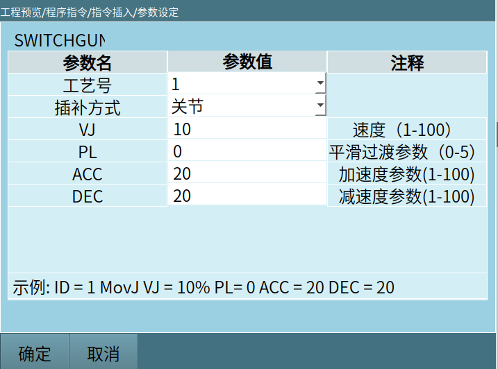

# Teach Pendant Custom Instruction Usage Example

# This document is only applicable to users with Qt development experience

This article focuses on teaching using the teach pendant secondary development demo from related downloads, and should be read alongside the code in the demo.

## 1. Custom Instruction Interface

Users can design their own instruction interface according to their preferences, or can directly use our template interface. The image below is an example interface designed in the demo (users can directly use this example for modification or copy and add new interfaces).



## 2. Setting Instructions in the Custom Instruction Class on the Instruction Insertion Page

Main interfaces used:

userdefined_cmd_name_change: Modifies the name displayed for custom instructions on the insertion interface, effect shown below:

```
QStringList ENname ;
ENname <<"SWITCHGUN"<<"SWITCHGUNPOS";
QStringList CNname;
CNname << tr("Switch Gun Action")<<tr("Move to Switch Gun Position");
Nextp::getInstance()->userdefined_cmd_name_change(ENname, CNname);
```


## 3. Opening the Custom Instruction Interface

Main interface used:

signal_userdefine_cmd_init: This function is a Qt signal function that needs to be connected with a slot function, used to open the user's own custom instruction interface.

```cpp
connect(Nextp::getInstance(),SIGNAL(signal_userdefine_cmd_init(int)),this,SLOT(slot_userdefine_cmd_init(int)));


void WidgetManager::slot_userdefine_cmd_init(int cmd_num)    // cmd_num corresponds to the top-to-bottom order on the instruction insertion page
{
    if(cmd_num == 1)                                        // Corresponds to the Switch Gun Action instruction on the interface
    {
    }
    if(cmd_num == 2)                                       // Corresponds to the Move to Switch Gun Position instruction on the interface
    {
        // Set the position of the secondary development interface in the window, and open the interface
        Nextp::getInstance()->setWidgetParentLocation((QWidget *)SwitchGunPosCommand::getInstance(), 86, 96);// Set the position where the interface opens
        SwitchGunPosCommand::getInstance()->initSwitchGunPosCmd();
        SwitchGunPosCommand::getInstance()->raise();
        SwitchGunPosCommand::getInstance()->show();     // Open the interface
    }
}
```
Ps: SwitchGunPosCommand is the custom instruction interface from our first step.

## 4. Inserting Custom Instructions

The click event of the confirm control in the custom instruction interface is bound to the slot_cmdInsertEnsureClicked slot function:

SwitchGunPosBtnEnsure is the name of the confirm control.

```cpp
connect(ui->SwitchGunPosBtnEnsure, SIGNAL(clicked()), this, SLOT(slot_cmdInsertEnsureClicked()));

void SwitchGunPosCommand::slot_cmdInsertEnsureClicked()
{
    int ID = ui->m_pcomboBoxGP_ID->currentIndex()+1;
    int moveType = ui->m_pcomboBoxGP_TYPE->currentIndex();
    double vel = ui->m_pLineEditSwitchGP_V->text().toDouble();
    double acc = ui->m_pLineEditSwitchGP_ACC->text().toDouble();
    double dec = ui->m_pLineEditSwitchGP_DEC->text().toDouble();
    int pl = ui->m_pLineEditSwitchGP_PL->text().toInt();
    QString Param = "Move to switch gun position " + QString::number(ID) + " " + QString::number(moveType) + " " + QString::number(vel) +         " " + QString::number(acc)
             + " " + QString::number(dec) + " " + QString::number(pl);    // Package the parameters to send
    Nextp::getInstance()->userdefine_cmd_insert(2,Param);  // 2: Custom instruction number, corresponds to the first int parameter of the controller callback function
    this->hide();      // Close the custom interface after instruction insertion
}
```
Package the parameters that need to be sent to the controller into a string type, then use the userdefine_cmd_insert interface to insert the instruction into the job file.


## 5. Modifying Custom Instructions

When a custom instruction has already been inserted into a job file and the parameters within the instruction need to be modified.

Main interface used:

signal_userdefine_cmd_alter: Signal function to invoke the custom instruction modification interface.

```cpp
connect(Nextp::getInstance(),SIGNAL(signal_userdefine_cmd_alter(int,QString,QString)),this,SLOT(slot_userdefine_cmd_alter(int,QString,QString)));      // When the cursor selects a custom instruction and clicks the modify control, this slot function is triggered


void WidgetManager::slot_userdefine_cmd_alter(int cmd_num, QString cmd_param, QString pos_name)
{
    if(cmd_num == 1)                                        // Corresponds to the Switch Gun Action instruction on the interface
    {
    }
    if(cmd_num == 2)                                       // Corresponds to the Move to Switch Gun Position instruction on the interface
    {
        // Set the position of the secondary development interface in the window, and open the interface
        Nextp::getInstance()->setWidgetParentLocation((QWidget *)SwitchGunPosCommand::getInstance(), 86, 96);// Set the position where the interface opens
        SwitchGunPosCommand::getInstance()->initSwitchGunPosCmd();
        SwitchGunPosCommand::getInstance()->raise();
        SwitchGunPosCommand::getInstance()->show();     // Open the interface
    }
}
```
## 6. Closing the Custom Instruction Interface

When the user has opened the custom instruction interface but does not want to insert an instruction, they can simply close this interface to return to the previous level's interface.

Create a return or cancel control on the interface and bind this control to a slot function that closes the interface.

SwitchGunPosBtnCancel is the cancel control in the custom instruction interface of the demo, example below:

```cpp
connect(ui->SwitchGunPosBtnCancel, SIGNAL(clicked()), this, SLOT(slot_cmdInsertCancelClicked()));

void SwitchGunPosCommand::slot_cmdInsertCancelClicked()
{
    this->close();
}
```

