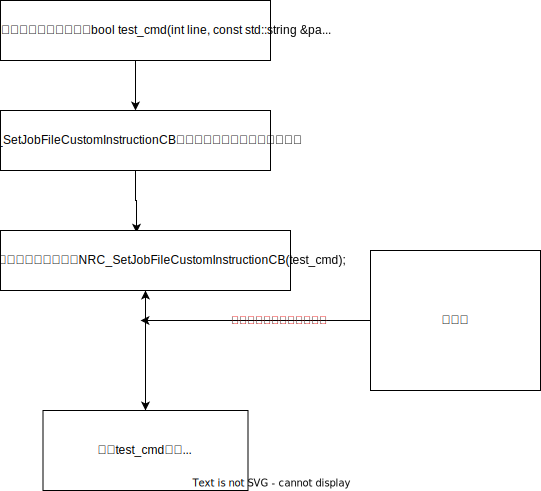

# Custom Instructions

## The controller secondary development demo is in the Controller SDK under related downloads, download it yourself

## 1. Introduction to Interface Functions Used by Custom Instructions

The following functions are all included in the SDK header files:

```cpp
/**
 * @brief MOVJ instruction for custom job file instruction calls, cannot be called directly
 * @param robotNum Robot number [1-4]
 * @param pos  Robot motion target position, see NRC_Position
 * @param vel Robot motion speed, as a percentage of the robot's maximum speed, range: 0 < vel <= 100
 * @param acc Robot motion acceleration, as a percentage of each joint's maximum acceleration, range: 0 < vel <= 100
 * @param dec Robot motion deceleration, as a percentage of each joint's maximum deceleration, range: 0 < vel <= 100
 * @param pl Smoothness, will smooth-transition with the next motion instruction. Higher values mean smoother with larger trajectory deviation, range: 0 <= pl <= 5
 * @param moveToNextLine Whether to advance to the next line, only set moveToNextLine to true for the last instruction
 */
void NRC_Jobrun_MoveDirect(int robotNum, const NRC_Position & pos, double vel,  double acc, double dec, int pl, bool moveToNextLine = false);


/**
 * @brief MOVL instruction for custom job file instruction calls, cannot be called directly
 * @param robotNum Robot number [1-4]
 * @param pos  Robot motion target position, see NRC_Position
 * @param vel Robot motion speed, absolute speed of the robot end point position, in millimeters per second (mm/s), range: vel > 1
 * @param acc Robot motion acceleration, as a percentage of each joint's maximum acceleration, range: 0 < vel <= 100
 * @param dec Robot motion deceleration, as a percentage of each joint's maximum deceleration, range: 0 < vel <= 100
 * @param pl Smoothness, will smooth-transition with the next motion instruction. Higher values mean smoother with larger trajectory deviation, range: 0 <= pl <= 5
 * @param moveToNextLine Whether to advance to the next line, only set moveToNextLine to true for the last instruction
 */
void NRC_Jobrun_MoveLinear(int robotNum, const NRC_Position & pos, double vel, double acc, double dec, int pl, bool moveToNextLine = false);


/**
 * @brief MOVC instruction for custom job file instruction calls, cannot be called directly
 * @param robotNum Robot number [1-4]
 * @param mid_pos,end_pos  Robot motion target positions, see NRC_Position
 * @param vel Robot motion speed, absolute speed of the robot end point position, in millimeters per second (mm/s), range: vel > 1
 * @param acc Robot motion acceleration, as a percentage of each joint's maximum acceleration, range: 0 < vel <= 100
 * @param dec Robot motion deceleration, as a percentage of each joint's maximum deceleration, range: 0 < vel <= 100
 * @param pl Smoothness, will smooth-transition with the next motion instruction. Higher values mean smoother with larger trajectory deviation, range: 0 <= pl <= 5
 * @param moveToNextLine Whether to advance to the next line, only set moveToNextLine to true for the last instruction
 * @note Note: MOVC cannot be run as the first instruction, and must be preceded by a MOVJ or MOVL instruction on the first call
 */
void NRC_Jobrun_MoveC(int robotNum, const NRC_Position& mid_pos,const NRC_Position& end_pos, double vel, double acc, double dec, int pl, bool moveToNextLine = false);


/**
 * @brief MOVS instruction for custom job file instruction calls, cannot be called directly
 * @param robotNum Robot number [1-4]
 * @param pos Robot motion target position container, size must not be less than 4 (i.e., pos.size() >= 4), see NRC_Position for position settings
 * @param vel Robot motion speed, absolute speed of the robot end point position, in millimeters per second (mm/s), range: vel > 1
 * @param acc Robot motion acceleration, as a percentage of each joint's maximum acceleration, range: 0 < vel <= 100
 * @param dec Robot motion deceleration, as a percentage of each joint's maximum deceleration, range: 0 < vel <= 100
 * @param pl Smoothness, will smooth-transition with the next motion instruction. Higher values mean smoother with larger trajectory deviation, range: 0 <= pl <= 5
 * @param moveToNextLine Whether to advance to the next line, only set moveToNextLine to true for the last instruction
 * @note Note: MOVS cannot be run as the first instruction, and must be preceded by a MOVJ or MOVL instruction on the first call
 */
void NRC_Jobrun_MoveS(int robotNum, int pointNum, const std::vector< NRC_Position>& pos, double vel, double acc, double dec, int pl, bool moveToNextLine = false);


/**
 * @brief IMOV instruction for custom job file instruction calls, cannot be called directly
 * @param robotNum Robot number [1-4]
 * @param pos Robot motion target position container, size must not be less than 4 (i.e., pos.size() >= 4), see NRC_Position for position settings
 * @param vel Robot motion speed, absolute speed of the robot end point position, in millimeters per second (mm/s), range: vel > 1
 * @param acc Robot motion acceleration, as a percentage of each joint's maximum acceleration, range: 0 < vel <= 100
 * @param dec Robot motion deceleration, as a percentage of each joint's maximum deceleration, range: 0 < vel <= 100
 * @param pl Smoothness, will smooth-transition with the next motion instruction. Higher values mean smoother with larger trajectory deviation, range: 0 <= pl <= 5
 * @param moveToNextLine Whether to advance to the next line, only set moveToNextLine to true for the last instruction
 * @param tm Pre-execution time, range: [0,999999], can be omitted, defaults to 0
 * @note Note: IMOV cannot be run as the first instruction, it must be preceded by a motion instruction
 */
int NRC_Jobrun_IMOV(int robotNum, const NRC_Position& offset, double vel, double acc, double dec, int pl, int tm = 0, bool moveToNextLine = false);


/**
 * @brief MOVJEXT instruction for custom job file instruction calls, cannot be called directly
 * @param robotNum Robot number [1-4]
 * @param pos  Robot motion target position, see NRC_Position
 * @param syncPos  Robot motion target position, see NRC_SyncPosition
 * @param vel Robot motion speed, as a percentage of the robot's maximum speed, range: 0 < vel <= 100
 * @param acc Robot motion acceleration, as a percentage of each joint's maximum acceleration, range: 0 < vel <= 100
 * @param dec Robot motion deceleration, as a percentage of each joint's maximum deceleration, range: 0 < vel <= 100
 * @param pl Smoothness, will smooth-transition with the next motion instruction. Higher values mean smoother with larger trajectory deviation, range: 0 <= pl <= 5
 * @param moveToNextLine Whether to advance to the next line, only set moveToNextLine to true for the last instruction
 */
void NRC_Jobrun_MoveDirectSync(int robotNum, const NRC_Position & pos, const NRC_SyncPosition & syncPos, double vel, double acc, double dec, int pl, bool moveToNextLine = false);


/**
 * @brief MOVLEXT instruction for custom job file instruction calls, cannot be called directly
 * @param robotNum Robot number [1-4]
 * @param pos  Robot motion target position, see NRC_Position
 * @param syncPos  Robot motion target position, see NRC_SyncPosition
 * @param vel Robot motion speed, absolute speed of the robot end point position, in millimeters per second (mm/s), range: vel > 1
 * @param acc Robot motion acceleration, as a percentage of each joint's maximum acceleration, range: 0 < vel <= 100
 * @param dec Robot motion deceleration, as a percentage of each joint's maximum deceleration, range: 0 < vel <= 100
 * @param pl Smoothness, will smooth-transition with the next motion instruction. Higher values mean smoother with larger trajectory deviation, range: 0 <= pl <= 5
 * @param moveToNextLine Whether to advance to the next line, only set moveToNextLine to true for the last instruction
 * @param sync Whether to synchronize
 */
void NRC_Jobrun_MoveLinearSync(int robotNum, const NRC_Position & pos, const NRC_SyncPosition & syncPos, double vel, double acc, double dec, int pl, int sync, bool moveToNextLine = false);
```
## 2. Custom Instruction Function Usage Example


```cpp
#include "nrcAPI.h"
#include "nrcAPI_advance.h"
#include "json/json.h"
#include <atomic>
#include <chrono>
#include <cstdlib>
#include <iostream>
#include <mutex>
#include <sstream>
#include <stdio.h>
#include <string>
#include <thread>
#include <unistd.h>
#include <vector>
#include <functional>
#include <cstdint>
#include <cstring>
#include <fstream>


using namespace std;


bool test_cmd(int line, const std::string &paramStr, const std::string &posName) {
  int robotNum = 1;             // Robot 1
  NRC_Position pos1 = {NRC_ACS, 40, 0, 0, 0, 0, 0};
  NRC_Position pos2 = {NRC_ACS, 0, 0, 0, 0, 0, 0};
  NRC_Position pos3 = {NRC_ACS, -40, 0, 0, 0, 0, 0};       // Robot motion target positions
  NRC_Jobrun_MoveDirect(robotNum, pos1, 50, 80, 80, 5);
  NRC_Jobrun_MoveDirect(robotNum, pos2, 50, 80, 80, 5);
  NRC_Jobrun_MoveDirect(robotNum, pos3, 50, 80, 80, 5, true);    // Last instruction needs advance to next line, pass true to moveToNextLine
}


int main() {
  // Output Nexmotion library version info
  std::cout << "Library version: " << NRC_GetNexMotionLibVersion() << std::endl;


  // Start the control system
  NRC_StartController();


  // Block until system initialization is complete
  while (NRC_GetControlInitComplete() != 1 )
  {
    NRC_Delayms(100);
  }
  NRC_ClearServoError();
  NRC_SetServoReadyStatus(1);
  NRC_Delayms(2000);
  NRC_SetJobFileCustomInstructionCB(test_cmd);     // Register custom instruction callback function
  while (1) // Keep the secondary development program running
  {
    NRC_Delayms(1000);
  }
}
```


## 3. Running Custom Instructions

Custom instructions are only available in secondary development teach pendants. Users can download the corresponding teach pendant secondary development package from related downloads.


