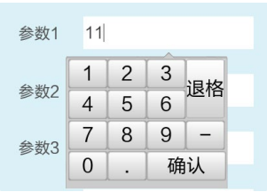
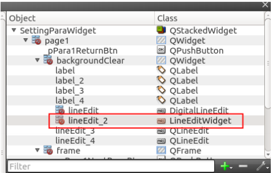
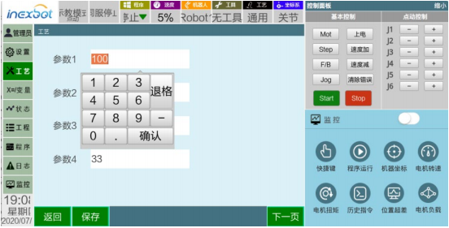
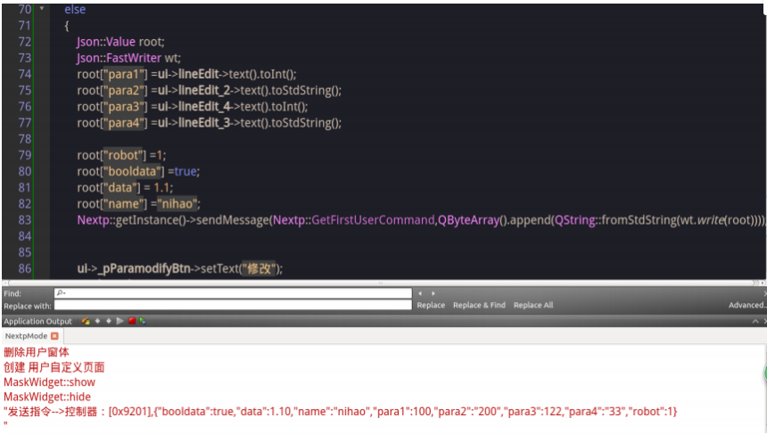
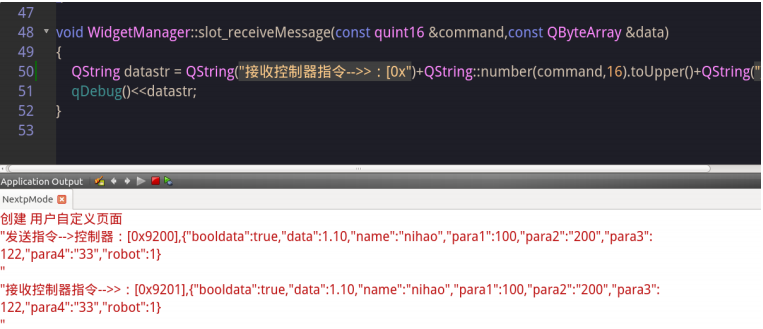

# API Reference

## Secondary Development Static Library Introduction

### Feature Overview

Provides complete teach pendant functionality, supports adding user-defined custom interfaces, and supports communication with the control system for specific fields.

### Static Library Directory Structure


nextpLib is the root folder;

Include folder contains header files;

Library folder contains static library files including library files for Linux platform and ARM platform (programs cross-compiled using the ARM platform are only applicable for use on Nabot's T30 Teach Pendant);

### Static Library Structure Description

#### 1. nextp.h Header File Interface Description:

```cpp
// Create Nextp class object
static QPointer<Nextp> getInstance();
// Get system font
QString getSystemFont();
// Transfer user-defined form to the main program
void setWidgetParentLocation(QPointer <QWidget> widget);
// Send message to controller
void sendMessage(const quint16 &command,const QByteArray &data);
// Notify the teach pendant program that the custom form has been opened
widgetShowFinish()
// Receive controller message signal
void signal_receiveMessage(const quint16 &command,const QByteArray &data);
// Open custom form signal
void signal_openWidget();
// Close custom form signal
void signal_closeWidget();
// Hide other buttons on the process main interface except custom buttons
void hideTechnologyToolbuttons();
// Static library supported controller communication command words
 enum CommandList
 {
    SetFirstUserParaCommand = 0x9200,
    GetFirstUserCommand = 0x9201,
    ReceivedFirstUserCommand = 0x9202,
    SetSecondUserParaCommand = 0x9203,
    GetSecondUserCommand = 0x9204,
    ReceivedSecondUserCommand = 0x9205,
    SetThirdUserParaCommand = 0x9206,
    GetThirdUserCommand = 0x9207,
    ReceivedThirdUserCommand = 0x92,
    ReceivedThirdUserCommand = 0x9208,
    SetFourthUserParaCommand = 0x9209,
    GetFourthUserCommand = 0x920a,
    ReceivedFourthUserCommand = 0x920b,
    SetFifthUserParaCommand = 0x920c,
    GetFifthUserCommand = 0x920d,
    ReceivedFifthUserCommand = 0x920e,
};
```

#### 2. json/json.h Header File Provides JSON Data Format Assembly and Parsing

JSON data assembly example:

```cpp
Json::Value root;
Json::FastWriter wt;
root["robot"] =1;
root["booldata"] =true;
root["data"] = 1.1;
root["name"] ="nihao";
```

JSON data parsing example:

```cpp
QByteArray jsonData // Data sent by controller
Json::Value root;
Json::Reader reader;
QString jsonData = param.data();
if(reader.parse(jsonData.toStdString(), root))
{
    int robot = root["robot"].asInt();
    bool booldata= root["booldata"].asBool();
    Int data= root["data"].asDouble();
    Std::string name = root["name "].asString();
}
```

#### 3. digitallineedit.h Provides Numeric Input Box

Supports promoting QLineEdit control to a numeric input box.

Promotion method: Right-click a QLineEdit control --->Promote to--->DigitalLineEdit


You can see in the right tree structure that the control's Class property changes to DigitLineEdit:


Control effect after program runs. Clicking the control will pop up a numeric keypad:



#### 4. lineeditwidget.h Provides Numeric and Text Input Box

Supports promoting QLineEdit control to a numeric and text input box. Promotion method: Right-click a QLineEdit control --->Promote to--->lineEditWidget


You can see in the right tree structure that the control's Class property changes to lineEditWidget:



Control effect after program runs. Clicking the control will pop up a numeric and alphabetic keypad:


## Demo Instructions


- Demo structure diagram. Demo folder name: NextpMode

2.1 settingparawidget.h settingparawidget.cpp settingparawidget.ui These three files are the user-defined form


2.2 widgetmanager.h widgetmanager.cpp is the management class connecting the user-defined form and the static library

2.2 The static library folder nextplib needs to be placed under the NextpMode folder of demod

2.3 Run Demo (Use QtCreator to directly open the NextpMode.pro file under the NextpMode folder)

Run Demo program, click [Operator] > Select Administrator > Enter password 123456 to log in


Click [Process] button on the left > User to enter the custom form


Click the modify button to modify parameters. Click save to send parameters to the controller



The QtCreator console will print the data sent to the controller





If the function void hideTechnologyToolbuttons(); is called, it will hide all process buttons except custom buttons on the process main interface


- Demo file class description
