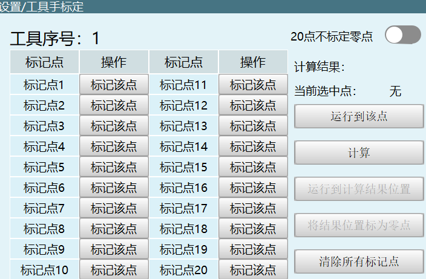
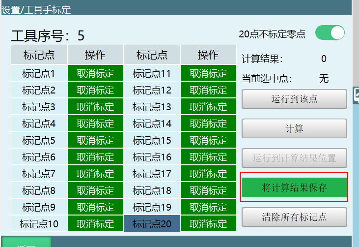
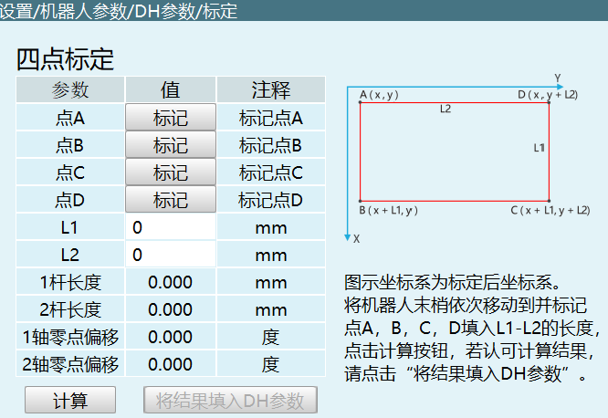

# Calibration

## Tool Calibration


### 0x3801 TOOLCALIBRATION_SET

Set tool calibration

**Request Parameters:**

| Parameter | Type | Description |
|--------|------|------|
| toolNum | int | Tool number |
| calibrationPointNum | int | Set 6-point or 7-point calibration |

```json
{
  "toolNum": 2,
  "calibrationPointNum": 6
}
```

---

### 0x3804 TOOLCALIBRATION_RESULT

Calibration calculation complete response

**Response Parameters:**

| Parameter | Type | Description |
|--------|------|------|
| result | bool | Whether calculation succeeded |

```json
{
  "result": true
}
```


---

### 0x3802 TOOLCALIBRATION_INQUIRE

Query calibration point data

**Request Parameters:**

| Parameter | Type | Description |
|--------|------|------|
| pointNum | int | Index 0~6 |
| toolNum | int | Tool number |

```json
{
  "pointNum": 2,
  "toolNum": 1
}
```

---

### 0x3803 TOOLCALIBRATION_RESPOND

Return calibration point data

**Response Parameters:**

| Parameter | Type | Description |
|--------|------|------|
| pointNum | int | Index 0~6 |
| pos | array[6] | Position data [x,y,z,rx,ry,rz] |

```json
{
  "pointNum": 2,
  "pos": [0, 0, 0, 0, 0, 0]
}
```

---

### 0x3815 TOOL_CALIBRATION_POINTS_STATUS_INQUIRE

Query calibration status

**Request Parameters:**

| Parameter | Type | Description |
|--------|------|------|
| toolNum | int | Tool number |

```json
{
  "toolNum": 2
}
```

---

### 0x3816 TOOL_CALIBRATION_POINTS_STATUS_RESPOND

Return calibration status

**Response Parameters:**

| Parameter | Type | Description |
|--------|------|------|
| status | array[7] | Calibration status: 1=calibrated, 0=pending calibration |

```json
{
  "status": [1, 0, 1, 0, 1, 0, 1]
}
```

---

### 0x3817 TOOL_CALIBRATION_POINTS_STATUS_CLEAR

Clear calibration

**Request Parameters:**

| Parameter | Type | Description |
|--------|------|------|
| pointNum | int | Index 0~6 |
| toolNum | int | Tool number |

```json
{
  "pointNum": 2,
  "toolNum": 1
}
```


---

### 0x3805 TOOLPARAMETER_SET

Set tool parameters

**Request Parameters:**

| Parameter | Type | Description |
|--------|------|------|
| tool.A | float | Rotation angle around A axis |
| tool.B | float | Rotation angle around B axis |
| tool.C | float | Rotation angle around C axis |
| tool.note | string | Annotation |
| tool.payload_inertia | float | Payload inertia |
| tool.payload_mass | float | Payload mass |
| tool.payload_mass_center_X | float | Payload center of mass X |
| tool.payload_mass_center_Y | float | Payload center of mass Y |
| tool.payload_mass_center_Z | float | Payload center of mass Z |
| tool.x | float | X axis offset |
| tool.y | float | Y axis offset |
| tool.z | float | Z axis offset |
| toolNum | int | Tool number |

```json
{
  "tool": {
    "A": 3.0,
    "B": 3.0,
    "C": 3.0,
    "note": "",
    "payload_inertia": 5.0,
    "payload_mass": 4.0,
    "payload_mass_center_X": 6.0,
    "payload_mass_center_Y": 7.0,
    "payload_mass_center_Z": 8.0,
    "x": 1.0,
    "y": 2.0,
    "z": 3.0
  },
  "toolNum": 1
}
```

---

### 0x3806 TOOLPARAMETER_INQUIRE

Query tool parameters

**Request Parameters:**

| Parameter | Type | Description |
|--------|------|------|
| toolNum | int | Tool number |

```json
{
  "toolNum": 2
}
```

---

### 0x3807 TOOLPARAMETER_RESPOND

Return tool parameters

Response format same as 0x3805

---

### 0x380A TOOLNUMBER_SWITCH

Switch tool

**Request Parameters:**

| Parameter | Type | Description |
|--------|------|------|
| robot | int | Robot number 1-4 |
| curToolNum | int | Current tool number |

```json
{
  "robot": 1,
  "curToolNum": 2
}
```

---

### 0x380B TOOLNUMBER_INQUIRE

Query current tool

**Request Parameters:**

| Parameter | Type | Description |
|--------|------|------|
| robot | int | Robot number 1-4 |

```json
{
  "robot": 1
}
```

---

### 0x380C TOOLNUMBER_RESPOND

Return current tool

**Response Parameters:**

| Parameter | Type | Description |
|--------|------|------|
| robot | int | Robot number 1-4 |
| curToolNum | int | Current tool number |

```json
{
  "robot": 1,
  "curToolNum": 2
}
```

---

### 0x3812 TOOL_CALIBRATION_POINTS_POS_INQUIRE

Query calibrated point data

**Request Parameters:**

| Parameter | Type | Description |
|--------|------|------|
| pointNum | int | Index 0~6, total 7 points |
| toolNum | int | Tool number |

```json
{
  "pointNum": 0,
  "toolNum": 1
}
```

---

### 0x3813 TOOL_CALIBRATION_POINTS_POS_RESPOND

Return calibrated point data

**Response Parameters:**

| Parameter | Type | Description |
|--------|------|------|
| pointNum | int | Index 0~6 |
| pos | array[6] | Position data [x,y,z,rx,ry,rz] |

```json
{
  "pointNum": 0,
  "pos": [0, 0, 0, 0, 0, 0]
}
```


---

## User Coordinate Calibration

### 0x3C01 USERCALIBRATION_CALC

User coordinate calibration set

**Request Parameters:**

| Parameter | Type | Description |
|--------|------|------|
| userNum | int | User coordinate number |

```json
{
  "userNum": 1
}
```

---

### 0x3C02 USERCALIBRATION_RESULT

User coordinate calibration result return

**Response Parameters:**

| Parameter | Type | Description |
|--------|------|------|
| result | bool | true=calibration success, false=calibration failure |
| status.O | bool | O point status |
| status.X | bool | X point status |
| status.Y | bool | Y point status |

```json
{
  "result": true,
  "status": {
    "O": false,
    "X": false,
    "Y": false
  }
}
```

---

### 0x3C03 USERCALIBRATION_RECORD

Mark user origin, X, Y values

**Request Parameters:**

| Parameter | Type | Description |
|--------|------|------|
| userNum | int | User coordinate number |
| inquire | string | Values "O", "X", "Y" or "OXY" |
| posZero | array[6] | Mark origin (radians), present when inquire is "OXY" |
| posX | array[6] | Mark X value (radians), present when inquire is "OXY" |
| posY | array[6] | Mark Y value (radians), present when inquire is "OXY" |

```json
{
  "userNum": 1,
  "inquire": "X",
  "posZero": [0.0, 0.0, 0.0, 0.0, 0.0, 0.0],
  "posX": [0.0, 0.0, 0.0, 0.0, 0.0, 0.0],
  "posY": [0.0, 0.0, 0.0, 0.0, 0.0, 0.0]
}
```

---

### 0x3C04 USERCALIBRATION_RECORD_RESPOND

Mark result response

**Response Parameters:**

| Parameter | Type | Description |
|--------|------|------|
| userNum | int | User coordinate number |
| inquire | string | Values "O", "X", "Y" |
| status | bool | Status |
| pos | array[6] | Position data in radians |
| posDeg | array[6] | Position data in degrees |

```json
{
  "userNum": 1,
  "inquire": "X",
  "status": true,
  "pos": [0, 0, 0, 0, 0, 0],
  "posDeg": [0, 0, 0, 0, 0, 0]
}
```


---

### 0x3C07 USERPARAMETER_SET

User coordinate set

**Request Parameters:**

| Parameter | Type | Description |
|--------|------|------|
| pos | array[6] | User coordinate position [x,y,z,rx,ry,rz] |
| userNum | int | User coordinate number |

```json
{
  "pos": [460.0, 0.0, 637.0, 0.0, 3.10, 3.0],
  "userNum": 1
}
```

---

### 0x3C08 USERPOSDATA_INQUIRE

User coordinate query

**Request Parameters:**

| Parameter | Type | Description |
|--------|------|------|
| userNum | int | User coordinate number |
| inquire | string | Query type: "Calibration", "O", "X", "Y" |

```json
{
  "userNum": 1,
  "inquire": "Calibration"
}
```

---

### 0x3C09 USERPOSDATA_RESPOND

User coordinate query response

**Response Parameters:**

| Parameter | Type | Description |
|--------|------|------|
| userNum | int | User coordinate number |
| inquire | string | Query type |
| status | bool | Status |
| pos | array[6] | Position data in radians |
| posDeg | array[6] | Position data in degrees |

```json
{
  "userNum": 1,
  "inquire": "Calibration",
  "status": false,
  "pos": [0, 0, 0, 0, 0, 0],
  "posDeg": [0, 0, 0, 0, 0, 0]
}
```

---

### 0x3C0A USERCOORDINATE_SWITCH

User coordinate number set

**Request Parameters:**

| Parameter | Type | Description |
|--------|------|------|
| robot | int | Robot number 1-4 |
| userNum | int | User coordinate number |

```json
{
  "robot": 1,
  "userNum": 1
}
```

---

### 0x3C0B USERCOORDINATE_INQUIRE

User coordinate number query

**Request Parameters:**

| Parameter | Type | Description |
|--------|------|------|
| robot | int | Robot number 1-4 |

```json
{
  "robot": 1
}
```

---

### 0x3C0C USERCOORDINATE_RESPOND

User coordinate number query response

**Response Parameters:**

| Parameter | Type | Description |
|--------|------|------|
| robot | int | Robot number 1-4 |
| curUserNum | int | Current user coordinate number |

```json
{
  "robot": 1,
  "curUserNum": 1
}
```

---

### 0x3C0D USERANNOTATION_SET

User annotation set

**Request Parameters:**

| Parameter | Type | Description |
|--------|------|------|
| note | string | Annotation content |
| userNum | int | User coordinate number |

```json
{
  "note": "Nabot",
  "userNum": 1
}
```

---

### 0x3C0E USERANNOTATION_INQUIRE

User annotation query

**Request Parameters:**

| Parameter | Type | Description |
|--------|------|------|
| userNum | int | User coordinate number |

```json
{
  "userNum": 1
}
```

---

### 0x3C0F USERANNOTATION_RESPOND

User annotation query response

Response format same as 0x3C0D



---

## 20-Point Calibration

### 0x7101 CALIBRATION_20POINTS_SET

20-point calibration complete, send calibration data

**Request Parameters:**

| Parameter | Type | Description |
|--------|------|------|
| calNum | int | Calibration number (currently default value) |
| noCalZero | bool | 20-point does not calibrate zero point |

```json
{
  "calNum": 1,
  "noCalZero": true
}
```

---

### 0x7102 CALIBRATION_20POINTS_INQUIRE

Click calibration point data

**Request Parameters:**

| Parameter | Type | Description |
|--------|------|------|
| toolNum | int | Tool coordinate system 1-3 |
| pointNum | int | Value 0~19, total 20 points |

```json
{
  "toolNum": 1,
  "pointNum": 0
}
```

---

### 0x7103 CALIBRATION_20POINTS_RESPOND

Return calibration point data

**Response Parameters:**

| Parameter | Type | Description |
|--------|------|------|
| pointNum | int | Value 0~19, total 20 points |
| pos | array[6] | Point data [x,y,z,rx,ry,rz] |

```json
{
  "pointNum": 0,
  "pos": [0, 0, 0, 0, 0, 0]
}
```

---

### 0x7104 CALIBRATION_20POINTS_RESULT

Calibration calculation complete

**Response Parameters:**

| Parameter | Type | Description |
|--------|------|------|
| result | bool | Whether calculation is correct |
| distance | float | Calculated distance value |

```json
{
  "result": true,
  "distance": 2.04
}
```



---

### 0x7105 CALIBRATION_20POINTS_RESULT_APPLY

Apply calibration result as tool

**Request Parameters:**

| Parameter | Type | Description |
|--------|------|------|
| toolNum | int | Tool coordinate system 1-3 |

```json
{
  "toolNum": 1
}
```

---

### 0x7106 CALIBRATION_20POINTS_RESULT_APPLY_OK

Set success response

**Response Parameters:**

| Parameter | Type | Description |
|--------|------|------|
| apply | bool | Whether setting succeeded |

```json
{
  "apply": true
}
```

---

### 0x7107 CALIBRATION_20POINTS_STATUS_INQUIRE

Query calibration point status

**Request Parameters:**

| Parameter | Type | Description |
|--------|------|------|
| calNum | int | Tool number |

```json
{
  "calNum": 1
}
```

> Note: The underlying layer shares calibration point status and does not distinguish tool numbers

---

### 0x7108 CALIBRATION_20POINTS_STATUS_RESPOND

Return calibration point status

**Response Parameters:**

| Parameter | Type | Description |
|--------|------|------|
| status | array[20] | Calibration point status: 1=calibrated, 0=not calibrated |

```json
{
  "status": [0, 0, 0, 0, 0, 0, 0, 0, 0, 0, 0, 0, 0, 0, 0, 0, 0, 0, 0, 0]
}
```

---

### 0x7109 CALIBRATION_20POINTS_STATUS_CLEAR

Clear calibration status

**Request Parameters:**

| Parameter | Type | Description |
|--------|------|------|
| pointNum | int | Value: 0-19 single point, 20=all points |

```json
{
  "pointNum": 0
}
```

---

### 0x710a CALIBRATION_20POINTS_POS_INQUIRE

Query calibrated point data

**Request Parameters:**

| Parameter | Type | Description |
|--------|------|------|
| pointNum | int | Value 0~19, total 20 points |

```json
{
  "pointNum": 0
}
```

---

### 0x710b CALIBRATION_20POINTS_POS_RESPOND

Return calibrated point data

**Response Parameters:**

| Parameter | Type | Description |
|--------|------|------|
| pointNum | int | Value 0~19, total 20 points |
| pos | array[6] | Point data [x,y,z,rx,ry,rz] |

```json
{
  "pointNum": 0,
  "pos": [0, 0, 0, 0, 0, 0]
}
```

---

### 0x710c CALIBRATION_20POINTS_POS_RUN

Move to calibration point (not yet available)

**Request Parameters:**

| Parameter | Type | Description |
|--------|------|------|
| robot | int | Robot number |

```json
{
  "robot": 1
}
```

---

### 0x710d CALIBRATION_20POINTS_CANCALIBRATION_INQUIRE

Get whether calibration interface can be opened

No request parameters

---

### 0x710e CALIBRATION_20POINTS_CANCALIBRATION_RESPOND

Whether calibration interface can be opened

**Response Parameters:**

| Parameter | Type | Description |
|--------|------|------|
| canCalibration | bool | Whether it can be opened |

```json
{
  "canCalibration": true
}
```



---

## 4-Point Calibration (SCARA)

### 0x7201 CALIBRATION_4POINTS_SET

Set distance input value, calculate and return result

**Request Parameters:**

| Parameter | Type | Description |
|--------|------|------|
| ParamOf4Points | array[2] | L1, L2 rod length |

```json
{
  "ParamOf4Points": [0, 0]
}
```

---

### 0x7202 CALIBRATION_4POINTS_INQUIRE

Click calibration button

**Request Parameters:**

| Parameter | Type | Description |
|--------|------|------|
| pointNum | int | Value 0~3, total 4 points |
| status | int | 1=marked, 0=unmarked |

```json
{
  "pointNum": 0,
  "status": 1
}
```

---

### 0x7203 CALIBRATION_4POINTS_RESPOND

Return calibration point data

**Response Parameters:**

| Parameter | Type | Description |
|--------|------|------|
| pointNum | int | Value 0~3, total 4 points |
| pos | array[6] | Point data [x,y,z,rx,ry,rz] |

```json
{
  "pointNum": 0,
  "pos": [0, 0, 0, 0, 0, 0]
}
```

---

### 0x7204 CALIBRATION_4POINTS_RESULT

Calculation complete

**Response Parameters:**

| Parameter | Type | Description |
|--------|------|------|
| result | bool | Calculation result |
| length | array[2] | Length [L1, L2] |
| dtheta | array[2] | Offset angle |

```json
{
  "result": true,
  "length": [0, 0],
  "dtheta": [0, 0]
}
```

---

### 0x7205 CALIBRATION_4POINTS_RESULT_APPLY

Fill result into DH parameters

No request parameters

---

### 0x7206 CALIBRATION_4POINTS_RESULT_APPLY_OK

Set success response

**Response Parameters:**

| Parameter | Type | Description |
|--------|------|------|
| apply | bool | Whether setting succeeded |

```json
{
  "apply": true
}
```

---

### 0x7207 CALIBRATION_4POINTS_STATUS_INQUIRE

Query 4-point calibration point status

No request parameters

---

### 0x7208 CALIBRATION_4POINTS_STATUS_RESPOND

Return 4-point calibration status

**Response Parameters:**

| Parameter | Type | Description |
|--------|------|------|
| result | bool | Calculation result |
| status | array[4] | Calibration point status: 1=calibrated, 0=not calibrated |
| length | array[2] | Length [L1, L2] |
| dtheta | array[2] | Offset angle |

```json
{
  "result": true,
  "status": [0, 0, 0, 0],
  "length": [0, 0],
  "dtheta": [0, 0]
}
```
