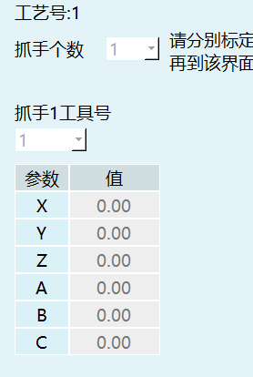
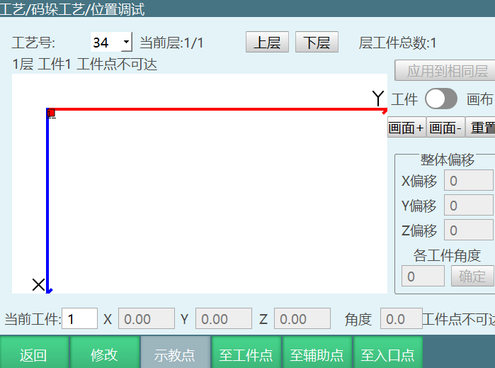

# Palletizing Process

## Full Palletizing

### Set Gripper Parameters



**0x4201 PAL_GRIPPER_PARM_SET**

| Parameter | Type | Required | Description |
|--------|------|------|------|
| robot | int | Yes | Robot number |
| craftID | int | Yes | Process number |
| gripperNum | int | No | Number of grippers, range 1~4 |
| gripper | array | No | Gripper tool number array, range 1~9 |

```json
{
    "robot": 1,
    "craftID": 1,
    "pallet": {
        "gripperNum": 2,
        "gripper": [1, 3, 4, 0]
    }
}
```

### Query Gripper Parameters

**0x4202 PAL_GRIPPER_PARM_INQUIRE**

| Parameter | Type | Required | Description |
|--------|------|------|------|
| robot | int | Yes | Robot number |
| craftID | int | Yes | Process number |

```json
{
    "robot": 1,
    "craftID": 1
}
```

### Return Gripper Parameters

**0x4203 PAL_GRIPPER_PARM_RESPOND**

| Parameter | Type | Description |
|--------|------|------|
| robot | int | Robot number |
| craftID | int | Process number |
| gripperNum | int | Number of grippers, range 1~4 |
| gripper | array | Gripper tool number array, range 1~9 |

```json
{
    "robot": 1,
    "craftID": 1,
    "pallet": {
        "gripperNum": 2,
        "gripper": [1, 3, 4, 0]
    }
}
```

### Set Pallet Parameters


**0x4204 PAL_PALLET_PARM_SET**

| Parameter | Type | Required | Description |
|--------|------|------|------|
| robot | int | Yes | Robot number |
| craftID | int | Yes | Process number |
| userNum | int | Yes | User number |

```json
{
    "robot": 1,
    "craftID": 1,
    "pallet": {
        "userNum": 1
    }
}
```

### Query Pallet Parameters

**0x4205 PAL_PALLET_PARM_INQUIRE**

| Parameter | Type | Required | Description |
|--------|------|------|------|
| robot | int | Yes | Robot number |
| craftID | int | Yes | Process number |

```json
{
    "robot": 1,
    "craftID": 1
}
```

### Return Pallet Parameters

**0x4206 PAL_PALLET_PARM_RESPOND**

| Parameter | Type | Description |
|--------|------|------|
| robot | int | Robot number |
| craftID | int | Process number |
| userNum | int | User number |

```json
{
    "robot": 1,
    "craftID": 1,
    "pallet": {
        "userNum": 1
    }
}
```

### Set Position Parameters


**0x4207 PAL_POS_PARM_SET**

| Parameter | Type | Required | Description |
|--------|------|------|------|
| robot | int | Yes | Robot number |
| craftID | int | Yes | Process number |
| enterPos | array | Yes | Entry point, 6 double values |
| floorNum | int | No | Marker layer number |
| shiftPos | array | No | Auxiliary point, 6 double values |
| realPos | array | No | Workpiece point, 6 double values |

```json
{
    "robot": 1,
    "craftID": 1,
    "pallet": {
        "enterPos": [0, 1.1, 222, 3.14159, 0, 0.008],
        "floorNum": 1,
        "shiftPos": [0, 1.1, 222, 3.14159, 0, 0.008],
        "realPos": [0, 1.1, 222, 3.14159, 0, 0.008]
    }
}
```

### Query Position Parameters

**0x4208 PAL_POS_PARM_INQUIRE**

| Parameter | Type | Required | Description |
|--------|------|------|------|
| robot | int | Yes | Robot number |
| craftID | int | Yes | Process number |

```json
{
    "robot": 1,
    "craftID": 1
}
```

### Return Position Parameters

**0x4209 PAL_POS_PARM_RESPOND**

Return data same as 0x4207.

### Set Workpiece Parameters


**0x420A PAL_WORKPIECE_PARM_SET**

| Parameter | Type | Required | Description |
|--------|------|------|------|
| robot | int | Yes | Robot number |
| craftID | int | Yes | Process number |
| workpieceLength | double | No | Workpiece length |
| workpieceWidth | double | No | Workpiece width |
| workpieceHeight | double | No | Workpiece height |
| workpieceGapX | double | No | X-direction gap |
| workpieceGapY | double | No | Y-direction gap |

```json
{
    "robot": 1,
    "craftID": 2,
    "pallet": {
        "workpieceLength": 1,
        "workpieceWidth": 2,
        "workpieceHeight": 3,
        "workpieceGapX": 4,
        "workpieceGapY": 5
    }
}
```

### Query Workpiece Parameters

**0x420B PAL_WORKPIECE_PARM_INQUIRE**

| Parameter | Type | Required | Description |
|--------|------|------|------|
| robot | int | Yes | Robot number |
| craftID | int | Yes | Process number |

```json
{
    "robot": 1,
    "craftID": 1
}
```

### Return Workpiece Parameters

**0x420C PAL_WORKPIECE_PARM_RESPOND**

Return data same as 0x420A.

### Set Approach Parameters (2207 teach pendant does not have this function)

**0x420D PAL_APPRO_PARM_SET**

| Parameter | Type | Required | Description |
|--------|------|------|------|
| robot | int | Yes | Robot number |
| craftID | int | Yes | Process number |
| workpieceApproEnable | bool | No | Enable approach |
| workpieceApproMode | int | No | Approach mode: 0-Descend then approach, 1-Approach then descend |
| workpieceApproLenX | double | No | X-direction approach length |
| workpieceApproLenY | double | No | Y-direction approach length |
| workpieceApproLenZ | double | No | Z-direction approach length |

```json
{
    "robot": 1,
    "craftID": 1,
    "pallet": {
        "workpieceApproEnable": false,
        "workpieceApproMode": 0,
        "workpieceApproLenX": 0,
        "workpieceApproLenY": 0,
        "workpieceApproLenZ": 0
    }
}
```

### Query Approach Parameters

**0x420E PAL_APPRO_PARM_INQUIRE**

| Parameter | Type | Required | Description |
|--------|------|------|------|
| robot | int | Yes | Robot number |
| craftID | int | Yes | Process number |

```json
{
    "robot": 1,
    "craftID": 1
}
```

### Return Approach Parameters

**0x420F PAL_APPRO_PARM_RESPOND**

Return data same as 0x420D.

### Set Overlap Mode Parameters


**0x4210 PAL_OVERLAP_PARM_SET**

| Parameter | Type | Required | Description |
|--------|------|------|------|
| robot | int | Yes | Robot number |
| craftID | int | Yes | Process number |
| floorSum | int | No | Number of layers |
| overlapType | int | No | Overlap type: 0-Same, 1-Alternating, 2-Custom |
| layHeightOffset | double | No | Place point height compensation |
| fixedLayHeight | bool | No | Fixed place point height |
| fixedSupHeight | bool | No | Fixed auxiliary point height |
| columnLay | bool | No | Vertical direction arrangement |
| floorAutoJustified | bool | No | Layer auto alignment |
| poseAutorotation | bool | No | Pose auto rotation |
| fixedEnterPoint | bool | No | Fixed entry point position |
| graphicNum | array | No | Graphic number |
| heightRevise | array | No | Height correction |

```json
{
    "robot": 1,
    "craftID": 1,
    "pallet": {
        "floorSum": 1,
        "overlapType": 0,
        "layHeightOffset": 0.0,
        "fixedLayHeight": false,
        "fixedSupHeight": false,
        "columnLay": false,
        "floorAutoJustified": false,
        "poseAutorotation": false,
        "fixedEnterPoint": false,
        "graphicNum": [1, 2, 1, 2],
        "heightRevise": [1.1, -2.2]
    }
}
```

### Query Overlap Mode Parameters

**0x4211 PAL_OVERLAP_PARM_INQUIRE**

| Parameter | Type | Required | Description |
|--------|------|------|------|
| robot | int | Yes | Robot number |
| craftID | int | Yes | Process number |

```json
{
    "robot": 1,
    "craftID": 1
}
```

### Return Overlap Mode Parameters

**0x4212 PAL_OVERLAP_PARM_RESPOND**

Return data same as 0x4210.

### Set Plane Mode Parameters


**0x4213 PAL_PLANE_PARM_SET**

#### Row-Column Mode

| Parameter | Type | Required | Description |
|--------|------|------|------|
| robot | int | Yes | Robot number |
| craftID | int | Yes | Process number |
| graphic | int | Yes | Graphic number |
| graphicType | int | Yes | Graphic type: 0-Row-column, 1-Interlocking, 2-Spiral, 3-Five-pattern, 4-Custom |
| autoCalculate | bool | No | Auto calculate |
| numX | double | No | X-direction count |
| numY | double | No | Y-direction count |
| rotationAngleSingle | double | No | Workpiece rotation angle |
| rotationAngleWhole | double | No | Overall rotation angle |
| transLenX | double | No | X translation compensation |
| transLenY | double | No | Y translation compensation |

```json
{
    "craftID": 2,
    "graphic": 1,
    "pallet": {
        "graphicType": 0,
        "ranks": {
            "autoCalculate": true,
            "numX": 1.0,
            "numY": 1.0,
            "rotationAngleSingle": 180.0,
            "rotationAngleWhole": 90.0
        },
        "transLenX": 2.0,
        "transLenY": 3.0
    },
    "robot": 1
}
```

#### Interlocking Mode

```json
{
    "craftID": 2,
    "graphic": 1,
    "pallet": {
        "graphicType": 1,
        "intertwining": {
            "numX": 3.0,
            "numY": 3.0,
            "rotationAngleSingle": -90.0,
            "rotationAngleWhole": 90.0
        },
        "transLenX": 0.0,
        "transLenY": 0.0
    },
    "robot": 1
}
```

#### Spiral Mode

```json
{
    "craftID": 2,
    "graphic": 1,
    "pallet": {
        "gearType": {
            "rotationAngleSingle": -90.0,
            "rotationAngleWhole": 180.0
        },
        "graphicType": 2,
        "transLenX": 0.0,
        "transLenY": 0.0
    },
    "robot": 1
}
```

#### Five-Pattern Mode

```json
{
    "craftID": 2,
    "graphic": 1,
    "pallet": {
        "graphicType": 3,
        "transLenX": 0.0,
        "transLenY": 0.0,
        "wideType": {
            "A_C_columns": 5.0,
            "A_rows": 1.0,
            "B_columns": 3.0,
            "B_rows": 2.0,
            "C_rows": 4.0,
            "rotationAngleSingle": 180.0,
            "rotationAngleWhole": 90.0
        }
    },
    "robot": 1
}
```

#### Custom Mode

| Parameter | Type | Required | Description |
|--------|------|------|------|
| robot | int | Yes | Robot number |
| craftID | int | Yes | Process number |
| graphic | int | Yes | Graphic number |
| graphicType | int | Yes | Graphic type (4-Custom) |
| transLenX | double | No | X translation compensation |
| transLenY | double | No | Y translation compensation |
| count | int | Yes | Layer workpiece count |
| sum | int | Yes | Total workpieces per layer |
| start | int | Yes | Start number |
| eachVec | array | Yes | Per-layer data |

```json
{
    "craftID": 1,
    "graphic": 1,
    "pallet": {
        "custom": {
            "count": 2,
            "eachVec": [
                {
                    "X": 1.0,
                    "Y": 2.0,
                    "dir": 0,
                    "h": 4.0,
                    "t": 3.0
                },
                {
                    "X": 5.0,
                    "Y": 6.0,
                    "dir": 0,
                    "h": 8.0,
                    "t": 7.0
                }
            ],
            "start": 1,
            "sum": 2
        },
        "graphicType": 4,
        "transLenX": 11.0,
        "transLenY": 22.0
    },
    "robot": 1
}
```

### Query Plane Mode Parameters

**0x4214 PAL_PLANE_PARM_INQUIRE**

| Parameter | Type | Required | Description |
|--------|------|------|------|
| robot | int | Yes | Robot number |
| craftID | int | Yes | Process number |
| graphic | int | Yes | Graphic number |

```json
{
    "robot": 1,
    "craftID": 1,
    "graphic": 1
}
```

### Return Plane Mode Parameters

**0x4215 PAL_PLANE_PARM_RESPOND**

Return data same as 0x4213.

### Request Conversion to Plane Mode Custom Template

**0x4216 PAL_PLANE_CUSTOM_TRANS_INQUIRE**

| Parameter | Type | Required | Description |
|--------|------|------|------|
| robot | int | Yes | Robot number |
| craftID | int | Yes | Process number |
| graphic | int | Yes | Graphic number |

```json
{
    "robot": 1,
    "craftID": 1,
    "graphic": 1
}
```

### Return Converted Plane Mode Custom Template Parameters

**0x4217 PAL_PLANE_CUSTOM_TRANS_RESPOND**

| Parameter | Type | Description |
|--------|------|------|
| robot | int | Robot number |
| craftID | int | Process number |
| graphic | int | Graphic number |
| graphicType | int | Graphic type (only 3 here) |
| transLenX | double | X translation compensation |
| transLenY | double | Y translation compensation |
| autoTransLenX | double | X auto translation distance |
| autoTransLenY | double | Y auto translation distance |
| sum | int | Total workpieces |
| start | int | Start number |
| count | int | Current layer workpiece count |
| eachVec | array | Workpiece position array |

```json
{
    "robot": 1,
    "craftID": 1,
    "graphic": 1,
    "pallet": {
        "graphicType": 3,
        "transLenX": 2.2,
        "transLenY": -3.3,
        "autoTransLenX": 4.4,
        "autoTransLenY": 5.5,
        "custom": {
            "sum": 20,
            "start": 1,
            "count": 10,
            "eachVec": [
                {"X": 0, "Y": 0, "t": 0, "dir": 0, "h": 0},
                {"X": 0, "Y": 0, "t": 0, "dir": 0, "h": 0},
                {"X": 0, "Y": 0, "t": 0, "dir": 0, "h": 0}
            ]
        }
    }
}
```

### Request Plane Mode Preview

**0x4218 PAL_PLANE_PREVIEW_INQUIRE**

| Parameter | Type | Required | Description |
|--------|------|------|------|
| robot | int | Yes | Robot number |
| craftID | int | Yes | Process number |
| graphic | int | Yes | Graphic number |

```json
{
    "robot": 1,
    "craftID": 1,
    "graphic": 1
}
```

### Return Plane Mode Preview Parameters

**0x4219 PAL_PLANE_PREVIEW_RESPOND**

| Parameter | Type | Description |
|--------|------|------|
| robot | int | Robot number |
| craftID | int | Process number |
| graphic | int | Graphic number |
| workpieceLength | double | Workpiece length |
| workpieceWidth | double | Workpiece width |
| sum | int | Total workpieces |
| start | int | Start number |
| count | int | Current layer workpiece count |
| eachVec | array | Workpiece position array |

```json
{
    "robot": 1,
    "craftID": 1,
    "graphic": 1,
    "pallet": {
        "workpieceLength": 1,
        "workpieceWidth": 1,
        "sum": 20,
        "start": 1,
        "count": 10,
        "eachVec": [
            {"X": 0, "Y": 0, "t": 0},
            {"X": 0, "Y": 0, "t": 0},
            {"X": 0, "Y": 0, "t": 0}
        ]
    }
}
```

### Query Full Palletizing Plane Mode Auto Calculate Result

**0x422A PAL_AUTO_CALCULATE_INQUIRE**

| Parameter | Type | Required | Description |
|--------|------|------|------|
| robot | int | Yes | Robot number |
| craftID | int | Yes | Process number |

```json
{
    "robot": 1,
    "craftID": 1
}
```

### Return Auto Calculate Result

**0x422B PAL_AUTO_CALCULATE_RESPOND**

| Parameter | Type | Description |
|--------|------|------|
| numX | double | X-direction count |
| numY | double | Y-direction count |

```json
{
    "pallet": {
        "ranks": {
            "numX": 0,
            "numY": 0
        }
    }
}
```

### Set Palletizing Status


**0x421A PAL_STATE_SET**

| Parameter | Type | Required | Description |
|--------|------|------|------|
| robot | int | Yes | Robot number |
| craftID | int | Yes | Process number |
| curLayerNum | int | No | Current layer number |
| curLayerPalletedWpNum | int | No | Current layer palletized workpiece count |

```json
{
    "robot": 1,
    "craftID": 1,
    "pallet": {
        "curLayerNum": 1,
        "curLayerPalletedWpNum": 5
    }
}
```

### Query Palletizing Status

**0x421B PAL_STATE_INQUIRE**

| Parameter | Type | Required | Description |
|--------|------|------|------|
| robot | int | Yes | Robot number |
| craftID | int | Yes | Process number |

```json
{
    "robot": 1,
    "craftID": 1
}
```

### Return Palletizing Status

**0x421C PAL_STATE_RESPOND**

| Parameter | Type | Description |
|--------|------|------|
| robot | int | Robot number |
| craftID | int | Process number |
| totalWpNum | int | Total workpieces |
| totalLayerNum | int | Total layers |
| curPalletedWpSum | int | Current total palletized workpieces |
| curLayerNum | int | Current layer number |
| curLayerPalletedWpNum | int | Current layer palletized workpiece count |
| curLayerWpSum | int | Current layer total workpieces |

```json
{
    "robot": 1,
    "craftID": 1,
    "pallet": {
        "totalWpNum": 20,
        "totalLayerNum": 2,
        "curPalletedWpSum": 5,
        "curLayerNum": 1,
        "curLayerPalletedWpNum": 5,
        "curLayerWpSum": 10
    }
}
```

### Copy Palletizing Parameters


**0x421D PAL_PARM_COPY**

| Parameter | Type | Required | Description |
|--------|------|------|------|
| robot | int | Yes | Robot number |
| craftID_source | int | Yes | Source process number |
| craftID_target | int | Yes | Target process number |

```json
{
    "robot": 1,
    "craftID_source": 1,
    "craftID_target": 2
}
```

### Clear Palletizing Parameters

**0x421E PAL_PARM_CLEAR**

| Parameter | Type | Required | Description |
|--------|------|------|------|
| robot | int | Yes | Robot number |
| craftID | int | Yes | Process number |

```json
{
    "robot": 1,
    "craftID": 1
}
```

### Copy Layer Graphic Parameters


**0x421F PAL_GRAPHIC_COPY**

| Parameter | Type | Required | Description |
|--------|------|------|------|
| robot | int | Yes | Robot number |
| craftID_source | int | Yes | Source process number |
| craftID_target | int | Yes | Target process number |
| graphic_source | int | Yes | Source graphic number |
| graphic_target | int | Yes | Target graphic number |

```json
{
    "craftID_source": 1,
    "craftID_target": 1,
    "graphic_source": 1,
    "graphic_target": 2,
    "robot": 1
}
```

### Switch Palletizing Type


**0x4221 PAL_SIMPLE_SWTICH**

| Parameter | Type | Required | Description |
|--------|------|------|------|
| robot | int | Yes | Robot number |
| craftID | int | Yes | Process number |
| usePalletType | int | Yes | Palletizing type: 0-Simple, 1-Full, 2-Undefined |

```json
{
    "robot": 1,
    "craftID": 1,
    "usePalletType": 0
}
```

### Query Current Palletizing Type

**0x4222 PAL_IS_SIMPLE_INQUIRE**

| Parameter | Type | Required | Description |
|--------|------|------|------|
| robot | int | Yes | Robot number |
| craftID | int | Yes | Process number |

```json
{
    "robot": 1,
    "craftID": 1
}
```

### Return Palletizing Type

**0x4223 PAL_IS_SIMPLE_RESPOND**

Return data same as 0x4221.

## Simple Palletizing


### Set Simple Palletizing Position

**0x4224 PAL_SIMPLE_POS_SET**

| Parameter | Type | Required | Description |
|--------|------|------|------|
| robot | int | Yes | Robot number |
| craftID | int | Yes | Process number |
| O | array | Yes | Workpiece start point, 6 double values |
| X | array | Yes | Column point, 6 double values |
| Y | array | Yes | Row point, 6 double values |
| Z | array | Yes | Height point, 6 double values |
| acrossCorner | array | No | Diagonal point, 6 double values |
| enter | array | Yes | Entry point, 6 double values |
| numX | int | Yes | Row count |
| numY | int | Yes | Column count |
| numZ | int | Yes | Layer count |
| shift | array | No | Auxiliary point, 6 double values |
| useAcrossCorner | bool | No | Use diagonal end |

```json
{
    "O": [456.905, -53.268, 637.0, 3.142, 0.0, 0.116],
    "X": [456.905, -53.268, 637.0, 3.142, 0.0, 0.116],
    "Y": [456.905, -53.268, 637.0, 3.142, 0.0, 0.116],
    "Z": [456.905, -53.268, 637.0, 3.142, 0.0, 0.116],
    "acrossCorner": [456.905, -53.268, 637.0, 3.142, 0.0, 0.116],
    "craftID": 6,
    "enter": [456.905, -53.268, 637.0, 3.142, 0.0, 0.116],
    "numX": 2,
    "numY": 1,
    "numZ": 3,
    "robot": 1,
    "shift": [456.905, -53.268, 637.0, 3.142, 0.0, 0.116],
    "useAcrossCorner": true
}
```

### Query Simple Palletizing Position Settings

**0x4225 PAL_SIMPLE_POS_INQUIRE**

| Parameter | Type | Required | Description |
|--------|------|------|------|
| robot | int | Yes | Robot number |
| craftID | int | Yes | Process number |

```json
{
    "robot": 1,
    "craftID": 1
}
```

### Return Simple Palletizing Position

**0x4226 PAL_SIMPLE_POS_RESPOND**

Return data same as 0x4224.

### Set Simple Palletizing Gripper Parameters

**0x4227 PAL_SIMPLE_GRIPPER_SET**

| Parameter | Type | Required | Description |
|--------|------|------|------|
| robot | int | Yes | Robot number |
| craftID | int | Yes | Process number |
| gripperNum | int | No | Number of grippers, range 1~4 |
| gripper | array | No | Gripper tool number array, range 1~9 |

```json
{
    "robot": 1,
    "craftID": 1,
    "pallet": {
        "gripperNum": 2,
        "gripper": [1, 3, 4, 0]
    }
}
```

### Query Simple Palletizing Gripper Parameters

**0x4228 PAL_SIMPLE_GRIPPER_INQUIRE**

| Parameter | Type | Required | Description |
|--------|------|------|------|
| robot | int | Yes | Robot number |
| craftID | int | Yes | Process number |

```json
{
    "robot": 1,
    "craftID": 1
}
```

### Return Simple Palletizing Gripper Parameters

**0x4229 PAL_SIMPLE_GRIPPER_RESPOND**

Return data same as 0x4227.

### Palletizing Reset


**0x422C PAR_PARM_RESET**

| Parameter | Type | Required | Description |
|--------|------|------|------|
| robot | int | Yes | Robot number |
| craftID | int | Yes | Process number |

```json
{
    "robot": 1,
    "craftID": 1
}
```

### Palletizing Custom Mode Drag and Rotate Preview

**0x4232 PAL_PLANE_CUSTOM_ROTATE_PREVIEW_INQUIRE**

| Parameter | Type | Required | Description |
|--------|------|------|------|
| robot | int | Yes | Robot number |
| craftID | int | Yes | Process number |
| graphic | int | Yes | Graphic number |
| count | int | Yes | Workpiece count |
| start | int | Yes | Start number |
| sum | int | Yes | Total count |
| eachVec | array | Yes | Position array |
| rotationAngleWhole | double | No | Overall rotation angle |
| transLenX | double | No | X translation compensation |
| transLenY | double | No | Y translation compensation |

```json
{
    "craftID": 1,
    "graphic": 1,
    "pallet": {
        "count": 2,
        "eachVec": [
            {"X": 0.0, "Y": 0.0, "t": 0.0},
            {"X": 0.0, "Y": 0.0, "t": 0.0}
        ],
        "start": 1,
        "sum": 2
    },
    "robot": 1,
    "rotationAngleWhole": 0,
    "transLenX": 0.0,
    "transLenY": 0.0
}
```

### Return Drag Rotate Preview Result

**0x4233 PAL_PLANE_CUSTOM_ROTATE_PREVIEW_RESPOND**

```json
{
    "craftID": 1,
    "graphic": 1,
    "pallet": {
        "count": 2,
        "eachVec": [
            {"X": 0.0, "Y": 0.0, "t": 0.0},
            {"X": 0.0, "Y": 0.0, "t": 0.0}
        ],
        "start": 1,
        "sum": 2
    },
    "robot": 1
}
```

## Point Debug Interface

### Get All Workpiece Data

**0x4242 PAL_POINTDEBUG_FLOORDATA_INQUIRE**

| Parameter | Type | Required | Description |
|--------|------|------|------|
| robot | int | Yes | Robot number |
| craft | int | Yes | Process number |
| layer | int | Yes | Layer number |
| clear | int | No | 1-Clear cache, 0-Do not clear |

```json
{
    "robot": 1,
    "craft": 1,
    "layer": 1,
    "clear": 0
}
```

### Return All Workpiece Data

**0x4243 PAL_POINTDEBUG_FLOORDATA_RESPOND**

| Parameter | Type | Description |
|--------|------|------|
| robot | int | Robot number |
| craft | int | Process number |
| layer | int | Layer number |
| sumLayer | int | Total layers |
| L | double | Workpiece length |
| W | double | Workpiece width |
| over | int | Over-limit status: 0-No over-limit, 1-Entry point over-limit, 2-Auxiliary point over-limit, 3-Workpiece point over-limit |
| overLayer | int | Over-limit layer number |
| overNum | int | Over-limit workpiece number |
| sum | int | Layer total workpieces |
| count | int | Current layer workpiece count |
| start | int | Start number |
| eachVec | array | Workpiece array |

```json
{
    "robot": 1,
    "craft": 1,
    "layer": 1,
    "sumLayer": 10,
    "length": {
        "L": 10,
        "W": 10
    },
    "overLimit": {
        "over": 1,
        "layer": 1,
        "num": 2
    },
    "pallet": {
        "sum": 25,
        "count": 10,
        "start": 1,
        "eachVec": [
            {"X": 0, "Y": 0, "Z": 0, "t": 0, "over": 0},
            {"X": 0, "Y": 0, "Z": 0, "t": 0, "over": 0}
        ]
    }
}
```



### Overall Offset

**0x4244 PAL_POINTDEBUG_FLOORWHOLETRANS**

| Parameter | Type | Required | Description |
|--------|------|------|------|
| robot | int | Yes | Robot number |
| craft | int | Yes | Process number |
| layer | int | Yes | Layer number |
| rotationAngle | double | No | Offset angle |
| transLenX | double | No | X offset |
| transLenY | double | No | Y offset |
| transLenZ | double | No | Z offset |

```json
{
    "craft": 1,
    "layer": 1,
    "robot": 1,
    "rotationAngle": 95.0,
    "transLenX": 1.0,
    "transLenY": 2.0,
    "transLenZ": 24.0
}
```

### Apply to Same Layer

**0x4245 PAL_POINTDEBUG_APPLYSAMEFLOOR**

| Parameter | Type | Required | Description |
|--------|------|------|------|
| robot | int | Yes | Robot number |
| craft | int | Yes | Process number |
| layer | int | Yes | Layer number |

```json
{
    "craft": 1,
    "layer": 2,
    "robot": 1
}
```

### Modify Single Workpiece Position

**0x4247 PAL_POINTDEBUG_ONEPOS_SET**

| Parameter | Type | Required | Description |
|--------|------|------|------|
| robot | int | Yes | Robot number |
| craft | int | Yes | Process number |
| layer | int | Yes | Layer number |
| num | int | Yes | Workpiece number |
| mode | int | Yes | Mode: 0-Directly set xyz, 1-Use current robot position |
| X | double | No | Workpiece X coordinate |
| Y | double | No | Workpiece Y coordinate |
| Z | double | No | Workpiece Z coordinate |
| angle | double | No | Workpiece angle |

```json
{
    "robot": 1,
    "craft": 1,
    "layer": 1,
    "num": 1,
    "mode": 0,
    "X": 0.1,
    "Y": 0.1,
    "Z": 0.1,
    "angle": 0
}
```

### Get Single Workpiece Position

**0x4248 PAL_POINTDEBUG_ONEPOS_INQUIRE**

Must use 0x4242 first before calling 0x4248.

| Parameter | Type | Required | Description |
|--------|------|------|------|
| robot | int | Yes | Robot number |
| craft | int | Yes | Process number |
| layer | int | Yes | Layer number |
| num | int | Yes | Workpiece number |

```json
{
    "robot": 1,
    "craft": 1,
    "layer": 1,
    "num": 1
}
```

### Return Single Workpiece Position

**0x4249 PAL_POINTDEBUG_ONEPOS_RESPOND**

| Parameter | Type | Description |
|--------|------|------|
| robot | int | Robot number |
| craft | int | Process number |
| layer | int | Layer number |
| num | int | Current workpiece number |
| X | double | Workpiece X coordinate |
| Y | double | Workpiece Y coordinate |
| Z | double | Workpiece Z coordinate |
| t | double | Workpiece angle |
| over | int | Over-limit status |
| overLimit | object | Over-limit details |

```json
{
    "robot": 1,
    "craft": 1,
    "layer": 1,
    "num": 1,
    "X": 0.1,
    "Y": 0.1,
    "Z": 0.1,
    "t": 0,
    "over": 0,
    "overLimit": {
        "over": 1,
        "layer": 1,
        "num": 2
    }
}
```

### Save Point Debug Data to File

**0x424A PAL_POINTDEBUG_SAVEBUFFERDATA**

| Parameter | Type | Required | Description |
|--------|------|------|------|
| robot | int | Yes | Robot number |
| craft | int | Yes | Process number |

```json
{
    "robot": 1,
    "craft": 1
}
```

### Move to Workpiece Position

**0x424D PAL_POINTDEBUG_MOVETOPOS**

| Parameter | Type | Required | Description |
|--------|------|------|------|
| robot | int | Yes | Robot number |
| craft | int | Yes | Process number |
| layer | int | Yes | Layer number |
| num | int | Yes | Workpiece number |
| type | int | Yes | Point type: 0-Entry point, 1-Auxiliary point, 2-Workpiece point |

```json
{
    "robot": 1,
    "craft": 1,
    "layer": 1,
    "num": 1,
    "type": 0
}
```
