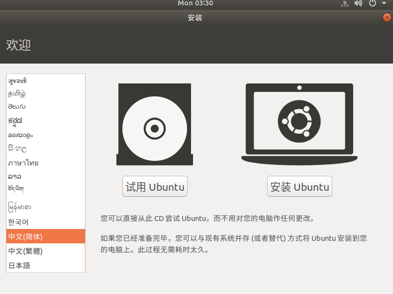
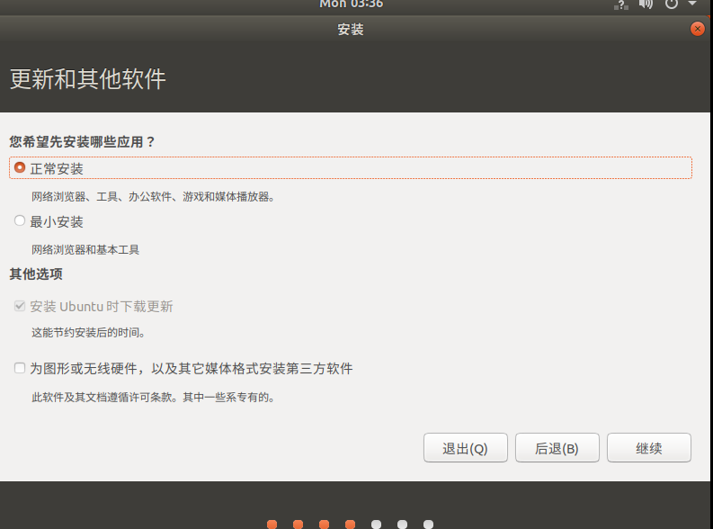
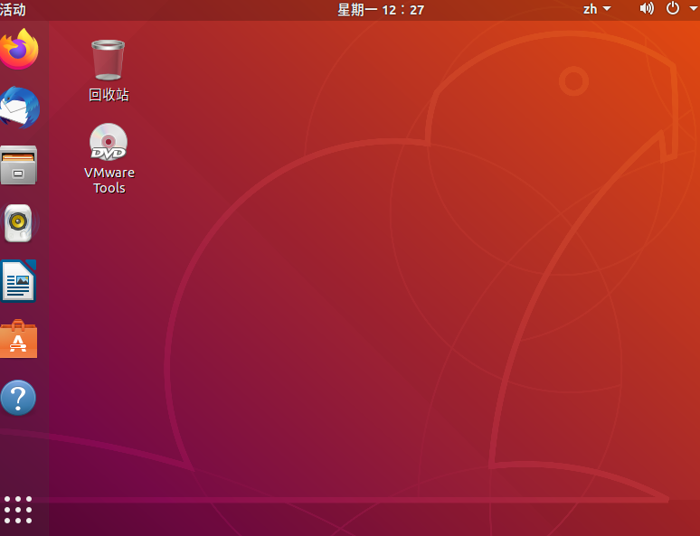
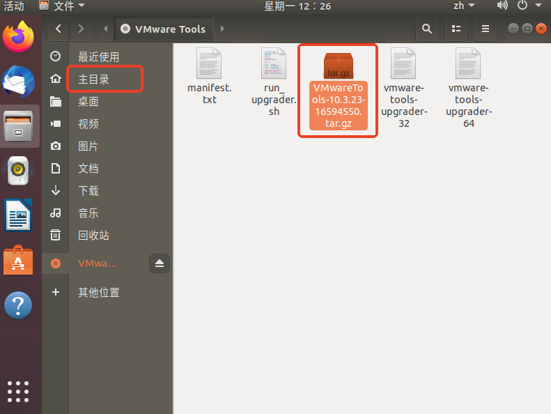
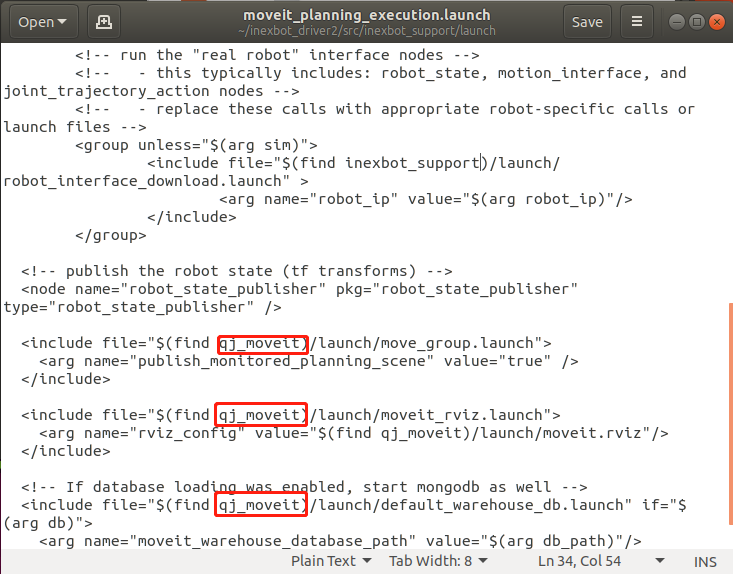
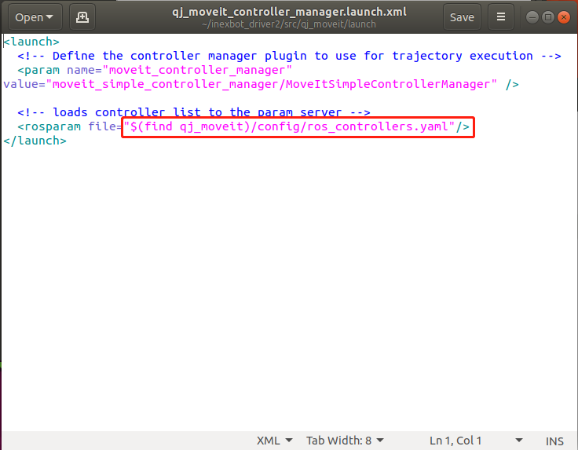
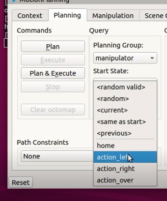
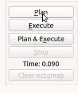

# ROS Usage Tutorial

This document introduces the basic usage of ROS, including creating a workspace, configuring a URDF model, controlling the robot via MoveIt, and implementing control through C++ programming. You can also follow the video tutorial [NexDroid and ROS Integration - Connection and Usage](https://www.bilibili.com/video/BV1mJ41177Jh) for guided learning.

## 1. Create a Workspace

```bash
mkdir -p ~/inexbot/src
cd ~/inexbot/src
catkin_init_workspace
```

If an error occurs:



Run the following command:

```bash
ls -al ~/inexbot/src
```

Then re-run the workspace initialization command:

```bash
catkin_init_workspace
cd ../
catkin_make
```

## 2. Configure ~/.bashrc

```bash
gedit ~/.bashrc
```

Add the following at the end of the file:

```bash
source ~/inexbot/devel/setup.bash
```

Copy the inexbot package to the `~/inexbot/src` directory.

## 3. Configure MoveIt

### Install MoveIt

Open a new terminal and run:

```bash
sudo apt-get install ros-melodic-moveit
source /opt/ros/melodic/setup.bash
sudo apt-get install ros-melodic-moveit-resources
```

### Launch MoveIt Setup Assistant

```bash
cd ~/inexbot
source ./devel/setup.bash
roslaunch moveit_setup_assistant setup_assistant.launch
```










Copy the two folders from the inexbot_driver file and the generated moveit file:



In `qj_ws/src/inexbot_support/launch`, change all default moveit folder names in `moveit_planning_execution.launch` to `qj_moveit` (the actual name of the moveit folder):


In `inexbot_support/config`, change the joint names in the two `.yaml` files to match the joint names in the URDF:



In `qj_moveit/launch/qj_moveit_controller_manager.launch.xml`, change the content highlighted in the red box to `(find inexbot_support)/config/controllers.yaml`:


Open a terminal, build and launch:

```bash
cd ~/inexbot
catkin_make
source devel/setup.bash
roslaunch inexbot_support moveit_planning_execution.launch sim:=false robot_ip:=192.168.1.13
```

## 4. Control the Robot via MoveIt

### Method 1: Set Goal State

Click **Plan** to generate a planned trajectory. The computation time will be displayed at the bottom.



Click **Execute** to run the motion, or click **Plan & Execute** to plan and execute immediately.



### Method 2: Drag Planner

Drag the green sphere at the end of the motion planner. When hovering over the sphere, a 3D coordinate appears below it. Drag to the target position, click **Plan** to generate the planned trajectory, then click **Execute** to run it, or click **Plan & Execute** to plan and execute immediately.


## 5. C++ Programming to Control the Robot

### Create a Package

```bash
cd ~/inexbot/src
catkin_create_pkg inexbot_code std_msgs rospy roscpp
cd ../
catkin_make
```

### Joint Space Planning Example

Save the following code as `src/moveit_joint_demo.cpp` and place it in `~/inexbot/src/inexbot_code/src/`:

```cpp
#include <ros/ros.h>
#include <moveit/move_group_interface/move_group_interface.h>

int main(int argc, char **argv)
{
    ros::init(argc, argv, "moveit_joint_demo");
    ros::AsyncSpinner spinner(1);
    spinner.start();

    // "manipulator" is the planning group name set through MoveIt
    moveit::planning_interface::MoveGroupInterface arm("manipulator");

    // Set joint tolerance
    arm.setGoalJointTolerance(0.001);
    // Set maximum acceleration
    arm.setMaxAccelerationScalingFactor(0.2);
    // Set maximum velocity
    arm.setMaxVelocityScalingFactor(0.2);

    // Move the arm to the initial position ("home" is a MoveIt preset position)
    arm.setNamedTarget("home");
    arm.move();
    sleep(1);

    // Set six joint angles in joint space
    double targetPose[6] = {0.391410, -0.676384, -0.376217, 0.0, 1.052834, 0.454125};
    std::vector<double> joint_group_positions(6);
    joint_group_positions[0] = targetPose[0];
    joint_group_positions[1] = targetPose[1];
    joint_group_positions[2] = targetPose[2];
    joint_group_positions[3] = targetPose[3];
    joint_group_positions[4] = targetPose[4];
    joint_group_positions[5] = targetPose[5];

    arm.setJointValueTarget(joint_group_positions);
    arm.move();
    sleep(1);

    // Move the arm back to the initial position
    arm.setNamedTarget("home");
    arm.move();
    sleep(1);

    ros::shutdown();
    return 0;
}
```

### Modify CMakeLists.txt

Add the following above the `add_executable` tag:

```cmake
add_executable(moveit_joint_demo src/moveit_joint_demo.cpp)
target_link_libraries(moveit_joint_demo ${catkin_LIBRARIES})
```

### Build and Run

```bash
cd ~/inexbot
catkin_make
rosrun inexbot_code moveit_joint_demo
```
