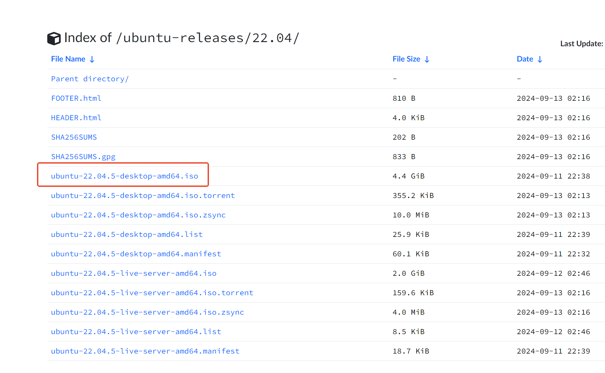
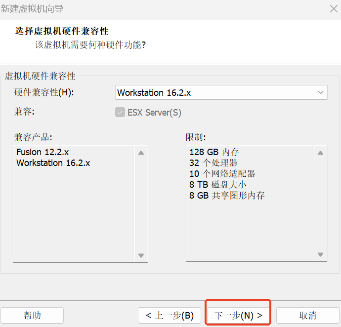
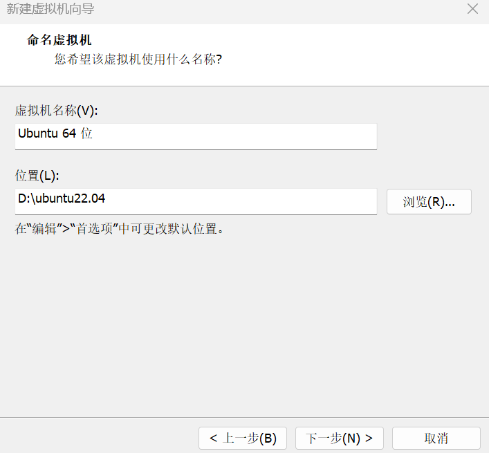
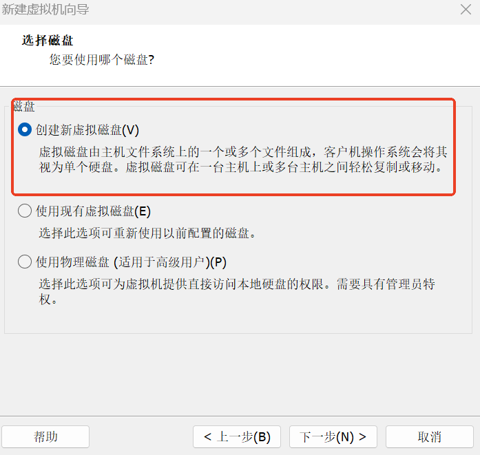
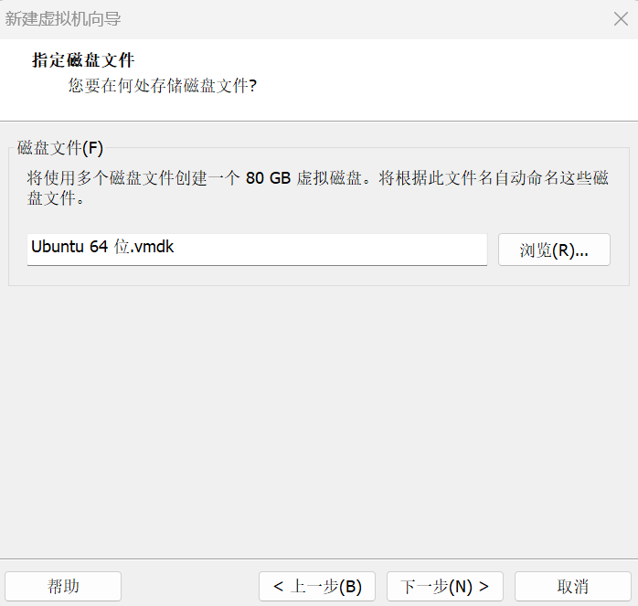
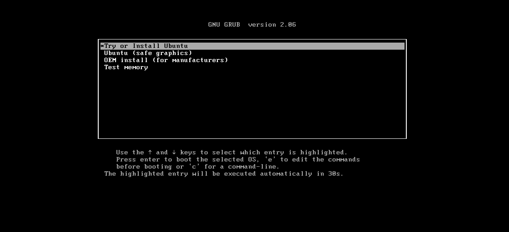
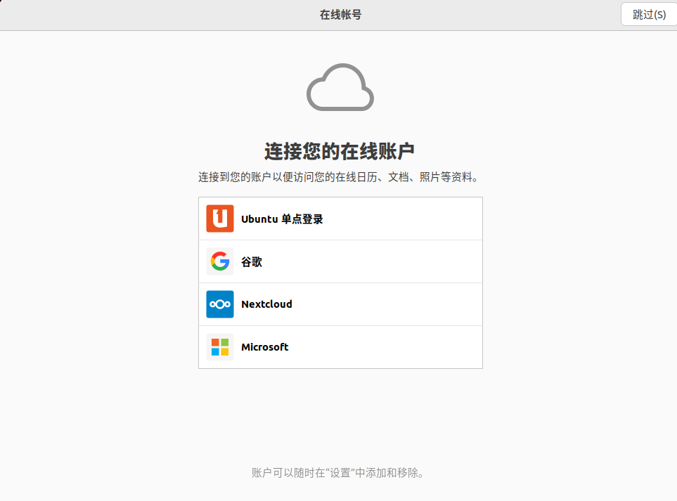

# Ubuntu 22.04 Installation

This article describes the complete steps for installing an Ubuntu 22.04 virtual machine using VMware. The Ubuntu image is downloaded from the Tsinghua University Open Source Mirror Site, so you can skip the manual repository replacement step during installation.

## Download the Image

Download the Ubuntu 22.04 LTS image from the Tsinghua University Open Source Mirror Site:

https://mirrors.tuna.tsinghua.edu.cn/ubuntu-releases/22.04/

## Create a Virtual Machine

### VMware Configuration Steps

1. Open VMware, click **Create a New Virtual Machine** to begin configuring the virtual machine environment.

2. Select **Custom (Advanced)**, then click **Next**.

3. Select hardware compatibility based on your VMware version, then click **Next**.

4. Select **I will install the operating system later**, then click **Next**.

5. Select **Linux**, and choose **Ubuntu 64-bit** as the version, then click **Next**.

6. Set the virtual machine name and installation location (it is recommended not to place it on the C drive), then click **Next**.

7. Set the number of processors and cores, then click **Next**.

8. Configure the memory (recommended 4GB or above), then click **Next**.

9. Select **Use network address translation (NAT)**, then click **Next**.

10. Keep the default recommended configuration, then click **Next**.

11. Select **SCSI (S)**, then click **Next**.

12. Select **Create a new virtual disk**, then click **Next**.

13. Allocate disk capacity (recommended 80GB, adjustable as needed), select **Split virtual disk into multiple files**, then click **Next**.

14. Click **Next**.

15. Click **Customize Hardware**, and remove the printer (to save resources).

16. Select **New CD/DVD (SATA)**, click **Use ISO image file**, browse and select the downloaded Ubuntu image file, then click **Close**.

17. Click **Finish**, then click **Power on this virtual machine**.

## Install Ubuntu 22.04

### Start the Virtual Machine

1. Select **Try or install ubuntu**, then press Enter.

2. From the left dropdown, select **Chinese (Simplified)**, then click **Install Ubuntu**.

### Configure Installation Options

1. Click **Continue**.

2. Select **Normal installation** or **Minimal installation**, then click **Continue**.

3. Select **Erase disk and install Ubuntu**, then click **Install Now**.

4. Click **Continue**.

5. Click **Continue**.

6. Set your username and password, click **Continue**, and wait for the installation to complete.

### Initial Configuration

1. After restarting, click **Skip**.

2. Follow the prompts for the next few steps by clicking Forward, and finally click **Done**. If a prompt dialog appears, click **Remind me later**.

