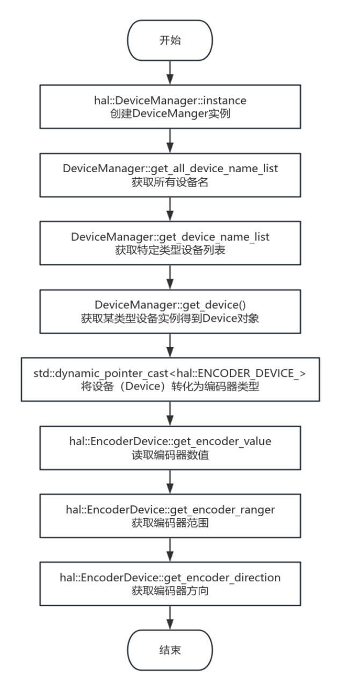
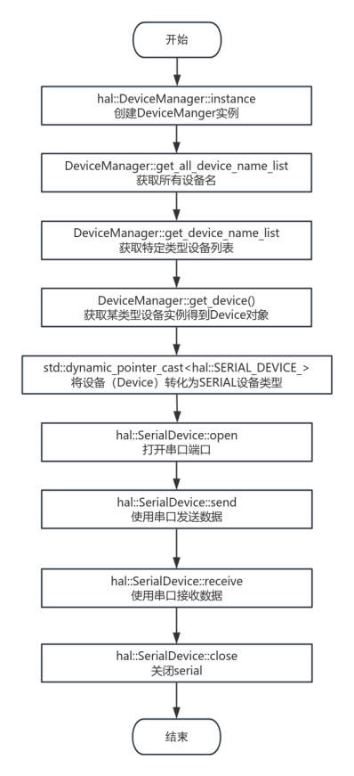

# HAL

# Introduction

The iNexBot EtherCAT master station controller has a master jitter time of less than 20us. It can be used for the development of industrial automation control systems, especially suitable for scenarios with high real-time requirements such as robotics and servo motor control.

### Version Information

| Secondary Development Version | Company |
| --- | --- |
| 1.0.0 | INEXBOT |

### Version Iterations

| Version | Modified Date | Modified By | Description |
| --- | --- | --- | --- |
| 1.0.0 | 20250310 | EA | Initial version |

# Overview

### About This Document

This document aims to help users use the iNexBot libhal_sdk C++ library.

### About the libhal_sdk Library

This library is the hardware abstraction layer for the iNexBot system, unifying the user interface and facilitating ease of use.

### Development Environment Requirements

| Operating System | Ubuntu 20.04 LTS |
| --- | --- |
| System Architecture | x86_64 |
| Compiler | GCC version 9.4.0/GLIBC 2.31-0ubuntu9.2<br>GCC version 4.8.2/EGLIBC 2.19-0ubuntu6.15 |
| Dependency Libraries | Libpthread, librt, libdl, libm |

| --- | --- |
# Function Library API Reference

## Usage Overview

1. Copy the libhal_sdk.a static library file to the project's lib directory

2. Copy the header files from the include folder to the project's include directory

3. Link the libhal_sdk.a library during compilation

Demo download

## Class List

| Class Name | Description |
| --- | --- |
| Device class | Base class for all device objects. |
| DeviceManager class | Manager class for Device objects. |
| AnalogIO class | Abstraction of analog IO devices. |
| CANDevice class | Abstraction of CAN devices. |
| DigitalIO class | Abstraction of digital IO. |
| EncoderDevice class | Abstraction of encoder devices. |
| PwmDevice class | Abstraction of PWM devices. |
| SerialDevice class | Abstraction of Serial devices. |
| UpsDevice class | Abstraction of UPS devices. |

## hal_sdk Usage Flowchart


## Usage Example

### demo.cpp

```
#include <hal/device_manager.h>
#include <hal/devices/digital_io.h>
#include <hal/devices/analog_io.h>
#include <hal/devices/can_device.h>
#include <hal/devices/pwm_device.h>
#include <hal/devices/encoder_device.h>
#include <hal/devices/ups_device.h>
#include <iostream>
#include <thread>
#include <chrono>


void print_device_info(const std::vector<std::string>& devices) {
    std::cout << "Devices:" << std::endl;
    for (const auto& name : devices) {
        std::cout << "- " << name << std::endl;
    }
    std::cout << std::endl;
}


int main() {
    auto& manager = hal::DeviceManager::instance();

    try {
        // 1. Demonstrate the device manager's query functionality
        std::cout << "\n=== Device Query ===" << std::endl;
        auto all_devices = manager.get_all_device_name_list();
        std::cout << "All devices:" << std::endl;
        print_device_info(all_devices);


        // Get list of specific device type
        auto dio_devices = manager.get_device_name_list(hal::DeviceType::DIGITAL_IO_);
        std::cout << "Digital IO devices:" << std::endl;
        print_device_info(dio_devices);


        // 2. Get and use devices through DeviceManager
        std::cout << "\n=== Device Usage Examples ===" << std::endl;

        // Use digital IO
        if (auto dio_dev = manager.get_device(hal::DeviceType::DIGITAL_IO_, "DIO_1")) {
            auto digital_io = std::dynamic_pointer_cast<hal::DigitalIO>(dio_dev);
            digital_io->set_output(2, true);
            std::cout << "DIO_1 channel 3: " << digital_io->get_input(3) << std::endl;
        }


        // Use CAN device
        if (auto can_dev = manager.get_device(hal::DeviceType::CAN_DEVICE_, "CAN_1")) {
            auto can_device = std::dynamic_pointer_cast<hal::CANDevice>(can_dev);
            can_device->open(0);
            can_device->set_parameters(0, 500000);
            unsigned char tx_data[8] = {0x11, 0x22, 0x33, 0x44};
            can_device->send(0, 0x123, tx_data, 4);
            unsigned int rx_id;
            unsigned char rx_data[16];
            unsigned int rx_len = can_device->receive(0, rx_id, rx_data);
            std::cout << "CAN_1 received length: " << rx_len << std::endl;
        }


        // 3. Device existence check
        std::cout << "\n=== Device Existence Check ===" << std::endl;
        std::cout << "DIO_1 exists: "
                  << manager.is_device_exist(hal::DeviceType::DIGITAL_IO_, "DIO_1") << std::endl;


    } catch (const std::exception& e) {
        std::cerr << "Error: " << e.what() << std::endl;
        return 1;
    }

    return 0;
}
```
# Function Library API Detailed Reference

## DeviceType Enum

```
enum class DeviceType {
    NULL_,
    ANALOG_IO_,
    CAN_DEVICE_,
    DIGITAL_IO_,
    ENCODER_DEVICE_,
    PWM_DEVICE_,
    SERIAL_DEVICE_,
    UPS_DEVICE_,
    CUSTOM_
};
```
| Variable Name | Description |
| --- | --- |
| NULL_ | Null device |
| DIGITAL_IO_ | Digital input/output device |
| ANALOG_IO_ | Analog input/output device |
| CAN_DEVICE_ | CAN bus device |
| PWM_DEVICE_ | Pulse width modulation device |
| ENCODER_DEVICE_ | Encoder device |
| UPS_DEVICE_ | Uninterruptible power supply device |
| SERIAL_DEVICE_ | Serial port device |
| CUSTOM_ | Custom device |

## Device Class

This class is the base class for all device objects.

### Device Class Definition

```
class Device {
public:
    Device(DeviceType device_type, const std::string& device_name);
    virtual ~Device() = default;

    bool valid() const { return valid_; }
    DeviceType get_device_type() const { return device_type_; }
    std::string get_device_name() const { return device_name_; }

protected:
    bool valid_{false};
    DeviceType device_type_;
    std::string device_name_;
};
}
```
### Device Class Member Functions

| Function Name | Function Description | Class Access Permission |
| --- | --- | --- |
| Device | Constructor | Public |
| get_device_type | Get device type | public |
| get_device_name | Get device name | public |
| valid | Check if device is available | public |

### Device Class Member Variables

| Variable Name | Variable Description | Class Access Permission |
| --- | --- | --- |
| valid_ | Whether available | protected |
| device_type_ | Device type | protected |
| device_name_ | Device name | protected |

### Member Function Detailed Reference

#### Device

| Function Prototype | Device(DeviceType device_type, const std::string& device_name); |
| --- | --- |
| Function Description | Constructor, used to initialize the Device object. |
| Parameter Description | Input parameters: device_type: Device type, used to specify the device category. device_name: Device name, used to identify the device. |
| Return Value | None |
| Remarks | This constructor is used to create a Device object and initialize its device type and name. |

#### ~Device

| Function Prototype | virtual ~Device() = default; |
| --- | --- |
| Function Description | Destructor, used to destroy the Device object. |
| Parameter Description | None |
| Return Value | None |
| Remarks | This destructor is virtual, ensuring proper destruction of derived classes. |

#### valid

| Function Prototype | bool valid() const; |
| --- | --- |
| Function Description | Check if the Device object is valid. |
| Parameter Description | None |
| Return Value | Returns a bool value; true indicates the Device object is valid, false indicates invalid. |
| Remarks | This function is used to determine whether the Device object's state is valid. |

#### get_device_type

| Function Prototype | DeviceType get_device_type() const; |
| --- | --- |
| Function Description | Get the device type of the Device object. |
| Parameter Description | None |
| Return Value | Returns a DeviceType value, representing the Device object's device type. |
| Remarks | This function is used to get the Device object's device type. |

#### get_device_name

| Function Prototype | std::string get_device_name() const; |
| --- | --- |
| Function Description | Get the device name of the Device object. |
| Parameter Description | None |
| Return Value | Returns a std::string value, representing the Device object's device name. |
| Remarks | This function is used to get the Device object's device name. |

## DeviceManager Class

This class is the manager class for Device objects.

### Class Definition

```
class DeviceManager {
public:
    static DeviceManager &instance();


    int add_device(std::shared_ptr<Device> device);
    int remove_device(DeviceType device_type, const std::string& device_name);
    bool is_device_exist(DeviceType device_type, const std::string& device_name) const;

    std::vector<std::string> get_all_device_name_list() const;
    std::vector<std::string> get_device_name_list(DeviceType device_type) const;
    std::vector<std::shared_ptr<Device>> get_device_list(DeviceType device_type) const;
    std::shared_ptr<Device> get_device(DeviceType device_type, const std::string& device_name) const;


private:
    DeviceManager() = default;
    static void register_devices(DeviceManager &manager);
    std::unordered_map<std::string, std::shared_ptr<Device>> devices_;
};
```
### Class Member Functions

| Function Name | Function Description | Class Access Permission |
| --- | --- | --- |
| instance | Get the singleton instance of the device manager | public |
| add_device | Add a device to the device manager | public |
| remove_device | Remove a device from the device manager | public |
| is_device_exist | Check if a device exists | public |
| get_all_device_name_list | Get the name list of all devices | public |
| get_device_name_list | Get the name list of all devices of a certain type | public |
| get_device_list | Get the object instances of all devices of a certain type | public |
| get_device | Get a specific device | public |
| DeviceManager | Constructor | private |
| register_devices | Register devices | private |

### Class Member Variables

| Variable Name | Variable Description | Class Access Permission |
| --- | --- | --- |
| device_ | Stores all devices mounted to the device manager | private |

### Member Function Detailed Reference

#### instance

| Function Prototype | static DeviceManager &instance(); |
| --- | --- |
| Function Description | Get the singleton instance of the DeviceManager class. |
| Parameter Description | None |
| Return Value | Returns a reference to the DeviceManager class's singleton instance. |
| Remarks | This function is used to get the unique instance of the DeviceManager class. |

#### add_device

| Function Prototype | int add_device(std::shared_ptr&lt;Device> device); |
| --- | --- |
| Function Description | Add a device to the device manager. |
| Parameter Description | Input parameter:<br>device: The device object to add |
| Return Value | Returns an int value; 0 indicates success, non-zero indicates failure. |
| Remarks | This function is used to add a new device to the device manager. |

#### remove_device

| Function Prototype | int remove_device(DeviceType device_type, const std::string& device_name); |
| --- | --- |
| Function Description | Remove a device from the device manager. |
| Parameter Description | Input parameters:<br>device_type: The device type.<br>device_name: The name of the device to remove. |
| Return Value | Returns an int value; 0 indicates success, non-zero indicates failure. |
| Remarks | This function is used to remove a device with the specified type and name from the device manager. |

#### is_device_exist

| Function Prototype | bool is_device_exist(DeviceType device_type, const std::string& device_name) const; |
| --- | --- |
| Function Description | Check if a device with the specified type and name exists in the device manager. |
| Parameter Description | Input parameters:<br>device_type: The device type.<br>device_name: The device name to check. |
| Return Value | Returns a bool value; true indicates exists, false indicates does not exist. |
| Remarks | This function is used to check if a device with the specified type and name exists in the device manager. |

#### get_all_device_name_list

| Function Prototype | std::vector&lt;std::string> get_all_device_name_list() const; |
| --- | --- |
| Function Description | Get the name list of all devices in the device manager. |
| Parameter Description | None |
| Return Value | Returns a string vector containing all device names. |
| Remarks | This function is used to get the name list of all devices in the device manager. |

#### get_device_name_list

| Function Prototype | std::vector&lt;std::string> get_device_name_list(DeviceType device_type) const; |
| --- | --- |
| Function Description | Get the name list of devices of the specified type in the device manager. |
| Parameter Description | Input parameter:<br>device_type: The device type to get the name list for. |
| Return Value | Returns a string vector containing device names of the specified type. |
| Remarks | This function is used to get the name list of devices of the specified type in the device manager. |

#### get_device_list

| Function Prototype | std::vector&lt;std::shared_ptr&lt;Device>> get_device_list(DeviceType device_type) const; |
| --- | --- |
| Function Description | Get the list of devices of the specified type in the device manager. |
| Parameter Description | Input parameter:<br>device_type: The device type to get the list for. |
| Return Value | Returns a shared pointer vector containing device objects of the specified type. |
| Remarks | This function is used to get the list of devices of the specified type in the device manager. |

#### get_device

| Function Prototype | std::shared_ptr&lt;Device> get_device(DeviceType device_type, const std::string& device_name) const; |
| --- | --- |
| Function Description | Get the device object with the specified type and name from the device manager. |
| Parameter Description | Input parameters:<br>device_type: The device type.<br>device_name: The device name to get. |
| Return Value | Returns a shared pointer to the device with the specified type and name. Returns nullptr if the device does not exist. |
| Remarks | This function is used to get the device object with the specified type and name from the device manager. |

## AnalogIO Class

This class is the abstraction of analog IO devices.

### Class Definition

```
class AnalogIO : public Device {
public:
    AnalogIO(const std::string& name);
    virtual ~AnalogIO() = default;


    virtual void set_output(int channel, double value) = 0;
    virtual void set_outputs(const std::vector<int>& channels, const std::vector<double>& values) = 0;
    virtual double get_input(int channel) = 0;
    virtual std::vector<double> get_inputs(const std::vector<int>& channels) = 0;
    virtual int get_channel_count() const = 0;

    // Get the measurement range of a channel
    virtual std::pair<double, double> get_range(int channel) const = 0;
};
```
### Class Member Functions

| Function Name | Function Description | Class Access Permission |
| --- | --- | --- |
| AnalogIO | Constructor, initializes device name | public |
| ~AnalogIO | Destructor | public |
| set_output | Set the value of a single output channel | public |
| set_outputs | Set the values of multiple output channels | public |
| get_input | Get the value of a single input channel | public |
| get_inputs | Get the values of multiple input channels | public |
| get_channel_count | Get the channel count | public |
| get_range | Get the measurement range of a specified channel | public |

### Class Member Variables

| Variable Name | Variable Description | Class Access Permission |

| --- | --- | --- |
### AnalogIO Class Usage Flowchart


### Member Function Detailed Reference

#### AnalogIO

| Function Prototype | AnalogIO(const std::string& name); |
| --- | --- |
| Function Description | Constructor, used to initialize the AnalogIO object. |
| Parameter Description | Input parameter:<br>name: Device name, used to identify the device. |
| Return Value | None |
| Remarks | This constructor is used to create an AnalogIO object and initialize its device type and name. |

#### ~AnalogIO

| Function Prototype | virtual ~AnalogIO() = default; |
| --- | --- |
| Function Description | Destructor, used to destroy the Device object. |
| Parameter Description | None |
| Return Value | None |
| Remarks | This destructor is virtual, ensuring proper destruction of derived classes. |

#### set_output

| Function Prototype | void set_output(int channel, double value); |
| --- | --- |
| Function Description | Set the analog output value of the specified channel. |
| Parameter Description | Input parameter<br>channel: The analog output channel number.<br>value: The analog output value to set. |
| Return Value | None |
| Remarks | This is a pure virtual function, used to set the analog output value of the specified channel. |

#### set_outputs

| Function Prototype | void set_outputs(const std::vector&lt;int>& channels, const std::vector&lt;double>& values); |
| --- | --- |
| Function Description | Set the analog output values of multiple channels. |
| Parameter Description | Input parameter<br>channels: A vector containing the analog output channel numbers to set.<br>values: A vector of analog output values corresponding to the channels vector. |
| Return Value | None |
| Remarks | This is a pure virtual function, used to set the analog output values of multiple channels. |

#### get_input

| Function Prototype | double get_input(int channel); |
| --- | --- |
| Function Description | Get the analog input value of the specified channel. |
| Parameter Description | Input parameter<br>channel: The analog input channel number. |
| Return Value | Returns a double value, representing the analog input value of the specified channel. |
| Remarks | This is a pure virtual function, used to get the analog input value of the specified channel. |

#### get_inputs

| Function Prototype | std::vector&lt;double> get_inputs(const std::vector&lt;int>& channels); |
| --- | --- |
| Function Description | Get the analog input values of multiple channels. |
| Parameter Description | Input parameter<br>channels: A vector containing the analog input channel numbers to get. |
| Return Value | Returns a std::vector&lt;double> value, containing a vector of analog input values for the specified channels. |
| Remarks | This is a pure virtual function, used to get the analog input values of multiple channels. |

#### get_channel_count

| Function Prototype | int get_channel_count() const; |
| --- | --- |
| Function Description | Get the total channel count of the analog I/O device. |
| Parameter Description | None |
| Return Value | Returns an int value, representing the total channel count of the analog I/O device. |
| Remarks | This is a pure virtual function, used to get the total channel count of the analog I/O device. |

#### get_range

| Function Prototype | std::pair&lt;double, double> get_range(int channel) const; |
| --- | --- |
| Function Description | Get the measurement range of the specified channel. |
| Parameter Description | Input parameter:<br>channel: The analog I/O channel number. |
| Return Value | Returns a std::pair&lt;double, double> value, representing the measurement range (minimum and maximum values) of the specified channel. |
| Remarks | This is a pure virtual function, used to get the measurement range of the specified channel. |

## CANDevice Class

This class is the abstraction of CAN devices.

### Class Definition

```
class CANDevice : public Device {
public:
    CANDevice(const std::string& name);
    virtual ~CANDevice() = default;
    virtual void open(int channel) = 0;
    virtual void close(int channel) = 0;
    virtual void set_parameters(int channel, int baudrate) = 0;
    virtual void set_recv_filter_id(int channel, bool enable_recv_filter, unsigned int recv_filter_id) = 0;
    virtual void set_frame_format(int channel, Frame_Format format) = 0;
    virtual bool detect_supported_function(int channel, Support_Function function) const = 0;
    virtual void send(int channel, unsigned int txid, const unsigned char buff[8], unsigned int len, bool use_remote_frame = false) = 0;
    virtual unsigned int receive(int channel, unsigned int & rxid, unsigned char buff[16]) = 0;
    virtual int get_channel_count() const = 0;
};
```
### Class Member Functions

| Function Name | Function Description | Class Access Permission |
| --- | --- | --- |
| CANDevice | Constructor, initializes device name | public |
| ~CANDevice | Destructor | public |
| open | Open the specified channel | public |
| close | Close the specified channel | public |
| set_parameters | Set parameters for the specified channel, mainly baud rate | public |
| set_recv_filter_id | Set receive filter ID | public |
| set_frame_format | Set data frame format | public |
| detect_supported_function | Detect if the specified channel supports a certain function | public |
| send | Send data frame | public |
| receive | Receive data frame | public |
| get_channel_count | Get the channel count of the device | public |

### Class Member Variables

| Variable Name | Variable Description | Class Access Permission |

| --- | --- | --- |
### CANDevice Class Usage Flowchart


### Member Function Detailed Reference

#### CANDevice

| Function Prototype | CANDevice(const std::string& name); |
| --- | --- |
| Function Description | Constructor, used to initialize the CANDevice object. |
| Parameter Description | Input parameter:<br>name: Device name, used to identify the device. |
| Return Value | None |
| Remarks | This constructor is used to create a CANDevice object and initialize its device type and name. |

#### ~CANDevice

| Function Prototype | virtual ~CANDevice() = default; |
| --- | --- |
| Function Description | Destructor, used to destroy the CANDevice object. |
| Parameter Description | None |
| Return Value | None |
| Remarks | This destructor is virtual, ensuring proper destruction of derived classes. |

#### open

| Function Prototype | void open(int channel); |
| --- | --- |
| Function Description | Open the CAN device on the specified channel. |
| Parameter Description | Input parameter:<br>channel: Specifies the CAN device channel number to open. |
| Return Value | None |
| Remarks | This is a pure virtual function that must be implemented in derived classes. The CAN device must be opened before subsequent communication operations can be performed. |

#### close

| Function Prototype | void close(int channel); |
| --- | --- |
| Function Description | Close the CAN device on the specified channel. |
| Parameter Description | Input parameter:<br>channel: Specifies the CAN device channel number to close. |
| Return Value | None |
| Remarks | This is a pure virtual function that must be implemented in derived classes. Closing the CAN device releases related resources. |

#### set_parameters

| Function Prototype | void set_parameters(int channel, int baudrate); |
| --- | --- |
| Function Description | Set the baud rate of the CAN device on the specified channel. |
| Parameter Description | Input parameters:<br>channel: Specifies the CAN device channel number to set the baud rate for.<br>baudrate: The baud rate value to set. |
| Return Value | None |
| Remarks | This is a pure virtual function that must be implemented in derived classes. Setting the baud rate ensures consistent communication speed between CAN devices. |

#### set_recv_filter_id

| Function Prototype | void set_recv_filter_id(int channel, bool enable_recv_filter, unsigned int recv_filter_id); |
| --- | --- |
| Function Description | Set the receive filter ID of the CAN device on the specified channel. |
| Parameter Description | Input parameters:<br>channel: Specifies the CAN device channel number to set the receive filter ID for.<br>enable_recv_filter: Whether to enable the receive filter.<br>recv_filter_id: The receive filter ID value to set. |
| Return Value | None |
| Remarks | This is a pure virtual function that must be implemented in derived classes. Setting the receive filter ID can filter out unwanted CAN messages. |

#### set_frame_format

| Function Prototype | void set_frame_format(int channel, Frame_Format format); |
| --- | --- |
| Function Description | Set the frame format of the CAN device on the specified channel. |
| Parameter Description | Input parameters:<br>channel: Specifies the CAN device channel number to set the frame format for.<br>format: The frame format type to set. |
| Return Value | None |
| Remarks | This is a pure virtual function that must be implemented in derived classes. Setting the frame format ensures consistent message format between CAN devices. |

#### detect_supported_function

| Function Prototype | bool detect_supported_function(int channel, Support_Function function) const; |
| --- | --- |
| Function Description | Detect if the CAN device on the specified channel supports the specified function. |
| Parameter Description | Input parameters:<br>channel: Specifies the CAN device channel number to detect the function for.<br>function: The function type to detect. |
| Return Value | Returns a bool value; true indicates the function is supported, false indicates not supported. |
| Remarks | This is a pure virtual function that must be implemented in derived classes. Detecting functionality ensures the CAN device supports the function before use. |

#### send

| Function Prototype | void send(int channel, unsigned int txid, const unsigned char buff[8], unsigned int len, bool use_remote_frame = false); |
| --- | --- |
| Function Description | Send a CAN message on the specified channel. |
| Parameter Description | Input parameters:<br>channel: Specifies the CAN device channel number to send the message on.<br>txid: The ID of the message to send.<br>buff: The data buffer for the message to send.<br>len: The data length of the message to send.<br>use_remote_frame: Whether to send a remote frame, default is false. |
| Return Value | None |
| Remarks | This is a pure virtual function that must be implemented in derived classes. Sending messages is one of the basic CAN communication operations. |

#### receive

| Function Prototype | unsigned int receive(int channel, unsigned int & rxid, unsigned char buff[16]); |
| --- | --- |
| Function Description | Receive a CAN message on the specified channel. |
| Parameter Description | Input parameter:<br>channel: Specifies the CAN device channel number to receive the message on.<br>Output parameters<br>rxid: The ID of the received message.<br>buff: The data buffer for the received message. |
| Return Value | Returns an unsigned int value, representing the length of the received message. |
| --- | --- |
| Remarks | This is a pure virtual function that must be implemented in derived classes. Receiving messages is one of the basic CAN communication operations. |

#### get_channel_count

| Function Prototype | int get_channel_count() const; |
| --- | --- |
| Function Description | Get the channel count of the CAN device. |
| Parameter Description | None |
| Return Value | Returns an int value, representing the channel count of the CAN device. |
| Remarks | This is a pure virtual function that must be implemented in derived classes. Getting the channel count provides information about the CAN device's hardware configuration. |

## DigitalIO Class

This class is the abstraction of digital IO.

### Class Definition

```
class DigitalIO : public Device {
public:
    DigitalIO(const std::string& name);
    virtual ~DigitalIO() = default;


    virtual void set_output(int channel, bool state) = 0;
    virtual void set_outputs(const std::vector<int>& channels, const std::vector<bool>& states) = 0;
    virtual bool get_input(int channel) = 0;
    virtual std::vector<bool> get_inputs(const std::vector<int>& channels) = 0;
    virtual int get_channel_count() const = 0;
};
```
### Class Member Functions

| Function Name | Function Description | Class Access Permission |
| --- | --- | --- |
| DigitalIO | Constructor, initializes device name | public |
| ~DigitalIO | Destructor | public |
| set_output | Set the output state of the specified channel | public |
| set_outputs | Set the output states of multiple channels | public |
| get_input | Get the input state of the specified channel | public |
| get_inputs | Get the input states of multiple channels | public |
| get_channel_count | Get the channel count of the device | public |

### Class Member Variables

| Variable Name | Variable Description | Class Access Permission |

| --- | --- | --- |
### DigitalIO Class Usage Flowchart


### Member Function Detailed Reference

#### DigitalIO

| Function Prototype | DigitalIO(const std::string& name); |
| --- | --- |
| Function Description | Constructor, used to initialize the DigitalIO object. |
| Parameter Description | Input parameter:<br>name: Device name, used to identify the device. |
| Return Value | None |
| Remarks | This constructor is used to create a DigitalIO object and initialize its device type and name. |

#### ~DigitalIO

| Function Prototype | virtual ~DigitalIO() = default; |
| --- | --- |
| Function Description | Destructor, used to destroy the DigitalIO object. |
| Parameter Description | None |
| Return Value | None |
| Remarks | This destructor is virtual, ensuring proper destruction of derived classes. |

#### set_output

| Function Prototype | void set_output(int channel, bool state); |
| --- | --- |
| Function Description | Set the output state of the specified digital IO channel. |
| Parameter Description | Input parameter<br>channel: Specifies the digital IO channel number to set.<br>state: Specifies the output state of the digital IO channel; true indicates high level, false indicates low level. |
| Return Value | None |
| --- | --- |
| Remarks | This function is a pure virtual function that must be implemented in derived classes, used to set the output state of the specified digital IO channel. |

#### set_outputs

| Function Prototype | void set_outputs(const std::vector&lt;int>& channels, const std::vector&lt;bool>& states); |
| --- | --- |
| Function Description | Batch set the output states of digital IO channels. |
| Parameter Description | Input parameter<br>channels: A vector containing the digital IO channel numbers to set.<br>states: A vector containing the output states of each digital IO channel; true indicates high level, false indicates low level. |
| Return Value | None |
| --- | --- |
| Remarks | This function is a pure virtual function that must be implemented in derived classes, used to batch set the output states of digital IO channels. |

#### get_input

| Function Prototype | bool get_input(int channel); |
| --- | --- |
| Function Description | Get the input state of the specified digital IO channel. |
| Parameter Description | Input parameter<br>channel: Specifies the digital IO channel number to get. |
| Return Value | Returns a bool value; true indicates high level, false indicates low level. |
| --- | --- |
| Remarks | This function is a pure virtual function that must be implemented in derived classes, used to get the input state of the specified digital IO channel. |

#### get_inputs

| Function Prototype | std::vector&lt;bool> get_inputs(const std::vector&lt;int>& channels); |
| --- | --- |
| Function Description | Batch get the input states of digital IO channels. |
| Parameter Description | Input parameter<br>channels: A vector containing the digital IO channel numbers to get. |
| Return Value | Returns a std::vector&lt;bool> value; each element in the vector represents the input state of the corresponding digital IO channel; true indicates high level, false indicates low level. |
| --- | --- |
| Remarks | This function is a pure virtual function that must be implemented in derived classes, used to batch get the input states of digital IO channels. |

#### get_channel_count

| Function Prototype | int get_channel_count() const; |
| --- | --- |
| Function Description | Get the total number of digital IO channels. |
| Parameter Description | None |
| Return Value | Returns an int value, representing the total number of digital IO channels. |
| Remarks | This function is a pure virtual function that must be implemented in derived classes, used to get the total number of digital IO channels. |

## EncoderDevice Class

This class is the abstraction of encoder devices.

### Class Definition

```
class EncoderDevice : public Device {
public:
    EncoderDevice(const std::string& name);
    virtual ~EncoderDevice() = default;


    virtual int64_t get_encoder_value() const = 0;
    virtual std::pair<int64_t, int64_t> get_encoder_range() const = 0;
    virtual int get_encoder_direction() const = 0;  // 1: forward rotation -1: reverse rotation
};
```
### Class Member Functions

| Function Name | Function Description | Class Access Permission |
| --- | --- | --- |
| EncoderDevice | Constructor, initializes device name | public |
| ~EncoderDevice | Destructor | public |
| get_encoder_value | Get the current encoder value | public |
| get_encoder_range | Get the encoder value range | public |
| get_encoder_direction | Get the encoder rotation direction | public |

### Class Member Variables

| Variable Name | Variable Description | Class Access Permission |

| --- | --- | --- |
### EncoderDevice Class Usage Flowchart



### Member Function Detailed Reference

#### EncoderDevice

| Function Prototype | EncoderDevice(const std::string& name); |
| --- | --- |
| Function Description | Constructor, used to initialize the EncoderDevice object. |
| Parameter Description | Input parameter<br>name: Device name, used to identify the device. |
| Return Value | None |
| --- | --- |
| Remarks | This constructor is used to create an EncoderDevice object and initialize its device type and name. |

#### ~EncoderDevice

| Function Prototype | virtual ~EncoderDevice() = default; |
| --- | --- |
| Function Description | Destructor, used to destroy the EncoderDevice object. |
| Parameter Description | None |
| Return Value | None |
| Remarks | This destructor is virtual, ensuring proper destruction of derived classes. |

#### get_encoder_value

| Function Prototype | virtual int64_t EncoderDevice::get_encoder_value() const; |
| --- | --- |
| Function Description | Get the encoder value. |
| Parameter Description | None |
| Return Value | Returns an int64_t value, representing the current encoder value. |
| Remarks | This is a pure virtual function that must be implemented in derived classes. |

#### get_encoder_range

| Function Prototype | virtual std::pair&lt;int64_t, int64_t> EncoderDevice::get_encoder_range() const; |
| --- | --- |
| Function Description | Get the encoder range. |
| Parameter Description | None |
| Return Value | Returns a std::pair&lt;int64_t, int64_t> value; the first element of the pair represents the encoder's minimum value, and the second element represents the encoder's maximum value. |
| Remarks | This is a pure virtual function that must be implemented in derived classes. |

#### get_encoder_direction

| Function Prototype | virtual int EncoderDevice::get_encoder_direction() const; |
| --- | --- |
| Function Description | Get the encoder direction. |
| Parameter Description | None |
| Return Value | Returns an int value; 1 indicates forward rotation, -1 indicates reverse rotation. |
| Remarks | This is a pure virtual function that must be implemented in derived classes. This function is used to get the encoder's rotation direction. |

## PwmDevice Class

This class is the abstraction of PWM devices.

### Class Definition

```
class PwmDevice : public Device {
public:
    PwmDevice(const std::string& name);
    virtual ~PwmDevice() = default;


    virtual void start_pwm() = 0;
    virtual void stop_pwm() = 0;
    virtual void set_freq(double freq) = 0;
    virtual void set_duty(double duty) = 0;
    virtual double get_freq() const = 0;
    virtual double get_duty() const = 0;
};
```
### Class Member Functions

| Function Name | Function Description | Class Access Permission |
| --- | --- | --- |
| PwmDevice | Constructor, initializes device name | public |
| ~PwmDevice | Destructor | public |
| start_pwm | Start PWM output | public |
| stop_pwm | Stop PWM output | public |
| set_freq | Set PWM output frequency | public |
| set_duty | Set PWM output duty cycle | public |
| get_freq | Get PWM output frequency | public |
| get_duty | Get PWM output duty cycle | public |

### Class Member Variables

| Variable Name | Variable Description | Class Access Permission |

| --- | --- | --- |
### PwmDevice Class Usage Flowchart


### Member Function Detailed Reference

#### PwmDevice

| Function Prototype | PwmDevice(const std::string& name); |
| --- | --- |
| Function Description | Constructor, used to initialize the PwmDevice object. |
| Parameter Description | Input parameter:<br>name: Device name, used to identify the device. |
| Return Value | None |
| Remarks | This constructor is used to create a PwmDevice object and initialize its device type and name. |

#### ~PwmDevice

| Function Prototype | virtual ~PwmDevice() = default; |
| --- | --- |
| Function Description | Destructor, used to destroy the PwmDevice object. |
| Parameter Description | None |
| Return Value | None |
| Remarks | This destructor is virtual, ensuring proper destruction of derived classes. |

#### start_pwm

| Function Prototype | void start_pwm(); |
| --- | --- |
| Function Description | Start the PWM (Pulse Width Modulation) device. |
| Parameter Description | None |
| Return Value | None |
| Remarks | This function is a pure virtual function that must be implemented in derived classes. Used to start the PWM device. |

#### stop_pwm

| Function Prototype | void stop_pwm(); |
| --- | --- |
| Function Description | Stop the PWM (Pulse Width Modulation) device. |
| Parameter Description | None |
| Return Value | None |
| Remarks | This function is a pure virtual function that must be implemented in derived classes. Used to stop the PWM device. |

#### set_freq

| Function Prototype | void set_freq(double freq); |
| --- | --- |
| Function Description | Set the frequency of the PWM (Pulse Width Modulation) device. |
| Parameter Description | Input parameter:<br>freq: The PWM frequency value to set. |
| Return Value | None |
| Remarks | This function is a pure virtual function that must be implemented in derived classes. Used to set the frequency of the PWM device. |

#### set_duty

| Function Prototype | void set_duty(double duty); |
| --- | --- |
| Function Description | Set the duty cycle of the PWM (Pulse Width Modulation) device. |
| Parameter Description | Input parameter:<br>duty: The PWM duty cycle value to set. |
| Return Value | None |
| Remarks | This function is a pure virtual function that must be implemented in derived classes. Used to set the duty cycle of the PWM device. |

#### get_freq

| Function Prototype | double get_freq() const; |
| --- | --- |
| Function Description | Get the current frequency of the PWM (Pulse Width Modulation) device. |
| Parameter Description | None |
| Return Value | Returns a double value, representing the current frequency of the PWM device. |
| Remarks | This function is a pure virtual function that must be implemented in derived classes. Used to get the current frequency of the PWM device. |

#### get_duty

| Function Prototype | double get_duty() const; |
| --- | --- |
| Function Description | Get the current duty cycle of the PWM (Pulse Width Modulation) device. |
| Parameter Description | None |
| Return Value | Returns a double value, representing the current duty cycle of the PWM device. |
| Remarks | This function is a pure virtual function that must be implemented in derived classes. Used to get the current duty cycle of the PWM device. |

## SerialDevice Class

This class is the abstraction of serial devices.

### Class Definition

```
class SerialDevice : public Device { // Remove ": public Device" if not needed
public:
    SerialDevice(const std::string& name);
    virtual ~SerialDevice() = default;
    virtual void open(int channel) = 0;
    virtual void close(int channel) = 0;
    virtual void set_parameters(int channel, int baudrate, char parity, int stop_bits) = 0;
    virtual int send(int channel, const std::vector<char>& data, size_t bytes_to_send) = 0;
    virtual int receive(int channel, std::vector<char>& buffer, size_t& bytes_received) = 0;
    virtual int get_channel_count() const = 0;
};
```
### SerialDevice Class Usage Flowchart



### Member Function Detailed Reference

#### SerialDevice

| Function Prototype | SerialDevice(const std::string& name); |
| --- | --- |
| Function Description | Constructor, used to initialize the SerialDevice object. |
| Parameter Description | Input parameter:<br>name: Device name, used to identify the device. |
| Return Value | None |
| Remarks | This constructor is used to create a SerialDevice object and initialize its device type and name. |

#### ~SerialDevice

| Function Prototype | virtual ~SerialDevice() = default; |
| --- | --- |
| Function Description | Destructor, used to destroy the CANDevice object. |
| Parameter Description | None |
| Return Value | None |
| Remarks | This destructor is virtual, ensuring proper destruction of derived classes. |

#### open

| Function Prototype | void open(int channel); |
| --- | --- |
| Function Description | Open the Serial device on the specified channel. |
| Parameter Description | Input parameter:<br>channel: Specifies the Serial device channel number to open. |
| Return Value | None |
| Remarks | This is a pure virtual function that must be implemented in derived classes. The device must be opened before subsequent communication operations can be performed. |

#### close

| Function Prototype | void close(int channel); |
| --- | --- |
| Function Description | Close the Serial device on the specified channel. |
| Parameter Description | Input parameter:<br>channel: Specifies the Serial device channel number to close. |
| Return Value | None |
| Remarks | This is a pure virtual function that must be implemented in derived classes. Closing the device releases related resources. |

#### set_parameters

| Function Prototype | void set_parameters(int channel, int baudrate, char parity, int stop_bits) ; |
| --- | --- |
| Function Description | Set the baud rate, parity bit, and stop bits of the Serial device on the specified channel. |
| Parameter Description | Input parameters:<br>channel: Specifies the Serial device channel number to set the baud rate for.<br>baudrate: The baud rate value to set.<br>parity: Specifies the parity bit type; "N" for no parity, "E" for even parity, "O" for odd parity<br>stop_bits: Stop bits |
| Return Value | None |
| Remarks |  |

#### send

| Function Prototype | int send(int channel, const std::vector&lt;char>& data, size_t bytes_to_send); |
| --- | --- |
| Function Description | Send a Serial message on the specified channel. |
| Parameter Description | Input parameters:<br>channel: Specifies the device channel number to send the message on.<br>data: The data to send.<br>bytes_to_send: The data length of the message to send. |
| Return Value | None |
| --- | --- |
| Remarks | None |

#### receive

| Function Prototype | int receive(int channel, std::vector&lt;char>& buffer, size_t& bytes_received); |
| --- | --- |
| Function Description | Receive a Serial message on the specified channel. |
| Parameter Description | Input parameter:<br>channel: Specifies the device channel number to receive the message on.<br>Output parameter<br>buffer: Buffer for the received message<br>bytes_received: Length of the received message |
| Return Value | Returns an unsigned int value, representing the length of the received message. |
| --- | --- |
| Remarks | None |

#### get_channel_count

| Function Prototype | int get_channel_count() const; |
| --- | --- |
| Function Description | Get the channel count of the Serial device. |
| Parameter Description | None |
| Return Value | Returns an int value, representing the channel count of the Serial device. |
| Remarks | This is a pure virtual function that must be implemented in derived classes. Getting the channel count provides information about the Serial device's hardware configuration. |

## UpsDevice Class

This class is the abstraction of UPS devices.

### Class Definition

```
class UpsDevice : public Device {
public:
    UpsDevice(const std::string& name);
    virtual ~UpsDevice() = default;


    virtual bool get_ups_status() const = 0;  // true: triggered false: not triggered
};
```
### Class Member Functions

| Function Name | Function Description | Class Access Permission |
| --- | --- | --- |
| UpsDevice | Constructor, initializes device name | public |
| ~UpsDevice | Destructor | public |
| get_ups_status | Get UPS status, returns trigger state (true: triggered, false: not triggered) | public |

### Class Member Variables

| Variable Name | Variable Description | Class Access Permission |

| --- | --- | --- |
### UpsDevice Class Usage Flowchart


### Member Function Detailed Reference

#### UpsDevice

| Function Prototype | UpsDevice(const std::string& name); |
| --- | --- |
| Function Description | Constructor, used to initialize the UpsDevice object. |
| Parameter Description | Input parameter:<br>name: Device name, used to identify the device. |
| Return Value | None |
| Remarks | This constructor is used to create an UpsDevice object and initialize its device type and name. |

#### ~UpsDevice

| Function Prototype | virtual ~UpsDevice() = default; |
| --- | --- |
| Function Description | Destructor, used to destroy the UpsDevice object. |
| Parameter Description | None |
| Return Value | None |
| Remarks | This destructor is virtual, ensuring proper destruction of derived classes. |

#### get_ups_status

| Function Prototype | virtual bool get_ups_status() const = 0; |
| --- | --- |
| Function Description | Get the status of the UPS device. |
| Parameter Description | None |
| Return Value | Returns a bool value; true indicates triggered, false indicates not triggered. |
| Remarks | This is a pure virtual function that must be implemented in derived classes. This function is used to get the status of the UPS device. |
