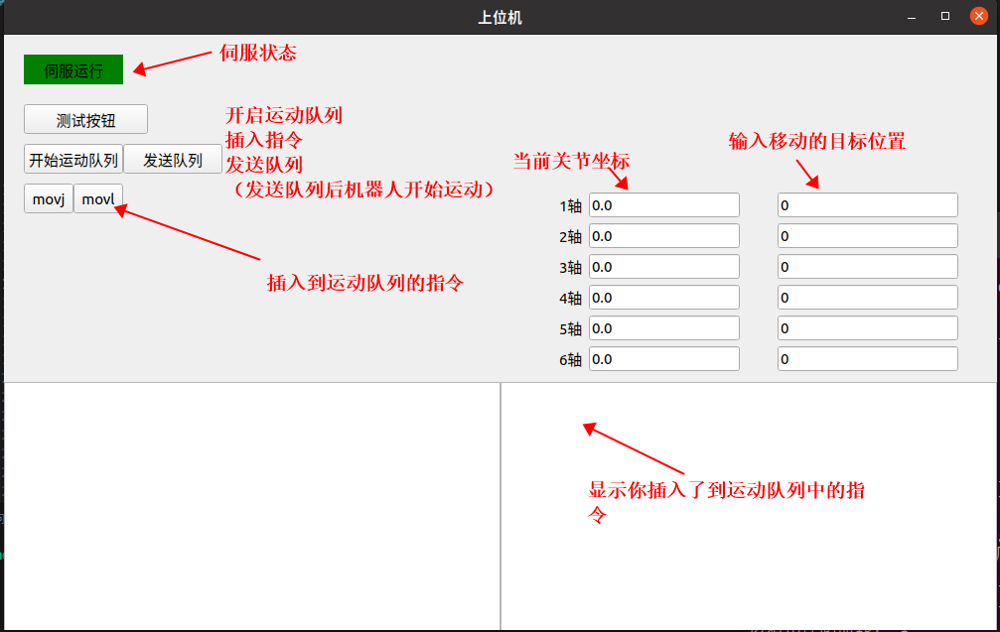
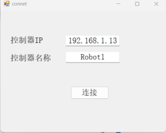
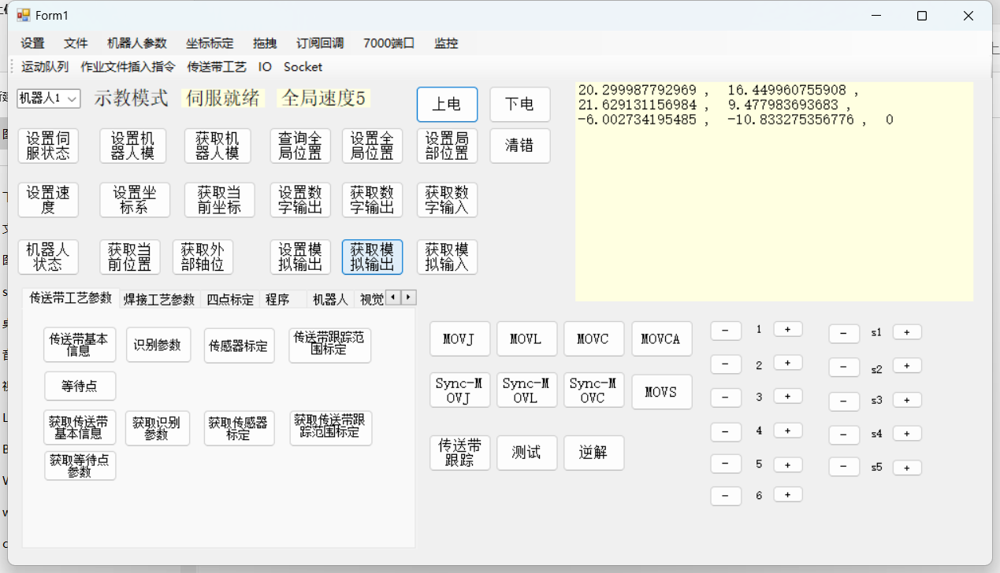

# Demo Examples

## Download

Controller secondary development demo download

## Download

Teach pendant secondary development demo download

- Controller Secondary Development
- Teach Pendant Secondary Development
- Host Computer Secondary Development

## Download

Python host computer secondary development demo download

- Python

## Download

C# host computer secondary development demo download

- C#

## Download

C++ host computer secondary development demo download

- C++

## Download

JSON protocol secondary development demo download

- JSON Protocol Secondary Development

## Download

HAL secondary development demo download

- HAL Secondary Development
