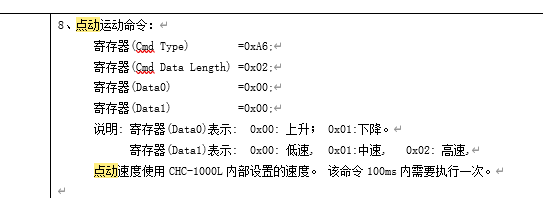

# Height Controller

---

## 0x91A1 Follow Start Command Request

**Request Parameters**

| Parameter | Type | Required | Description |
|--------|------|------|------|
| robot | int | Yes | Robot number |
| thirdLevelPerforationEnable | bool | No | Third-level perforation enable |
| secondPerforationEnable | bool | No | Second perforation enable |
| perforationMode | int | No | Perforation mode: 0-Direct perforation, 1-Segmented perforation, 2-Progressive perforation |

**Example**

```json
{
    "robot": 1,
    "thirdLevelPerforationEnable": false,
    "secondPerforationEnable": false,
    "perforationMode": 1
}
```

---

## 0x91A2 Follow Stop Command Request

**Request Parameters**

| Parameter | Type | Required | Description |
|--------|------|------|------|
| robot | int | Yes | Robot number |

**Example**

```json
{
    "robot": 1
}
```

---

## 0x91A3 Follow Pause Command Request

**Request Parameters**

| Parameter | Type | Required | Description |
|--------|------|------|------|
| robot | int | Yes | Robot number |

**Example**

```json
{
    "robot": 1
}
```

---

## 0x91A4 Height Controller Jog

**Request Parameters**

| Parameter | Type | Required | Description |
|--------|------|------|------|
| robot | int | Yes | Robot number |
| direction | int | Yes | Direction: 0-Down, 1-Up (send within 100ms) |
| speedLevel | int | No | Speed level: 0-Low, 1-Medium, 2-High |

**Example**

```json
{
    "robot": 1,
    "direction": 1,
    "speedLevel": 1
}
```



---

## 0x91AF Stop Jog

**Request Parameters**

| Parameter | Type | Required | Description |
|--------|------|------|------|
| robot | int | Yes | Robot number |

**Example**

```json
{
    "robot": 1
}
```

---

## OperationStatus Status Enumeration

```cpp
enum class OperationStatus {
    STOP_                    = 0x00,  // Stop
    MENU_SETTING_            = 0x01,  // Menu setting
    MOTOR_CALIBRATION_       = 0x02,  // Motor calibration
    CAPACITANCE_CALIBRATION_ = 0x03,  // Capacitance calibration
    AUTO_TUNING_             = 0x04,  // Auto tuning
    HOME_                    = 0x05,  // Home return
    FOLLOW_                  = 0x06,  // Follow
    ASCEND_                  = 0x07,  // Ascend
    DESCEND_                 = 0x08,  // Descend
    EMERGENCY_TOP_           = 0x09,  // Emergency stop
    FROG_LEAP_               = 0x0A   // Frog leap
};
```

---

## 0x91A7 Request Height Controller Information

**Request Parameters**

| Parameter | Type | Required | Description |
|--------|------|------|------|
| robot | int | Yes | Robot number |

**Example**

```json
{
    "robot": 1
}
```

---

## 0x91A8 Return Height Controller Information

**Response Parameters**

| Parameter | Type | Description |
|--------|------|------|
| status | int | OperationStatus status value |
| capacitance_value | int | Capacitance value |
| position | int | Position value |
| height | int | Height value |
| version | int | Version number |
| stop_coordinate | int | Stop coordinate |
| air_moving_board_delay | int | Pneumatic board delay |
| back_to_center_coordinate | int | Return-to-center coordinate |
| cutting_plate_delay | int | Cutting plate delay |
| perforation_plate_delay | int | Perforation plate delay |
| zaxis_coordinate | int | Z-axis coordinate |

**Example**

```json
{
    "status": 0,
    "capacitance_value": 0,
    "position": 0,
    "height": 0,
    "version": 0,
    "stop_coordinate": 1,
    "air_moving_board_delay": 1,
    "back_to_center_coordinate": 1,
    "cutting_plate_delay": 1,
    "perforation_plate_delay": 1,
    "zaxis_coordinate": 1
}
```

---

## 0x91A9 Set Follow Level

**Request Parameters**

| Parameter | Type | Required | Description |
|--------|------|------|------|
| cuttingTrackLevel | int | No | Cutting trajectory follow level, range (0, 30] |
| rAngleTrackLevel | int | No | R-angle follow level |

**Example**

```json
{
    "cuttingTrackLevel": 30,
    "rAngleTrackLevel": 0
}
```

---

## 0x91B0 Set Height

**Request Parameters**

| Parameter | Type | Required | Description |
|--------|------|------|------|
| cuttingHeight | int | No | Cutting height, unit μm, range 200-9999 |

**Example**

```json
{
    "cuttingHeight": 0
}
```

---

## 0x91AA Capacitance Calibration

**Request Parameters**

| Parameter | Type | Required | Description |
|--------|------|------|------|
| type | int | No | Calibration type: 0-Motor calibration, 1-Capacitance calibration/bevel cutting calibration |
| isBevelCutting | bool | No | Whether bevel cutting calibration |
| calibrationProtection | bool | No | Calibration protection |
| zAxisAngle | int | No | Z-axis angle |

**Example**

```json
{
    "type": 0,
    "isBevelCutting": false,
    "calibrationProtection": false,
    "zAxisAngle": 0
}
```


---

## 0x91B0 CNC Send Real-time Z-axis Speed

**Request Parameters**

| Parameter | Type | Required | Description |
|--------|------|------|------|
| cncSpeed | int | No | Z-axis speed, unit: μm/ms |

**Example**

```json
{
    "cncSpeed": 100
}
```
