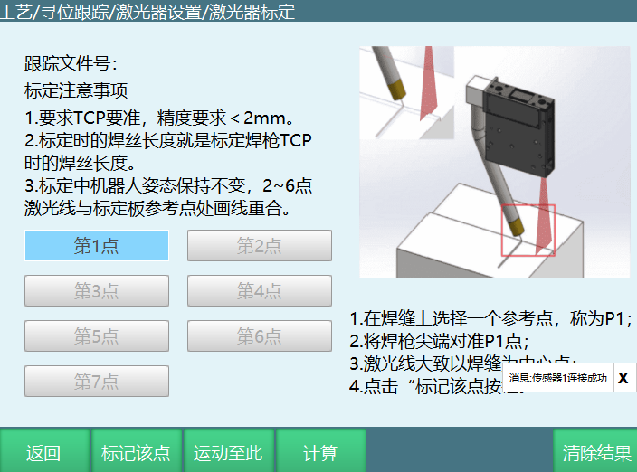
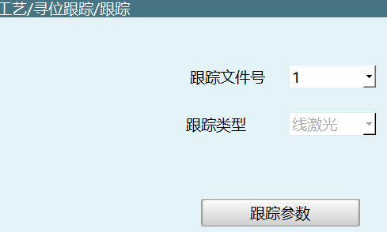
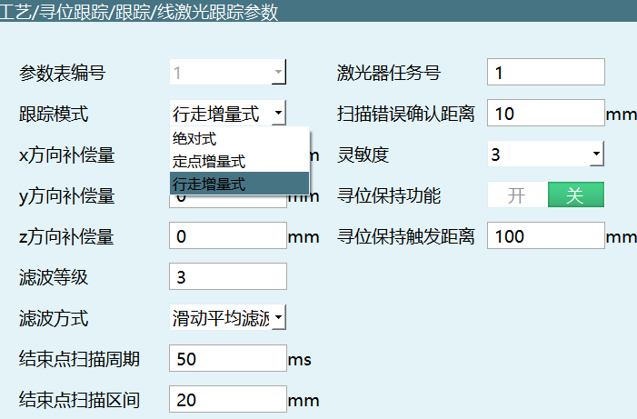
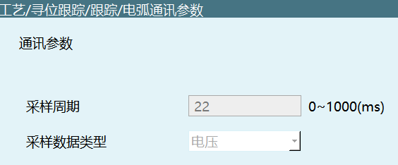

# Seam Tracking Process

## Set Laser Parameters


Set laser configuration parameters


**0x4130 TRACK_LASER_PARAM_SET**

```json
{
  "fileNum": 1,
  "laserParam": {
    "communication": 1,
    "devid": 1,
    "ip": "192.168.1.3",
    "port": 502,
    "responseTimeout": 0.3,
    "scaleFactor": 0.01,
    "timeLimit": 500.0,
    "timePeriod": 50.0,
    "vendor": "Chuangxiang"
  },
  "robot": 1
}
```

| Parameter Name | Type | Required | Description |
|--------|------|------|------|
| fileNum | int | Yes | Laser file number |
| robot | int | Yes | Robot number |
| laserParam.communication | int | Yes | Communication mode: 0-modbus tcp, 1-ethernet tcp |
| laserParam.devid | int | Yes | Device number |
| laserParam.ip | string | Yes | IP address |
| laserParam.port | int | Yes | Port number |
| laserParam.responseTimeout | float | No | Response timeout |
| laserParam.scaleFactor | float | No | Laser return value scale factor |
| laserParam.timeLimit | float | No | Read/write timeout (ms) |
| laserParam.timePeriod | float | No | Read/write period (ms) |
| laserParam.vendor | string | No | Laser manufacturer |

---

Query laser parameters

**0x4131 TRACK_LASER_PARAM_INQUIRE**

```json
{
  "robot": 1,
  "fileNum": 1
}
```

| Parameter Name | Type | Required | Description |
|--------|------|------|------|
| robot | int | Yes | Robot number |
| fileNum | int | Yes | Laser file number |

---

Response of laser parameters

**0x4132 TRACK_LASER_PARAM_RESPOND**

```json
{
  "fileNum": 1,
  "laserParam": {
    "commLog": false,
    "communication": 0,
    "devid": 88,
    "ip": "192.168.1.3",
    "netstate": false,
    "port": 502,
    "responseTimeout": 0.3,
    "scaleFactor": 0.01,
    "timeLimit": 500.0,
    "timePeriod": 50,
    "vendor": "Chuangxiang",
    "vendorlist": [
      "Generic",
      "Chuangxiang",
      "Ruiboshi",
      "Ruinui",
      "Tongzhou Tech",
      "Zhongke Hongwei",
      "Quanshi Zhineng",
      "Shenggong Zhineng",
      "Kangpuman",
      "Qingdong"
    ]
  },
  "robot": 1
}
```

| Parameter Name | Type | Description |
|--------|------|------|
| fileNum | int | Laser file number |
| robot | int | Robot number |
| laserParam.commLog | bool | Communication log |
| laserParam.communication | int | Communication mode: 0-modbus tcp, 1-ethernet tcp |
| laserParam.devid | int | Device number |
| laserParam.ip | string | IP address |
| laserParam.netstate | bool | Network status |
| laserParam.port | int | Port number |
| laserParam.responseTimeout | float | Response timeout |
| laserParam.scaleFactor | float | Laser return value scale factor |
| laserParam.timeLimit | float | Read/write timeout (ms) |
| laserParam.timePeriod | float | Read/write period (ms) |
| laserParam.vendor | string | Laser manufacturer |
| laserParam.vendorlist | array | Laser manufacturer list |

---

## Laser Calibration



Calibration record query

**0x4140 SENSOR_LASER_CALIBRATE_INQUIRE**

```json
{
  "robot": 1,
  "fileNum": 1
}
```

| Parameter Name | Type | Required | Description |
|--------|------|------|------|
| robot | int | Yes | Robot number |
| fileNum | int | Yes | Laser file number |

---

Return 0x4140 query result

**0x4141 SENSOR_LASER_CALIBRATE_RESPOND**

```json
{
  "robot": 1,
  "fileNum": 1,
  "recordResult": {
    "point1": false,
    "point2": false,
    "point3": false,
    "point4": false,
    "point5": false,
    "point6": false,
    "point7": false
  }
}
```

| Parameter Name | Type | Description |
|--------|------|------|
| robot | int | Robot number |
| fileNum | int | Laser file number |
| recordResult.point1~7 | bool | Record result of each calibration point |

---

Record calibration point

**0x4142 SENSOR_LASER_CALIBRATE_RECORD**

```json
{
  "robot": 1,
  "fileNum": 1,
  "pointNum": 1
}
```

| Parameter Name | Type | Required | Description |
|--------|------|------|------|
| robot | int | Yes | Robot number |
| fileNum | int | Yes | Laser file number |
| pointNum | int | Yes | Calibration point number (range 1~7) |

---

Query calibration result

**0x4143 SENSOR_LASER_CALIBRATE_RECORD_RESPOND**

```json
{
  "robot": 1,
  "fileNum": 1,
  "pointNum": 1,
  "recordResult": true
}
```

| Parameter Name | Type | Description |
|--------|------|------|
| robot | int | Robot number |
| fileNum | int | Laser file number |
| pointNum | int | Calibration point number |
| recordResult | bool | Record result |

---

Move to calibration point

**0x4144 SENSOR_LASER_CALIBRATE_MOVETO**

```json
{
  "robot": 1,
  "fileNum": 1,
  "pointNum": 1
}
```

| Parameter Name | Type | Required | Description |
|--------|------|------|------|
| robot | int | Yes | Robot number |
| fileNum | int | Yes | Laser file number |
| pointNum | int | Yes | Calibration point number |

---

Calculate calibration result

**0x4145 SENSOR_LASER_CALIBRATE_CALCULATE**

```json
{
  "robot": 1,
  "fileNum": 1
}
```

| Parameter Name | Type | Required | Description |
|--------|------|------|------|
| robot | int | Yes | Robot number |
| fileNum | int | Yes | Laser file number |

---

Return 0x4145 calculation result

**0x4146 SENSOR_LASER_CALIBRATE_CALCULATE_RESPOND**

```json
{
  "robot": 1,
  "fileNum": 1,
  "result": true
}
```

| Parameter Name | Type | Description |
|--------|------|------|
| robot | int | Robot number |
| fileNum | int | Laser file number |
| result | bool | Calculation result |

---

Clear calibration records

**0x4147 SENSOR_LASER_CALIBRATE_CLEAR**

```json
{
  "robot": 1,
  "fileNum": 1
}
```

| Parameter Name | Type | Required | Description |
|--------|------|------|------|
| robot | int | Yes | Robot number |
| fileNum | int | Yes | Laser file number |

Returns 0x4141

---

Cancel calibration

**0x4148 SENSOR_LASER_CALIBRATE_CANCEL**

```json
{
  "robot": 1,
  "fileNum": 1
}
```

| Parameter Name | Type | Required | Description |
|--------|------|------|------|
| robot | int | Yes | Robot number |
| fileNum | int | Yes | Laser file number |

---

Query whether laser is calibrated

**0x4149 SENSOR_LASER_CALIBRATE_RESULT_INQUIRE**

```json
{
  "robot": 1,
  "fileNum": 1
}
```

| Parameter Name | Type | Required | Description |
|--------|------|------|------|
| robot | int | Yes | Robot number |
| fileNum | int | Yes | Laser file number |

---

Response to 0x4149 query result

**0x414A SENSOR_LASER_CALIBRATE_RESULT_RESPOND**

```json
{
  "robot": 1,
  "fileNum": 1,
  "laserCalibrated": false
}
```

| Parameter Name | Type | Description |
|--------|------|------|
| robot | int | Robot number |
| fileNum | int | Laser file number |
| laserCalibrated | bool | Whether calibrated |

---

## Set Locating Type


**0x4133 LOCATING_SENSORTYPE_SET**

```json
{
  "fileNum": 77,
  "robot": 1,
  "sensorType": 0
}
```

| Parameter Name | Type | Required | Description |
|--------|------|------|------|
| fileNum | int | Yes | Laser file number |
| robot | int | Yes | Robot number |
| sensorType | int | Yes | Locating type: 0-Line laser, 1-Arc |

---

Query locating type

**0x4134 LOCATING_SENSORTYPE_INQUIRE**

```json
{
  "robot": 1,
  "fileNum": 1
}
```

| Parameter Name | Type | Required | Description |
|--------|------|------|------|
| robot | int | Yes | Robot number |
| fileNum | int | Yes | Laser file number |

---

Response to locating type

**0x4135 LOCATING_SENSORTYPE_RESPOND**

```json
{
  "robot": 1,
  "fileNum": 1,
  "sensorType": 0
}
```

| Parameter Name | Type | Description |
|--------|------|------|
| robot | int | Robot number |
| fileNum | int | Laser file number |
| sensorType | int | Locating type: 0-Line laser, 1-Arc |

---

## Set Tracking Type



**0x4169 TRACK_SENSORTYPE_SET**

```json
{
  "robot": 1,
  "fileNum": 1,
  "sensorType": 0
}
```

| Parameter Name | Type | Required | Description |
|--------|------|------|------|
| robot | int | Yes | Robot number |
| fileNum | int | Yes | Laser file number |
| sensorType | int | Yes | Tracking type: 0-Line laser, 1-Arc, 2-Arc voltage |

---

Query tracking type

**0x4170 TRACK_SENSORTYPE_INQUIRE**

```json
{
  "robot": 1,
  "fileNum": 1
}
```

| Parameter Name | Type | Required | Description |
|--------|------|------|------|
| robot | int | Yes | Robot number |
| fileNum | int | Yes | Laser file number |

---

Return 0x4170 query result

**0x4171 TRACK_SENSORTYPE_RESPOND**

Same as 0x4169

---

## Set Laser Tracking Parameter Table



**0x4136 TRACK_LASER_TRACKPARAM_SET**

```json
{
  "fileNum": 1,
  "robot": 1,
  "tableid": 98,
  "trackParam": {
    "compensateX": 1.0,
    "compensateY": 2.0,
    "compensateZ": 3.0,
    "din_end": 0,
    "dout_part_move": -1,
    "endPoint": {
      "interval": 6.0,
      "scanPeriod": 5.0
    },
    "filter": {
      "level": 4,
      "type": 1
    },
    "laserTaskId": 7,
    "positionHold": {
      "distance": 100.0,
      "switchon": false
    },
    "scanErrorLength": 8.0,
    "sensitivity": 3,
    "trackMode": 0
  }
}
```

| Parameter Name | Type | Required | Description |
|--------|------|------|------|
| fileNum | int | Yes | Laser file number |
| robot | int | Yes | Robot number |
| tableid | int | Yes | Tracking mode |
| trackParam.compensateX | float | No | X direction compensation |
| trackParam.compensateY | float | No | Y direction compensation |
| trackParam.compensateZ | float | No | Z direction compensation |
| trackParam.din_end | int | No | Tracking end input IO |
| trackParam.dout_part_move | int | No | Workpiece rotation output IO |
| trackParam.endPoint.interval | float | No | End point scan interval |
| trackParam.endPoint.scanPeriod | float | No | End point scan period |
| trackParam.filter.level | int | No | Filter level |
| trackParam.filter.type | int | No | Filter method: 0-None, 1-Moving average filter |
| trackParam.laserTaskId | int | No | Laser task number |
| trackParam.positionHold.distance | float | No | Locating hold trigger distance |
| trackParam.positionHold.switchon | bool | No | Locating hold function: true enable, false disable |
| trackParam.scanErrorLength | float | No | Scan error confirmation distance |
| trackParam.sensitivity | int | No | Sensitivity |
| trackParam.trackMode | int | No | Tracking mode: 0-Absolute, 1-Fixed-point incremental, 2-Traveling incremental |

---

Query laser tracking parameters

**0x4137 TRACK_LASER_TRACKPARAM_INQUIRE**

```json
{
  "robot": 1,
  "fileNum": 1,
  "tableid": 1
}
```

| Parameter Name | Type | Required | Description |
|--------|------|------|------|
| robot | int | Yes | Robot number |
| fileNum | int | Yes | Laser file number |
| tableid | int | Yes | Parameter table number |

---

Response to laser tracking parameters

**0x4138 TRACK_LASER_TRACKPARAM_RESPOND**

Data: Same as 0x4136

---

## Locating Parameter Table


Set locating parameters

**0x4139 TRACK_LASER_SEARCHPARAM_SET**

```json
{
  "fileNum": 1,
  "robot": 1,
  "searchParam": {
    "compensateX": 2.0,
    "compensateY": 3.0,
    "compensateZ": 4.0,
    "dynamic": {
      "distance": 5.0,
      "pointIndex": 7,
      "speed": 6.0
    },
    "laserTaskId": 1,
    "storeType": 1
  },
  "tableid": 3
}
```

| Parameter Name | Type | Required | Description |
|--------|------|------|------|
| fileNum | int | Yes | Locating file number |
| robot | int | Yes | Robot number |
| tableid | int | Yes | Parameter table number |
| searchParam.compensateX | float | No | X direction compensation |
| searchParam.compensateY | float | No | Y direction compensation |
| searchParam.compensateZ | float | No | Z direction compensation |
| searchParam.dynamic.distance | float | No | Dynamic locating distance |
| searchParam.dynamic.pointIndex | int | No | Dynamic locating selection |
| searchParam.dynamic.speed | float | No | Dynamic locating speed |
| searchParam.laserTaskId | int | No | Laser task number |
| searchParam.storeType | int | No | Locating type: 0-Reference locating, 1-Correction locating |

---

Query locating parameters

**0x413A TRACK_LASER_SEARCHPARAM_INQUIRE**

```json
{
  "robot": 1,
  "fileNum": 1,
  "tableid": 1
}
```

| Parameter Name | Type | Required | Description |
|--------|------|------|------|
| robot | int | Yes | Robot number |
| fileNum | int | Yes | Laser file number |
| tableid | int | Yes | Parameter table number |

---

Response to locating parameters

**0x413B TRACK_LASER_SEARCHPARAM_RESPOND**

Data: Same as 0x4139

---


Copy locating parameters (must clear with 0x413D before copying)

**0x413C TRACK_SEAMTRACK_PARAM_COPY**

```json
{
  "dstFileNum": 4,
  "fileNum": 1,
  "function": 1,
  "robot": 1,
  "sensorType": 0
}
```

| Parameter Name | Type | Required | Description |
|--------|------|------|------|
| dstFileNum | int | Yes | File number to copy to |
| fileNum | int | Yes | File number to copy from |
| function | int | Yes | 0-Tracking, 1-Locating |
| robot | int | Yes | Robot number |
| sensorType | int | Yes | Tracking type: 0-Line laser, 1-Arc, 2-Arc voltage; Locating type: 0-Line laser, 1-Arc |

---

Clear locating parameters

**0x413D TRACK_SEAMTRACK_PARAM_CLEAR**

```json
{
  "robot": 1,
  "fileNum": 1,
  "sensorType": 0,
  "function": 0
}
```

| Parameter Name | Type | Required | Description |
|--------|------|------|------|
| robot | int | Yes | Robot number |
| fileNum | int | Yes | Laser file number |
| sensorType | int | Yes | Tracking type: 0-Line laser, 1-Arc, 2-Arc voltage; Locating type: 0-Line laser, 1-Arc |
| function | int | Yes | 0-Tracking, 1-Locating |

> Note: After clearing is complete, query parameters once

---

## Arc Tracking


Set communication parameters



**0x4150 TRACK_ARC_COMMPARAM_SET**

```json
{
  "robot": 1,
  "craftid": 1,
  "sampling": {
    "dataType": 0,
    "period": 20
  }
}
```

| Parameter Name | Type | Required | Description |
|--------|------|------|------|
| robot | int | Yes | Robot number |
| craftid | int | Yes | Tracking file number |
| sampling.dataType | int | Yes | Data type: 0-Current, 1-Voltage |
| sampling.period | int | Yes | Sampling period (0~1000) |

---

Query communication parameters

**0x4151 TRACK_ARC_COMMPARAM_INQUIRE**

```json
{
  "robot": 1,
  "craftid": 1
}
```

| Parameter Name | Type | Required | Description |
|--------|------|------|------|
| robot | int | Yes | Robot number |
| craftid | int | Yes | Tracking file number |

---

Response to communication parameter query

**0x4152 TRACK_ARC_COMMPARAM_RESPOND**

```json
{
  "robot": 1,
  "craftid": 1,
  "sampling": {
    "dataType": 0,
    "period": 20
  }
}
```

| Parameter Name | Type | Description |
|--------|------|------|
| robot | int | Robot number |
| craftid | int | Tracking file number |
| sampling.dataType | int | Data type: 0-Current, 1-Voltage |
| sampling.period | int | Sampling period (0~1000) |

---

Set lateral compensation parameters


**0x4153 TRACK_ARC_LATERALCOMPENPARAM_SET**

```json
{
  "craftid": 1,
  "robot": 1,
  "lateralCompensation": {
    "accFactor": 5.0,
    "algorithmType": 0,
    "beginCycleNum": 1,
    "factor": 2.0,
    "maxSingleLen": 4.0,
    "switchon": false,
    "threshold": 3.0
  }
}
```

| Parameter Name | Type | Required | Description |
|--------|------|------|------|
| craftid | int | Yes | Tracking file number |
| robot | int | Yes | Robot number |
| lateralCompensation.accFactor | float | No | Compensation acceleration factor (0.1~10) |
| lateralCompensation.algorithmType | int | No | Deviation extraction type: 0-Mean |
| lateralCompensation.beginCycleNum | int | No | Start sampling cycle count (1~1000) |
| lateralCompensation.factor | float | No | Correction factor (0.001~1000) |
| lateralCompensation.maxSingleLen | float | No | Max compensation per cycle (0~10) |
| lateralCompensation.switchon | bool | No | Compensation switch |
| lateralCompensation.threshold | float | No | Compensation threshold (0~1000) |

---

Query lateral compensation parameters

**0x4154 TRACK_ARC_LATERALCOMPENPARAM_INQUIRE**

```json
{
  "robot": 1,
  "craftid": 1
}
```

| Parameter Name | Type | Required | Description |
|--------|------|------|------|
| robot | int | Yes | Robot number |
| craftid | int | Yes | Tracking file number |

---

Return lateral parameter query

**0x4155 TRACK_ARC_LATERALCOMPENPARAM_RESPOND**

Same as: 0x4153

---

Set vertical compensation parameters


**0x4156 TRACK_ARC_VERTICALCOMPENPARAM_SET**

```json
{
  "craftid": 1,
  "robot": 1,
  "verticalCompensation": {
    "accFactor": 1,
    "algorithmType": 0,
    "beginCycleNum": 5,
    "factor": 4,
    "maxSingleLen": 2,
    "switchon": true,
    "threshold": 3
  }
}
```

| Parameter Name | Type | Required | Description |
|--------|------|------|------|
| craftid | int | Yes | Tracking file number |
| robot | int | Yes | Robot number |
| verticalCompensation.accFactor | float | No | Compensation acceleration factor |
| verticalCompensation.algorithmType | int | No | Deviation extraction type |
| verticalCompensation.beginCycleNum | int | No | Start sampling cycle count |
| verticalCompensation.factor | float | No | Correction factor |
| verticalCompensation.maxSingleLen | float | No | Max compensation per cycle |
| verticalCompensation.switchon | bool | No | Compensation switch |
| verticalCompensation.threshold | float | No | Compensation threshold |

---

Query vertical compensation parameters

**0x4157 TRACK_ARC_VERTICALCOMPENPARAM_INQUIRE**

```json
{
  "robot": 1,
  "craftid": 1
}
```

| Parameter Name | Type | Required | Description |
|--------|------|------|------|
| robot | int | Yes | Robot number |
| craftid | int | Yes | Tracking file number |

---

Return vertical compensation parameter query

**0x4158 TRACK_ARC_VERTICALCOMPENPARAM_RESPOND**

Same as: 0x4156

---

## Touch Locating Parameters


**0x4160 SEARCH_TOUCH_PARAM_SET**

```json
{
  "craftid": 1,
  "robot": 1,
  "touchSearch": {
    "2ndAutoDistance": 8.0,
    "2ndAutoReturn": true,
    "2ndAutoVel": 9.0,
    "2ndDeviationLimit": 10.0,
    "2ndDistance": 6.0,
    "2ndSwitchon": false,
    "2ndVel": 7.0,
    "autoDistance": 3.0,
    "autoReturn": true,
    "autoVel": 4.0,
    "baseFlag": true,
    "compensation": 11.0,
    "deviationLimit": 5.0,
    "distance": 1.0,
    "isChangePose": false,
    "vel": 2.0
  }
}
```

| Parameter Name | Type | Required | Description |
|--------|------|------|------|
| craftid | int | Yes | Locating file number |
| robot | int | Yes | Robot number |
| touchSearch.2ndAutoDistance | float | No | Secondary auto return distance |
| touchSearch.2ndAutoReturn | bool | No | Secondary auto return enable |
| touchSearch.2ndAutoVel | float | No | Secondary auto return speed |
| touchSearch.2ndDeviationLimit | float | No | Secondary over-deviation range |
| touchSearch.2ndDistance | float | No | Secondary locating distance |
| touchSearch.2ndSwitchon | bool | No | Secondary locating enable |
| touchSearch.2ndVel | float | No | Secondary locating speed |
| touchSearch.autoDistance | float | No | Auto return distance |
| touchSearch.autoReturn | bool | No | Auto return enable |
| touchSearch.autoVel | float | No | Auto return speed |
| touchSearch.baseFlag | bool | No | Reference locating switch |
| touchSearch.compensation | float | No | Motion vector compensation |
| touchSearch.deviationLimit | float | No | Over-deviation range |
| touchSearch.distance | float | No | Locating distance |
| touchSearch.isChangePose | bool | No | Whether to change posture |
| touchSearch.vel | float | No | Locating speed |

---

Query parameters

**0x4161 SEARCH_TOUCH_PARAM_INQUIRE**

```json
{
  "robot": 1,
  "craftid": 1
}
```

| Parameter Name | Type | Required | Description |
|--------|------|------|------|
| robot | int | Yes | Robot number |
| craftid | int | Yes | Locating file number |

---

Response to query

**0x4162 SEARCH_TOUCH_PARAM_RESPOND**

Parameters same as 0x4160

---

## Arc Voltage Tracking


Arc voltage tracking parameter setting

**0x4163 ARC_VOLTAGE_TRACK_PARAMETERS_SET**

```json
{
  "base_calc": {
    "collect_time": 5.0,
    "method": 0,
    "vol_inc": 4.0,
    "voltage": 3.0
  },
  "collection": {
    "analog_port": 1,
    "equipment": 0,
    "invalid_data_time": 2.0,
    "period": 1
  },
  "craftid": 1,
  "pid": {
    "dev_shreshold": 9.0,
    "kd": 8.0,
    "ki": 7.0,
    "kp": 6.0,
    "max_iout": 10.0,
    "max_out": 11.0
  },
  "robot": 1
}
```

| Parameter Name | Type | Required | Description |
|--------|------|------|------|
| craftid | int | Yes | Tracking file number |
| robot | int | Yes | Robot number |
| base_calc.collect_time | float | No | Welding start calculation time (s) |
| base_calc.method | int | No | Base voltage acquisition method: 0-Welding calculation, 1-Manual calculation |
| base_calc.vol_inc | float | No | Calculation increment |
| base_calc.voltage | float | No | Base voltage (= calculation + increment) |
| collection.analog_port | int | No | Arc voltage analog port (AIN-1...) |
| collection.equipment | int | No | Arc voltage acquisition equipment: 0-Welder, 1-Arc voltage module |
| collection.invalid_data_time | float | No | Invalid data time (s) |
| collection.period | int | No | Sampling period (ms) |
| pid.dev_shreshold | float | No | Deviation threshold |
| pid.kd | float | No | Derivative coefficient |
| pid.ki | float | No | Integral coefficient |
| pid.kp | float | No | Proportional coefficient |
| pid.max_iout | float | No | Integral limit |
| pid.max_out | float | No | Output limit |

---

Arc voltage tracking parameter query

**0x4164 ARC_VOLTAGE_TRACK_PARAMETERS_INQUIRE**

```json
{
  "robot": 1,
  "craftid": 1
}
```

| Parameter Name | Type | Required | Description |
|--------|------|------|------|
| robot | int | Yes | Robot number |
| craftid | int | Yes | Tracking file number |

---

Response to arc voltage tracking parameter query

**0x4165 ARC_VOLTAGE_TRACK_PARAMETERS_RESPOND**

Same as: 0x4163

---

Arc voltage tracking base voltage calculation start

**0x4166 ARC_VOLTAGE_TRACK_BASEVOLTAGE_CALC_START**

```json
{
  "robot": 1,
  "craftid": 1
}
```

| Parameter Name | Type | Required | Description |
|--------|------|------|------|
| robot | int | Yes | Robot number |
| craftid | int | Yes | Tracking file number |

---

Arc voltage tracking base voltage calculation end

**0x4167 ARC_VOLTAGE_TRACK_BASEVOLTAGE_CALC_END**

```json
{
  "robot": 1,
  "craftid": 1
}
```

| Parameter Name | Type | Required | Description |
|--------|------|------|------|
| robot | int | Yes | Robot number |
| craftid | int | Yes | Tracking file number |

---

Calculate arc voltage tracking base voltage

**0x4168 ARC_VOLTAGE_TRACK_BASEVOLTAGE_CALC**

```json
{
  "robot": 1,
  "craftid": 1
}
```

| Parameter Name | Type | Required | Description |
|--------|------|------|------|
| robot | int | Yes | Robot number |
| craftid | int | Yes | Tracking file number |

---

Return 0x4168 calculation result

**ARC_VOLTAGE_TRACK_BASEVOLTAGE_CALCULESULTS_GET**

```json
{
  "basic_calc": {
    "voltage": 0.0
  }
}
```

| Parameter Name | Type | Description |
|--------|------|------|
| basic_calc.voltage | float | Base voltage |

---

Modify arc voltage tracking window parameters

**0x416B ARC_VOLTAGE_TRACK_WINDOWSPARAM_SET**

```json
{
  "base_calc": {
    "vol_inc": 4.0,
    "voltage": 3.0
  },
  "craftid": 3,
  "robot": 1
}
```

| Parameter Name | Type | Required | Description |
|--------|------|------|------|
| robot | int | Yes | Robot number |
| craftid | int | Yes | Tracking file number |
| base_calc.vol_inc | float | No | Calculation increment |
| base_calc.voltage | float | No | Base voltage |
