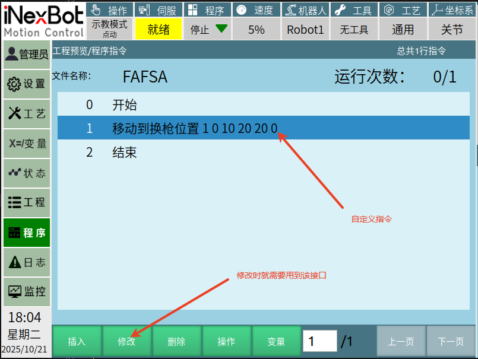
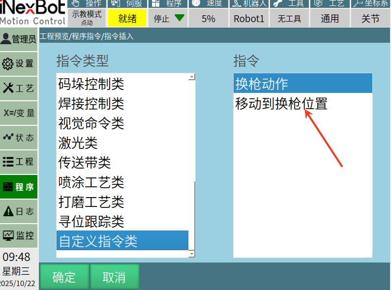

# API Introduction

The following interfaces can be found in the SDK header files of the teach pendant.

## Signal Interfaces for Custom Instructions, to be used with slot functions

```cpp
/**
 * @brief Signal to invoke the custom instruction insertion interface
 * @note Signal used to initialize the custom interface, i.e., the interface displayed when inserting a job file instruction
 * @param cmdNum Its number, corresponding to the top-to-bottom order in the custom instruction class when inserting
 */
void signal_userdefine_cmd_init(int cmdNum);
/**
 * @brief Signal to invoke the custom instruction modification interface
 * @note Signal used to modify a custom instruction, i.e., the interface displayed when modifying a job file instruction
 * @param cmdNum Number, corresponding to the top-to-bottom order in the custom instruction class when inserting
 * @param cmdParam String parameter passed during insertion, used to display the current string parameter
 * @param posName Position name passed during insertion, optional
*/
void signal_userdefine_cmd_alter(int cmdNum, QString cmdParam, QString posName);
```
## signal_userdefine_cmd_init: Used to open the user's own custom instruction interface, as shown in the custom interface below:


cmdNum parameter: The top-to-bottom order within the custom instruction class on the instruction insertion page:


## signal_userdefine_cmd_alter: Used to modify a custom instruction that has already been inserted into a job file. After calling it, the user's own custom instruction interface will also be opened.



cmdNum parameter: Which custom instruction needs to be modified — determine which specific instruction based on the diagram below:


## Custom Instruction Interfaces

```cpp
/**
 * @brief Insert a custom instruction
 * @param cmdNum Number, corresponding to the top-to-bottom order in the custom instruction class when inserting
 * @param cmdParam Custom string parameter to pass
 */
void userdefine_cmd_insert(int cmdNum, QString cmdParam);
/**
 * @brief Modify the name displayed for a custom instruction on the insertion interface
 * @param EnglishName English name
 * @param ChineseName Chinese name
 * @note The number of inserted items determines the number of custom instructions
 * @note Please call this parameter after binding the interface with connect to signal signal_userdefine_cmd_init(int), otherwise it will be invalid
 */
void userdefined_cmd_name_change(QStringList &EnglishName,QStringList &ChineseName);
/**
 * @brief Close the custom instruction interface
 * @note When inserting and modifying custom points needs to be cancelled, please call this interface to ensure the system properly handles the flag
 */
void close_userdefine_cmd_widget(QWidget *);
```
## userdefined_cmd_name_change: Usage Example

```cpp
QStringList ENname ;
ENname <<"SWITCHGUN"<<"SWITCHGUNPOS";

QStringList CNname;
CNname << tr("Switch Gun Action")<<tr("Move to Switch Gun Position");
Nextp::getInstance()->userdefined_cmd_name_change(ENname, CNname);
```


