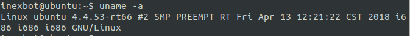

# Quick Start

## 1. Environment Installation

## 1.1 System Requirements

The recommended operating system for the development environment is:

The currently supported compilation suites include:

- Ubuntu 20.04

You need to select different compilation suites based on different controller models.

We provide image files with all development environments pre-packaged. Alternatively, you can install them on any Ubuntu 20.04 system by following the section "1.2 Compilation Suite Installation".

> Get the pre-installed virtual machine directly
> Click here to download a virtual machine with Ubuntu 20.04.1 system configured with the development environment, for use with VirtualBox software;
> Click here to download the VirtualBox software installation package for Windows. For other system versions, please download from the VirtualBox official website.
> •
> Install VirtualBox software (note that the installation path must not contain Chinese characters)
> •
> Open the downloaded "Development Environment Virtual Machine" folder, and follow the instructions in the "README.txt" file to install the virtual machine;
> •
> After booting up, log in with the account "nbt" and password "123".

## 1.2 Compilation Suite Installation

Install the following compilation chains based on your specific controller hardware:

### 1.2.1 gcc-4.8 Compilation Suite Installation

Since the default gcc version available in Ubuntu 20.04 repositories cannot install version 4.8, we need to add the trusty repository.

```bash
sudo sh -c 'echo "deb http://dk.archive.ubuntu.com/ubuntu/ trusty main" >> /etc/a pt/sources.list'
sudo sh -c 'echo "deb http://dk.archive.ubuntu.com/ubuntu/ trusty universe" >> /e tc/apt/sources.list'
```

```bash
sudo apt update
sudo apt install -y gcc-4.8 g++-4.8
sudo update-alternatives --install /usr/bin/gcc gcc /usr/bin/gcc-4.8 40
sudo update-alternatives --install /usr/bin/g++ g++ /usr/bin/g++-4.8 40
sudo apt-get install -y gcc-4.8-multilib g++-4.8-multilib
```

Download the lib32 library files.

Extract the lib32.xxx file and replace the original /usr/lib32 folder.

```bash
tar -zxvf lib32.xxx
sudo rm -rf /usr/lib32
sudo mv usr/lib32 /usr/
```

### 1.2.2 gcc-9.4 Compilation Suite Installation

Install directly from the Ubuntu 20.04 repository.

```bash
sudo apt install gcc g++
```

### 1.2.3 aarch64-linux-gnu-gcc-5.3 Compilation Suite Installation

Download the compilation suite: Link: gcc-linaro-5.3.1-2016.05-x86_64_aarch64-linux-gnu.tar.gz Extraction code: w33y

Create a T5 folder and extract gcc-linaro-5.3.1-2016.05-x86_64_aarch64-linux-gnu.tar.gz into it.

```bash
mkdir ~/T5
tar -zxvf gcc-linaro-5.3.1-2016.05-x86_64_aarch64-linux-gnu.tar.gz -C ~/T5
```

Add environment variable

```bash
gedit ~/.bashrc
```

Copy the following line to the end, save and exit.

```bash
export PATH=$PATH:$HOME/T5/gcc-linaro-5.3.1-2016.05-x86_64_aarch64-linux-gnu/bin
```

## 2. Build Project

## 2.1 Project Initialization

You can use VS Code or other IDEs for development.

Create a demo folder, place the header files in the include folder, and place libNexRob.a in the lib folder. The directory structure should be as follows:

```text
├── include
│   ├── nrcAPI.h
│   └── nrcAPI_advance.h
├── lib
│   └── libNexRob.a
└── src
    └── main.cpp
```

## 2.2 main.cpp File

```cpp
#include <iostream>
#include "nrcAPI.h"


void SystemStartup() {
  // Output NexMotion library version info
  std::cout << "Library version: " << NRC_GetNexMotionLibVersion() << std::endl;
  // Start the control system
  NRC_StartController();
  // Check if the control system initialization is complete
  while (NRC_GetControlInitComplete() != 1 ) {
    NRC_Delayms(100);   // Delay 100ms
  }
  // Clear all errors
  NRC_ClearAllError();


  std::cout << "----" << NRC_GetControlInitComplete() << std::endl;
  std::cout << "StartController Success" << std::endl;
  std::cout << "Get sync version number" << NRC_GetSyncVersion() << std::endl;
  NRC_Delayms(200);
}


int main() {
  // System startup
  SystemStartup();

  std::cout << "Hello World" << std::endl;


  // Keep the program running
  while(true) {
    NRC_Delayms(2000);
  }
}
```

## 2.3 Compile Code

### 2.3.1 Direct Compilation

Confirm your controller system architecture and select the corresponding compilation chain tool. The following uses gcc-4.8; depending on the architecture, it can be changed to gcc-9.

> Note: If the controller has an x64 architecture, change g++-4.8 to g++-9 and -m32 to -m64. If the controller has an x86 architecture, no changes are needed.

```bash
g++-4.8 -m32 -o nrc2.out src/*.cpp -I./include -L./lib -lNexRob -lpthread -lm -ldl -lrt -std=c++11
```

### 2.3.2 Using Makefile

Create a Makefile file.

Create a Makefile file in the demo directory, copy the following content into the Makefile file, and save it.

```makefile
TARGET=nrc2.out
all :
	g++-4.8 -m32 -o nrc2.out src/*.cpp -I./include -L./lib -lNexRob -lpthread -lm -ldl -lrt -std=c++11


clean :
	rm $(TARGET) $(objects)
```

After creating the Makefile file, to compile, simply open a terminal in the demo directory and type make to compile the controller executable program.

Open a new terminal in the demo directory, type make, and after compilation is complete, there will be an nrc2.out executable program in the demo directory.

The compilation process is shown in the figure below:


## 3. Remote Login to Controller

## 3.1 Confirm Computer is Connected to Controller

First, ensure that your computer is connected to the controller. The computer's IP needs to be in the same network segment as the controller's IP. The controller's factory default IP is 192.168.1.13, so the computer's network port connected to the controller also needs to be set to the 1 segment (for example, set to 192.168.1.110). After setting up, open a new terminal in Ubuntu and enter:

```bash
ping 192.168.1.13
```

If the result is as shown in the figure below, communication with the controller is successful:


If unsuccessful, please check the network cable connection, computer IP, and controller IP.

## 3.2 Login to Controller Using SSH

```bash
ssh inexbot@192.168.1.13
```

Then enter the password 123 to enable remote control.

## 3.3 Check Controller System Architecture

After logging into the controller, you can check the controller architecture via uname -a.



The figure shows three i686 entries, which are the machine hardware name, processor type, and hardware platform respectively. i686 is commonly referred to as a 32-bit system.

## 4. Upload Program to Controller and Run

## 4.1 Upload Program Using SCP

After compilation is complete, we will replace the program into the controller to run our own compiled secondary development program. Continue entering in the current terminal:

```bash
scp nrc2.out inexbot@192.168.1.13:~/robot
```

After entering, a prompt "inexbot@192.168.1.13's password:" will appear.

Enter 123, and when the following figure appears, the program has been successfully replaced into the controller.


There may also be cases where the replacement fails. The terminal will display "Text file busy", which means the controller's original nrc2.out program is still running and cannot be replaced.

In this case, you need to SSH into the controller's backend and kill the running nrc2.out process.

```bash
sudo killall -9 nrc2.out
```

After the process is stopped, you can execute the scp operation mentioned above again to successfully replace the secondary development program into the controller.

## 4.2 Remote Login to Controller to Start Program

Then you can execute our compiled secondary development program. In the controller's robot directory, enter:

```bash
sudo ./nrc2.out
```

The execution result is as follows:


At this step, our secondary development project has been successfully running.

- gcc-4.8
- gcc-9.4
- aarch64-linux-gnu-gcc-5.3
