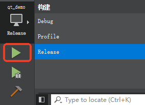
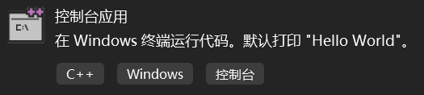
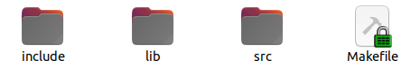

# Project Initialization

# Windows

This page introduces the process of importing libraries and initializing a project using MinGW and MSVC.

## 1. MinGW+Qt

- MinGW
- MSVC

First, find the host computer SDK download section in the relevant downloads and choose the latest version of the API to download.

In the `Cpp` folder, there is an `include` header folder. Under the `windows` folder, `win_mingw64_v2.x.x` contains the latest version of the dynamic library.

### 1.1 Create a Project

Create a Qt Widgets Application project named `qt_demo`.


### 1.2 Import the SDK

After creating the project, create a `libs` folder under the project and copy the SDK into the project folder.

Assume your directory structure is as follows:

```text
Project Root/
├── libs/
│   ├── include/
│   │   └── c_interface
│   │   └── cpp_interface
│   │   └── parameter
│   ├── libnrc_host.dll.a
│   └── nrc_host.dll
└── main.cpp
└── mainwindow.cpp
└── mainwindow.h
└── mainwindow.ui
└── qt_demo.pro
```

Add the SDK header files and library references at the end of the `qt_demo.pro` file.

```makefile
# 1. Specify header file path
INCLUDEPATH += $$PWD/libs/include
# 2. Specify library file search path
LIBS += -L$$PWD/libs
# 3. Link the library file (note the naming format)
LIBS += -lnrc_host
# 4. Ensure .dll can be found at runtime (optional, see notes below)
win32 {
    # Copy .dll to the build output directory (e.g., debug/release)
    DLL_SOURCE = $$shell_path($${PWD}\libs\nrc_host.dll)
    DLL_TARGET = $$shell_path($${OUT_PWD}\\)
    QMAKE_POST_LINK += $$quote(cmd /c copy /Y $$quote($$DLL_SOURCE) $$quote($$DLL_TARGET))
}
```

### 1.3 Include the Header File

Add the header file `#include "cpp_interface/nrc_api.h"` in `mainwindows.cpp`.

```cpp
#include "mainwindow.h"
#include "ui_mainwindow.h"
// Add the library header file
#include "cpp_interface/nrc_api.h"


MainWindow::MainWindow(QWidget *parent)
    : QMainWindow(parent)
    , ui(new Ui::MainWindow)
{
    ui->setupUi(this);
}


MainWindow::~MainWindow()
{
    delete ui;
}
```

### 1.4 Run

Click Run. If there are no errors, it means the header file was successfully imported.



For more examples, visit C++ API Reference | NexDroid Technology

## 2. MSVC

- IDE used: Qt Creator 5.0.2
- Build kit: Qt 5.12.12 MinGW 64-bit

In the `Cpp` folder, there is an `include` header folder. Under the `windows` folder, `win_msvc2017_x64_v2.x.x` contains the latest version of the dynamic library.

### 2.1 Create a Project

Select C++ "Console Application" to create.



### 2.2 Import the SDK

After creating the project, copy the SDK into the newly created project folder.

Assume your directory structure is as follows:

```text
Project Root/
├── libs/
│   ├── include/
│   │   └── c_interface
│   │   └── cpp_interface
│   │   └── parameter
│   ├── nrc_host.lib
│   └── nrc_host.dll
└── cpp_demo.cpp
└── cpp_demo.aps
└── cpp_demo.rc
└── cpp_demo.vcxproj
└── resource.h
```

In Visual Studio, right-click the project → Properties → configure the following options:

#### (1) Add Header File Path

- IDE used: Visual Studio 2022
- Build tool: MSVC Release x64

```text
$(ProjectDir)libs\include
```

#### (2) Add Library Path

- Configuration Properties → C/C++ → General → Additional Include Directories
Add the header file path:

```text
$(ProjectDir)libs
```

#### (3) Link the Library File

- Configuration Properties → Linker → General → Additional Library Directories
Add the path where the `.lib` file is located:

```text
nrc_host.lib
```

#### (4) Ensure `.dll` Can Be Found at Runtime

- Configuration Properties → Linker → Input → Additional Dependencies
Add the `.lib` file name:

```text
copy "$(ProjectDir)libs\nrc_host.dll" "$(OutDir)"
```

### 2.3 Include the Header File

Add the header file in `cpp_demo.cpp`.

```cpp
#include <iostream>
#include <thread>
#include <chrono>
#include <string>
#include "cpp_interface/nrc_interface.h"  // Import header file


int main()
{
    SOCKETFD fd = connect_robot("192.168.1.15", "6001");
    if (fd <= 0)
    {
        std::cout << "Connection failed" << std::endl;
        return 0;
    }
    std::cout << "Connection succeeded: " << fd << std::endl;
}
```

Click Local Windows Debugger. If using the Debug version of the library, switch Release to Debug.


If there are no errors, it means the SDK has been successfully imported.

For more examples, visit C++ API Reference | NexDroid Technology

# Linux

Create three new folders: `include`, `lib`, and `src`. Place the `api/` folder into `include`. Place `libnrc_host` into `lib`. Create a new `main.cpp` file under the `src` folder.



## 1. Create a Makefile

Copy the following content into the Makefile and save it.

```makefile
TARGET=demo
all:
  g++ -o $(TARGET) src/*.cpp -I./include -L./lib -lnrc_host -lpthread -lm -ldl -lrt -lstdc++ -std=c++11 -fPIC
clean:
  rm $(TARGET) $(objects)
```

## 2. Create a main.cpp File Under src

```cpp
#include <iostream>
#include "cpp_interface/nrc_api.h"


int main() {
  std::cout << "connect state: " << std::endl;
  SOCKETFD fd = connect_robot("192.168.1.15","6001");
  std::cout << "connect state: " << get_connection_status(fd) << std::endl;
}
```

## 3. Compile to Generate the Executable

Open the terminal and use `make` to compile the executable program `demo`.

For more examples, visit API Examples | NexDroid Technology

- Configuration Properties → Build Events → Post-Build Event
Add the `.lib` file name:
