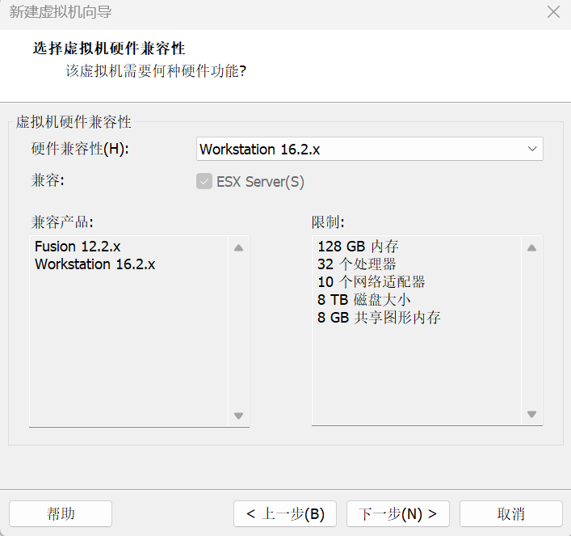
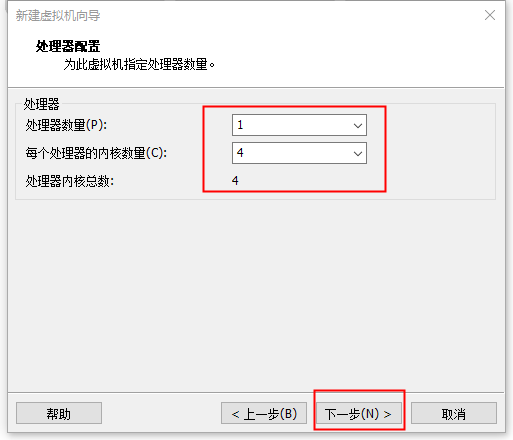
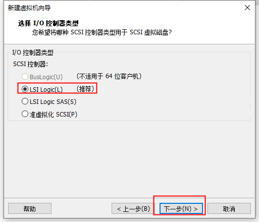
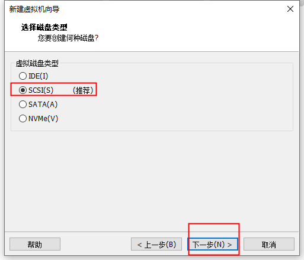
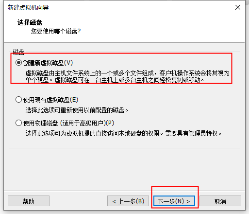
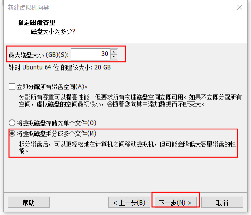
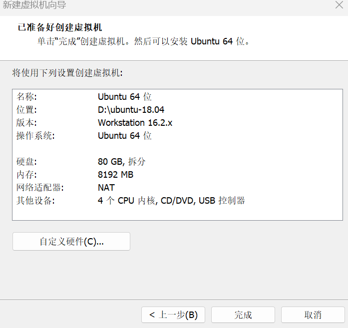
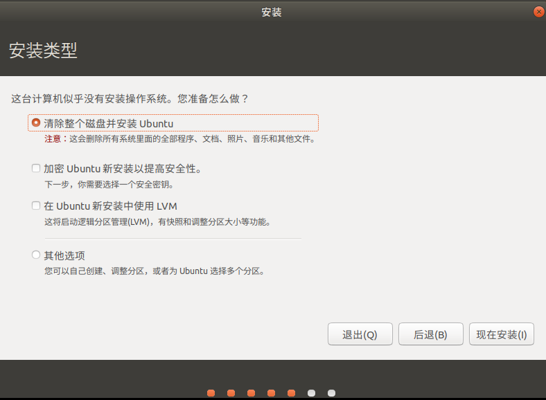
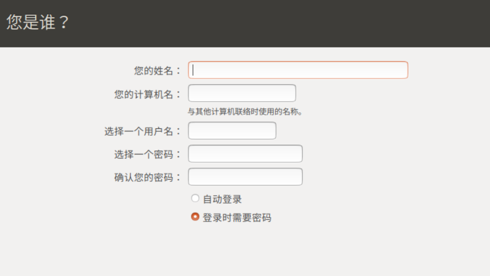
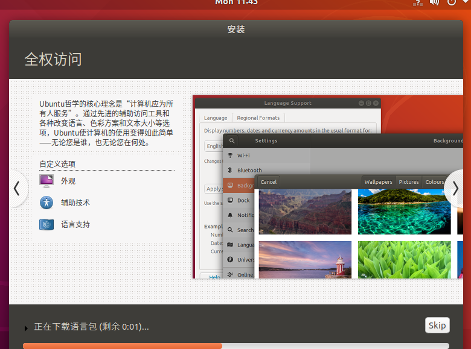

# Ubuntu 18.04 Installation

This document provides detailed instructions for downloading Ubuntu 18.04, creating a virtual machine via VMware Workstation, installing and configuring it, and installing VMware Tools.

## 1. Download Ubuntu 18.04

Download the Ubuntu 18.04 LTS ISO file from the Ubuntu official website or a domestic mirror site.


After installation, it appears as follows:


## 2. Create a Virtual Machine

### VMware Configuration Steps

1. Open VMware Workstation and click **Create a New Virtual Machine**.


2. Select **Custom (Advanced)**, then click **Next**.


3. Select hardware compatibility based on your installed VMware version, then click **Next**.



4. Select **I will install the operating system later**, then click **Next**.


5. Select **Linux**, with version **Ubuntu 64-bit**, then click **Next**.


6. Name the virtual machine and choose an installation location (preferably not on the C drive).


7. Set processor count to **1** and core count to **4**, then click **Next**.


8. Set memory to **8GB**, then click **Next**.



9. Select **Use network address translation (NAT)**, then click **Next**.


10. Keep the default recommended settings and click **Next**.




11. Select **Create a new virtual disk**, then click **Next**.



12. Allocate disk space, recommended **80GB** (adjustable based on actual needs), and select **Split virtual disk into multiple files**, then click **Next**.



13. Keep defaults and click **Next**.



14. Click **Customize Hardware**.


15. In the hardware customization dialog, use the **ISO image file** option and select the ISO file downloaded earlier. Remove **Sound Card** and **Printer**, then click **Close**. Since the virtual machine does not need a sound card or printer, removing them saves resources.


16. Click **Finish** to begin installation.


## 3. Install Ubuntu 18.04

1. Enter Ubuntu 18.04 and power on the virtual machine. Select **Chinese (Simplified)**, then click **Install Ubuntu**.



2. Select **Chinese**.


3. Select **Normal installation**, check **Download updates while installing Ubuntu**, then click **Continue**.


4. Select **Erase disk and install Ubuntu**, click **Continue** on the warning prompt, and finally click **Install Now**.




5. Set your username and password. The location field can be filled freely. Wait for Ubuntu to complete the installation.




## 4. Install VMware Tools

After Ubuntu is installed, click Restart Now, enter Ubuntu, and install VMware Tools.

### Mount VMware Tools

1. Click **VM** in the top menu, then click **Install VMware Tools**.



After the download completes:


2. Locate the VMware Tools folder in Files — VMware Tools, and move it to the home directory.


3. Right-click in the home directory and select **Open in Terminal**, then run the following command:

```bash
tar -zxvf VMwareTools-xxx.tar.gz
```

After running, you will see the extracted folder:


4. Run the following two commands:

```bash
cd vmware-tools-distrib
sudo ./vmware-install.pl
```

Type `yes` at the first prompt, then press Enter for all subsequent prompts.

Afterward, restart the system. Ubuntu 18.04 installation is now complete.
