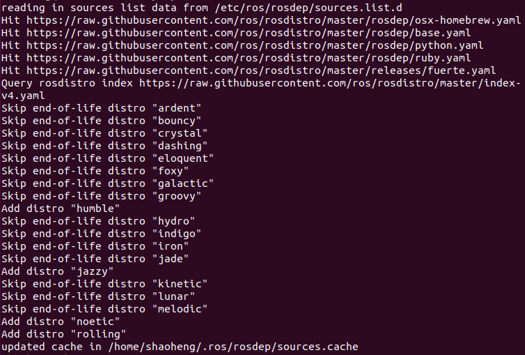

# ROS 1 Installation

This document describes the complete steps for installing ROS 1 Melodic on Ubuntu 18.04, as well as solutions for common errors.

## 1. Configure Software Sources

Ubuntu's default software sources are slow. It is recommended to switch to a domestic mirror (using Aliyun as an example).

### Backup the Original sources.list

```bash
sudo cp /etc/apt/sources.list /etc/apt/sources.list_backup
```

### Replace with Aliyun Mirror Sources

```bash
sudo gedit /etc/apt/sources.list
```

Add the following lines at the beginning of the file:

```bash
deb http://mirrors.aliyun.com/ubuntu/ bionic main restricted universe multiverse
deb http://mirrors.aliyun.com/ubuntu/ bionic-security main restricted universe multiverse
deb http://mirrors.aliyun.com/ubuntu/ bionic-updates main restricted universe multiverse
deb http://mirrors.aliyun.com/ubuntu/ bionic-proposed main restricted universe multiverse
deb http://mirrors.aliyun.com/ubuntu/ bionic-backports main restricted universe multiverse
deb-src http://mirrors.aliyun.com/ubuntu/ bionic main restricted universe multiverse
deb-src http://mirrors.aliyun.com/ubuntu/ bionic-security main restricted universe multiverse
deb-src http://mirrors.aliyun.com/ubuntu/ bionic-updates main restricted universe multiverse
deb-src http://mirrors.aliyun.com/ubuntu/ bionic-proposed main restricted universe multiverse
deb-src http://mirrors.aliyun.com/ubuntu/ bionic-backports main restricted universe multiverse
```

### Refresh Software List

```bash
sudo apt-get update
sudo apt-get upgrade
sudo apt-get install build-essential
```

## 2. Add ROS Software Sources

### Official Source

```bash
sudo sh -c 'echo "deb http://packages.ros.org/ros/ubuntu $(lsb_release -sc) main" > /etc/apt/sources.list.d/ros-latest.list'
```

### Tsinghua Mirror (Recommended for Users in China)

```bash
sudo sh -c '. /etc/lsb-release && echo "deb http://mirrors.tuna.tsinghua.edu.cn/ros/ubuntu/ `lsb_release -cs` main" > /etc/apt/sources.list.d/ros-latest.list'
```

## 3. Add Keys

```bash
sudo apt-key adv --keyserver 'hkp://keyserver.ubuntu.com:80' --recv-key C1CF6E31E6BADE8868B172B4F42ED6FBAB17C654
```

## 4. Install ROS

```bash
sudo apt update
sudo apt install ros-melodic-desktop-full
```

## 5. Install and Initialize rosdep

```bash
sudo apt update
sudo apt install python-rosdep
sudo rosdep init
rosdep update
```

If everything goes smoothly, the output of rosdep initialization and update should look like this:




### Fixing rosdep Initialization Failures

If initialization fails (due to limited access to GitHub servers), you can first try connecting via a mobile hotspot to run `rosdep init`. If that still doesn't work, follow the steps below to modify the configuration.

#### Fix sources_list.py

```bash
sudo gedit /usr/lib/python2.7/dist-packages/rosdep2/sources_list.py
```

In the `download_rosdep_data` function, change `url = "https://raw.githubusercontent.com/..."` to `url = "https://ghproxy.com/" + url`.

#### Fix rosdistro/__init__.py

```bash
sudo gedit /usr/lib/python2.7/dist-packages/rosdistro/__init__.py
```

Find `DEFAULT_INDEX_URL` (around line 72) and change it to:

```python
DEFAULT_INDEX_URL = 'https://ghproxy.com/https://raw.githubusercontent.com/ros/rosdistro/master/index-v4.yaml'
```

#### Fix gbpdistro_support.py

```bash
sudo gedit /usr/lib/python2.7/dist-packages/rosdep2/gbpdistro_support.py
```

Add the following at the beginning of the `download_rosdep_data` function (around line 36):

```python
gbpdistro_url = "https://ghproxy.com/" + gbpdistro_url
```

#### Fix rep3.py

```bash
sudo gedit /usr/lib/python2.7/dist-packages/rosdep2/rep3.py
```

Add a proxy prefix around line 39.

#### Fix manifest_provider/github.py

```bash
sudo gedit /usr/lib/python2.7/dist-packages/rosdistro/manifest_provider/github.py
```

Add a proxy prefix around lines 68 and 119.

#### Handle DNS Issues

If the errors still cannot be resolved, try modifying DNS:

```bash
sudo gedit /etc/resolv.conf
```

Comment out the existing `nameserver` lines and add:

```bash
nameserver 8.8.8.8
nameserver 8.8.4.4
```

Save and exit, then run:

```bash
sudo apt-get update
```

Then run:

```bash
sudo rosdep init
```

If the error states `default sources list file already exists`, first delete the existing file:

```bash
sudo rm /etc/ros/rosdep/sources.list.d/20-default.list
```

Then re-run `sudo rosdep init`.

## 6. Set Environment Variables

```bash
echo "source /opt/ros/melodic/setup.bash" >> ~/.bashrc
source ~/.bashrc
```

## 7. Install ROS Packages

```bash
sudo apt-get install ros-melodic-moveit
sudo apt-get install ros-melodic-joint-state-publisher
sudo apt-get install ros-melodic-robot-state-publisher
sudo apt install ros-melodic-gazebo-ros-pkgs
sudo apt-get install ros-melodic-gazebo-ros-control
sudo apt-get install ros-melodic-joint-trajectory-controller
sudo apt-get install ros-melodic-industrial-core
```

## 8. Testing

ROS includes some built-in small programs that can be used to verify whether the ROS environment is working properly.

### Start roscore

```bash
roscore
```

### Start the Turtle Simulator

Open a new terminal:

```bash
rosrun turtlesim turtlesim_node
```

### Start Keyboard Control

Open another terminal:

```bash
rosrun turtlesim turtle_teleop_key
```

Hover the cursor over this terminal, then use the ↑, ↓, ←, → arrow keys to control the turtle's movement:


