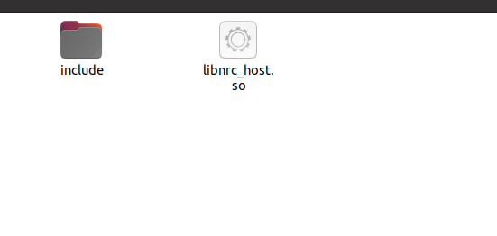
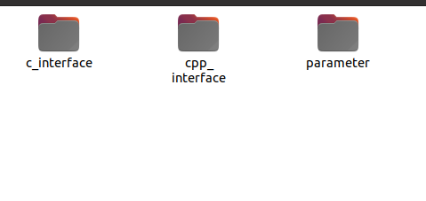
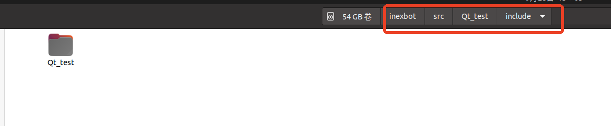
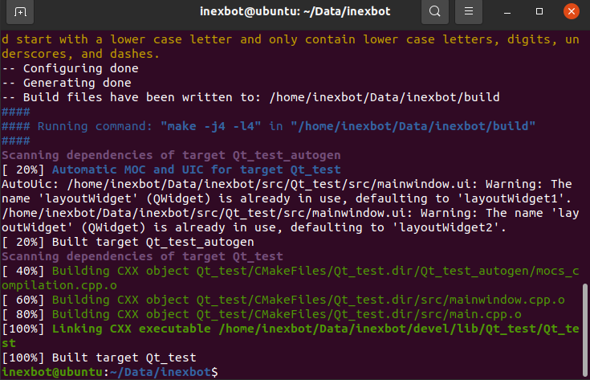
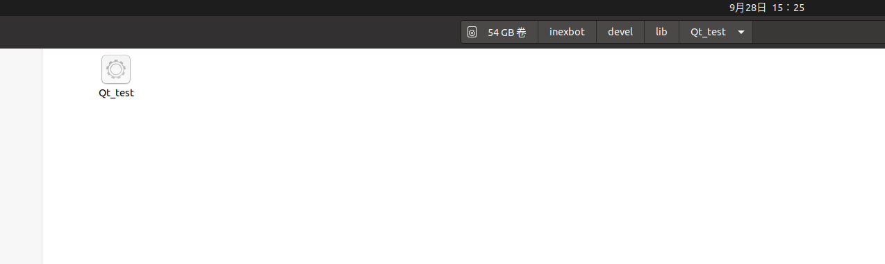

# Using ROS with Qt

This guide explains how to integrate a Qt project with ROS 1, enabling it to run via `rosrun` or `roslaunch` commands. The core approach is to convert the Qt project into a ROS package and properly configure CMakeLists.txt. Below are the complete steps.

## 1. Check g++ Version

Qt5 requires g++ 4.8 or later:

```bash
g++ --version
gcc --version
```

## 2. Create a ROS Workspace

```bash
source /opt/ros/noetic/setup.bash
mkdir -p ~/inexbot/src
cd ~/inexbot/src
catkin_create_pkg Qt_test roscpp std_msgs
```

## 3. Adjust Qt Project Structure

First, create a Qt project with the following file structure, where `libs` contains library files `.so` and their header files `.h`:






The Qt project needs some structural adjustments to work as a ROS package, as shown below:


Move the original project files `main.cpp`, `mainwindow.cpp`, and `Qt_test.pro` into the `src` directory, and place `mainwindow.h` in `include/Qt_test`:



## 4. Modify CMakeLists.txt

This is the most critical step. You need to modify the `CMakeLists.txt` file under the function package so it can compile the Qt project. ROS uses CMake, while Qt typically uses qmake, but you can use CMake's `find_package` to locate Qt.

```cmake
cmake_minimum_required(VERSION 3.0.2)
project(Qt_test)

# Find Catkin and ROS packages
find_package(catkin REQUIRED COMPONENTS
  roscpp
  std_msgs
)

# Set C++ standard
set(CMAKE_CXX_STANDARD 11)
set(CMAKE_CXX_STANDARD_REQUIRED ON)

# Find Qt5
set(Qt5_DIR "/usr/lib/x86_64-linux-gnu/cmake/Qt5")
find_package(Qt5 COMPONENTS Core Widgets REQUIRED)

# Catkin package configuration
catkin_package(
  CATKIN_DEPENDS roscpp std_msgs
)

# Include directories
include_directories(
  include
  /opt/ros/noetic/include
  ${catkin_INCLUDE_DIRS}
  ${Qt5Widgets_INCLUDE_DIRS}
)

# Set automatic processing
set(CMAKE_AUTOMOC ON)
set(CMAKE_AUTORCC ON)
set(CMAKE_AUTOUIC ON)  # Ensure this line exists

# Process resource files (if .qrc files exist)
file(GLOB RESOURCE_FILES "*.qrc")
qt5_add_resources(QT_RESOURCES ${RESOURCE_FILES})

# Source files
set(SRC_FILES
  src/main.cpp
  src/mainwindow.cpp
)

# Header files
set(HEADER_FILES
  include/Qt_test/mainwindow.h
  libs/include/cpp_interface/nrc_api.h
  libs/include/cpp_interface/nrc_interface.h
)

# Add library paths
link_directories(${PROJECT_SOURCE_DIR}/libs)

# Create executable
add_executable(${PROJECT_NAME}
  ${SRC_FILES}
  ${HEADER_FILES}
  ${QT_UI_HEADERS}
  ${QT_RESOURCES}
)

# Link libraries
target_link_libraries(${PROJECT_NAME}
  ${catkin_LIBRARIES}
  Qt5::Widgets
  Qt5::Core
  nrc_host
)

# Install executable
install(TARGETS ${PROJECT_NAME}
  RUNTIME DESTINATION ${CATKIN_PACKAGE_BIN_DESTINATION}
)

# Install library files (optional)
install(FILES libs/libnrc_host.so
  DESTINATION ${CATKIN_PACKAGE_LIB_DESTINATION}
)
```

**Notes:**

- `qt5_add_resources`: embeds `.qrc` resource files into the executable;
- `CMAKE_AUTOMOC`, `CMAKE_AUTORCC`, `CMAKE_AUTOUIC`: automatically handle Qt meta-object compiler, resource compiler, and UI conversion;
- Make sure source file paths (such as `src/main.cpp`) are correct.

## 5. Build the Package

Go back to the workspace root directory and build:

```bash
cd ~/inexbot
catkin_make
```

If the build succeeds, you should find the generated executable `Qt_test` in the `~/inexbot/devel/lib/Qt_test/` directory:





## 6. Run

```bash
# First, make sure roscore is running
roscore

# Then run the node
source ~/inexbot/devel/setup.bash
rosrun Qt_test Qt_test
```


## Common Issues and Tips

- **Environment Variables**: Make sure the terminal has already run `source /opt/ros/noetic/setup.bash` and `source ~/inexbot/devel/setup.bash`;
- **Qt Version**: ROS Noetic defaults to Ubuntu 20.04, which comes with Qt5 version 5.12. Ensure your project is compatible with this version;
- **Dependencies**: If the project depends on other ROS packages (such as rviz, tf, etc.), add them to both `catkin_create_pkg` and `find_package(catkin ...)`.
