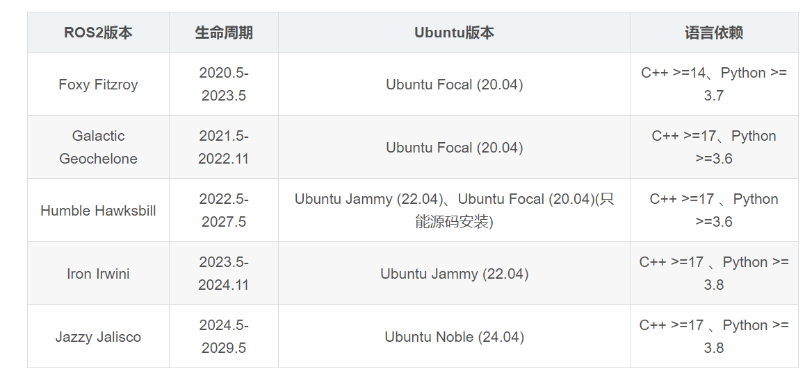
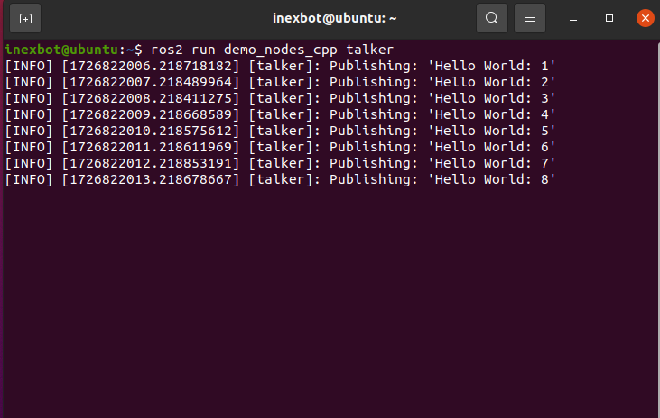
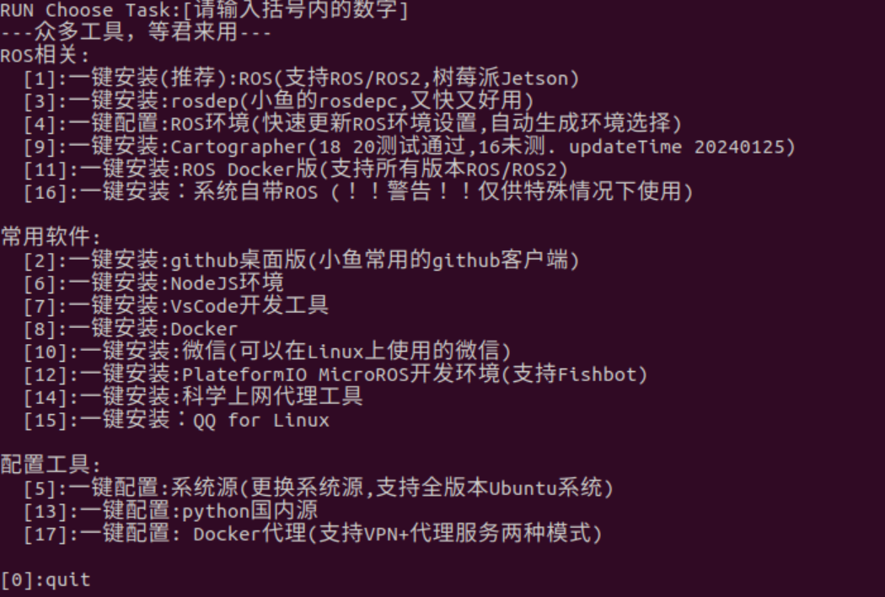

# ROS 2 Installation

This article describes the complete steps for installing ROS 2 on Ubuntu 20.04 and above, using Ubuntu 22.04 + ROS 2 Humble as an example.

## Preparation

### Check Ubuntu Version

```bash
lsb_release -a
```

Ubuntu 22.04 corresponds to ROS 2 Humble. Versions after Foxy began supporting Ubuntu 22.04. For more detailed version mappings, refer to the official ROS documentation.



## Method 1: Manual Installation

### 1. Base Environment Configuration

#### Set Locale

Ensure the system supports UTF-8 encoding:

```bash
sudo apt update && sudo apt install locales
sudo locale-gen en_US en_US.UTF-8
sudo update-locale LC_ALL=en_US.UTF-8 LANG=en_US.UTF-8
export LANG=en_US.UTF-8
```

#### Configure Software Sources

```bash
sudo apt install software-properties-common
sudo add-apt-repository universe
```

#### Add ROS 2 GPG Key

```bash
sudo apt update && sudo apt install curl gnupg2 -y
sudo curl -sSL https://gitee.com/tyx6/rosdistro/raw/master/ros.key -o /usr/share/keyrings/ros-archive-keyring.gpg
```

#### Add Software Repository

**Official source:**

```bash
echo "deb [arch=$(dpkg --print-architecture) signed-by=/usr/share/keyrings/ros-archive-keyring.gpg] http://packages.ros.org/ros2/ubuntu $(. /etc/os-release && echo $UBUNTU_CODENAME) main" | sudo tee /etc/apt/sources.list.d/ros2.list > /dev/null
```

**Tsinghua mirror (recommended for users in China):**

```bash
echo "deb [arch=$(dpkg --print-architecture) signed-by=/usr/share/keyrings/ros-archive-keyring.gpg] https://mirrors.tuna.tsinghua.edu.cn/ros2/ubuntu $(. /etc/os-release && echo $UBUNTU_CODENAME) main" | sudo tee /etc/apt/sources.list.d/ros2.list > /dev/null
```

### 2. Install ROS 2

#### Update the System

```bash
sudo apt update
sudo apt upgrade
```

#### Install ROS 2

```bash
sudo apt install ros-humble-desktop
```

#### Configure Environment Variables

```bash
echo "source /opt/ros/humble/setup.bash" >> ~/.bashrc
source ~/.bashrc
```

### 3. Verify Installation

#### Test Communication

In Terminal 1, start the publisher:

```bash
ros2 run demo_nodes_cpp talker
```

If working correctly, the following output will be displayed:



In Terminal 2, start the subscriber:

```bash
ros2 run demo_nodes_py listener
```

If working correctly, the following output will be displayed:


If both terminals display the `Hello World` string, communication is working correctly.

#### Test the Turtlesim Simulator

In Terminal 1, start the turtlesim simulator:

```bash
ros2 run turtlesim turtlesim_node
```

In Terminal 2, start the keyboard control:

```bash
ros2 run turtlesim turtle_teleop_key
```

The result is shown below:


### 4. Configure rosdep

rosdep is the dependency management tool for ROS. It is needed to install system dependencies when compiling some packages from source.

rosdep accesses GitHub servers, which may be slow in China. It is recommended to replace the addresses with domestic mirrors.

#### Install rosdep

```bash
sudo apt install python3-rosdep
```

#### Automatic Configuration (Recommended)

Download and run the one-click fix script:

```bash
wget https://gitee.com/tyx6/mytools/raw/main/ros/Mrosdep.py
sudo python3 Mrosdep.py
```

Note: This script is located in the rosdistro directory. If the script fails, you can manually modify the configuration as described below.

#### Manual Configuration

You need to manually modify the following 4 files, replacing `https://raw.githubusercontent.com/...` with `https://gitee.com/...`:

```bash
sudo gedit /usr/lib/python3/dist-packages/rosdep2/sources_list.py    # around line 64
sudo gedit /usr/lib/python3/dist-packages/rosdistro/__init__.py       # around line 68
sudo gedit /usr/lib/python3/dist-packages/rosdep2/gbpdistro_support.py # around line 34
sudo gedit /usr/lib/python3/dist-packages/rosdep2/rep3.py               # around line 36
```

#### Complete Initialization

```bash
sudo rosdep init
rosdep update
```

Note: If configuration keeps failing, try Method 2 for one-click setup.

## Method 2: One-Click Installation

Use the FishROS one-click installation script, which automatically completes ROS 2 installation, rosdep configuration, and environment variable setup:

```bash
wget http://fishros.com/install -O fishros && . fishros
```


