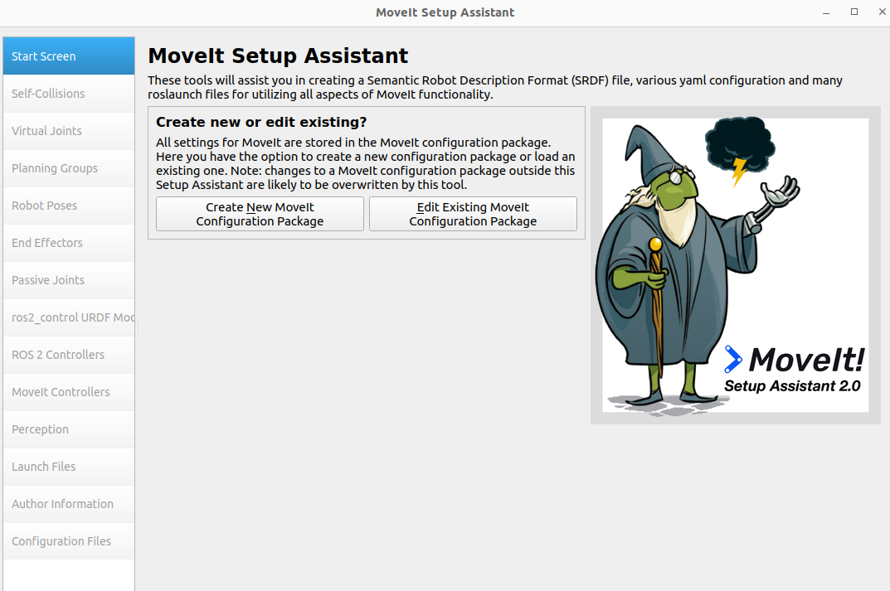

# MoveIt 2 Installation

Unlike ROS 1, ROS 2 Humble requires manual installation of MoveIt 2.

## Installation Steps

### 1. Install the MoveIt 2 Main Package

```bash
sudo apt install ros-humble-moveit
```

If it runs without errors after installation, it is successful. Note that different ROS 2 versions use different commands; this tutorial uses Humble as an example.

### 2. Install MoveIt Setup Assistant

```bash
sudo apt install ros-humble-moveit-setup-assistant
```

### 3. Install All MoveIt Related Packages

```bash
sudo apt install ros-humble-moveit-*
```

### 4. Launch Setup Assistant

```bash
ros2 run moveit_setup_assistant moveit_setup_assistant
```

If the following interface appearss, the installation is successful. The usage workflow of MoveIt Setup Assistant is essentially the same in ROS 2 as in ROS 1, so it will not be covered here.


