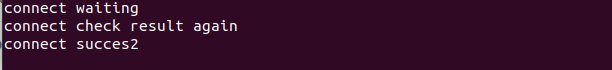
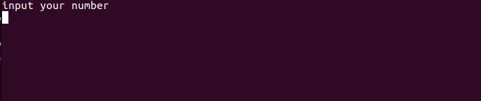
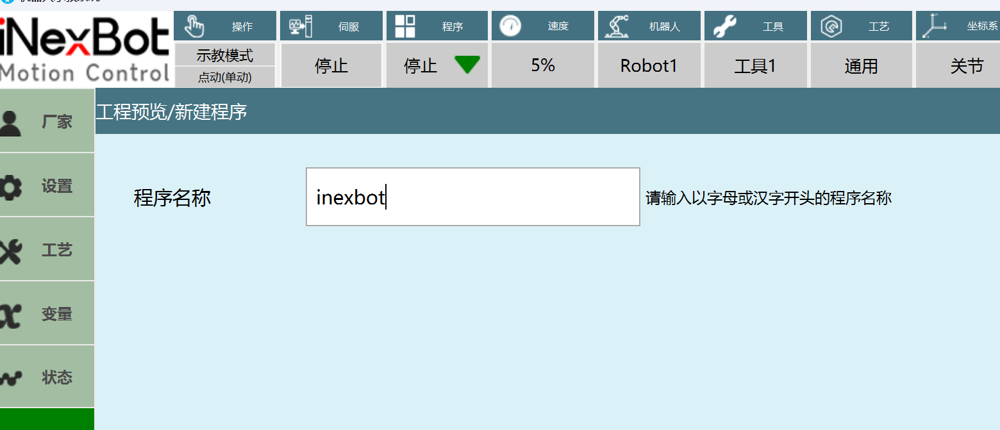
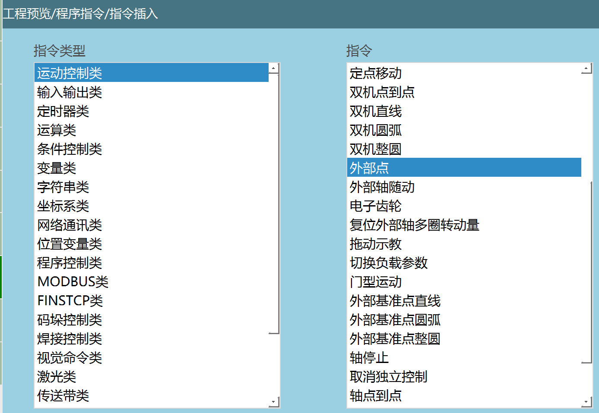
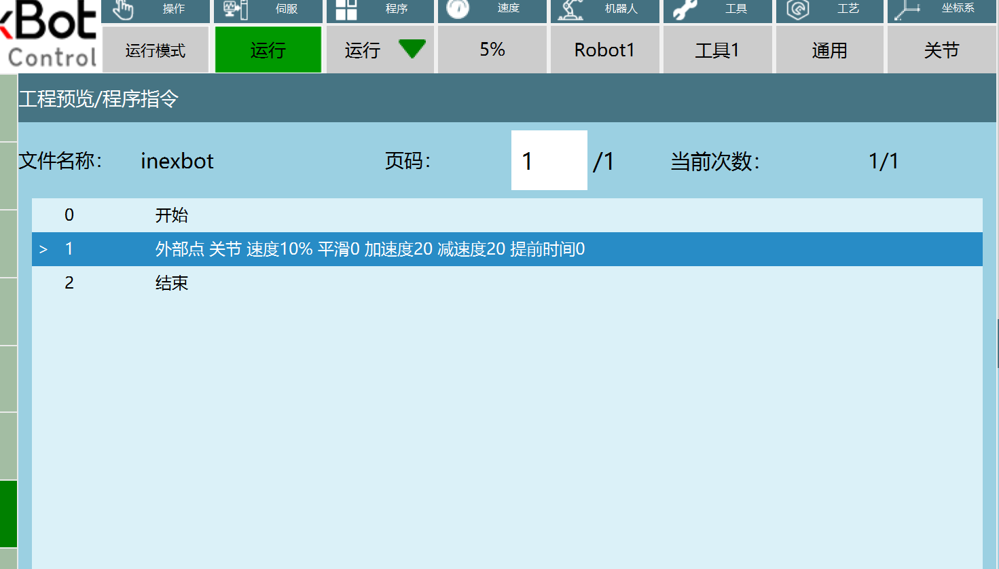
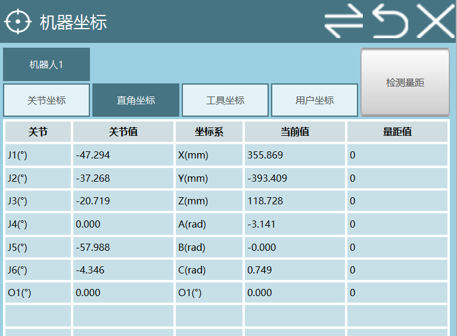

# Port 7000 Communication Package Tutorial

This document describes the specific process of communication between ROS 2 and the inexbot controller using the socket protocol on port 7000.

## 1. Modify Controller Configuration

The ROS 2 package depends on port 7000 to communicate with the controller. Before use, you need to log into the controller via SSH and modify the `controller.json` configuration file.

### SSH Login to the Controller

```bash
ssh inexbot@192.168.x.x  # Replace with the actual controller IP
```

Password: `123`

### Modify File Permissions

```bash
cd robot/
cd config/
sudo chmod 777 controller.json
```


### Disable CRC Verification

Open `controller.json`, find `checkCRC` under the `hostComputerService` node, and change `true` to `false`.


## 2. Create a Workspace

```bash
mkdir -p ~/inexbot/src
```

## 3. Build the Package

Place the `inexbot_service` package into `~/inexbot/src`, then build:

```bash
cd ~/inexbot/
colcon build
```

## 4. Launch the Communication Node

### Launch nrc_rostopic_joint (Connect to Controller)

```bash
source install/setup.bash
ros2 run inexbot_service nrc_rostopic_joint
```

Enter 5 in the terminal running `rostopic_joint.cpp`, at which point the following effect will appear in the terminal running `nrc_rostopic_joint.cpp`.




### Launch rostopic_joint (Demo Program)

```bash
source install/setup.bash
ros2 run inexbot_service rostopic_joint
```



## Demo Program Feature Description

`rostopic_joint.cpp` serves as a demo to show customers how ROS 2 communicates with the inexbot controller. After the message `input your number` appears, you can enter 1-6, each number representing a different function:

| Number | Feature |
|------|------|
| 1 | Read IO information from the controller |
| 2 | Write IO information to the controller |
| 3 | Stop query commands |
| 4 | Read the robot's actual coordinates |
| 5 | Control the robot to move to pose 1 |
| 6 | Control the robot to move to pose 2 |

### Core Code Example

```cpp
switch(s_number) {
    case 1: { // Read IO
        Json::Value rootSend;
        Json::FastWriter fWriter;
        rootSend["channel"] = 1;
        rootSend["stop"] = 0;
        rootSend["robot"] = 1;
        rootSend["mode"] = 1;      // 0: reply only once, 1: reply periodically
        rootSend["interval"] = 1000; // reply every 1000ms
        rootSend["queryType"][(unsigned int)0] = "IO";
        rootSend["typeCfg"]["IO"][(unsigned int)0] = "DO1";
        rootSend["typeCfg"]["IO"][1] = "DO2";
        rootSend["typeCfg"]["IO"][2] = "DO3";
        rootSend["typeCfg"]["IO"][3] = "DO4";
        rootSend["typeCfg"]["IO"][4] = "DO5";
        str = fWriter.write(rootSend);
        break;
    }
    case 2: { // Write IO
        Json::Value rootSend_1;
        Json::FastWriter fWriter_1;
        rootSend_1["IO"]["DO1"] = 1;
        rootSend_1["IO"]["DO2"] = 0;
        rootSend_1["IO"]["DO3"] = 1;
        rootSend_1["IO"]["DO4"] = 0;
        str = fWriter_1.write(rootSend_1);
        break;
    }
    case 3: { // Stop query
        printf("tell me channel number is ???\n");
        int channel_num;
        scanf("%d", &channel_num);
        Json::Value rootSend;
        Json::FastWriter fWriter;
        rootSend["channel"] = channel_num; // channel to stop, supports up to 9
        rootSend["stop"] = 1;
        str = fWriter.write(rootSend);
        break;
    }
    case 4: { // Read actual coordinates
        Json::Value rootSend;
        Json::FastWriter fWriter;
        rootSend["channel"] = 2;
        rootSend["stop"] = 0;
        rootSend["robot"] = 1;
        rootSend["mode"] = 1;
        rootSend["interval"] = 1000;
        rootSend["queryType"][(unsigned int)0] = "realPosMCS";
        str = fWriter.write(rootSend);
        break;
    }
    case 5: { // Control movement to pose 1
        Json::Value rootSend;
        Json::FastWriter fWriter;
        rootSend["robot"] = 1;
        rootSend["clearBuffer"] = 1;
        rootSend["targetMode"] = 0;
        rootSend["cfg"]["coord"] = "MCS";
        rootSend["cfg"]["speed"] = 20;
        rootSend["cfg"]["acc"] = 20;
        rootSend["cfg"]["moveMode"] = "MOVJ";
        rootSend["targetPos"][0] = 530.433;
        rootSend["targetPos"][1] = 7.497;
        rootSend["targetPos"][2] = 118.728;
        rootSend["targetPos"][3] = 3.141593;
        rootSend["targetPos"][4] = 0;
        rootSend["targetPos"][5] = -0.1;
        str = fWriter.write(rootSend);
        break;
    }
    case 6: { // Control movement to pose 2
        Json::Value rootSend;
        Json::FastWriter fWriter;
        rootSend["robot"] = 1;
        rootSend["clearBuffer"] = 1;
        rootSend["targetMode"] = 0;
        rootSend["cfg"]["coord"] = "MCS";
        rootSend["cfg"]["speed"] = 20;
        rootSend["cfg"]["acc"] = 20;
        rootSend["cfg"]["moveMode"] = "MOVJ";
        rootSend["targetPos"][0] = 574.964434;
        rootSend["targetPos"][1] = -37.208582;
        rootSend["targetPos"][2] = 150;
        rootSend["targetPos"][3] = 3.141593;
        rootSend["targetPos"][4] = 0;
        rootSend["targetPos"][5] = 0.2;
        str = fWriter.write(rootSend);
        break;
    }
    default:
        RCLCPP_INFO(this->get_logger(), "scanf is: %d", s_number);
        break;
}
```

## Controller-side Configuration

First, open the teach pendant, create a new project, then open the project.



Insert an instruction, select: **Motion Control → External Point**



Then switch the teach pendant to run mode and run the project.



Through monitoring, you can see the robot's position in the Cartesian coordinate system.



Enter 5 in the terminal running `rostopic_joint.cpp`, and the following output will appear in the terminal running `nrc_rostopic_joint.cpp`.


The robot starts moving, and its position in the Cartesian coordinate system changes to the position sent to the controller. Note: If it does not move, try pressing `START`.


Then enter 6 in the terminal running `rostopic_joint.cpp`, press `START`, and the robot will move to the position in case 6.


