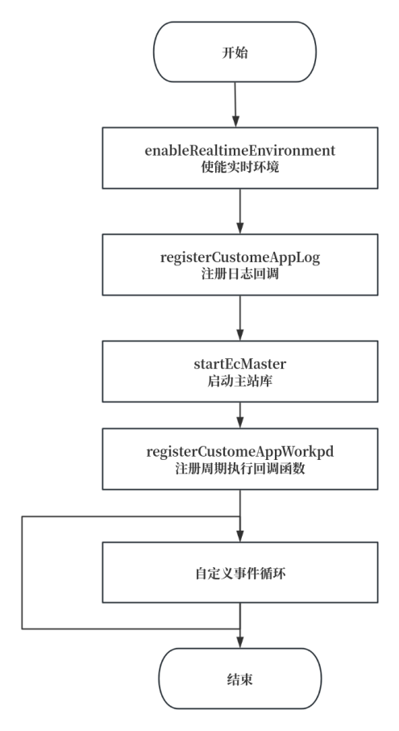

# Master Station Library

# Introduction

The INEXBOT EtherCAT Master Station controller has a master station jitter time of less than 20us. It can be widely applied to the development of industrial automation control systems, especially in scenarios with high real-time requirements such as robotics and servo motor control.

### Version Information

| Secondary Development Version | Company |
| --- | --- |
| 1.0.0 | INEXBOT |

### Changelog

| Version | Date | Author | Description |
| --- | --- | --- | --- |
| 1.0.0 | 20250310 | EA | Initial version |

# Overview

### About This Document

This document aims to help users use the INEXBOT EtherCAT Master Station control C++ library libNexIghEcm.

### About the libNexIghEcm Library

This library can automatically generate ENI files. Users only need to obtain PDO operation addresses and register periodic tasks, greatly reducing the difficulty of using the EtherCAT Master Station.

### Development Environment Requirements

| Operating System | Ubuntu 20.04 LTS |
| --- | --- |
| System Architecture | x86_64 |
| Compiler | GCC version 9.4.0/GLIBC 2.31-0ubuntu9.2<br>GCC version 4.8.2/EGLIBC 2.19-0ubuntu6.15 |
| Dependencies | Libpthread, librt, libdl, libm |

| --- | --- |
# Library API Reference

## Usage Overview

1. Copy the libNexIghEcm.a static library file to the project's lib directory

2. Copy the EcMasterApi.h header file to the project's include directory

3. Link the libNexIghEcm.a library during compilation

### NexIghLib API Function List

| Function Name | Function Description |
| --- | --- |
| startEcMaster | Start the master station |
| enableRealtimeEnvironment | Enable the real-time environment |
| ECM_LogMsg | Message-level log output provided by the master station |
| ECM_LogError | Error-level log output provided by the master station |
| ecatGetConnectedSlavesNum | Number of slaves connected to the master station |
| ecatGetConfiguredSlavesNum | Number of slaves configured by the master station |
| ecatGetSlaveState | Get the state of a slave |
| ecatSetSDO | Set SDO |
| ecatGetSDO | Get SDO |
| setEcatLicenseKey | Set the master station key (empty function, no effect) |
| isEcatLicenseCorrect | Get whether the master station key is correct |
| setLogDirName | Set the directory for master station log output |
| setEcatLogSwitch | Set whether master station log is enabled |
| getCycleTime | Get the real-time status of the master station |
| getEcLibVersion | Get the master station library version |
| getEniFileName | Get the ENI file name |
| getPDOAddrVec | Get the slave PDO data list |
| getSlaveIDVec | Get the slave ID and code list |
| registerCustomeContrastID | Register the callback function for whether the master station is complete |
| registerCustomeAppWorkpd | Register the callback function for comparing whether the slave ID found by the master station matches the preset slave ID |
| registerCustomeEcMasterStartFinish | Register the callback function called every cycle by the master station |
| registerCustomeAppLog | Register the callback function for outputting master station logs to the NEX log |

### Error Code Definitions

| Error Code | Description |
| --- | --- |
| 0 | No error |
| 1 | Bus busy state |
| 2 | Bus is being used |
| 3 | Bus error |
| 4 | Device access timeout |
| 5 | IO device inaccessible |
| 6 | Invalid parameter |
| 7 | File loading error |
| 8 | Dynamic library loading error |
| 9 | EtherCAT master request error |
| 10 | Error getting slave count |
| 11 | EtherCAT master failed to get slave |
| 12 | XML file open failure |
| 13 | XML information parsing failure |
| 14 | Slave configuration data initialization failure |
| 15 | Creating EtherCAT domain failure |
| 16 | Error configuring slave |
| 17 | Error configuring slave PDO |
| 18 | Error configuring slave PDO |
| 19 | Error selecting EtherCAT master reference clock |
| 20 | Error configuring slave Sync0 signal |
| 21 | Master activation failure |
| 22 | Domain data error |
| 23 | Domain size error |
| 24 | Error getting EtherCAT PDO |

### Basic Data Types

| typedef unsigned char EC_T_BYTE; |
| --- |
| typedef unsigned short EC_T_WORD; |
| typedef unsigned int EC_T_DWORD; |
| typedef signed char EC_T_SBYTE; |
| typedef signed short EC_T_SWORD; |
| typedef signed int EC_T_SDWORD; |
| typedef double EC_T_REAL; |

### PDO Data Structure

##### Function Description

The PDOAddrData struct is the structure for PDO addresses. One struct represents one PDO address object.

##### Struct Prototype

```
typedef struct {
    EC_T_WORD index;
    EC_T_WORD subIndex;
    EC_T_BYTE* addrMap;
} PDOAddrData;
```
##### Member Variable Description

| Variable Name | Description |
| --- | --- |
| Index | PDO index |
| subIndex | PDO sub-index |
| addrMap | PDO object address pointer |

## NexIghLib API Usage Flow



## Usage Example

### Demo.cpp

```
int CALLBACK()
{
    static int iState = -5000;
    if (iState < 3001)
    {
        ctrlwdSend(iState);
        iState++;
    }
    else
    {
        for (int i = 0; i < slave_num; i++)
        {
            if (target_position[i] != nullptr)
            {
                iPos[i] += 300;
                *target_position[i] = iPos[i];
            }
        }
    }
    return 0;
}


void myprintf(unsigned char c1, const char *s1, const char *s2, const char *s3, const long n, const char *format, ...)
{
    char dest[1024 * 16 * 16];
    va_list argptr;
    va_start(argptr, format);
    vsprintf(dest, format, argptr);
    va_end(argptr);
    printf(dest);
}


int main()
{
// Initialize parameters
    int nArgc = 1;
    char *argv[8];
    int CycleTime = 1000;
    argv[0]=(char *)(&CycleTime);
 
// Enable real-time environment
    enableRealtimeEnvironment();
// Register log callback
    EC_PF_EC_START_CustomeLog_CALLBACK p2 = myprintf;
    registerCustomeAppLog(p2);
// Start master station
    startEcMaster(nArgc,argv);
// Get slave count
    slave_num = ecatGetConnectedSlavesNum();
    printf("getSlaveIDVec\n");
// Get slave ID array
    std::vector<std::pair<unsigned int, unsigned int> > vectorID;
    getSlaveIDVec(vectorID);
 
// Get PDO address mapping
    printf("getPDOAddrVec\n");
    PDOAddrVec outPDOAddrVec, inPDOAddrVec;
    getPDOAddrVec(outPDOAddrVec, inPDOAddrVec);
// Access output PDO
    for (unsigned int i = 0; i < outPDOAddrVec.size(); i++) {
        for (unsigned int j = 0; j < outPDOAddrVec[i].size(); j++) {
            if ((outPDOAddrVec[i][j].index == 0x6040)
                    && (outPDOAddrVec[i][j].subIndex == 0x00)) {
                control_word[i] = (EC_T_WORD*) (outPDOAddrVec[i][j].addrMap);
                printf("get slave %d control_word addr = %x\n", i, control_word[i]);
            }
        }
    }
// Access input PDO
    for (unsigned int i = 0; i < inPDOAddrVec.size(); i++) {
        for (unsigned int j = 0; j < inPDOAddrVec[i].size(); j++) {
            if ((inPDOAddrVec[i][j].index == 0x6041)
                    && (inPDOAddrVec[i][j].subIndex == 0x00)) {
                status_word[i] = (EC_T_WORD*) (inPDOAddrVec[i][j].addrMap);
                printf("get slave %d status_word addr = %x\n", i, status_word[i]);
            }
        }
    }
// Register custom
    printf("registerCustomeAppWorkpd\n");
    EC_PF_EC_START_AppWorkpd_CALLBACK p = CALLBACK;
    registerCustomeAppWorkpd(p);
    while(1)
    {
      // Custom event loop
    }
    return 0;
}
```
### MakeFile

```
# Specify compiler
CXX ?= g++
 
CFLAGS = -std=c++11
# Add libNexIghEcm.a dependency
LDFLAGS = -lm -ldl -lpthread -lrt
 
INCLUDE = -I.
# Link libNexIghEcm.a from the ../ directory
LIB = -L.. -lNexIghEcm 
 
OBJ += $(patsubst %.cpp, %.o, $(wildcard *.cpp))
 
target = test
 
all:$(OBJ)
    $(CXX) *.o -o $(target) $(LIB) $(LDFLAGS)
%.o:%.cpp
    $(CXX) $(CFLAGS) -c $< -o $@ $(INCLUDE)
clean:
    rm -rf *.o $(target)
```
## NexIghLib API Detailed Reference

### startEcMaster

| Function Prototype | int startEcMaster(); |
| --- | --- |
| Function Description | Start the EtherCAT Master Station. |
| Parameter Description | None |
| Return Value | Returns an int value, 0 indicates success, non-zero indicates failure. |
| Notes | None |

### enableRealtimeEnvironment

| Function Prototype | int enableRealtimeEnvironment(); |
| --- | --- |
| Function Description | Enable the real-time environment. |
| Parameter Description | None |
| Return Value | Returns an int value, 0 indicates success, non-zero indicates failure. |
| Notes | This function is used to enable the real-time environment so that the master station can run in the real-time system. |

### ECM_LogMsg

| Function Prototype | void ECM_LogMsg(const char* msg); |
| --- | --- |
| Function Description | Log a message. |
| Parameter Description | Input parameter:<br>msg: the log message to record, type const char*. |
| Return Value | None |
| Notes | This function is used to record regular log messages. It can be used in the system for debugging and runtime tracking. |

### ECM_LogError

| Function Prototype | void ECM_LogError(const char* errorMsg); |
| --- | --- |
| Function Description | Log an error. |
| Parameter Description | Input parameter:<br>errorMsg: the error message to record, type const char*. |
| Return Value | None |
| Notes | This function is used to record error logs. Suitable for recording error information that occurs during program execution. |

### ecatGetConnectedSlavesNum

| Function Prototype | int ecatGetConnectedSlavesNum(); |
| --- | --- |
| Function Description | Get the number of slaves connected to the master station. |
| Parameter Description | None |
| Return Value | Returns an int value representing the number of connected slaves. |
| Notes | This function is used to get the number of slaves successfully connected to the master station. |

### ecatGetConfiguredSlavesNum

| Function Prototype | int ecatGetConfiguredSlavesNum(); |
| --- | --- |
| Function Description | Get the number of configured slaves. |
| Parameter Description | None |
| Return Value | Returns an int value representing the number of configured slaves. |
| Notes | None |

### ecatGetSlaveState

| Function Prototype | EC_T_WORD ecatGetSlaveState(EC_T_DWORD ecSlaveNum); |
| --- | --- |
| Function Description | Get the state of the specified slave. |
| Parameter Description | Input parameter:<br>ecSlaveNum: slave number, starting from 0. |
| Return Value | The state of the slave, type EC_T_WORD. |
| Notes | This function is used to get the state information of the specified slave. |

### ecatSetSDO

| Function Prototype | int ecatSetSDO(EC_T_DWORD slaveNum, EC_T_WORD index, EC_T_DWORD subindex, EC_T_BYTE* value, EC_T_DWORD size); |
| --- | --- |
| Function Description | Set the SDO value of a slave. |
| Parameter Description | Input parameters:<br>slaveNum: slave number.<br>index: SDO index.<br>subindex: SDO sub-index.<br>value: the SDO data value to set.<br>size: the size of the data value. |
| Return Value | Returns an int value, 0 indicates success, non-zero indicates failure. |
| Notes | None |

### ecatGetSDO

| Function Prototype | int ecatGetSDO(EC_T_DWORD slaveNum, EC_T_WORD index, EC_T_DWORD subindex, EC_T_BYTE* value, EC_T_DWORD size, int num = 0); |
| --- | --- |
| Function Description | Get the SDO value of a slave. |
| Parameter Description | Input parameters:<br>slaveNum: slave number.<br>index: SDO index.<br>subindex: SDO sub-index.<br>value: buffer for storing the SDO value.<br>size: the size of the buffer.<br>num: optional parameter, default is 0, indicating the number of SDO data items to get.<br>Output parameter:<br>value: the received SDO data value. |
| Return Value | Returns an int value, 0 indicates success, non-zero indicates failure. |
| --- | --- |
| Notes | This function is used to get the SDO value of a slave. |

### setEcatLicenseKey

| Function Prototype | void setEcatLicenseKey(const char* licenseKey); |
| --- | --- |
| Function Description | Set the EtherCAT license key. |
| Parameter Description | Input parameter:<br>licenseKey: EtherCAT license key, type const char* |
| Return Value | None |
| Notes | Empty function with no effect |

### isEcatLicenseCorrect

| Function Prototype | bool isEcatLicenseCorrect(); |
| --- | --- |
| Function Description | Check whether the EtherCAT license is valid. |
| Parameter Description | None |
| Return Value | None |
| Notes | Empty function with no effect |

### setLogDirName

| Function Prototype | void setLogDirName(const char* dir); |
| --- | --- |
| Function Description | Set the log output directory. |
| Parameter Description | Input parameter:<br>dir: log directory path, type const char*. |
| Return Value | None |
| Notes | This function is used to set the output directory for log files. |

### setEcatLogSwitch

| Function Prototype | void setEcatLogSwitch(bool enable); |
| --- | --- |
| Function Description | Set the EtherCAT log switch. |
| Parameter Description | Input parameter:<br>enable: boolean value, true indicates enabling logging, false indicates disabling logging. |
| Return Value | None |
| Notes | This function is used to enable or disable the EtherCAT logging function. |

### getCycleTime

| Function Prototype | CycleTime getCycleTime(); |
| --- | --- |
| Function Description | Get the real-time cycle time of the master station. |
| Parameter Description | None |
| Return Value | CycleTime type, representing the cycle time. |
| Notes | This function is used to get the real-time cycle time of the master station. |

### getEcLibVersion

| Function Prototype | const char* getEcLibVersion(); |
| --- | --- |
| Function Description | Get the version number of the EtherCAT library. |
| Parameter Description | None |
| Return Value | const char*, representing the version number of the EtherCAT library. |
| Notes | None |

### getEniFileName

| Function Prototype | const char* getEniFileName(); |
| --- | --- |
| Function Description | Get the configured ENI file name. |
| Parameter Description | None |
| Return Value | const char*, representing the configured ENI file name. |
| Notes | This function is used to get the currently configured ENI file name. |

### getPDOAddrVec

| Function Prototype | const std::vector<EC_T_DWORD>& getPDOAddrVec(); |
| --- | --- |
| Function Description | Get the PDO address vector. |
| Parameter Description | None |
| Return Value | Returns a reference to the PDO address vector representing the PDO addresses for communication with the master station. |
| Notes | This function is used to get the PDO address information between the master station and slaves. |

### getSlaveIDVec

| Function Prototype | const std::vector<EC_T_DWORD>& getSlaveIDVec(); |
| --- | --- |
| Function Description | Get the slave ID vector. |
| Parameter Description | None |
| Return Value | std::vector<EC_T_DWORD> type, representing the slave ID vector. |
| Notes | This function is used to get the IDs of all slaves in the current network. |

### registerCustomeContrastID

| Function Prototype | void registerCustomeContrastID(void (*callback)(EC_T_DWORD slaveNum, bool isMatched)); |
| --- | --- |
| Function Description | Register a custom callback function for comparing IDs. |
| Parameter Description | Input parameter:<br>callback: callback function that accepts two parameters:<br>slaveNum: slave number.<br>isMatched: boolean value, indicating whether the slave ID matches the preset ID. |
| Return Value | None |
| Notes | This function is used to register a callback function that will be called when the master station checks whether the slave ID matches the preset ID. |

### registerCustomeAppWorkpd

| Function Prototype | void registerCustomeAppWorkpd(void (*callback)(EC_T_DWORD slaveNum, bool isMatched)); |
| --- | --- |
| Function Description | Register a custom work cycle callback function. |
| Parameter Description | Input parameter:<br>callback: callback function that accepts two parameters:<br>slaveNum: slave number.<br>isMatched: boolean value, indicating whether the slave ID matches the preset ID. |
| Return Value | None |
| Notes | This function is used to register a work cycle callback function. |

### registerCustomeEcMasterStartFinish

| Function Prototype | void registerCustomeEcMasterStartFinish(void (*callback)(bool success)); |
| --- | --- |
| Function Description | Register a custom EtherCAT Master Station startup completion callback function. |
| Parameter Description | Input parameter:<br>callback: callback function that accepts a boolean value success, indicating whether the startup was successful. |
| Return Value | None |
| Notes | This function is used to register a work cycle callback function. |

### registerCustomeAppLog

| Function Prototype | void registerCustomeAppLog(void (*callback)(const char* logMessage)); |
| --- | --- |
| Function Description | Register an application log callback function. |
| Parameter Description | Input parameter:<br>callback: callback function that accepts a string logMessage representing the log information. |
| Return Value | None |
| Notes | This function is used to register a custom log callback function. |
