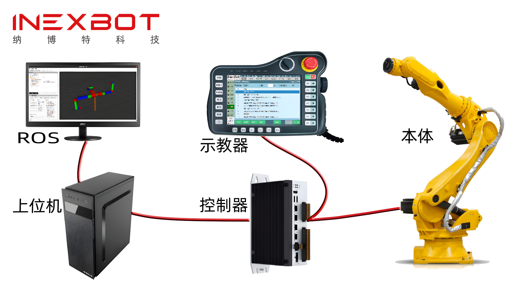

# 개요

INEXBOT은 국내를 이끄는 산업용 로봇 컨트롤러 제조업체입니다. INEXBOT이 자체 개발한 개방형 NexDroid 소프트웨어 플랫폼은 안정적이고 신뢰할 수 있으며 풍부한 기능을 갖춘 이차 개발 인터페이스(NexDroidAPI)를 제공합니다. NexDroid은 운동 제어 알고리즘 계층과 애플리케이션 계층을 분리하여 협력 업체가 산업 수요에만 집중할 수 있도록 합니다. NexDroidAPI와 산업 경험을 결합하면 3C 전자, 의료, 원자력, 건설 기계, 풍력 등 산업 장비와 같은 독자적인 자동화 장비를 개발할 수 있습니다.

INEXBOT 문서 센터는 INEXBOT 제어 시스템을 기반으로 한 예제 Demo, 이차 개발 인터페이스 설명, 이차 개발 리소스 다운로드를 제공하여, 개발자가 INEXBOT 제어 시스템의 역량을 전면적으로 이해하고, 개발 진입 장벽을 낮추며, 개발 효율을 높여, INEXBOT 제어 시스템을 기반으로 특정 시나리오 단말 애플리케이션을 갖춘 로봇 제품을 신속하게 구축할 수 있도록 합니다.

INEXBOT 소프트웨어 플랫폼은 다음과 같은 계층의 이차 개발을 제공하며, 사용자는 필요에 따라 선택할 수 있습니다.

특수 공정 개발, 특수 모델 지원, 보간 알고리즘 교체 등. Linux 시스템, C++ 개발.

전용 UI/UE 커스터마이즈. 컨트롤러 이차 개발과 함께 전용 기능을 맞춤 구현. Linux 시스템, Qt/C++ 개발.

티치 펜던트의 제약을 벗어나 API를 통해 로봇을 직접 제어합니다. Windows 시스템: VC++/C#/VB/Python/Qt; Linux 시스템, C++/Qt/Python.

INEXBOT 컨트롤러가 산업용 컴퓨터로 강등되어 실시간 시스템과 EtherCAT 마스터 기능을 제공하여, 고객이 자유롭게 맞춤 설정할 수 있도록 합니다. Linux 시스템, C/C++ 개발.

프로토콜을 따르면 INEXBOT 컨트롤러를 쾌적하게 제어할 수 있습니다. Windows 시스템: VC++/C#/VB/Python/Qt; Linux 시스템, C++/Qt/Python.

INEXBOT 컨트롤러는 ROS 프로토콜에 따라 하나의 Node로 구현되므로, ROS 프로토콜에 따라 제어할 수 있습니다.

## 대상 독자

- 컨트롤러:
- 티치 펜던트:
- 상위 컴퓨터:
- 마스터 스테이션:
- JSON 프로토콜:
- ROS:

고객은 INEXBOT 시스템을 기반으로 자신의 제어 시스템을 신속하게 맞춤화하여 자체 로봇 두뇌를 만들고 브랜드 인지도를 높일 수 있습니다.

- 본체 제조업체:

특수 공정을 개발하고, 자체 산업 지식을 보호하며, 제품 해자를 구축합니다.

- 통합업체:

기본 기능을 INEXBOT에 맡기고, 고객은 고정밀 운동 제어 알고리즘 연구에 집중하며, 로봇의 극한 성능을 깊이 파고, 과학 기술의 정상을 향해 용감히 도전합니다.

- 과학 연구 사용자:

학생들이 로봇을 사용할 줄 아는 데 그치지 않고, 직접 로봇을 만들 줄 알게 합니다.

## 주요 내용

- 교육 사용자:

INEXBOT Demo 예제는 INEXBOT 컨트롤러의 전형적인 애플리케이션을 기반으로 한 여러 Demo를 제공하여, 개발자가 INEXBOT 제어 시스템을 활용한 애플리케이션 개발에 참고할 수 있도록 합니다. INEXBOT Demo 예제는 C, C++, Qt, C#, Python, ROS 등 환경을 지원하는 Demo 예제를 제공하여, 사용자가 흔히 사용되는 개발 환경에서 신속하게 시연할 수 있습니다. INEXBOT Demo 예제는 로봇 암의 다양한 기본 동작과 고급 기능을 포괄하며, 좌표계 조작, 힘 제어, 그랩, IO 기능, 외부축 제어, ModbusRTU 통신, 스플라인 곡선 운동, 각도 패스스루, 온라인 프로그래밍, 알고리즘 등을 포함하여, 사용자가 다양한 API 인터페이스의 응용을 빠르게 익힐 수 있도록 합니다.

- Demo 예제

INEXBOT 로봇 암 이차 개발 인터페이스는 로봇 암의 일부 복잡한 기능을 인터페이스화하여, 사용자가 저수준 개발 없이 로봇 암의 고급 제어 기능을 빠르게 사용할 수 있게 하여 INEXBOT 컨트롤러 기반 사용자의 개발 진입 장벽을 낮추며, 개발자가 손쉽게 애플리케이션을 개발할 수 있도록 합니다. INEXBOT 컨트롤러 이차 개발 인터페이스는 C, C++, Qt, C#, LabVIEW, Python, JSON, ROS 등 개발 환경을 지원하여, 사용자의 어떠한 환경에서도 배포를 충족합니다. INEXBOT 이차 개발 인터페이스는 자세한 인터페이스 설명, 파라미터 해석 및 예제 코드를 포괄하여, 사용자가 각 인터페이스의 기능과 사용법을 전면적으로 이해할 수 있도록 합니다.

- 이차 개발 인터페이스

소프트웨어 이차 개발 리소스 패키지는 API 인터페이스 패키지, SDK 패키지, ROS 패키지 등 다운로드 리소스를 제공하여, 소프트웨어 패키지를 기반으로 사용자가 이차 개발을 편리하게 수행하여 애플리케이션 배포를 빠르게 진행할 수 있습니다.

## 연락처 및 지원

- 관련 리소스 획득

- INEXBOT 제품에 대해 자세히 알아보려면 다음을 방문하십시오: INEXBOT 모션 컨트롤 공식 사이트
- INEXBOT 제품 사용법에 대해 자세히 알아보려면 다음을 방문하십시오: INEXBOT 모션 컨트롤 - Bilibili
- INEXBOT 제품 관련 문의 사항은 공식 이메일로 연락 주십시오: sales@inexbot.com
- INEXBOT 제품의 최신 소식과 자세한 제품 사양서, 매뉴얼을 받으려면: 공식 WeChat 공개 계정, 공식 WeChat 미니프로그램
