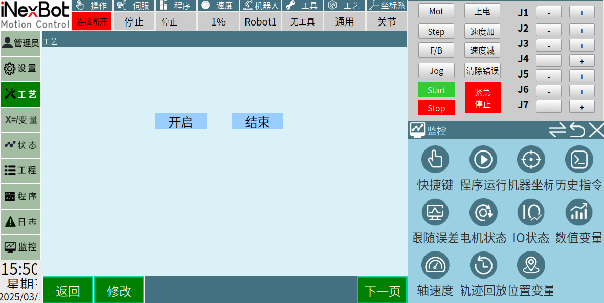

# Demo 예제

## 다운로드

컨트롤러 2차 개발 demo 다운로드

## 다운로드

티치 펜던트 2차 개발 demo 다운로드

- 컨트롤러 2차 개발
- 티치 펜던트 2차 개발
- 호스트 컴퓨터 2차 개발

## 다운로드

Python 호스트 컴퓨터 2차 개발 demo 다운로드

- Python

## 다운로드

C# 호스트 컴퓨터 2차 개발 demo 다운로드

- C#

## 다운로드

C++ 호스트 컴퓨터 2차 개발 demo 다운로드

- C++

## 다운로드

JSON 프로토콜 2차 개발 demo 다운로드

- JSON 프로토콜 2차 개발

## 다운로드

HAL 2차 개발 demo 다운로드

- HAL 2차 개발
