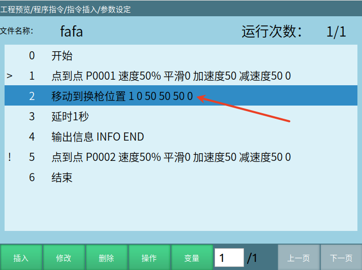

# 컨트롤러 사용자 정의 명령어 사용 예시

# 본 문서는 C++ 개발 기초가 있는 사용자에게만 적용됩니다

본 문서는 주로 관련 다운로드 내 컨트롤러 2차 개발 demo를 중심으로 설명하며, demo의 코드와 함께 보아야 합니다
## 1. 사용자 정의 명령어 콜백 함수 등록

```cpp
NRC_SetJobFileCustomInstructionCB(userdefinecmd);       //사용자 정의 명령어의 콜백 함수 등록
```
등록된 함수:

```cpp
bool userdefinecmd(int id, const std::string & paramStr,const std::string & posName)
{
	//id : 티치 펜던트 인터페이스 userdefine_cmd_insert의 첫 번째 매개변수에 해당
	//paramStr : 티치 펜던트 인터페이스 userdefine_cmd_insert의 두 번째 매개변수에 해당
	return true;
}
```
## 2. 티치 펜던트 측에서 전송한 사용자 정의 명령어 매개변수를 가져오는 함수 캡슐화 (선택 사항, 본 부분을 자체 개발하여 처리할 수도 있음)

수신된 문자열을 캡슐화하여 파싱하는 함수:

```cpp
//기능 함수, 문자열을 분할하여 컨테이너에 저장
std::vector<std::string> split(const std::string& s, char delimiter)
{
	std::vector<std::string> tokens;
	std::string token;
	std::istringstream tokenStream(s);


	while (std::getline(tokenStream, token, delimiter))
	{
		tokens.push_back(token);
	}
	return tokens;
}
```
split 함수의 사용 예시:

```cpp
std::vector<std::string> param = split(paramStr,' ');
param.erase(param.begin());
double vel = atoi(param.at(2).c_str());
double acc = atoi(param.at(3).c_str());
double dec = atoi(param.at(4).c_str());
```
## 3. 사용 예시

티치 펜던트가 전송한 속도, 가속도, 감속도 매개변수를 파싱하여 사용하며, 아래는 사용자 정의 명령어가 세 개의 MOVJ 동작을 실행하는 예시입니다:

주의: 사용자 정의 명령어 내의 운동 관련 명령어는 인터페이스 소개의 운동 관련 인터페이스만 사용할 수 있습니다

```cpp
bool userdefinecmd(int id, const std::string & paramStr,const std::string & posName)
{
	//id : 티치 펜던트 인터페이스 userdefine_cmd_insert의 첫 번째 매개변수에 해당
	//paramStr : 티치 펜던트 인터페이스 userdefine_cmd_insert의 두 번째 매개변수에 해당
	int robotNum = 1;                                               //제어할 로봇 번호 정의
	if (id == 1)
	{


	}
	else if (id == 2)
	{
		//문자열을 구분하여 매개변수 가져오기
		std::vector<std::string> param = split(paramStr,' ');
		param.erase(param.begin());
		double vel = atoi(param.at(2).c_str());
		double acc = atoi(param.at(3).c_str());
		double dec = atoi(param.at(4).c_str());                     //티치 펜던트가 캡슐화한 각 매개변수 추출


		NRC_Position pos1 = {NRC_ACS, 40, 0, 0, 0, 0, 0};
		NRC_Position pos2 = {NRC_ACS, 0, 0, 0, 0, 0, 0};
		NRC_Position pos3 = {NRC_ACS, -40, 0, 0, 0, 0, 0};       //로봇 실행 목표 위치점


		NRC_Jobrun_MoveDirect(robotNum, pos1, vel, acc, dec, 5);      //MOVJ 운동 명령어
		NRC_Jobrun_MoveDirect(robotNum, pos2, vel, acc, dec, 5);
		NRC_Jobrun_MoveDirect(robotNum, pos3, vel, acc, dec, 5, true);    //마지막 운동 명령어는 줄을 건너뛰어야 하며, moveToNextLine에 true 전달!!! 그렇지 않으면 로봇 비행 사고가 발생합니다!


	}
	else
	{
		printf("no this cmd");
	}


	return true;
}
```
## 4. 사용자 정의 명령어 실행

프로그램 업그레이드가 모두 완료된 후, 작업 파일에서 방금 작성한 사용자 정의 명령어를 작업 파일에 삽입합니다, 그림과 같이:



작업 파일 명령어 삽입이 완료된 후, 실행 모드로 전환하여 프로그램을 시작합니다. 프로그램이 "이동到换枪위치 1 0 50 50 50 0"이라는 사용자 정의 명령어에 도달하면, 위 예시의 userdefinecmd 함수 내의 모든 코드(세 개의 MOVJ 운동)를 실행하기 시작합니다.

## 5. 고급 튜토리얼

사용자가 로봇이 특정 위치점으로 운동할 때, 프로그램 제어, 로봇 상태 제어, IO 제어 또는 사용자 자신의 일부 기능 코드에 대해 처리가 필요한 경우, 이 부분의 코드를 등록된 사용자 정의 명령어 함수에 직접 추가하고 티치 펜던트에서 사용자 정의 명령어를 실행하면 로봇이 계속 운동하는데 사용자 코드는 사용자 정의 명령어 실행 직후 이미 완료된 상황이 발생합니다. 이때는 아래 차단 인터페이스를 사용하여 필요한 위치에서 프로그램을 차단해야 합니다.

```
/**
 * @brief 비운동 명령어 차단, 현재 실행이 완료되지 않은 로봇 운동 명령어가 있을 때 본 인터페이스에서 차단되어 프로그램이 아래로 실행되는 것을 방지합니다;
 * @brief 중단점에서 재개할 때, 프로그램은 정지 시 프로그램이 머물렀던 본 인터페이스에서 계속 아래로 실행됩니다
 */
void NRC_JobRun_BlockNotMoveInstruction();
```
### 예시 1: 로봇이 특정 위치점으로 운동한 후 IO 출력을 열어야 하는 경우

```cpp
bool userdefinecmd(int id, const std::string & paramStr,const std::string & posName)
{
	//id : 티치 펜던트 인터페이스 userdefine_cmd_insert의 첫 번째 매개변수에 해당
	//paramStr : 티치 펜던트 인터페이스 userdefine_cmd_insert의 두 번째 매개변수에 해당
	int robotNum = 1;             //제어할 로봇 번호 정의
	if (id == 1)
	{


	}
	else if (id == 2)
	{
	        NRC_Position pos1 = {NRC_ACS, 40, 0, 0, 0, 0, 0};
		NRC_Position pos2 = {NRC_ACS, 0, 0, 0, 0, 0, 0};
		NRC_Position pos3 = {NRC_ACS, -40, 0, 0, 0, 0, 0};       //로봇 실행 목표 위치점


		NRC_Jobrun_MoveDirect(robotNum, pos1, 80, 50, 50, 0);
		NRC_Jobrun_MoveDirect(robotNum, pos2, 80, 50, 50, 0);
		NRC_JobRun_BlockNotMoveInstruction();//차단 인터페이스, 프로그램을 해당 위치에서 차단, 이전 MOVJ 운동이 목표 위치에 도달할 때까지 대기
		NRC_DigOut(1, 1);      //해당 IO 디지털 출력 열기
		NRC_Jobrun_MoveDirect(robotNum, pos3, 80, 50, 50, 0, true);    //마지막 운동 명령어는 줄을 건너뛰어야 하며, moveToNextLine에 true 전달!!! 그렇지 않으면 로봇 비행 사고가 발생합니다!
	}
	else
	{
		printf("no this cmd");
	}


	return true;
}
```
nrcAPI.h 헤더 파일의 비운동 관련 인터페이스 대부분은 등록 함수 내에서 사용할 수 있습니다.

### 예시 2: 로봇이 특정 위치점으로 운동한 후, 사용자가 직접 작성한 기능 함수를 실행해야 하는 경우:

로봇이 pos2의 목표 위치로 운동한 후 사용자가 직접 작성한 기능 함수 실행을 시작합니다, 주의: 사용자가 자신의 기능 함수를 추가할 때 마지막에 차단을 추가하여 기능 함수가 아직 완료되지 않은 상태에서 아래 MOVJ 운동이 실행되는 것을 방지해야 합니다!

```cpp
bool userdefinecmd(int id, const std::string & paramStr,const std::string & posName)
{
	//id : 티치 펜던트 인터페이스 userdefine_cmd_insert의 첫 번째 매개변수에 해당
	//paramStr : 티치 펜던트 인터페이스 userdefine_cmd_insert의 두 번째 매개변수에 해당
	int robotNum = 1;             //제어할 로봇 번호 정의
	if (id == 1)
	{


	}
	else if (id == 2)
	{
	        NRC_Position pos1 = {NRC_ACS, 40, 0, 0, 0, 0, 0};
		NRC_Position pos2 = {NRC_ACS, 0, 0, 0, 0, 0, 0};
		NRC_Position pos3 = {NRC_ACS, -40, 0, 0, 0, 0, 0};       //로봇 실행 목표 위치점


		NRC_Jobrun_MoveDirect(robotNum, pos1, 80, 50, 50, 0);
		NRC_Jobrun_MoveDirect(robotNum, pos2, 80, 50, 50, 0);
		NRC_JobRun_BlockNotMoveInstruction();//차단 인터페이스, 프로그램을 해당 위치에서 차단, 이전 MOVJ 운동이 목표 위치에 도달할 때까지 대기
		/**
                 * ........................
                 *   사용자가 직접 작성한 기능 함수
                 * ........................
                */
		NRC_Jobrun_MoveDirect(robotNum, pos3, 80, 50, 50, 0, true);    //마지막 운동 명령어는 줄을 건너뛰어야 하며, moveToNextLine에 true 전달!!! 그렇지 않으면 로봇 비행 사고가 발생합니다!
	}
	else
	{
		printf("no this cmd");
	}


	return true;
}
```
