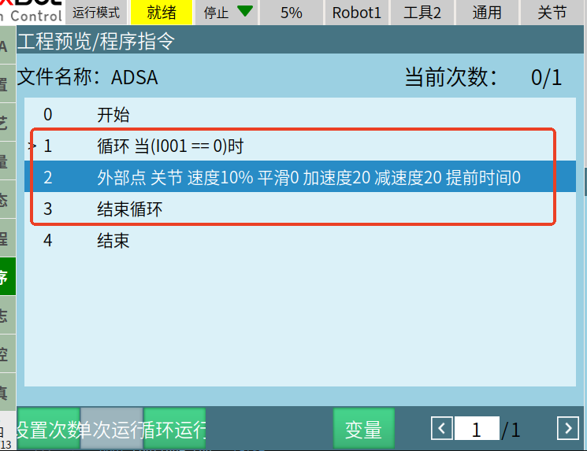

# servo_move()를 사용한 추적 운동

servo_move(SOCKETFD socketFd,ServoMovePara servoMove)는 포인트 그룹을 수신한 후 timeStamp에 따라 수신한 포인트를 평활 처리하여 서보 운동으로 전송할 수 있습니다.

```cpp
struct ServoMovePara {
  ///< 전송 매개변수
  bool clearBuffer;                         ///< 이전에 전송했지만 보간 계산을 시작하지 않은 포인트를 삭제할지 여부
  int targetMode;                           ///< 0-독립 포인트 1-연속 궤적
  int sendMode;                             ///< 0-전체 궤적을 한 번에 전송 1-포인트 일부를 한 번에 전송
  int runMode;                              ///< 0-수신 완료 후 운동 1-수신하면서 운동
  int sum;                                  ///< 총 전송 횟수
  int count;                                ///< 현재 몇 번째 전송인지
  ///< 운동 매개변수
  int coord;                                ///< 0-관절 1-직교
  int size;                                 ///< 이번 전송의 포인트 수
  std::vector<std::vector<double>> pos;     ///< 2차원 배열. 1차원은 이번 전송의 포인트 수를 나타내고, 2차원 길이는 7이며 각 관절 각도 또는 Cartesian 좌표를 나타냄
  std::vector<std::vector<double>> axisvel; ///< 2차원 배열. 1차원은 이번 전송의 포인트 수를 나타내고, 2차원 길이는 7이며 각 축의 속도를 나타냄
  std::vector<std::vector<double>> axisacc; ///< 2차원 배열. 1차원은 이번 전송의 포인트 수를 나타내고, 2차원 길이는 7이며 각 축의 가속도를 나타냄
  std::vector<double> timeStamp;            ///< 이번 전송의 포인트 수와 같은 길이이며, 해당 포인트에 도달하는 시간을 나타냄. 단위 ms
};
```
## 사용 전제: 티칭 펜던트에서 외부 포인트 명령 실행 필요



이 작업 파일의 실행을 시작합니다.

### 예시 1: 연속 포인트 궤적을 사용하고, 매번 포인트 일부를 전송하여 원격 조작

```cpp
#include <iostream>
#include <vector>
#include <chrono>
#include "cpp_interface/nrc_api.h"


int main() {
  ServoMovePara param;


  // 목표 포인트 데이터
  double axis1_pos = 1;
  double axis2_pos = 2;
  
  // 운동 전 좌표 조회
  std::vector<double> pos(7);
  get_current_position(fd, 0, pos);
  std::cout << "관절 운동 전 좌표:" << pos[0] << " " << pos[1] << " " << pos[2] << " " 
            << pos[3] << " " << pos[4] << " " << pos[5] << " "  << pos[6] << std::endl;
  
  for (int k = 0; k < 4000; k++) {
      // 목표 포인트 데이터 생성
      for (int i = 0; i < 2; i++) {
          param.pos.push_back({pos[0], pos[1], pos[2], pos[3], pos[4], pos[5], pos[6]});      // 목표 포인트 데이터
          std::cout << "관절 각도=" << param.pos[i][6] << std::endl;
  
          if (k < 100) {
              pos[5] += 0.05;
          } else if (k >= 100 && k < 200) {
              pos[5] -= 0.05;
          } else if (k >= 200 && k < 300) {
              pos[5] += 0.05;
          } else {
              pos[5] -= 0.05;
          }
  
          std::cout << "k=" << k << std::endl;
      }
  
      std::cout << "크기=" << param.pos.size() << std::endl;
  
      // 각 축의 속도 설정
      for (int i = 0; i < param.pos.size(); i++) {
          param.axisvel.push_back({1, 1, 1, 1, 1, 50, 1});     // 목표 포인트에 도달할 때 각 축의 속도, 단위 도/초
      }
  
      // 각 축의 가속도 설정
      for (int i = 0; i < param.pos.size(); i++) {
          param.axisacc.push_back({1, 1, 1, 1, 1, 50, 1});       // 목표 포인트에 도달할 때 각 축의 가속도
      }
  
      // 타임스탬프 설정
      double times = 5;     // 해당 포인트까지 운동할 때 시작 포인트를 기준으로 한 시간
      for (int i = 0; i < param.pos.size(); i++) {
          param.timeStamp.push_back(times);
          times += 5;        // 이후 각 포인트가 이전 포인트보다 5ms씩 더 늦다고 가정하면 최종 timeStamp 배열은 {5,10,15,20...}
      }
  
      // 매개변수 설정
      param.clearBuffer = true;  // 연속 운동 사용 시 clearBuffer, targetMode, sendMode, runMode는 이 고정 형식으로 값을 할당해야 함
      param.targetMode = 0;   // 연속 궤적
      param.sendMode = 0;     // 전체 궤적 포인트를 한 번에 전송
      param.runMode = 0;
      param.coord = 0;        // 관절 좌표
      param.sum = 100000;        // 포인트를 계속 전송해야 하므로 총 전송 횟수가 매우 크다고 가정
      param.count = 100000;        // 포인트를 계속 전송해야 하므로 총 전송 횟수가 매우 크다고 가정
      param.extMove = 0;
      param.size = param.pos.size();
  
      // 운동 인터페이스 호출
      auto t_start = std::chrono::high_resolution_clock::now();
      std::cout << "servo_move return: " << servo_move(fd, param) << std::endl;
  
      auto t_stop = std::chrono::high_resolution_clock::now();
      auto t_duration = std::chrono::duration<double>(t_stop - t_start);
      std::cout << "t_duration: " << t_duration.count() << std::endl;
  
      // 지연 보상
      if (t_duration.count() < times / 1000 + 0.01) {
          std::this_thread::sleep_for(std::chrono::duration<double>(times / 1000 + 0.01 - t_duration.count()));
      }
  
      // 매개변수 초기화
      param.pos.clear();
      param.axisvel.clear();
      param.axisacc.clear();
      param.timeStamp.clear();
  }
  return 0;
}
```
### 예시 2: 독립 포인트 궤적을 사용하고, 전체 궤적 포인트를 한 번에 전송(평활화 없음)

```cpp
#include <iostream>
#include <vector>
#include <chrono>
#include "cpp_interface/nrc_api.h"


int main() {
  ServoMovePara param;


// 목표 포인트 데이터
double axis1_pos = 1;
double axis2_pos = 2;


// 운동 전 좌표 조회
std::vector<double> pos(7);
get_current_position(fd, 0, pos);
std::cout << "관절 운동 전 좌표:" 
          << pos[0] << " " << pos[1] << " " << pos[2] << " " 
          << pos[3] << " " << pos[4] << " " << pos[5] << " " 
          << pos[6] << std::endl;


for (int k = 0; k < 4000; k++) {
    // 목표 포인트 데이터 생성
    for (int i = 0; i < 2; i++) {
        param.pos.push_back({pos[0], pos[1], pos[2], pos[3], pos[4], pos[5], pos[6]});      // 목표 포인트 데이터
        std::cout << "관절 각도=" << param.pos[i][6] << std::endl;


        if (k < 100) {
            pos[5] += 0.05;
        } else if (k >= 100 && k < 200) {
            pos[5] -= 0.05;
        } else if (k >= 200 && k < 300) {
            pos[5] += 0.05;
        } else {
            pos[5] -= 0.05;
        }


        std::cout << "k=" << k << std::endl;
    }


    std::cout << "크기=" << param.pos.size() << std::endl;


    // 각 축의 속도 설정
    for (int i = 0; i < param.pos.size(); i++) {
        param.axisvel.push_back({1, 1, 1, 1, 1, 50, 1});     // 목표 포인트에 도달할 때 각 축의 속도, 단위 도/초
    }


    // 각 축의 가속도 설정
    for (int i = 0; i < param.pos.size(); i++) {
        param.axisacc.push_back({1, 1, 1, 1, 1, 50, 1});       // 목표 포인트에 도달할 때 각 축의 가속도
    }


    // 타임스탬프 설정
    double times = 5;     // 해당 포인트까지 운동할 때 시작 포인트를 기준으로 한 시간
    for (int i = 0; i < param.pos.size(); i++) {
        param.timeStamp.push_back(times);
        times += 5;        // 이후 각 포인트가 이전 포인트보다 5ms씩 더 늦다고 가정하면 최종 timeStamp 배열은 {500,550,600,650...}
    }


    // 매개변수 설정
    param.robotNum = 1;
    param.clearBuffer = true;  // 연속 운동 사용 시 clearBuffer, targetMode, sendMode, runMode는 이 고정 형식으로 값을 할당해야 함
    param.targetMode = 0;   // 독립 포인트
    param.sendMode = 0;     // 전체 궤적 포인트를 한 번에 전송
    param.runMode = 0;
    param.coord = 0;        // 관절 좌표
    param.size = param.pos.size();
    // 운동 인터페이스 호출
    std::cout << "servo_move return: " << servo_move(fd, param) << std::endl;
    // 5ms 지연
    std::this_thread::sleep_for(std::chrono::milliseconds(5));


    // 매개변수 초기화
    param.pos.clear();
    param.axisvel.clear();
    param.axisacc.clear();
    param.timeStamp.clear();
}
  return 0;
}


```