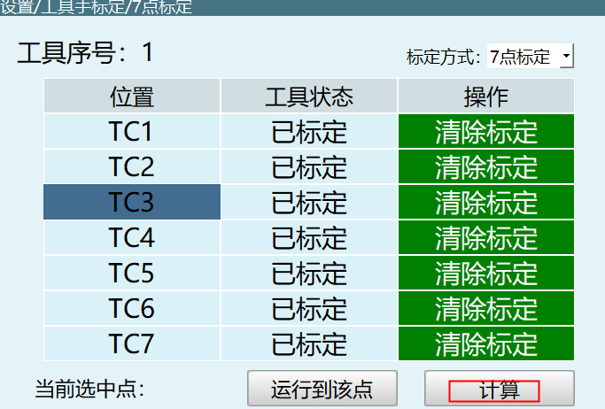

# 캘리브레이션

## 툴 핸드 캘리브레이션



### 0x3801 TOOLCALIBRATION_SET

툴 핸드 캘리브레이션 설정

**요청 파라미터:**

| 파라미터명 | 타입 | 설명 |
|--------|------|------|
| toolNum | int | 툴 핸드 번호 |
| calibrationPointNum | int | 6점 캘리브레이션 또는 7점 캘리브레이션 설정 |

```json
{
  "toolNum": 2,
  "calibrationPointNum": 6
}
```

---

### 0x3804 TOOLCALIBRATION_RESULT

캘리브레이션 계산 완료 응답

**응답 파라미터:**

| 파라미터명 | 타입 | 설명 |
|--------|------|------|
| result | bool | 계산 성공 여부 |

```json
{
  "result": true
}
```


---

### 0x3802 TOOLCALIBRATION_INQUIRE

캘리브레이션 포인트 데이터 조회

**요청 파라미터:**

| 파라미터명 | 타입 | 설명 |
|--------|------|------|
| pointNum | int | 인덱스 0~6 |
| toolNum | int | 툴 핸드 번호 |

```json
{
  "pointNum": 2,
  "toolNum": 1
}
```

---

### 0x3803 TOOLCALIBRATION_RESPOND

캘리브레이션 포인트 데이터 반환

**응답 파라미터:**

| 파라미터명 | 타입 | 설명 |
|--------|------|------|
| pointNum | int | 인덱스 0~6 |
| pos | array[6] | 위치 데이터 [x,y,z,rx,ry,rz] |

```json
{
  "pointNum": 2,
  "pos": [0, 0, 0, 0, 0, 0]
}
```

---

### 0x3815 TOOL_CALIBRATION_POINTS_STATUS_INQUIRE

캘리브레이션 상태 조회

**요청 파라미터:**

| 파라미터명 | 타입 | 설명 |
|--------|------|------|
| toolNum | int | 툴 핸드 번호 |

```json
{
  "toolNum": 2
}
```

---

### 0x3816 TOOL_CALIBRATION_POINTS_STATUS_RESPOND

캘리브레이션 상태 반환

**응답 파라미터:**

| 파라미터명 | 타입 | 설명 |
|--------|------|------|
| status | array[7] | 캘리브레이션 상태: 1=캘리브레이션 완료, 0=캘리브레이션 대기 |

```json
{
  "status": [1, 0, 1, 0, 1, 0, 1]
}
```

---

### 0x3817 TOOL_CALIBRATION_POINTS_STATUS_CLEAR

캘리브레이션 제거

**요청 파라미터:**

| 파라미터명 | 타입 | 설명 |
|--------|------|------|
| pointNum | int | 인덱스 0~6 |
| toolNum | int | 툴 핸드 번호 |

```json
{
  "pointNum": 2,
  "toolNum": 1
}
```


---

### 0x3805 TOOLPARAMETER_SET

툴 핸드 파라미터 설정

**요청 파라미터:**

| 파라미터명 | 타입 | 설명 |
|--------|------|------|
| tool.A | float | A축 회전 각도 |
| tool.B | float | B축 회전 각도 |
| tool.C | float | C축 회전 각도 |
| tool.note | string | 주석 |
| tool.payload_inertia | float | 부하 관성 |
| tool.payload_mass | float | 부하 질량 |
| tool.payload_mass_center_X | float | 부하 질량 중심 X |
| tool.payload_mass_center_Y | float | 부하 질량 중심 Y |
| tool.payload_mass_center_Z | float | 부하 질량 중심 Z |
| tool.x | float | X축 오프셋 |
| tool.y | float | Y축 오프셋 |
| tool.z | float | Z축 오프셋 |
| toolNum | int | 툴 핸드 번호 |

```json
{
  "tool": {
    "A": 3.0,
    "B": 3.0,
    "C": 3.0,
    "note": "",
    "payload_inertia": 5.0,
    "payload_mass": 4.0,
    "payload_mass_center_X": 6.0,
    "payload_mass_center_Y": 7.0,
    "payload_mass_center_Z": 8.0,
    "x": 1.0,
    "y": 2.0,
    "z": 3.0
  },
  "toolNum": 1
}
```

---

### 0x3806 TOOLPARAMETER_INQUIRE

툴 핸드 파라미터 조회

**요청 파라미터:**

| 파라미터명 | 타입 | 설명 |
|--------|------|------|
| toolNum | int | 툴 핸드 번호 |

```json
{
  "toolNum": 2
}
```

---

### 0x3807 TOOLPARAMETER_RESPOND

툴 핸드 파라미터 반환

응답 형식은 0x3805와 동일

---

### 0x380A TOOLNUMBER_SWITCH

툴 핸드 전환

**요청 파라미터:**

| 파라미터명 | 타입 | 설명 |
|--------|------|------|
| robot | int | 로봇 번호 1-4 |
| curToolNum | int | 현재 툴 핸드 번호 |

```json
{
  "robot": 1,
  "curToolNum": 2
}
```

---

### 0x380B TOOLNUMBER_INQUIRE

현재 툴 핸드 조회

**요청 파라미터:**

| 파라미터명 | 타입 | 설명 |
|--------|------|------|
| robot | int | 로봇 번호 1-4 |

```json
{
  "robot": 1
}
```

---

### 0x380C TOOLNUMBER_RESPOND

현재 툴 핸드 반환

**응답 파라미터:**

| 파라미터명 | 타입 | 설명 |
|--------|------|------|
| robot | int | 로봇 번호 1-4 |
| curToolNum | int | 현재 툴 핸드 번호 |

```json
{
  "robot": 1,
  "curToolNum": 2
}
```

---

### 0x3812 TOOL_CALIBRATION_POINTS_POS_INQUIRE

캘리브레이션 완료된 포인트 데이터 조회

**요청 파라미터:**

| 파라미터명 | 타입 | 설명 |
|--------|------|------|
| pointNum | int | 인덱스 0~6, 총 7개의 점 |
| toolNum | int | 툴 핸드 번호 |

```json
{
  "pointNum": 0,
  "toolNum": 1
}
```

---

### 0x3813 TOOL_CALIBRATION_POINTS_POS_RESPOND

캘리브레이션 완료된 포인트 데이터 반환

**응답 파라미터:**

| 파라미터명 | 타입 | 설명 |
|--------|------|------|
| pointNum | int | 인덱스 0~6 |
| pos | array[6] | 위치 데이터 [x,y,z,rx,ry,rz] |

```json
{
  "pointNum": 0,
  "pos": [0, 0, 0, 0, 0, 0]
}
```


---

## 사용자 좌표 보정

### 0x3C01 USERCALIBRATION_CALC

사용자 좌표 보정 설정

**요청 파라미터:**

| 파라미터명 | 타입 | 설명 |
|--------|------|------|
| userNum | int | 사용자 좌표 번호 |

```json
{
  "userNum": 1
}
```

---

### 0x3C02 USERCALIBRATION_RESULT

사용자 좌표 보정 결과 반환

**응답 파라미터:**

| 파라미터명 | 타입 | 설명 |
|--------|------|------|
| result | bool | true=캘리브레이션 성공, false=캘리브레이션 실패 |
| status.O | bool | O점 상태 |
| status.X | bool | X점 상태 |
| status.Y | bool | Y점 상태 |

```json
{
  "result": true,
  "status": {
    "O": false,
    "X": false,
    "Y": false
  }
}
```

---

### 0x3C03 USERCALIBRATION_RECORD

사용자 원점, X, Y 값 마킹

**요청 파라미터:**

| 파라미터명 | 타입 | 설명 |
|--------|------|------|
| userNum | int | 사용자 좌표 번호 |
| inquire | string | 값 "O", "X", "Y" 또는 "OXY" |
| posZero | array[6] | 원점 마킹(라디안), inquire가 "OXY"일 때 존재 |
| posX | array[6] | X값 마킹(라디안), inquire가 "OXY"일 때 존재 |
| posY | array[6] | Y값 마킹(라디안), inquire가 "OXY"일 때 존재 |

```json
{
  "userNum": 1,
  "inquire": "X",
  "posZero": [0.0, 0.0, 0.0, 0.0, 0.0, 0.0],
  "posX": [0.0, 0.0, 0.0, 0.0, 0.0, 0.0],
  "posY": [0.0, 0.0, 0.0, 0.0, 0.0, 0.0]
}
```

---

### 0x3C04 USERCALIBRATION_RECORD_RESPOND

마킹 결과 응답

**응답 파라미터:**

| 파라미터명 | 타입 | 설명 |
|--------|------|------|
| userNum | int | 사용자 좌표 번호 |
| inquire | string | 값 "O", "X", "Y" |
| status | bool | 상태 |
| pos | array[6] | 라디안 위치 데이터 |
| posDeg | array[6] | 각도 위치 데이터 |

```json
{
  "userNum": 1,
  "inquire": "X",
  "status": true,
  "pos": [0, 0, 0, 0, 0, 0],
  "posDeg": [0, 0, 0, 0, 0, 0]
}
```


---

### 0x3C07 USERPARAMETER_SET

사용자 좌표 설정

**요청 파라미터:**

| 파라미터명 | 타입 | 설명 |
|--------|------|------|
| pos | array[6] | 사용자 좌표 위치 [x,y,z,rx,ry,rz] |
| userNum | int | 사용자 좌표 번호 |

```json
{
  "pos": [460.0, 0.0, 637.0, 0.0, 3.10, 3.0],
  "userNum": 1
}
```

---

### 0x3C08 USERPOSDATA_INQUIRE

사용자 좌표 조회

**요청 파라미터:**

| 파라미터명 | 타입 | 설명 |
|--------|------|------|
| userNum | int | 사용자 좌표 번호 |
| inquire | string | 조회 타입: "Calibration", "O", "X", "Y" |

```json
{
  "userNum": 1,
  "inquire": "Calibration"
}
```

---

### 0x3C09 USERPOSDATA_RESPOND

사용자 좌표 조회 응답

**응답 파라미터:**

| 파라미터명 | 타입 | 설명 |
|--------|------|------|
| userNum | int | 사용자 좌표 번호 |
| inquire | string | 조회 타입 |
| status | bool | 상태 |
| pos | array[6] | 라디안 위치 데이터 |
| posDeg | array[6] | 각도 위치 데이터 |

```json
{
  "userNum": 1,
  "inquire": "Calibration",
  "status": false,
  "pos": [0, 0, 0, 0, 0, 0],
  "posDeg": [0, 0, 0, 0, 0, 0]
}
```

---

### 0x3C0A USERCOORDINATE_SWITCH

사용자 좌표 번호 설정

**요청 파라미터:**

| 파라미터명 | 타입 | 설명 |
|--------|------|------|
| robot | int | 로봇 번호 1-4 |
| userNum | int | 사용자 좌표 번호 |

```json
{
  "robot": 1,
  "userNum": 1
}
```

---

### 0x3C0B USERCOORDINATE_INQUIRE

사용자 좌표 번호 조회

**요청 파라미터:**

| 파라미터명 | 타입 | 설명 |
|--------|------|------|
| robot | int | 로봇 번호 1-4 |

```json
{
  "robot": 1
}
```

---

### 0x3C0C USERCOORDINATE_RESPOND

사용자 좌표 번호 조회 응답

**응답 파라미터:**

| 파라미터명 | 타입 | 설명 |
|--------|------|------|
| robot | int | 로봇 번호 1-4 |
| curUserNum | int | 현재 사용자 좌표 번호 |

```json
{
  "robot": 1,
  "curUserNum": 1
}
```

---

### 0x3C0D USERANNOTATION_SET

사용자 주석 설정

**요청 파라미터:**

| 파라미터명 | 타입 | 설명 |
|--------|------|------|
| note | string | 주석 내용 |
| userNum | int | 사용자 좌표 번호 |

```json
{
  "note": "나보터",
  "userNum": 1
}
```

---

### 0x3C0E USERANNOTATION_INQUIRE

사용자 주석 조회

**요청 파라미터:**

| 파라미터명 | 타입 | 설명 |
|--------|------|------|
| userNum | int | 사용자 좌표 번호 |

```json
{
  "userNum": 1
}
```

---

### 0x3C0F USERANNOTATION_RESPOND

사용자 주석 조회 응답

응답 형식은 0x3C0D와 동일


---

## 20점 캘리브레이션

### 0x7101 CALIBRATION_20POINTS_SET

20점 캘리브레이션 완료, 캘리브레이션 데이터 전송

**요청 파라미터:**

| 파라미터명 | 타입 | 설명 |
|--------|------|------|
| calNum | int | 캘리브레이션 번호(현재 기본값) |
| noCalZero | bool | 20점 영점 캘리브레이션 안 함 |

```json
{
  "calNum": 1,
  "noCalZero": true
}
```

---

### 0x7102 CALIBRATION_20POINTS_INQUIRE

캘리브레이션 포인트 데이터 클릭

**요청 파라미터:**

| 파라미터명 | 타입 | 설명 |
|--------|------|------|
| toolNum | int | 툴 핸드 좌표계 1-3 |
| pointNum | int | 값 0~19, 총 20개 점 |

```json
{
  "toolNum": 1,
  "pointNum": 0
}
```

---

### 0x7103 CALIBRATION_20POINTS_RESPOND

캘리브레이션 포인트 데이터 반환

**응답 파라미터:**

| 파라미터명 | 타입 | 설명 |
|--------|------|------|
| pointNum | int | 값 0~19, 총 20개 점 |
| pos | array[6] | 포인트 데이터 [x,y,z,rx,ry,rz] |

```json
{
  "pointNum": 0,
  "pos": [0, 0, 0, 0, 0, 0]
}
```

---

### 0x7104 CALIBRATION_20POINTS_RESULT

캘리브레이션 계산 완료

**응답 파라미터:**

| 파라미터명 | 타입 | 설명 |
|--------|------|------|
| result | bool | 계산 정확 여부 |
| distance | float | 계산 거리 값 |

```json
{
  "result": true,
  "distance": 2.04
}
```


---

### 0x7105 CALIBRATION_20POINTS_RESULT_APPLY

캘리브레이션 결과를 툴 핸드로 설정

**요청 파라미터:**

| 파라미터명 | 타입 | 설명 |
|--------|------|------|
| toolNum | int | 툴 핸드 좌표계 1-3 |

```json
{
  "toolNum": 1
}
```

---

### 0x7106 CALIBRATION_20POINTS_RESULT_APPLY_OK

설정 성공 응답

**응답 파라미터:**

| 파라미터명 | 타입 | 설명 |
|--------|------|------|
| apply | bool | 설정 성공 여부 |

```json
{
  "apply": true
}
```

---

### 0x7107 CALIBRATION_20POINTS_STATUS_INQUIRE

캘리브레이션 포인트 상태 조회

**요청 파라미터:**

| 파라미터명 | 타입 | 설명 |
|--------|------|------|
| calNum | int | 툴 핸드 번호 |

```json
{
  "calNum": 1
}
```

> 주의: 저수준은 캘리브레이션 포인트 상태를 공유하며, 툴 핸드 번호를 구분하지 않음

---

### 0x7108 CALIBRATION_20POINTS_STATUS_RESPOND

캘리브레이션 포인트 상태 반환

**응답 파라미터:**

| 파라미터명 | 타입 | 설명 |
|--------|------|------|
| status | array[20] | 캘리브레이션 포인트 상태: 1=캘리브레이션 완료, 0=캘리브레이션 미완료 |

```json
{
  "status": [0, 0, 0, 0, 0, 0, 0, 0, 0, 0, 0, 0, 0, 0, 0, 0, 0, 0, 0, 0]
}
```

---

### 0x7109 CALIBRATION_20POINTS_STATUS_CLEAR

캘리브레이션 상태 제거

**요청 파라미터:**

| 파라미터명 | 타입 | 설명 |
|--------|------|------|
| pointNum | int | 값: 0-19 단일 점, 20=모든 점 |

```json
{
  "pointNum": 0
}
```

---

### 0x710a CALIBRATION_20POINTS_POS_INQUIRE

캘리브레이션 완료된 포인트 데이터 조회

**요청 파라미터:**

| 파라미터명 | 타입 | 설명 |
|--------|------|------|
| pointNum | int | 값 0~19, 총 20개 점 |

```json
{
  "pointNum": 0
}
```

---

### 0x710b CALIBRATION_20POINTS_POS_RESPOND

캘리브레이션 완료된 포인트 데이터 반환

**응답 파라미터:**

| 파라미터명 | 타입 | 설명 |
|--------|------|------|
| pointNum | int | 값 0~19, 총 20개 점 |
| pos | array[6] | 포인트 데이터 [x,y,z,rx,ry,rz] |

```json
{
  "pointNum": 0,
  "pos": [0, 0, 0, 0, 0, 0]
}
```

---

### 0x710c CALIBRATION_20POINTS_POS_RUN

캘리브레이션 포인트로 이동(현재 미공개)

**요청 파라미터:**

| 파라미터명 | 타입 | 설명 |
|--------|------|------|
| robot | int | 로봇 번호 |

```json
{
  "robot": 1
}
```

---

### 0x710d CALIBRATION_20POINTS_CANCALIBRATION_INQUIRE

캘리브레이션 인터페이스 열기 가능 여부 조회

요청 파라미터 없음

---

### 0x710e CALIBRATION_20POINTS_CANCALIBRATION_RESPOND

캘리브레이션 인터페이스 열기 가능 여부

**응답 파라미터:**

| 파라미터명 | 타입 | 설명 |
|--------|------|------|
| canCalibration | bool | 열기 가능 여부 |

```json
{
  "canCalibration": true
}
```


---

## 4점 캘리브레이션(SCARA)

### 0x7201 CALIBRATION_4POINTS_SET

거리 입력값 설정, 계산 후 결과 반환

**요청 파라미터:**

| 파라미터명 | 타입 | 설명 |
|--------|------|------|
| ParamOf4Points | array[2] | L1, L2 로드 길이 |

```json
{
  "ParamOf4Points": [0, 0]
}
```

---

### 0x7202 CALIBRATION_4POINTS_INQUIRE

캘리브레이션 버튼 클릭

**요청 파라미터:**

| 파라미터명 | 타입 | 설명 |
|--------|------|------|
| pointNum | int | 값 0~3, 총 4개의 점 |
| status | int | 1=마킹 완료, 0=마킹 미완료 |

```json
{
  "pointNum": 0,
  "status": 1
}
```

---

### 0x7203 CALIBRATION_4POINTS_RESPOND

캘리브레이션 포인트 데이터 반환

**응답 파라미터:**

| 파라미터명 | 타입 | 설명 |
|--------|------|------|
| pointNum | int | 값 0~3, 총 4개의 점 |
| pos | array[6] | 포인트 데이터 [x,y,z,rx,ry,rz] |

```json
{
  "pointNum": 0,
  "pos": [0, 0, 0, 0, 0, 0]
}
```

---

### 0x7204 CALIBRATION_4POINTS_RESULT

계산 완료

**응답 파라미터:**

| 파라미터명 | 타입 | 설명 |
|--------|------|------|
| result | bool | 계산 결과 |
| length | array[2] | 길이 [L1, L2] |
| dtheta | array[2] | 오프셋 각도 |

```json
{
  "result": true,
  "length": [0, 0],
  "dtheta": [0, 0]
}
```

---

### 0x7205 CALIBRATION_4POINTS_RESULT_APPLY

결과를 DH 파라미터에 채우기

요청 파라미터 없음

---

### 0x7206 CALIBRATION_4POINTS_RESULT_APPLY_OK

설정 성공 응답

**응답 파라미터:**

| 파라미터명 | 타입 | 설명 |
|--------|------|------|
| apply | bool | 설정 성공 여부 |

```json
{
  "apply": true
}
```

---

### 0x7207 CALIBRATION_4POINTS_STATUS_INQUIRE

4점 캘리브레이션 포인트 상태 조회

요청 파라미터 없음

---

### 0x7208 CALIBRATION_4POINTS_STATUS_RESPOND

4점 캘리브레이션 상태 반환

**응답 파라미터:**

| 파라미터명 | 타입 | 설명 |
|--------|------|------|
| result | bool | 계산 결과 |
| status | array[4] | 캘리브레이션 포인트 상태: 1=캘리브레이션 완료, 0=캘리브레이션 미완료 |
| length | array[2] | 길이 [L1, L2] |
| dtheta | array[2] | 오프셋 각도 |

```json
{
  "result": true,
  "status": [0, 0, 0, 0],
  "length": [0, 0],
  "dtheta": [0, 0]
}
```
