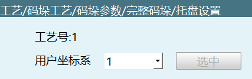
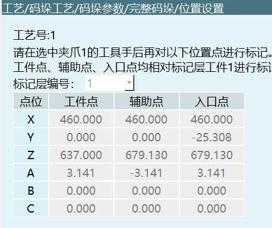
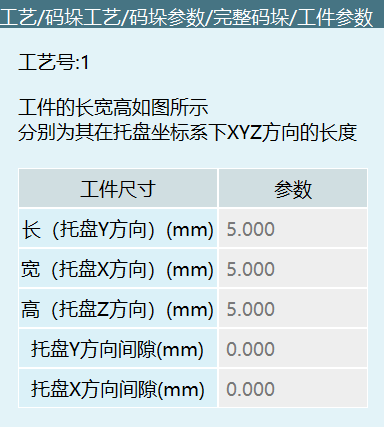
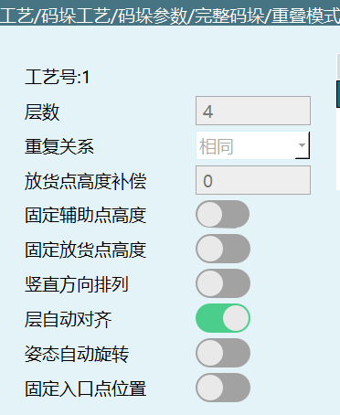
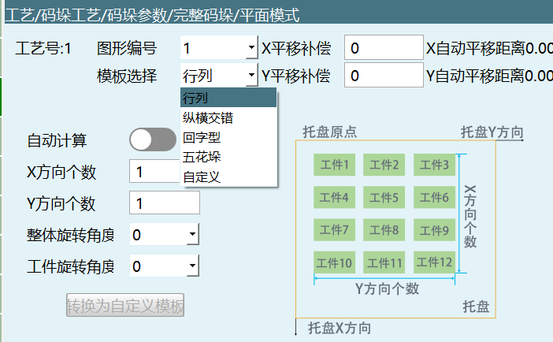
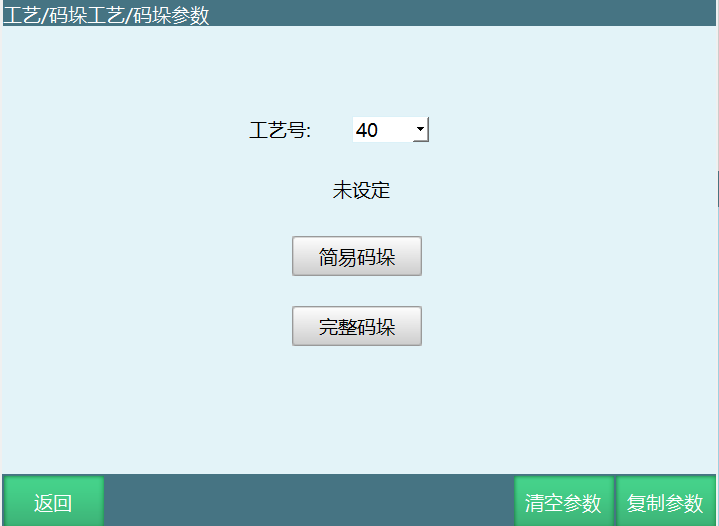
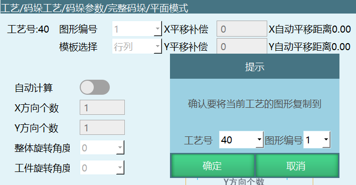
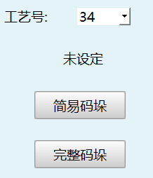
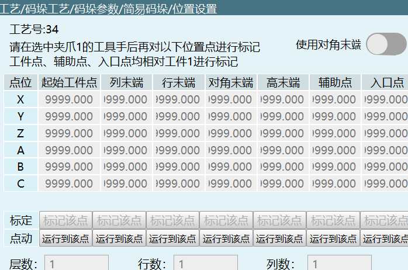
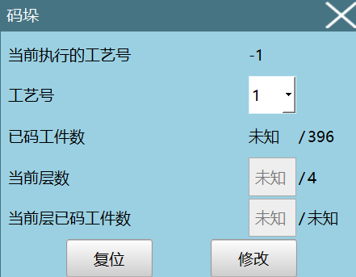

# 팔레타이징 프로세스

## 완전 팔레타이징

### 그리퍼 매개변수 설정


**0x4201 PAL_GRIPPER_PARM_SET**

| 매개변수명 | 유형 | 필수 | 설명 |
|--------|------|------|------|
| robot | int | 예 | 로봇 번호 |
| craftID | int | 예 | 프로세스 번호 |
| gripperNum | int | 아니오 | 그리퍼 개수, 범위 1~4 |
| gripper | array | 아니오 | 그리퍼 도구 번호 배열, 범위 1~9 |

```json
{
    "robot": 1,
    "craftID": 1,
    "pallet": {
        "gripperNum": 2,
        "gripper": [1, 3, 4, 0]
    }
}
```

### 그리퍼 매개변수 조회

**0x4202 PAL_GRIPPER_PARM_INQUIRE**

| 매개변수명 | 유형 | 필수 | 설명 |
|--------|------|------|------|
| robot | int | 예 | 로봇 번호 |
| craftID | int | 예 | 프로세스 번호 |

```json
{
    "robot": 1,
    "craftID": 1
}
```

### 그리퍼 매개변수 반환

**0x4203 PAL_GRIPPER_PARM_RESPOND**

| 매개변수명 | 유형 | 설명 |
|--------|------|------|
| robot | int | 로봇 번호 |
| craftID | int | 프로세스 번호 |
| gripperNum | int | 그리퍼 개수, 범위 1~4 |
| gripper | array | 그리퍼 도구 번호 배열, 범위 1~9 |

```json
{
    "robot": 1,
    "craftID": 1,
    "pallet": {
        "gripperNum": 2,
        "gripper": [1, 3, 4, 0]
    }
}
```

### 팔레트 매개변수 설정



**0x4204 PAL_PALLET_PARM_SET**

| 매개변수명 | 유형 | 필수 | 설명 |
|--------|------|------|------|
| robot | int | 예 | 로봇 번호 |
| craftID | int | 예 | 프로세스 번호 |
| userNum | int | 예 | 사용자 번호 |

```json
{
    "robot": 1,
    "craftID": 1,
    "pallet": {
        "userNum": 1
    }
}
```

### 팔레트 매개변수 조회

**0x4205 PAL_PALLET_PARM_INQUIRE**

| 매개변수명 | 유형 | 필수 | 설명 |
|--------|------|------|------|
| robot | int | 예 | 로봇 번호 |
| craftID | int | 예 | 프로세스 번호 |

```json
{
    "robot": 1,
    "craftID": 1
}
```

### 팔레트 매개변수 반환

**0x4206 PAL_PALLET_PARM_RESPOND**

| 매개변수명 | 유형 | 설명 |
|--------|------|------|
| robot | int | 로봇 번호 |
| craftID | int | 프로세스 번호 |
| userNum | int | 사용자 번호 |

```json
{
    "robot": 1,
    "craftID": 1,
    "pallet": {
        "userNum": 1
    }
}
```

### 위치 매개변수 설정



**0x4207 PAL_POS_PARM_SET**

| 매개변수명 | 유형 | 필수 | 설명 |
|--------|------|------|------|
| robot | int | 예 | 로봇 번호 |
| craftID | int | 예 | 프로세스 번호 |
| enterPos | array | 예 | 진입점, 6개의 double 값 |
| floorNum | int | 아니오 | 레이어 번호 표시 |
| shiftPos | array | 아니오 | 보조점, 6개의 double 값 |
| realPos | array | 아니오 | 공작물점, 6개의 double 값 |

```json
{
    "robot": 1,
    "craftID": 1,
    "pallet": {
        "enterPos": [0, 1.1, 222, 3.14159, 0, 0.008],
        "floorNum": 1,
        "shiftPos": [0, 1.1, 222, 3.14159, 0, 0.008],
        "realPos": [0, 1.1, 222, 3.14159, 0, 0.008]
    }
}
```

### 위치 매개변수 조회

**0x4208 PAL_POS_PARM_INQUIRE**

| 매개변수명 | 유형 | 필수 | 설명 |
|--------|------|------|------|
| robot | int | 예 | 로봇 번호 |
| craftID | int | 예 | 프로세스 번호 |

```json
{
    "robot": 1,
    "craftID": 1
}
```

### 위치 매개변수 반환

**0x4209 PAL_POS_PARM_RESPOND**

반환 데이터는 0x4207과 동일합니다.

### 공작물 매개변수 설정



**0x420A PAL_WORKPIECE_PARM_SET**

| 매개변수명 | 유형 | 필수 | 설명 |
|--------|------|------|------|
| robot | int | 예 | 로봇 번호 |
| craftID | int | 예 | 프로세스 번호 |
| workpieceLength | double | 아니오 | 공작물 길이 |
| workpieceWidth | double | 아니오 | 공작물 너비 |
| workpieceHeight | double | 아니오 | 공작물 높이 |
| workpieceGapX | double | 아니오 | X 방향 간격 |
| workpieceGapY | double | 아니오 | Y 방향 간격 |

```json
{
    "robot": 1,
    "craftID": 2,
    "pallet": {
        "workpieceLength": 1,
        "workpieceWidth": 2,
        "workpieceHeight": 3,
        "workpieceGapX": 4,
        "workpieceGapY": 5
    }
}
```

### 공작물 매개변수 조회

**0x420B PAL_WORKPIECE_PARM_INQUIRE**

| 매개변수명 | 유형 | 필수 | 설명 |
|--------|------|------|------|
| robot | int | 예 | 로봇 번호 |
| craftID | int | 예 | 프로세스 번호 |

```json
{
    "robot": 1,
    "craftID": 1
}
```

### 공작물 매개변수 반환

**0x420C PAL_WORKPIECE_PARM_RESPOND**

반환 데이터는 0x420A와 동일합니다.

### 접근 매개변수 설정 (2207 티치에는 이 기능 없음)

**0x420D PAL_APPRO_PARM_SET**

| 매개변수명 | 유형 | 필수 | 설명 |
|--------|------|------|------|
| robot | int | 예 | 로봇 번호 |
| craftID | int | 예 | 프로세스 번호 |
| workpieceApproEnable | bool | 아니오 | 접근 활성화 여부 |
| workpieceApproMode | int | 아니오 | 접근 모드: 0-하강 접근, 1-접근 후 하강 |
| workpieceApproLenX | double | 아니오 | X 방향 접근 길이 |
| workpieceApproLenY | double | 아니오 | Y 방향 접근 길이 |
| workpieceApproLenZ | double | 아니오 | Z 방향 접근 길이 |

```json
{
    "robot": 1,
    "craftID": 1,
    "pallet": {
        "workpieceApproEnable": false,
        "workpieceApproMode": 0,
        "workpieceApproLenX": 0,
        "workpieceApproLenY": 0,
        "workpieceApproLenZ": 0
    }
}
```

### 접근 매개변수 조회

**0x420E PAL_APPRO_PARM_INQUIRE**

| 매개변수명 | 유형 | 필수 | 설명 |
|--------|------|------|------|
| robot | int | 예 | 로봇 번호 |
| craftID | int | 예 | 프로세스 번호 |

```json
{
    "robot": 1,
    "craftID": 1
}
```

### 접근 매개변수 반환

**0x420F PAL_APPRO_PARM_RESPOND**

반환 데이터는 0x420D와 동일합니다.

### 겹침 모드 매개변수 설정



**0x4210 PAL_OVERLAP_PARM_SET**

| 매개변수명 | 유형 | 필수 | 설명 |
|--------|------|------|------|
| robot | int | 예 | 로봇 번호 |
| craftID | int | 예 | 프로세스 번호 |
| floorSum | int | 아니오 | 레이어 수 |
| overlapType | int | 아니오 | 겹침 유형: 0-동일, 1-교대, 2-사용자 정의 |
| layHeightOffset | double | 아니오 | 적재점 높이 보정 |
| fixedLayHeight | bool | 아니오 | 적재점 높이 고정 |
| fixedSupHeight | bool | 아니오 | 보조점 높이 고정 |
| columnLay | bool | 아니오 | 수직 방향 정렬 |
| floorAutoJustified | bool | 아니오 | 레이어 자동 정렬 |
| poseAutorotation | bool | 아니오 | 자세 자동 회전 |
| fixedEnterPoint | bool | 아니오 | 진입점 위치 고정 |
| graphicNum | array | 아니오 | 그래픽 번호 |
| heightRevise | array | 아니오 | 높이 수정 |

```json
{
    "robot": 1,
    "craftID": 1,
    "pallet": {
        "floorSum": 1,
        "overlapType": 0,
        "layHeightOffset": 0.0,
        "fixedLayHeight": false,
        "fixedSupHeight": false,
        "columnLay": false,
        "floorAutoJustified": false,
        "poseAutorotation": false,
        "fixedEnterPoint": false,
        "graphicNum": [1, 2, 1, 2],
        "heightRevise": [1.1, -2.2]
    }
}
```

### 겹침 모드 매개변수 조회

**0x4211 PAL_OVERLAP_PARM_INQUIRE**

| 매개변수명 | 유형 | 필수 | 설명 |
|--------|------|------|------|
| robot | int | 예 | 로봇 번호 |
| craftID | int | 예 | 프로세스 번호 |

```json
{
    "robot": 1,
    "craftID": 1
}
```

### 겹침 모드 매개변수 반환

**0x4212 PAL_OVERLAP_PARM_RESPOND**

반환 데이터는 0x4210과 동일합니다.

### 평면 모드 매개변수 설정



**0x4213 PAL_PLANE_PARM_SET**

#### 행렬 모드

| 매개변수명 | 유형 | 필수 | 설명 |
|--------|------|------|------|
| robot | int | 예 | 로봇 번호 |
| craftID | int | 예 | 프로세스 번호 |
| graphic | int | 예 | 그래픽 번호 |
| graphicType | int | 예 | 그래픽 유형: 0-행렬, 1-지그재그, 2-회자형, 3-오방적재, 4-사용자 정의 |
| autoCalculate | bool | 아니오 | 자동 계산 |
| numX | double | 아니오 | X 방향 개수 |
| numY | double | 아니오 | Y 방향 개수 |
| rotationAngleSingle | double | 아니오 | 공작물 회전 각도 |
| rotationAngleWhole | double | 아니오 | 전체 회전 각도 |
| transLenX | double | 아니오 | X 평행 이동 보정 |
| transLenY | double | 아니오 | Y 평행 이동 보정 |

```json
{
    "craftID": 2,
    "graphic": 1,
    "pallet": {
        "graphicType": 0,
        "ranks": {
            "autoCalculate": true,
            "numX": 1.0,
            "numY": 1.0,
            "rotationAngleSingle": 180.0,
            "rotationAngleWhole": 90.0
        },
        "transLenX": 2.0,
        "transLenY": 3.0
    },
    "robot": 1
}
```

#### 지그재그 모드

```json
{
    "craftID": 2,
    "graphic": 1,
    "pallet": {
        "graphicType": 1,
        "intertwining": {
            "numX": 3.0,
            "numY": 3.0,
            "rotationAngleSingle": -90.0,
            "rotationAngleWhole": 90.0
        },
        "transLenX": 0.0,
        "transLenY": 0.0
    },
    "robot": 1
}
```

#### 회자형 모드

```json
{
    "craftID": 2,
    "graphic": 1,
    "pallet": {
        "gearType": {
            "rotationAngleSingle": -90.0,
            "rotationAngleWhole": 180.0
        },
        "graphicType": 2,
        "transLenX": 0.0,
        "transLenY": 0.0
    },
    "robot": 1
}
```

#### 오방적재 모드

```json
{
    "craftID": 2,
    "graphic": 1,
    "pallet": {
        "graphicType": 3,
        "transLenX": 0.0,
        "transLenY": 0.0,
        "wideType": {
            "A_C_columns": 5.0,
            "A_rows": 1.0,
            "B_columns": 3.0,
            "B_rows": 2.0,
            "C_rows": 4.0,
            "rotationAngleSingle": 180.0,
            "rotationAngleWhole": 90.0
        }
    },
    "robot": 1
}
```

#### 사용자 정의 모드

| 매개변수명 | 유형 | 필수 | 설명 |
|--------|------|------|------|
| robot | int | 예 | 로봇 번호 |
| craftID | int | 예 | 프로세스 번호 |
| graphic | int | 예 | 그래픽 번호 |
| graphicType | int | 예 | 그래픽 유형 (4-사용자 정의) |
| transLenX | double | 아니오 | X 평행 이동 보정 |
| transLenY | double | 아니오 | Y 평행 이동 보정 |
| count | int | 예 | 레이어 공작물 수 |
| sum | int | 예 | 레이어 공작물 총수 |
| start | int | 예 | 시작 번호 |
| eachVec | array | 예 | 각 레이어 데이터 |

```json
{
    "craftID": 1,
    "graphic": 1,
    "pallet": {
        "custom": {
            "count": 2,
            "eachVec": [
                {
                    "X": 1.0,
                    "Y": 2.0,
                    "dir": 0,
                    "h": 4.0,
                    "t": 3.0
                },
                {
                    "X": 5.0,
                    "Y": 6.0,
                    "dir": 0,
                    "h": 8.0,
                    "t": 7.0
                }
            ],
            "start": 1,
            "sum": 2
        },
        "graphicType": 4,
        "transLenX": 11.0,
        "transLenY": 22.0
    },
    "robot": 1
}
```

### 평면 모드 매개변수 조회

**0x4214 PAL_PLANE_PARM_INQUIRE**

| 매개변수명 | 유형 | 필수 | 설명 |
|--------|------|------|------|
| robot | int | 예 | 로봇 번호 |
| craftID | int | 예 | 프로세스 번호 |
| graphic | int | 예 | 그래픽 번호 |

```json
{
    "robot": 1,
    "craftID": 1,
    "graphic": 1
}
```

### 평면 모드 매개변수 반환

**0x4215 PAL_PLANE_PARM_RESPOND**

반환 데이터는 0x4213과 동일합니다.

### 평면 모드 사용자 정의 템플릿으로 변환 요청

**0x4216 PAL_PLANE_CUSTOM_TRANS_INQUIRE**

| 매개변수명 | 유형 | 필수 | 설명 |
|--------|------|------|------|
| robot | int | 예 | 로봇 번호 |
| craftID | int | 예 | 프로세스 번호 |
| graphic | int | 예 | 그래픽 번호 |

```json
{
    "robot": 1,
    "craftID": 1,
    "graphic": 1
}
```

### 평면 모드 사용자 정의 템플릿 변환 후 대응 매개변수 반환

**0x4217 PAL_PLANE_CUSTOM_TRANS_RESPOND**

| 매개변수명 | 유형 | 설명 |
|--------|------|------|
| robot | int | 로봇 번호 |
| craftID | int | 프로세스 번호 |
| graphic | int | 그래픽 번호 |
| graphicType | int | 그래픽 유형 (여기서는 3만 가능) |
| transLenX | double | X 평행 이동 보정 |
| transLenY | double | Y 평행 이동 보정 |
| autoTransLenX | double | X 자동 평행 이동 거리 |
| autoTransLenY | double | Y 자동 평행 이동 거리 |
| sum | int | 공작물 총수 |
| start | int | 시작 번호 |
| count | int | 현재 레이어 공작물 수 |
| eachVec | array | 공작물 위치 배열 |

```json
{
    "robot": 1,
    "craftID": 1,
    "graphic": 1,
    "pallet": {
        "graphicType": 3,
        "transLenX": 2.2,
        "transLenY": -3.3,
        "autoTransLenX": 4.4,
        "autoTransLenY": 5.5,
        "custom": {
            "sum": 20,
            "start": 1,
            "count": 10,
            "eachVec": [
                {"X": 0, "Y": 0, "t": 0, "dir": 0, "h": 0},
                {"X": 0, "Y": 0, "t": 0, "dir": 0, "h": 0},
                {"X": 0, "Y": 0, "t": 0, "dir": 0, "h": 0}
            ]
        }
    }
}
```

### 평면 모드 미리보기 요청

**0x4218 PAL_PLANE_PREVIEW_INQUIRE**

| 매개변수명 | 유형 | 필수 | 설명 |
|--------|------|------|------|
| robot | int | 예 | 로봇 번호 |
| craftID | int | 예 | 프로세스 번호 |
| graphic | int | 예 | 그래픽 번호 |

```json
{
    "robot": 1,
    "craftID": 1,
    "graphic": 1
}
```

### 평면 모드 미리보기 매개변수 반환

**0x4219 PAL_PLANE_PREVIEW_RESPOND**

| 매개변수명 | 유형 | 설명 |
|--------|------|------|
| robot | int | 로봇 번호 |
| craftID | int | 프로세스 번호 |
| graphic | int | 그래픽 번호 |
| workpieceLength | double | 공작물 길이 |
| workpieceWidth | double | 공작물 너비 |
| sum | int | 공작물 총수 |
| start | int | 시작 번호 |
| count | int | 현재 레이어 공작물 수 |
| eachVec | array | 공작물 위치 배열 |

```json
{
    "robot": 1,
    "craftID": 1,
    "graphic": 1,
    "pallet": {
        "workpieceLength": 1,
        "workpieceWidth": 1,
        "sum": 20,
        "start": 1,
        "count": 10,
        "eachVec": [
            {"X": 0, "Y": 0, "t": 0},
            {"X": 0, "Y": 0, "t": 0},
            {"X": 0, "Y": 0, "t": 0}
        ]
    }
}
```

### 완전 팔레타이징 평면 모드 자동 계산 결과 조회

**0x422A PAL_AUTO_CALCULATE_INQUIRE**

| 매개변수명 | 유형 | 필수 | 설명 |
|--------|------|------|------|
| robot | int | 예 | 로봇 번호 |
| craftID | int | 예 | 프로세스 번호 |

```json
{
    "robot": 1,
    "craftID": 1
}
```

### 자동 계산 결과 반환

**0x422B PAL_AUTO_CALCULATE_RESPOND**

| 매개변수명 | 유형 | 설명 |
|--------|------|------|
| numX | double | X 방향 개수 |
| numY | double | Y 방향 개수 |

```json
{
    "pallet": {
        "ranks": {
            "numX": 0,
            "numY": 0
        }
    }
}
```

### 팔레타이징 상태 설정


**0x421A PAL_STATE_SET**

| 매개변수명 | 유형 | 필수 | 설명 |
|--------|------|------|------|
| robot | int | 예 | 로봇 번호 |
| craftID | int | 예 | 프로세스 번호 |
| curLayerNum | int | 아니오 | 현재 레이어 번호 |
| curLayerPalletedWpNum | int | 아니오 | 현재 레이어 적재 완료된 공작물 수 |

```json
{
    "robot": 1,
    "craftID": 1,
    "pallet": {
        "curLayerNum": 1,
        "curLayerPalletedWpNum": 5
    }
}
```

### 팔레타이징 상태 조회

**0x421B PAL_STATE_INQUIRE**

| 매개변수명 | 유형 | 필수 | 설명 |
|--------|------|------|------|
| robot | int | 예 | 로봇 번호 |
| craftID | int | 예 | 프로세스 번호 |

```json
{
    "robot": 1,
    "craftID": 1
}
```

### 팔레타이징 상태 반환

**0x421C PAL_STATE_RESPOND**

| 매개변수명 | 유형 | 설명 |
|--------|------|------|
| robot | int | 로봇 번호 |
| craftID | int | 프로세스 번호 |
| totalWpNum | int | 총 공작물 수 |
| totalLayerNum | int | 총 레이어 수 |
| curPalletedWpSum | int | 현재까지 적재된 총 공작물 수 |
| curLayerNum | int | 현재 레이어 번호 |
| curLayerPalletedWpNum | int | 현재 레이어 적재 완료된 공작물 수 |
| curLayerWpSum | int | 현재 레이어 총 공작물 수 |

```json
{
    "robot": 1,
    "craftID": 1,
    "pallet": {
        "totalWpNum": 20,
        "totalLayerNum": 2,
        "curPalletedWpSum": 5,
        "curLayerNum": 1,
        "curLayerPalletedWpNum": 5,
        "curLayerWpSum": 10
    }
}
```

### 팔레타이징 매개변수 복사



**0x421D PAL_PARM_COPY**

| 매개변수명 | 유형 | 필수 | 설명 |
|--------|------|------|------|
| robot | int | 예 | 로봇 번호 |
| craftID_source | int | 예 | 소스 프로세스 번호 |
| craftID_target | int | 예 | 대상 프로세스 번호 |

```json
{
    "robot": 1,
    "craftID_source": 1,
    "craftID_target": 2
}
```

### 팔레타이징 매개변수 비우기

**0x421E PAL_PARM_CLEAR**

| 매개변수명 | 유형 | 필수 | 설명 |
|--------|------|------|------|
| robot | int | 예 | 로봇 번호 |
| craftID | int | 예 | 프로세스 번호 |

```json
{
    "robot": 1,
    "craftID": 1
}
```

### 레이어 그래픽 매개변수 복사



**0x421F PAL_GRAPHIC_COPY**

| 매개변수명 | 유형 | 필수 | 설명 |
|--------|------|------|------|
| robot | int | 예 | 로봇 번호 |
| craftID_source | int | 예 | 소스 프로세스 번호 |
| craftID_target | int | 예 | 대상 프로세스 번호 |
| graphic_source | int | 예 | 소스 그래픽 번호 |
| graphic_target | int | 예 | 대상 그래픽 번호 |

```json
{
    "craftID_source": 1,
    "craftID_target": 1,
    "graphic_source": 1,
    "graphic_target": 2,
    "robot": 1
}
```

### 팔레타이징 유형 전환



**0x4221 PAL_SIMPLE_SWTICH**

| 매개변수명 | 유형 | 필수 | 설명 |
|--------|------|------|------|
| robot | int | 예 | 로봇 번호 |
| craftID | int | 예 | 프로세스 번호 |
| usePalletType | int | 예 | 팔레타이징 유형: 0-간이, 1-완전, 2-미정의 |

```json
{
    "robot": 1,
    "craftID": 1,
    "usePalletType": 0
}
```

### 현재 사용 중인 팔레타이징 유형 조회

**0x4222 PAL_IS_SIMPLE_INQUIRE**

| 매개변수명 | 유형 | 필수 | 설명 |
|--------|------|------|------|
| robot | int | 예 | 로봇 번호 |
| craftID | int | 예 | 프로세스 번호 |

```json
{
    "robot": 1,
    "craftID": 1
}
```

### 팔레타이징 유형 반환

**0x4223 PAL_IS_SIMPLE_RESPOND**

반환 데이터는 0x4221과 동일합니다.

## 간이 팔레타이징



### 간이 팔레타이징 위치 설정

**0x4224 PAL_SIMPLE_POS_SET**

| 매개변수명 | 유형 | 필수 | 설명 |
|--------|------|------|------|
| robot | int | 예 | 로봇 번호 |
| craftID | int | 예 | 프로세스 번호 |
| O | array | 예 | 공작물 시작점, 6개의 double 값 |
| X | array | 예 | 열 점, 6개의 double 값 |
| Y | array | 예 | 행 점, 6개의 double 값 |
| Z | array | 예 | 높이 점, 6개의 double 값 |
| acrossCorner | array | 아니오 | 대각선 점, 6개의 double 값 |
| enter | array | 예 | 진입점, 6개의 double 값 |
| numX | int | 예 | 행 수 |
| numY | int | 예 | 열 수 |
| numZ | int | 예 | 레이어 수 |
| shift | array | 아니오 | 보조점, 6개의 double 값 |
| useAcrossCorner | bool | 아니오 | 대각선 끝점 사용 |

```json
{
    "O": [456.905, -53.268, 637.0, 3.142, 0.0, 0.116],
    "X": [456.905, -53.268, 637.0, 3.142, 0.0, 0.116],
    "Y": [456.905, -53.268, 637.0, 3.142, 0.0, 0.116],
    "Z": [456.905, -53.268, 637.0, 3.142, 0.0, 0.116],
    "acrossCorner": [456.905, -53.268, 637.0, 3.142, 0.0, 0.116],
    "craftID": 6,
    "enter": [456.905, -53.268, 637.0, 3.142, 0.0, 0.116],
    "numX": 2,
    "numY": 1,
    "numZ": 3,
    "robot": 1,
    "shift": [456.905, -53.268, 637.0, 3.142, 0.0, 0.116],
    "useAcrossCorner": true
}
```

### 간이 팔레타이징 위치 설정 조회

**0x4225 PAL_SIMPLE_POS_INQUIRE**

| 매개변수명 | 유형 | 필수 | 설명 |
|--------|------|------|------|
| robot | int | 예 | 로봇 번호 |
| craftID | int | 예 | 프로세스 번호 |

```json
{
    "robot": 1,
    "craftID": 1
}
```

### 간이 팔레타이징 위치 반환

**0x4226 PAL_SIMPLE_POS_RESPOND**

반환 데이터는 0x4224와 동일합니다.

### 간이 팔레타이징 그리퍼 매개변수 설정

**0x4227 PAL_SIMPLE_GRIPPER_SET**

| 매개변수명 | 유형 | 필수 | 설명 |
|--------|------|------|------|
| robot | int | 예 | 로봇 번호 |
| craftID | int | 예 | 프로세스 번호 |
| gripperNum | int | 아니오 | 그리퍼 개수, 범위 1~4 |
| gripper | array | 아니오 | 그리퍼 도구 번호 배열, 범위 1~9 |

```json
{
    "robot": 1,
    "craftID": 1,
    "pallet": {
        "gripperNum": 2,
        "gripper": [1, 3, 4, 0]
    }
}
```

### 간이 팔레타이징 그리퍼 매개변수 조회

**0x4228 PAL_SIMPLE_GRIPPER_INQUIRE**

| 매개변수명 | 유형 | 필수 | 설명 |
|--------|------|------|------|
| robot | int | 예 | 로봇 번호 |
| craftID | int | 예 | 프로세스 번호 |

```json
{
    "robot": 1,
    "craftID": 1
}
```

### 간이 팔레타이징 그리퍼 매개변수 반환

**0x4229 PAL_SIMPLE_GRIPPER_RESPOND**

반환 데이터는 0x4227과 동일합니다.

### 팔레타이징 리셋



**0x422C PAR_PARM_RESET**

| 매개변수명 | 유형 | 필수 | 설명 |
|--------|------|------|------|
| robot | int | 예 | 로봇 번호 |
| craftID | int | 예 | 프로세스 번호 |

```json
{
    "robot": 1,
    "craftID": 1
}
```

### 팔레타이징 사용자 정의 모드 드래그 및 회전 미리보기

**0x4232 PAL_PLANE_CUSTOM_ROTATE_PREVIEW_INQUIRE**

| 매개변수명 | 유형 | 필수 | 설명 |
|--------|------|------|------|
| robot | int | 예 | 로봇 번호 |
| craftID | int | 예 | 프로세스 번호 |
| graphic | int | 예 | 그래픽 번호 |
| count | int | 예 | 공작물 수 |
| start | int | 예 | 시작 번호 |
| sum | int | 예 | 총수 |
| eachVec | array | 예 | 위치 배열 |
| rotationAngleWhole | double | 아니오 | 전체 회전 각도 |
| transLenX | double | 아니오 | X 평행 이동 보정 |
| transLenY | double | 아니오 | Y 평행 이동 보정 |

```json
{
    "craftID": 1,
    "graphic": 1,
    "pallet": {
        "count": 2,
        "eachVec": [
            {"X": 0.0, "Y": 0.0, "t": 0.0},
            {"X": 0.0, "Y": 0.0, "t": 0.0}
        ],
        "start": 1,
        "sum": 2
    },
    "robot": 1,
    "rotationAngleWhole": 0,
    "transLenX": 0.0,
    "transLenY": 0.0
}
```

### 드래그 회전 미리보기 결과 반환

**0x4233 PAL_PLANE_CUSTOM_ROTATE_PREVIEW_RESPOND**

```json
{
    "craftID": 1,
    "graphic": 1,
    "pallet": {
        "count": 2,
        "eachVec": [
            {"X": 0.0, "Y": 0.0, "t": 0.0},
            {"X": 0.0, "Y": 0.0, "t": 0.0}
        ],
        "start": 1,
        "sum": 2
    },
    "robot": 1
}
```

## 포인트 디버깅 인터페이스

### 전체 공작물 데이터 가져오기

**0x4242 PAL_POINTDEBUG_FLOORDATA_INQUIRE**

| 매개변수명 | 유형 | 필수 | 설명 |
|--------|------|------|------|
| robot | int | 예 | 로봇 번호 |
| craft | int | 예 | 프로세스 번호 |
| layer | int | 예 | 레이어 번호 |
| clear | int | 아니오 | 1-캐시 비우기, 0-비우지 않음 |

```json
{
    "robot": 1,
    "craft": 1,
    "layer": 1,
    "clear": 0
}
```

### 전체 공작물 데이터 반환

**0x4243 PAL_POINTDEBUG_FLOORDATA_RESPOND**

| 매개변수명 | 유형 | 설명 |
|--------|------|------|
| robot | int | 로봇 번호 |
| craft | int | 프로세스 번호 |
| layer | int | 레이어 번호 |
| sumLayer | int | 총 레이어 수 |
| L | double | 공작물 길이 |
| W | double | 공작물 너비 |
| over | int | 한계 초과 상태: 0-한계 초과 없음, 1-진입점 한계 초과, 2-보조점 한계 초과, 3-공작물점 한계 초과 |
| overLayer | int | 한계 초과 레이어 번호 |
| overNum | int | 한계 초과 공작물 번호 |
| sum | int | 레이어 공작물 총수 |
| count | int | 현재 레이어 공작물 수 |
| start | int | 시작 번호 |
| eachVec | array | 공작물 배열 |

```json
{
    "robot": 1,
    "craft": 1,
    "layer": 1,
    "sumLayer": 10,
    "length": {
        "L": 10,
        "W": 10
    },
    "overLimit": {
        "over": 1,
        "layer": 1,
        "num": 2
    },
    "pallet": {
        "sum": 25,
        "count": 10,
        "start": 1,
        "eachVec": [
            {"X": 0, "Y": 0, "Z": 0, "t": 0, "over": 0},
            {"X": 0, "Y": 0, "Z": 0, "t": 0, "over": 0}
        ]
    }
}
```


### 전체 오프셋

**0x4244 PAL_POINTDEBUG_FLOORWHOLETRANS**

| 매개변수명 | 유형 | 필수 | 설명 |
|--------|------|------|------|
| robot | int | 예 | 로봇 번호 |
| craft | int | 예 | 프로세스 번호 |
| layer | int | 예 | 레이어 번호 |
| rotationAngle | double | 아니오 | 오프셋 각도 |
| transLenX | double | 아니오 | X 오프셋 |
| transLenY | double | 아니오 | Y 오프셋 |
| transLenZ | double | 아니오 | Z 오프셋 |

```json
{
    "craft": 1,
    "layer": 1,
    "robot": 1,
    "rotationAngle": 95.0,
    "transLenX": 1.0,
    "transLenY": 2.0,
    "transLenZ": 24.0
}
```

### 동일 레이어에 적용

**0x4245 PAL_POINTDEBUG_APPLYSAMEFLOOR**

| 매개변수명 | 유형 | 필수 | 설명 |
|--------|------|------|------|
| robot | int | 예 | 로봇 번호 |
| craft | int | 예 | 프로세스 번호 |
| layer | int | 예 | 레이어 번호 |

```json
{
    "craft": 1,
    "layer": 2,
    "robot": 1
}
```

### 단일 공작물 위치 수정

**0x4247 PAL_POINTDEBUG_ONEPOS_SET**

| 매개변수명 | 유형 | 필수 | 설명 |
|--------|------|------|------|
| robot | int | 예 | 로봇 번호 |
| craft | int | 예 | 프로세스 번호 |
| layer | int | 예 | 레이어 번호 |
| num | int | 예 | 공작물 번호 |
| mode | int | 예 | 모드: 0-xyz 직접 설정, 1-로봇 현재 위치 사용 |
| X | double | 아니오 | 공작물 X 좌표 |
| Y | double | 아니오 | 공작물 Y 좌표 |
| Z | double | 아니오 | 공작물 Z 좌표 |
| angle | double | 아니오 | 공작물 각도 |

```json
{
    "robot": 1,
    "craft": 1,
    "layer": 1,
    "num": 1,
    "mode": 0,
    "X": 0.1,
    "Y": 0.1,
    "Z": 0.1,
    "angle": 0
}
```

### 단일 공작물 위치 가져오기

**0x4248 PAL_POINTDEBUG_ONEPOS_INQUIRE**

먼저 0x4242를 사용해야 0x4248을 호출할 수 있습니다.

| 매개변수명 | 유형 | 필수 | 설명 |
|--------|------|------|------|
| robot | int | 예 | 로봇 번호 |
| craft | int | 예 | 프로세스 번호 |
| layer | int | 예 | 레이어 번호 |
| num | int | 예 | 공작물 번호 |

```json
{
    "robot": 1,
    "craft": 1,
    "layer": 1,
    "num": 1
}
```

### 단일 공작물 위치 반환

**0x4249 PAL_POINTDEBUG_ONEPOS_RESPOND**

| 매개변수명 | 유형 | 설명 |
|--------|------|------|
| robot | int | 로봇 번호 |
| craft | int | 프로세스 번호 |
| layer | int | 레이어 번호 |
| num | int | 현재 공작물 번호 |
| X | double | 공작물 X 좌표 |
| Y | double | 공작물 Y 좌표 |
| Z | double | 공작물 Z 좌표 |
| t | double | 공작물 각도 |
| over | int | 한계 초과 상태 |
| overLimit | object | 한계 초과 상세 |

```json
{
    "robot": 1,
    "craft": 1,
    "layer": 1,
    "num": 1,
    "X": 0.1,
    "Y": 0.1,
    "Z": 0.1,
    "t": 0,
    "over": 0,
    "overLimit": {
        "over": 1,
        "layer": 1,
        "num": 2
    }
}
```

### 포인트 디버깅 데이터를 파일로 저장

**0x424A PAL_POINTDEBUG_SAVEBUFFERDATA**

| 매개변수명 | 유형 | 필수 | 설명 |
|--------|------|------|------|
| robot | int | 예 | 로봇 번호 |
| craft | int | 예 | 프로세스 번호 |

```json
{
    "robot": 1,
    "craft": 1
}
```

### 공작물의 특정 위치로 모션

**0x424D PAL_POINTDEBUG_MOVETOPOS**

| 매개변수명 | 유형 | 필수 | 설명 |
|--------|------|------|------|
| robot | int | 예 | 로봇 번호 |
| craft | int | 예 | 프로세스 번호 |
| layer | int | 예 | 레이어 번호 |
| num | int | 예 | 공작물 번호 |
| type | int | 예 | 포인트 유형: 0-진입점, 1-보조점, 2-공작물점 |

```json
{
    "robot": 1,
    "craft": 1,
    "layer": 1,
    "num": 1,
    "type": 0
}
```
