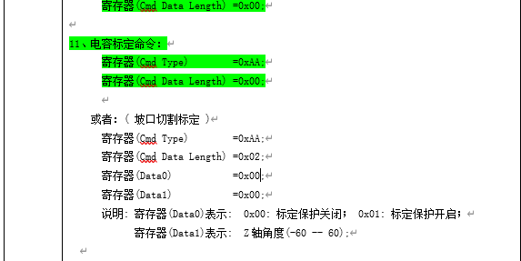

# 하이트 컨트롤러

---

## 0x91A1 팔로잉 켜기 명령 요청

**요청 파라미터**

| 파라미터명 | 타입 | 필수 | 설명 |
|--------|------|------|------|
| robot | int | 예 | 로봇 번호 |
| thirdLevelPerforationEnable | bool | 아니오 | 3단계 천공 활성화 |
| secondPerforationEnable | bool | 아니오 | 2차 천공 활성화 |
| perforationMode | int | 아니오 | 천공 모드: 0-직접 천공, 1-분할 천공, 2-점진 천공 |

**예시**

```json
{
    "robot": 1,
    "thirdLevelPerforationEnable": false,
    "secondPerforationEnable": false,
    "perforationMode": 1
}
```

---

## 0x91A2 팔로잉 끄기 명령 요청

**요청 파라미터**

| 파라미터명 | 타입 | 필수 | 설명 |
|--------|------|------|------|
| robot | int | 예 | 로봇 번호 |

**예시**

```json
{
    "robot": 1
}
```

---

## 0x91A3 팔로잉 정지 명령 요청

**요청 파라미터**

| 파라미터명 | 타입 | 필수 | 설명 |
|--------|------|------|------|
| robot | int | 예 | 로봇 번호 |

**예시**

```json
{
    "robot": 1
}
```

---

## 0x91A4 하이트 컨트롤러 조그

**요청 파라미터**

| 파라미터명 | 타입 | 필수 | 설명 |
|--------|------|------|------|
| robot | int | 예 | 로봇 번호 |
| direction | int | 예 | 방향: 0-하강, 1-상승 (100ms 내에 전송) |
| speedLevel | int | 아니오 | 속도 등급: 0-저속, 1-중속, 2-고속 |

**예시**

```json
{
    "robot": 1,
    "direction": 1,
    "speedLevel": 1
}
```


---

## 0x91AF 조그 정지

**요청 파라미터**

| 파라미터명 | 타입 | 필수 | 설명 |
|--------|------|------|------|
| robot | int | 예 | 로봇 번호 |

**예시**

```json
{
    "robot": 1
}
```

---

## OperationStatus 상태 열거형

```cpp
enum class OperationStatus {
    STOP_                    = 0x00,  // 정지
    MENU_SETTING_            = 0x01,  // 메뉴 설정 중
    MOTOR_CALIBRATION_       = 0x02,  // 모터 캘리브레이션 중
    CAPACITANCE_CALIBRATION_ = 0x03,  // 커패시턴스 캘리브레이션 중
    AUTO_TUNING_             = 0x04,  // 자동 튜닝 중
    HOME_                    = 0x05,  // 원점 복귀
    FOLLOW_                  = 0x06,  // 팔로잉
    ASCEND_                  = 0x07,  // 상승
    DESCEND_                 = 0x08,  // 하강
    EMERGENCY_TOP_           = 0x09,  // 비상 정지
    FROG_LEAP_               = 0x0A   // 프로그 점프
};
```

---

## 0x91A7 하이트 컨트롤러 관련 정보 요청

**요청 파라미터**

| 파라미터명 | 타입 | 필수 | 설명 |
|--------|------|------|------|
| robot | int | 예 | 로봇 번호 |

**예시**

```json
{
    "robot": 1
}
```

---

## 0x91A8 하이트 컨트롤러 관련 정보 반환

**응답 파라미터**

| 파라미터명 | 타입 | 설명 |
|--------|------|------|
| status | int | OperationStatus 상태 값 |
| capacitance_value | int | 커패시턴스 값 |
| position | int | 위치 값 |
| height | int | 높이 값 |
| version | int | 버전 번호 |
| stop_coordinate | int | 정지 좌표 |
| air_moving_board_delay | int | 공압 보드 지연 |
| back_to_center_coordinate | int | 중앙 복귀 좌표 |
| cutting_plate_delay | int | 커팅 보드 지연 |
| perforation_plate_delay | int | 천공 보드 지연 |
| zaxis_coordinate | int | Z축 좌표 |

**예시**

```json
{
    "status": 0,
    "capacitance_value": 0,
    "position": 0,
    "height": 0,
    "version": 0,
    "stop_coordinate": 1,
    "air_moving_board_delay": 1,
    "back_to_center_coordinate": 1,
    "cutting_plate_delay": 1,
    "perforation_plate_delay": 1,
    "zaxis_coordinate": 1
}
```

---

## 0x91A9 팔로잉 등급 설정

**요청 파라미터**

| 파라미터명 | 타입 | 필수 | 설명 |
|--------|------|------|------|
| cuttingTrackLevel | int | 아니오 | 커팅 궤적 팔로잉 등급, 범위 (0, 30] |
| rAngleTrackLevel | int | 아니오 | R 코너 팔로잉 등급 |

**예시**

```json
{
    "cuttingTrackLevel": 30,
    "rAngleTrackLevel": 0
}
```

---

## 0x91B0 높이 설정

**요청 파라미터**

| 파라미터명 | 타입 | 필수 | 설명 |
|--------|------|------|------|
| cuttingHeight | int | 아니오 | 커팅 높이, 단위 μm, 범위 200-9999 |

**예시**

```json
{
    "cuttingHeight": 0
}
```

---

## 0x91AA 커패시턴스 캘리브레이션

**요청 파라미터**

| 파라미터명 | 타입 | 필수 | 설명 |
|--------|------|------|------|
| type | int | 아니오 | 캘리브레이션 타입: 0-모터 캘리브레이션, 1-커패시턴스 캘리브레이션/베벨 커팅 캘리브레이션 |
| isBevelCutting | bool | 아니오 | 베벨 커팅 캘리브레이션 여부 |
| calibrationProtection | bool | 아니오 | 캘리브레이션 보호 |
| zAxisAngle | int | 아니오 | Z축 각도 |

**예시**

```json
{
    "type": 0,
    "isBevelCutting": false,
    "calibrationProtection": false,
    "zAxisAngle": 0
}
```



---

## 0x91B0 CNC 실시간 Z축 속도 전송

**요청 파라미터**

| 파라미터명 | 타입 | 필수 | 설명 |
|--------|------|------|------|
| cncSpeed | int | 아니오 | Z축 속도, 단위: μm/ms |

**예시**

```json
{
    "cncSpeed": 100
}
```