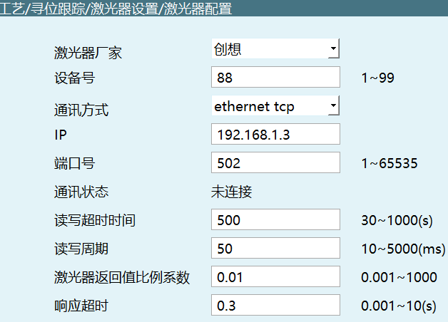
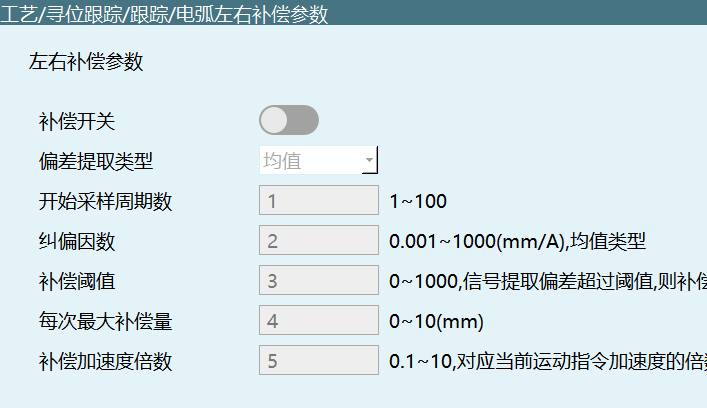
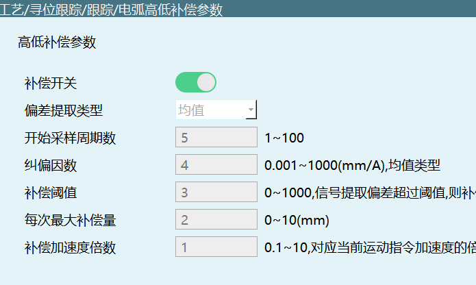
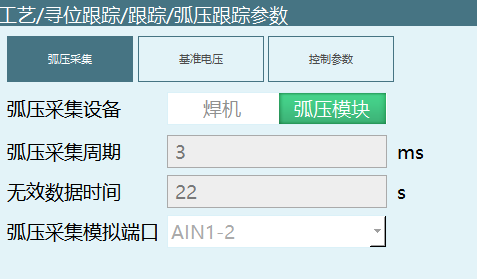

# 심 추적 프로세스

## 레이저 센서 매개변수 설정


레이저 센서 구성 매개변수 설정



**0x4130 TRACK_LASER_PARAM_SET**

```json
{
  "fileNum": 1,
  "laserParam": {
    "communication": 1,
    "devid": 1,
    "ip": "192.168.1.3",
    "port": 502,
    "responseTimeout": 0.3,
    "scaleFactor": 0.01,
    "timeLimit": 500.0,
    "timePeriod": 50.0,
    "vendor": "창상"
  },
  "robot": 1
}
```

| 매개변수 이름 | 유형 | 필수 | 설명 |
|--------|------|------|------|
| fileNum | int | 예 | 레이저 센서 파일 번호 |
| robot | int | 예 | 로봇 번호 |
| laserParam.communication | int | 예 | 통신 방식：0-modbus tcp, 1-ethernet tcp |
| laserParam.devid | int | 예 | 장비 번호 |
| laserParam.ip | string | 예 | IP 주소 |
| laserParam.port | int | 예 | 포트 번호 |
| laserParam.responseTimeout | float | 아니오 | 응답 타임아웃 |
| laserParam.scaleFactor | float | 아니오 | 레이저 센서 반환값 비율 계수 |
| laserParam.timeLimit | float | 아니오 | 읽기/쓰기 타임아웃 시간 (ms) |
| laserParam.timePeriod | float | 아니오 | 읽기/쓰기 주기 (ms) |
| laserParam.vendor | string | 아니오 | 레이저 센서 제조사 |

---

레이저 센서 매개변수 조회

**0x4131 TRACK_LASER_PARAM_INQUIRE**

```json
{
  "robot": 1,
  "fileNum": 1
}
```

| 매개변수 이름 | 유형 | 필수 | 설명 |
|--------|------|------|------|
| robot | int | 예 | 로봇 번호 |
| fileNum | int | 예 | 레이저 센서 파일 번호 |

---

응답 레이저 센서 매개변수

**0x4132 TRACK_LASER_PARAM_RESPOND**

```json
{
  "fileNum": 1,
  "laserParam": {
    "commLog": false,
    "communication": 0,
    "devid": 88,
    "ip": "192.168.1.3",
    "netstate": false,
    "port": 502,
    "responseTimeout": 0.3,
    "scaleFactor": 0.01,
    "timeLimit": 500.0,
    "timePeriod": 50,
    "vendor": "창상",
    "vendorlist": [
      "범용",
      "창상",
      "예박시",
      "예우",
      "동주과학기술",
      "중과굉위",
      "전시지능",
      "성공지능",
      "강보만",
      "청동"
    ]
  },
  "robot": 1
}
```

| 매개변수 이름 | 유형 | 설명 |
|--------|------|------|
| fileNum | int | 레이저 센서 파일 번호 |
| robot | int | 로봇 번호 |
| laserParam.commLog | bool | 통신 로그 |
| laserParam.communication | int | 통신 방식：0-modbus tcp, 1-ethernet tcp |
| laserParam.devid | int | 장비 번호 |
| laserParam.ip | string | IP 주소 |
| laserParam.netstate | bool | 네트워크 상태 |
| laserParam.port | int | 포트 번호 |
| laserParam.responseTimeout | float | 응답 타임아웃 |
| laserParam.scaleFactor | float | 레이저 센서 반환값 비율 계수 |
| laserParam.timeLimit | float | 읽기/쓰기 타임아웃 시간 (ms) |
| laserParam.timePeriod | float | 읽기/쓰기 주기 (ms) |
| laserParam.vendor | string | 레이저 센서 제조사 |
| laserParam.vendorlist | array | 레이저 센서 제조사 목록 |

---

## 레이저 센서 캘리브레이션


캘리브레이션 기록 조회

**0x4140 SENSOR_LASER_CALIBRATE_INQUIRE**

```json
{
  "robot": 1,
  "fileNum": 1
}
```

| 매개변수 이름 | 유형 | 필수 | 설명 |
|--------|------|------|------|
| robot | int | 예 | 로봇 번호 |
| fileNum | int | 예 | 레이저 센서 파일 번호 |

---

0x4140 조회 결과 반환

**0x4141 SENSOR_LASER_CALIBRATE_RESPOND**

```json
{
  "robot": 1,
  "fileNum": 1,
  "recordResult": {
    "point1": false,
    "point2": false,
    "point3": false,
    "point4": false,
    "point5": false,
    "point6": false,
    "point7": false
  }
}
```

| 매개변수 이름 | 유형 | 설명 |
|--------|------|------|
| robot | int | 로봇 번호 |
| fileNum | int | 레이저 센서 파일 번호 |
| recordResult.point1~7 | bool | 각 캘리브레이션 점 기록 결과 |

---

캘리브레이션 점 기록

**0x4142 SENSOR_LASER_CALIBRATE_RECORD**

```json
{
  "robot": 1,
  "fileNum": 1,
  "pointNum": 1
}
```

| 매개변수 이름 | 유형 | 필수 | 설명 |
|--------|------|------|------|
| robot | int | 예 | 로봇 번호 |
| fileNum | int | 예 | 레이저 센서 파일 번호 |
| pointNum | int | 예 | 캘리브레이션 점 번호 (범위 1~7) |

---

캘리브레이션 결과 조회

**0x4143 SENSOR_LASER_CALIBRATE_RECORD_RESPOND**

```json
{
  "robot": 1,
  "fileNum": 1,
  "pointNum": 1,
  "recordResult": true
}
```

| 매개변수 이름 | 유형 | 설명 |
|--------|------|------|
| robot | int | 로봇 번호 |
| fileNum | int | 레이저 센서 파일 번호 |
| pointNum | int | 캘리브레이션 점 번호 |
| recordResult | bool | 기록 결과 |

---

캘리브레이션 점으로 이동

**0x4144 SENSOR_LASER_CALIBRATE_MOVETO**

```json
{
  "robot": 1,
  "fileNum": 1,
  "pointNum": 1
}
```

| 매개변수 이름 | 유형 | 필수 | 설명 |
|--------|------|------|------|
| robot | int | 예 | 로봇 번호 |
| fileNum | int | 예 | 레이저 센서 파일 번호 |
| pointNum | int | 예 | 캘리브레이션 점 번호 |

---

캘리브레이션 결과 계산

**0x4145 SENSOR_LASER_CALIBRATE_CALCULATE**

```json
{
  "robot": 1,
  "fileNum": 1
}
```

| 매개변수 이름 | 유형 | 필수 | 설명 |
|--------|------|------|------|
| robot | int | 예 | 로봇 번호 |
| fileNum | int | 예 | 레이저 센서 파일 번호 |

---

0x4145 계산 결과 반환

**0x4146 SENSOR_LASER_CALIBRATE_CALCULATE_RESPOND**

```json
{
  "robot": 1,
  "fileNum": 1,
  "result": true
}
```

| 매개변수 이름 | 유형 | 설명 |
|--------|------|------|
| robot | int | 로봇 번호 |
| fileNum | int | 레이저 센서 파일 번호 |
| result | bool | 계산 결과 |

---

캘리브레이션 기록 비우기

**0x4147 SENSOR_LASER_CALIBRATE_CLEAR**

```json
{
  "robot": 1,
  "fileNum": 1
}
```

| 매개변수 이름 | 유형 | 필수 | 설명 |
|--------|------|------|------|
| robot | int | 예 | 로봇 번호 |
| fileNum | int | 예 | 레이저 센서 파일 번호 |

0x4141 반환

---

캘리브레이션 취소

**0x4148 SENSOR_LASER_CALIBRATE_CANCEL**

```json
{
  "robot": 1,
  "fileNum": 1
}
```

| 매개변수 이름 | 유형 | 필수 | 설명 |
|--------|------|------|------|
| robot | int | 예 | 로봇 번호 |
| fileNum | int | 예 | 레이저 센서 파일 번호 |

---

레이저 센서 캘리브레이션 여부 조회

**0x4149 SENSOR_LASER_CALIBRATE_RESULT_INQUIRE**

```json
{
  "robot": 1,
  "fileNum": 1
}
```

| 매개변수 이름 | 유형 | 필수 | 설명 |
|--------|------|------|------|
| robot | int | 예 | 로봇 번호 |
| fileNum | int | 예 | 레이저 센서 파일 번호 |

---

0x4149 조회 결과 응답

**0x414A SENSOR_LASER_CALIBRATE_RESULT_RESPOND**

```json
{
  "robot": 1,
  "fileNum": 1,
  "laserCalibrated": false
}
```

| 매개변수 이름 | 유형 | 설명 |
|--------|------|------|
| robot | int | 로봇 번호 |
| fileNum | int | 레이저 센서 파일 번호 |
| laserCalibrated | bool | 캘리브레이션 완료 여부 |

---

## 심 검출 유형 설정


**0x4133 LOCATING_SENSORTYPE_SET**

```json
{
  "fileNum": 77,
  "robot": 1,
  "sensorType": 0
}
```

| 매개변수 이름 | 유형 | 필수 | 설명 |
|--------|------|------|------|
| fileNum | int | 예 | 레이저 센서 파일 번호 |
| robot | int | 예 | 로봇 번호 |
| sensorType | int | 예 | 심 검출 유형：0-선 레이저, 1-아크 |

---

심 검출 유형 조회

**0x4134 LOCATING_SENSORTYPE_INQUIRE**

```json
{
  "robot": 1,
  "fileNum": 1
}
```

| 매개변수 이름 | 유형 | 필수 | 설명 |
|--------|------|------|------|
| robot | int | 예 | 로봇 번호 |
| fileNum | int | 예 | 레이저 센서 파일 번호 |

---

심 검출 유형 응답

**0x4135 LOCATING_SENSORTYPE_RESPOND**

```json
{
  "robot": 1,
  "fileNum": 1,
  "sensorType": 0
}
```

| 매개변수 이름 | 유형 | 설명 |
|--------|------|------|
| robot | int | 로봇 번호 |
| fileNum | int | 레이저 센서 파일 번호 |
| sensorType | int | 심 검출 유형：0-선 레이저, 1-아크 |

---

## 추적 유형 설정


**0x4169 TRACK_SENSORTYPE_SET**

```json
{
  "robot": 1,
  "fileNum": 1,
  "sensorType": 0
}
```

| 매개변수 이름 | 유형 | 필수 | 설명 |
|--------|------|------|------|
| robot | int | 예 | 로봇 번호 |
| fileNum | int | 예 | 레이저 센서 파일 번호 |
| sensorType | int | 예 | 추적 유형：0-선 레이저, 1-아크, 2-아크 전압 |

---

추적 유형 조회

**0x4170 TRACK_SENSORTYPE_INQUIRE**

```json
{
  "robot": 1,
  "fileNum": 1
}
```

| 매개변수 이름 | 유형 | 필수 | 설명 |
|--------|------|------|------|
| robot | int | 예 | 로봇 번호 |
| fileNum | int | 예 | 레이저 센서 파일 번호 |

---

0x4170 조회 결과 반환

**0x4171 TRACK_SENSORTYPE_RESPOND**

0x4169와 동일

---

## 레이저 추적 매개변수 테이블 설정


**0x4136 TRACK_LASER_TRACKPARAM_SET**

```json
{
  "fileNum": 1,
  "robot": 1,
  "tableid": 98,
  "trackParam": {
    "compensateX": 1.0,
    "compensateY": 2.0,
    "compensateZ": 3.0,
    "din_end": 0,
    "dout_part_move": -1,
    "endPoint": {
      "interval": 6.0,
      "scanPeriod": 5.0
    },
    "filter": {
      "level": 4,
      "type": 1
    },
    "laserTaskId": 7,
    "positionHold": {
      "distance": 100.0,
      "switchon": false
    },
    "scanErrorLength": 8.0,
    "sensitivity": 3,
    "trackMode": 0
  }
}
```

| 매개변수 이름 | 유형 | 필수 | 설명 |
|--------|------|------|------|
| fileNum | int | 예 | 레이저 센서 파일 번호 |
| robot | int | 예 | 로봇 번호 |
| tableid | int | 예 | 추적 모드 |
| trackParam.compensateX | float | 아니오 | x 방향 보상량 |
| trackParam.compensateY | float | 아니오 | y 방향 보상량 |
| trackParam.compensateZ | float | 아니오 | z 방향 보상량 |
| trackParam.din_end | int | 아니오 | 추적 종료 입력 IO |
| trackParam.dout_part_move | int | 아니오 | 작업물 회전 출력 IO |
| trackParam.endPoint.interval | float | 아니오 | 종료점 스캔 구간 |
| trackParam.endPoint.scanPeriod | float | 아니오 | 종료점 스캔 주기 |
| trackParam.filter.level | int | 아니오 | 필터 레벨 |
| trackParam.filter.type | int | 아니오 | 필터 방식：0-없음, 1-이동 평균 필터 |
| trackParam.laserTaskId | int | 아니오 | 레이저 센서 작업 번호 |
| trackParam.positionHold.distance | float | 아니오 | 심 검출 유지 트리거 거리 |
| trackParam.positionHold.switchon | bool | 아니오 | 심 검출 저장 기능：true 활성화, false 비활성화 |
| trackParam.scanErrorLength | float | 아니오 | 스캔 오류 확인 거리 |
| trackParam.sensitivity | int | 아니오 | 민감도 |
| trackParam.trackMode | int | 아니오 | 추적 모드：0-절대식, 1-고정점 증분식, 2-주행 증분식 |

---

레이저 추적 매개변수 조회

**0x4137 TRACK_LASER_TRACKPARAM_INQUIRE**

```json
{
  "robot": 1,
  "fileNum": 1,
  "tableid": 1
}
```

| 매개변수 이름 | 유형 | 필수 | 설명 |
|--------|------|------|------|
| robot | int | 예 | 로봇 번호 |
| fileNum | int | 예 | 레이저 센서 파일 번호 |
| tableid | int | 예 | 매개변수 테이블 번호 |

---

레이저 추적 매개변수 응답

**0x4138 TRACK_LASER_TRACKPARAM_RESPOND**

Data：0x4136과 동일

---

## 심 검출 매개변수 테이블


심 검출 매개변수 설정

**0x4139 TRACK_LASER_SEARCHPARAM_SET**

```json
{
  "fileNum": 1,
  "robot": 1,
  "searchParam": {
    "compensateX": 2.0,
    "compensateY": 3.0,
    "compensateZ": 4.0,
    "dynamic": {
      "distance": 5.0,
      "pointIndex": 7,
      "speed": 6.0
    },
    "laserTaskId": 1,
    "storeType": 1
  },
  "tableid": 3
}
```

| 매개변수 이름 | 유형 | 필수 | 설명 |
|--------|------|------|------|
| fileNum | int | 예 | 심 검출 파일 번호 |
| robot | int | 예 | 로봇 번호 |
| tableid | int | 예 | 매개변수 테이블 번호 |
| searchParam.compensateX | float | 아니오 | x 방향 보상량 |
| searchParam.compensateY | float | 아니오 | y 방향 보상량 |
| searchParam.compensateZ | float | 아니오 | z 방향 보상량 |
| searchParam.dynamic.distance | float | 아니오 | 동적 심 검출 거리 |
| searchParam.dynamic.pointIndex | int | 아니오 | 동적 심 검출 선택 |
| searchParam.dynamic.speed | float | 아니오 | 동적 심 검출 속도 |
| searchParam.laserTaskId | int | 아니오 | 레이저 센서 작업 번호 |
| searchParam.storeType | int | 아니오 | 심 검출 유형：0-기준 심 검출, 1-수정 심 검출 |

---

심 검출 매개변수 조회

**0x413A TRACK_LASER_SEARCHPARAM_INQUIRE**

```json
{
  "robot": 1,
  "fileNum": 1,
  "tableid": 1
}
```

| 매개변수 이름 | 유형 | 필수 | 설명 |
|--------|------|------|------|
| robot | int | 예 | 로봇 번호 |
| fileNum | int | 예 | 레이저 센서 파일 번호 |
| tableid | int | 예 | 매개변수 테이블 번호 |

---

심 검출 매개변수 응답

**0x413B TRACK_LASER_SEARCHPARAM_RESPOND**

Data：0x4139와 동일

---


심 검출 매개변수 복사 (복사 전에 0x413D 비우기 필요)

**0x413C TRACK_SEAMTRACK_PARAM_COPY**

```json
{
  "dstFileNum": 4,
  "fileNum": 1,
  "function": 1,
  "robot": 1,
  "sensorType": 0
}
```

| 매개변수 이름 | 유형 | 필수 | 설명 |
|--------|------|------|------|
| dstFileNum | int | 예 | 복사 대상 파일 번호 |
| fileNum | int | 예 | 복사할 파일 번호 |
| function | int | 예 | 0-추적, 1-심 검출 |
| robot | int | 예 | 로봇 번호 |
| sensorType | int | 예 | 추적 유형：0-선 레이저, 1-아크, 2-아크 전압；심 검출 유형：0-선 레이저, 1-아크 |

---

심 검출 매개변수 비우기

**0x413D TRACK_SEAMTRACK_PARAM_CLEAR**

```json
{
  "robot": 1,
  "fileNum": 1,
  "sensorType": 0,
  "function": 0
}
```

| 매개변수 이름 | 유형 | 필수 | 설명 |
|--------|------|------|------|
| robot | int | 예 | 로봇 번호 |
| fileNum | int | 예 | 레이저 센서 파일 번호 |
| sensorType | int | 예 | 추적 유형：0-선 레이저, 1-아크, 2-아크 전압；심 검출 유형：0-선 레이저, 1-아크 |
| function | int | 예 | 0-추적, 1-심 검출 |

> 참고：비우기 완료 후 매개변수를 한 번 조회해야 한다

---

## 아크 추적


통신 매개변수 설정


**0x4150 TRACK_ARC_COMMPARAM_SET**

```json
{
  "robot": 1,
  "craftid": 1,
  "sampling": {
    "dataType": 0,
    "period": 20
  }
}
```

| 매개변수 이름 | 유형 | 필수 | 설명 |
|--------|------|------|------|
| robot | int | 예 | 로봇 번호 |
| craftid | int | 예 | 추적 파일 번호 |
| sampling.dataType | int | 예 | 데이터 유형：0-전류, 1-전압 |
| sampling.period | int | 예 | 샘플링 주기 (0~1000) |

---

통신 매개변수 조회

**0x4151 TRACK_ARC_COMMPARAM_INQUIRE**

```json
{
  "robot": 1,
  "craftid": 1
}
```

| 매개변수 이름 | 유형 | 필수 | 설명 |
|--------|------|------|------|
| robot | int | 예 | 로봇 번호 |
| craftid | int | 예 | 추적 파일 번호 |

---

통신 매개변수 응답 조회

**0x4152 TRACK_ARC_COMMPARAM_RESPOND**

```json
{
  "robot": 1,
  "craftid": 1,
  "sampling": {
    "dataType": 0,
    "period": 20
  }
}
```

| 매개변수 이름 | 유형 | 설명 |
|--------|------|------|
| robot | int | 로봇 번호 |
| craftid | int | 추적 파일 번호 |
| sampling.dataType | int | 데이터 유형：0-전류, 1-전압 |
| sampling.period | int | 샘플링 주기 (0~1000) |

---

좌우 보상 매개변수 설정



**0x4153 TRACK_ARC_LATERALCOMPENPARAM_SET**

```json
{
  "craftid": 1,
  "robot": 1,
  "lateralCompensation": {
    "accFactor": 5.0,
    "algorithmType": 0,
    "beginCycleNum": 1,
    "factor": 2.0,
    "maxSingleLen": 4.0,
    "switchon": false,
    "threshold": 3.0
  }
}
```

| 매개변수 이름 | 유형 | 필수 | 설명 |
|--------|------|------|------|
| craftid | int | 예 | 추적 파일 번호 |
| robot | int | 예 | 로봇 번호 |
| lateralCompensation.accFactor | float | 아니오 | 보상 가속도 배수 (0.1~10) |
| lateralCompensation.algorithmType | int | 아니오 | 편차 추출 유형：0-평균값 |
| lateralCompensation.beginCycleNum | int | 아니오 | 샘플링 시작 주기 수 (1~1000) |
| lateralCompensation.factor | float | 아니오 | 편향 보정 계수 (0.001~1000) |
| lateralCompensation.maxSingleLen | float | 아니오 | 단일 최대 보상량 (0~10) |
| lateralCompensation.switchon | bool | 아니오 | 보상 스위치 |
| lateralCompensation.threshold | float | 아니오 | 보상 임계값 (0~1000) |

---

좌우 보상 매개변수 조회

**0x4154 TRACK_ARC_LATERALCOMPENPARAM_INQUIRE**

```json
{
  "robot": 1,
  "craftid": 1
}
```

| 매개변수 이름 | 유형 | 필수 | 설명 |
|--------|------|------|------|
| robot | int | 예 | 로봇 번호 |
| craftid | int | 예 | 추적 파일 번호 |

---

좌우 매개변수 반환 조회

**0x4155 TRACK_ARC_LATERALCOMPENPARAM_RESPOND**

0x4153와 동일

---

상하 보상 매개변수 설정



**0x4156 TRACK_ARC_VERTICALCOMPENPARAM_SET**

```json
{
  "craftid": 1,
  "robot": 1,
  "verticalCompensation": {
    "accFactor": 1,
    "algorithmType": 0,
    "beginCycleNum": 5,
    "factor": 4,
    "maxSingleLen": 2,
    "switchon": true,
    "threshold": 3
  }
}
```

| 매개변수 이름 | 유형 | 필수 | 설명 |
|--------|------|------|------|
| craftid | int | 예 | 추적 파일 번호 |
| robot | int | 예 | 로봇 번호 |
| verticalCompensation.accFactor | float | 아니오 | 보상 가속도 배수 |
| verticalCompensation.algorithmType | int | 아니오 | 편차 추출 유형 |
| verticalCompensation.beginCycleNum | int | 아니오 | 수집 시작 주기 수 |
| verticalCompensation.factor | float | 아니오 | 편향 보정 계수 |
| verticalCompensation.maxSingleLen | float | 아니오 | 단일 최대 보상량 |
| verticalCompensation.switchon | bool | 아니오 | 보상 스위치 |
| verticalCompensation.threshold | float | 아니오 | 보상 임계값 |

---

상하 보상 매개변수 조회

**0x4157 TRACK_ARC_VERTICALCOMPENPARAM_INQUIRE**

```json
{
  "robot": 1,
  "craftid": 1
}
```

| 매개변수 이름 | 유형 | 필수 | 설명 |
|--------|------|------|------|
| robot | int | 예 | 로봇 번호 |
| craftid | int | 예 | 추적 파일 번호 |

---

상하 보상 매개변수 반환 조회

**0x4158 TRACK_ARC_VERTICALCOMPENPARAM_RESPOND**

0x4156와 동일

---

## 터치 심 검출 매개변수


**0x4160 SEARCH_TOUCH_PARAM_SET**

```json
{
  "craftid": 1,
  "robot": 1,
  "touchSearch": {
    "2ndAutoDistance": 8.0,
    "2ndAutoReturn": true,
    "2ndAutoVel": 9.0,
    "2ndDeviationLimit": 10.0,
    "2ndDistance": 6.0,
    "2ndSwitchon": false,
    "2ndVel": 7.0,
    "autoDistance": 3.0,
    "autoReturn": true,
    "autoVel": 4.0,
    "baseFlag": true,
    "compensation": 11.0,
    "deviationLimit": 5.0,
    "distance": 1.0,
    "isChangePose": false,
    "vel": 2.0
  }
}
```

| 매개변수 이름 | 유형 | 필수 | 설명 |
|--------|------|------|------|
| craftid | int | 예 | 심 검출 파일 번호 |
| robot | int | 예 | 로봇 번호 |
| touchSearch.2ndAutoDistance | float | 아니오 | 2차 자동 반환 거리 |
| touchSearch.2ndAutoReturn | bool | 아니오 | 2차 자동 반환 활성화 |
| touchSearch.2ndAutoVel | float | 아니오 | 2차 자동 반환 속도 |
| touchSearch.2ndDeviationLimit | float | 아니오 | 2차 초과 편차 범위 |
| touchSearch.2ndDistance | float | 아니오 | 2차 심 검출 거리 |
| touchSearch.2ndSwitchon | bool | 아니오 | 2차 심 검출 활성화 |
| touchSearch.2ndVel | float | 아니오 | 2차 심 검출 속도 |
| touchSearch.autoDistance | float | 아니오 | 자동 반환 거리 |
| touchSearch.autoReturn | bool | 아니오 | 자동 반환 활성화 |
| touchSearch.autoVel | float | 아니오 | 자동 반환 속도 |
| touchSearch.baseFlag | bool | 아니오 | 기준 심 검출 스위치 |
| touchSearch.compensation | float | 아니오 | 모션 벡터 보상 |
| touchSearch.deviationLimit | float | 아니오 | 초과 편차 범위 |
| touchSearch.distance | float | 아니오 | 심 검출 거리 |
| touchSearch.isChangePose | bool | 아니오 | 자세 변경 여부 |
| touchSearch.vel | float | 아니오 | 심 검출 속도 |

---

매개변수 조회

**0x4161 SEARCH_TOUCH_PARAM_INQUIRE**

```json
{
  "robot": 1,
  "craftid": 1
}
```

| 매개변수 이름 | 유형 | 필수 | 설명 |
|--------|------|------|------|
| robot | int | 예 | 로봇 번호 |
| craftid | int | 예 | 심 검출 파일 번호 |

---

조회 응답

**0x4162 SEARCH_TOUCH_PARAM_RESPOND**

매개변수는 0x4160과 동일

---

## 아크 전압 추적



아크 전압 추적 매개변수 설정

**0x4163 ARC_VOLTAGE_TRACK_PARAMETERS_SET**

```json
{
  "base_calc": {
    "collect_time": 5.0,
    "method": 0,
    "vol_inc": 4.0,
    "voltage": 3.0
  },
  "collection": {
    "analog_port": 1,
    "equipment": 0,
    "invalid_data_time": 2.0,
    "period": 1
  },
  "craftid": 1,
  "pid": {
    "dev_shreshold": 9.0,
    "kd": 8.0,
    "ki": 7.0,
    "kp": 6.0,
    "max_iout": 10.0,
    "max_out": 11.0
  },
  "robot": 1
}
```

| 매개변수 이름 | 유형 | 필수 | 설명 |
|--------|------|------|------|
| craftid | int | 예 | 추적 파일 번호 |
| robot | int | 예 | 로봇 번호 |
| base_calc.collect_time | float | 아니오 | 용접 시작 계산 시간 (s) |
| base_calc.method | int | 아니오 | 기준 전압 가져오기 방식：0-용접 계산, 1-수동 계산 |
| base_calc.vol_inc | float | 아니오 | 계산 증분 |
| base_calc.voltage | float | 아니오 | 기준 전압 (= 계산량 + 계산 증분) |
| collection.analog_port | int | 아니오 | 아크 전압 수집 아날로그 포트 (AIN-1...) |
| collection.equipment | int | 아니오 | 아크 전압 수집 장비：0-용접기, 1-아크 전압 모듈 |
| collection.invalid_data_time | float | 아니오 | 무효 데이터 시간 (s) |
| collection.period | int | 아니오 | 샘플링 주기 (ms) |
| pid.dev_shreshold | float | 아니오 | 편차 임계값 |
| pid.kd | float | 아니오 | 미분 계수 |
| pid.ki | float | 아니오 | 적분 계수 |
| pid.kp | float | 아니오 | 비례 계수 |
| pid.max_iout | float | 아니오 | 적분 리미트 |
| pid.max_out | float | 아니오 | 출력 리미트 |

---

아크 전압 추적 매개변수 조회

**0x4164 ARC_VOLTAGE_TRACK_PARAMETERS_INQUIRE**

```json
{
  "robot": 1,
  "craftid": 1
}
```

| 매개변수 이름 | 유형 | 필수 | 설명 |
|--------|------|------|------|
| robot | int | 예 | 로봇 번호 |
| craftid | int | 예 | 추적 파일 번호 |

---

아크 전압 추적 매개변수 응답 조회

**0x4165 ARC_VOLTAGE_TRACK_PARAMETERS_RESPOND**

0x4163와 동일

---

아크 전압 추적 기준 전압 계산 시작

**0x4166 ARC_VOLTAGE_TRACK_BASEVOLTAGE_CALC_START**

```json
{
  "robot": 1,
  "craftid": 1
}
```

| 매개변수 이름 | 유형 | 필수 | 설명 |
|--------|------|------|------|
| robot | int | 예 | 로봇 번호 |
| craftid | int | 예 | 추적 파일 번호 |

---

아크 전압 추적 기준 전압 계산 종료

**0x4167 ARC_VOLTAGE_TRACK_BASEVOLTAGE_CALC_END**

```json
{
  "robot": 1,
  "craftid": 1
}
```

| 매개변수 이름 | 유형 | 필수 | 설명 |
|--------|------|------|------|
| robot | int | 예 | 로봇 번호 |
| craftid | int | 예 | 추적 파일 번호 |

---

아크 전압 추적 기준 전압 계산

**0x4168 ARC_VOLTAGE_TRACK_BASEVOLTAGE_CALC**

```json
{
  "robot": 1,
  "craftid": 1
}
```

| 매개변수 이름 | 유형 | 필수 | 설명 |
|--------|------|------|------|
| robot | int | 예 | 로봇 번호 |
| craftid | int | 예 | 추적 파일 번호 |

---

0x4168 계산 결과 반환

**ARC_VOLTAGE_TRACK_BASEVOLTAGE_CALCURESULTS_GET**

```json
{
  "basic_calc": {
    "voltage": 0.0
  }
}
```

| 매개변수 이름 | 유형 | 설명 |
|--------|------|------|
| basic_calc.voltage | float | 기준 전압 |

---

아크 전압 추적 소구간 매개변수 수정

**0x416B ARC_VOLTAGE_TRACK_WINDOWSPARAM_SET**

```json
{
  "base_calc": {
    "vol_inc": 4.0,
    "voltage": 3.0
  },
  "craftid": 3,
  "robot": 1
}
```

| 매개변수 이름 | 유형 | 필수 | 설명 |
|--------|------|------|------|
| robot | int | 예 | 로봇 번호 |
| craftid | int | 예 | 추적 파일 번호 |
| base_calc.vol_inc | float | 아니오 | 계산 증분 |
| base_calc.voltage | float | 아니오 | 기준 전압 |