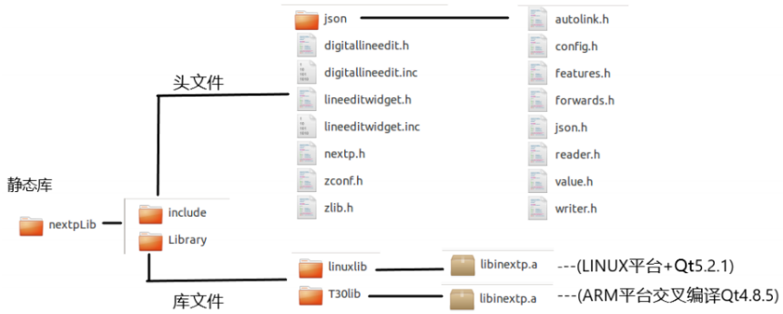
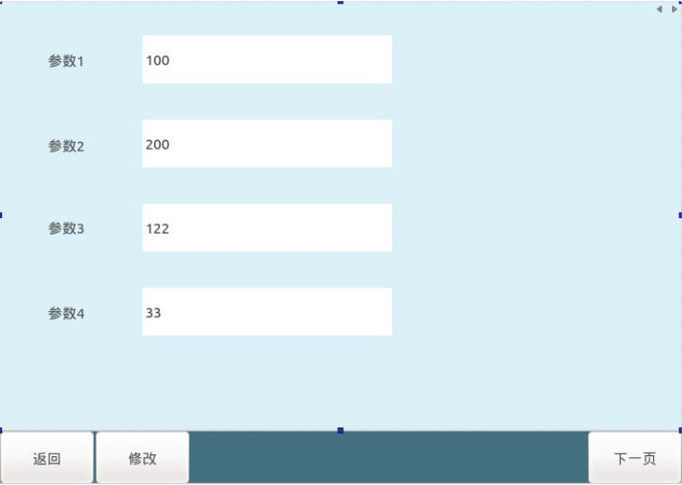

# 2차 개발 API

## 2차 개발静态库소개

### 기능介绍

제공完整的티치 펜던트기능，지원추가사용자사용자 정의인터페이스，지원特定필드的통신与제어시스템통신。

### 静态库디렉터리구조



nextpLib 을/를总파일夹；

Include 파일夹에서头파일；

Library 파일夹에서静态库파일包括 linux 平台和 ARM 平台的库파일（사용ARM 平台交叉编译的프로그램只适用于纳博特公司的 T30 티치 펜던트사용）；

### 静态库구조설명

#### 1.nextp.h 头파일인터페이스설명：

```cpp
//创建 Nextp 클래스객체
static QPointer<Nextp> getInstance();
//가져오기시스템字体
QString getSystemFont();
//사용자사용자 정의窗体传输到主프로그램
void setWidgetParentLocation(QPointer <QWidget> widget);
//向컨트롤러전송메시지
void sendMessage(const quint16 &command,const QByteArray &data);
//通知티치프로그램사용자 정의窗体已经열기
widgetShowFinish()
//수신컨트롤러메시지신호
void signal_receiveMessage(const quint16 &command,const QByteArray &data);
//열기사용자 정의窗体신호
void signal_openWidget();
//닫기사용자 정의窗体신호
void signal_closeWidget();
//隐藏프로세스主인터페이스中除了사용자 정의버튼的기타버튼
void hideTechnologyToolbuttons();
//静态库지원与컨트롤러통신명령字
 enum CommandList
 {
    SetFirstUserParaCommand = 0x9200,
    GetFirstUserCommand = 0x9201,
    ReceivedFirstUserCommand = 0x9202,
    SetSecondUserParaCommand = 0x9203,
    GetSecondUserCommand = 0x9204,
    ReceivedSecondUserCommand = 0x9205,
    SetThirdUserParaCommand = 0x9206,
    GetThirdUserCommand = 0x9207,
    ReceivedThirdUserCommand = 0x92,
    ReceivedThirdUserCommand = 0x9208,
    SetFourthUserParaCommand = 0x9209,
    GetFourthUserCommand = 0x920a,
    ReceivedFourthUserCommand = 0x920b,
    SetFifthUserParaCommand = 0x920c,
    GetFifthUserCommand = 0x920d,
    ReceivedFifthUserCommand = 0x920e,
};
```

#### 2.json/json.h 头파일제공 JSON 데이터형식的组装和解析

组装 json 데이터예시:

```cpp
Json::Value root;
Json::FastWriter wt;
root["robot"] =1;
root["booldata"] =true;
root["data"] = 1.1;
root["name"] ="nihao";
```

解析 Json 데이터예시

```cpp
QByteArray jsonData //컨트롤러전송的데이터
Json::Value root;
Json::Reader reader;
QString jsonData = param.data();
if(reader.parse(jsonData.toStdString(), root))
{
    int robot = root["robot"].asInt();
    bool booldata= root["booldata"].asBool();
    Int data= root["data"].asDouble();
    Std::string name = root["name "].asString();
}
```

#### 3.digitallineedit.h 제공숫자입력框

지원将 QLineEdit 控件提升을/를숫자입력框

提升메서드：右键선택1번째 QLineEdit 控件 --->Promote to--->DigitalLineEdit


右侧树形구조中可以看到该控件 Classs 속성变을/를 DigitLineEdit


프로그램실행后控件效果，单击控件会弹出숫자键盘：


#### 4.lineeditwidget.h 제공숫자和字符입력框 지원将 QLineEdit 控件提升을/를숫자与字符입력框 提升메서드：右键선택1번째 QLineEdit 控 件 --->Promote to--->lineEditWidget


右侧树形구조中可以看到该控件 Classs 속성变을/를 lineEditWidget


프로그램실행后控件效果，单击控件会弹出숫자与字母键盘：


## Demo 설명


- Demo 구조图 demo 파일夹이름：NextpMode

2.1 settingparawidget.h settingparawidget.cpp settingparawidget.ui 三번째파일을/를사용자사용자 정의窗体



2.2 widgetmanager.h widgetmanager.cpp 을/를管理클래스연결사용자사용자 정의窗体和静态库

2.2 静态库파일夹 nextplib 필요放置在 demod 的 NextpMode 파일夹下

2.3 실행 Demo （사용 QtCreator 直接열기 NextpMode 파일夹下的 NextpMode.pro 파일 ）

运 Demo 프로그램포인트击【조작员】> 선택管理员>입력密码 123456 로그인


포인트击左侧【프로세스】버튼> 사용자 进入사용자 정의窗体


포인트击수정버튼 可以수정매개변수 포인트击저장将전송매개변수到컨트롤러


QtCreator 제어台会打印전송到컨트롤러的데이터


만일호출함수 void hideTechnologyToolbuttons();会隐藏除프로세스在主界 面上사용자 정의버튼以外的기타프로세스버튼


- Demo 파일클래스설명
