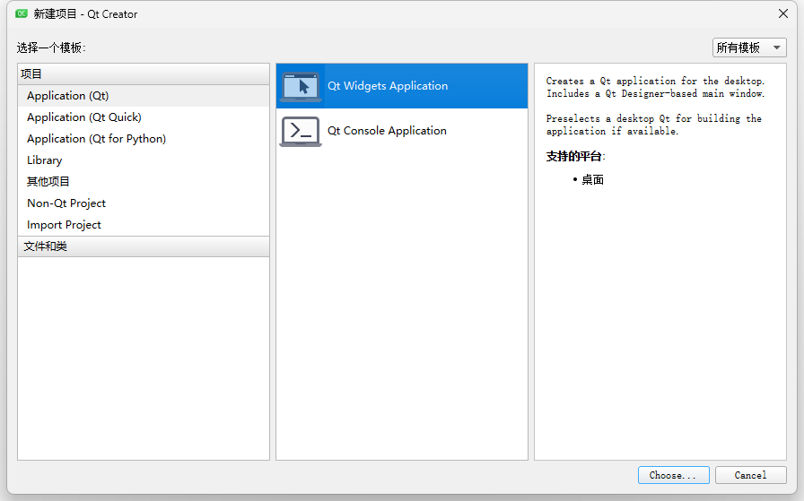

# 프로젝트 초기화

# Windows

본 페이지에서는 MinGW 및 MSVC 임포트 라이브러리를 사용한 프로젝트 초기화 과정을 소개합니다.

## 1. MinGW+Qt

- MinGW
- MSVC

먼저 관련 다운로드에서 상위컴퓨터(上비트機) SDK 다운로드 영역을 찾아 최신 버전의 API를 다운로드합니다.

Cpp 폴더 아래에 include 헤더 폴더가 있으며, windows 폴더의 win_mingw64_v2.x.x에 최신 버전의 동적 라이브러리가 있습니다.

### 1.1 프로젝트 생성

Qt Widgets Application 프로젝트를 생성하고 qt_demo로 명명합니다.



### 1.2 SDK 가져오기

프로젝트 생성 후 프로젝트 아래에 libs 폴더를 새로 만들고 SDK를 프로젝트 폴더에 복사합니다.

디렉터리 구조가 다음과 같다고 가정합니다:

```text
프로젝트 루트 디렉터리/
├── libs/
│   ├── include/
│   │   └── c_interface
│   │   └── cpp_interface
│   │   └── parameter
│   ├── libnrc_host.dll.a
│   └── nrc_host.dll
└── main.cpp
└── mainwindow.cpp
└── mainwindow.h
└── mainwindow.ui
└── qt_demo.pro
```

프로젝트의 qt_demo.pro 파일 끝에 SDK 헤더 파일과 라이브러리 참조를 추가합니다.

```makefile
# 1. 헤더 파일 경로 지정
INCLUDEPATH += $$PWD/libs/include
# 2. 라이브러리 파일 검색 경로 지정
LIBS += -L$$PWD/libs
# 3. 라이브러리 파일 링크 (이름 형식에 주의)
LIBS += -lnrc_host
# 4. 런타임에 .dll을 찾을 수 있도록 보장 (선택 사항, 아래 설명 참조)
win32 {
    # .dll을 빌드 출력 디렉터리(예: debug/release)로 복사
    DLL_SOURCE = $$shell_path($${PWD}\libs\nrc_host.dll)
    DLL_TARGET = $$shell_path($${OUT_PWD}\\)
    QMAKE_POST_LINK += $$quote(cmd /c copy /Y $$quote($$DLL_SOURCE) $$quote($$DLL_TARGET))
}
```

### 1.3 헤더 파일 호출

mainwindows.cpp에 헤더 파일을 추가합니다.  #include "cpp_interface/nrc_api.h"

```cpp
#include "mainwindow.h"
#include "ui_mainwindow.h"
// 라이브러리 헤더 파일 추가
#include "cpp_interface/nrc_api.h"


MainWindow::MainWindow(QWidget *parent)
    : QMainWindow(parent)
    , ui(new Ui::MainWindow)
{
    ui->setupUi(this);
}


MainWindow::~MainWindow()
{
    delete ui;
}
```

### 1.4 실행

실행 버튼을 클릭합니다. 오류가 없으면 헤더 파일이 성공적으로 참조된 것입니다.


더 많은 예제는 C++ 인터페이스 설명 | 나보터 테크 를 참조하세요.

## 2. MSVC

- 사용 IDE:  Qt Creator 5.0.2
- 컴파일 툴킷: Qt 5.12.12 MinGW 64-bit

Cpp 폴더 아래에 include 헤더 폴더가 있으며, windows 폴더의 win_msvc2017_x64_v2.x.x에 최신 버전의 동적 라이브러리가 있습니다.

### 2.1 프로젝트 생성

c++ "콘솔 응용 프로그램"을 선택하여 생성합니다.


### 2.2 SDK 가져오기

프로젝트 생성 후 SDK를 새로 생성한 프로젝트 폴더에 복사합니다.

디렉터리 구조가 다음과 같다고 가정합니다:

```text
프로젝트 루트 디렉터리/
├── libs/
│   ├── include/
│   │   └── c_interface
│   │   └── cpp_interface
│   │   └── parameter
│   ├── nrc_host.lib
│   └── nrc_host.dll
└── cpp_demo.cpp
└── cpp_demo.aps
└── cpp_demo.rc
└── cpp_demo.vcxproj
└── resource.h
```

Visual Studio에서 프로젝트를 마우스 오른쪽 버튼으로 클릭 → 속성(Properties) → 다음 옵션 구성:

#### (1) 헤더 파일 경로 추가

- 사용 IDE:  Visual Studio 2022
- 컴파일 생성 도구: MSVC Release x64

```text
$(ProjectDir)libs\include
```

#### (2) 라이브러리 경로 추가

- Configuration Properties → C/C++ → General → Additional Include Directories에
헤더 파일 경로 추가:

```text
$(ProjectDir)libs
```

#### (3) 라이브러리 파일 링크

- Configuration Properties → Linker → General → Additional Library Directories에
.lib 파일이 있는 경로 추가:

```text
nrc_host.lib
```

#### (4) 런타임에 .dll을 찾을 수 있도록 보장

- Configuration Properties → Linker → Input → Additional Dependencies에
.lib 파일 이름 추가:

```text
copy "$(ProjectDir)libs\nrc_host.dll" "$(OutDir)"
```

### 2.3 헤더 파일 포함

cpp_demo.cpp에 헤더 파일을 추가합니다.

```cpp
#include <iostream>
#include <thread>
#include <chrono>
#include <string>
#include "cpp_interface/nrc_interface.h"  // 헤더 파일 임포트


int main()
{
    SOCKETFD fd = connect_robot("192.168.1.15", "6001");
    if (fd <= 0)
    {
        std::cout << "연결 실패" << std::endl;
        return 0;
    }
    std::cout << "연결 성공: " << fd << std::endl;
}
```

로컬 Windows 디버거를 클릭합니다. Debug 버전의 라이브러리를 사용하는 경우 Release를 Debug로 전환해야 합니다.


오류가 없으면 SDK가 성공적으로 포함된 것입니다.

더 많은 예제는 C++ 인터페이스 설명 | 나보터 테크 를 참조하세요.

# Linux

include, lib, src 세 개의 폴더를 새로 만든 다음 api/ 폴더를 include에 넣습니다. libnrc_host를 lib에 넣고, src 폴더 아래에 main.cpp 파일을 새로 만듭니다.


## 1. Makefile 파일 생성

다음 내용을 Makefile 파일에 복사하고 저장합니다.

```makefile
TARGET=demo
all:
  g++ -o $(TARGET) src/*.cpp -I./include -L./lib -lnrc_host -lpthread -lm -ldl -lrt -lstdc++ -std=c++11 -fPIC
clean:
  rm $(TARGET) $(objects)
```

## 2. src 아래에 main.cpp 파일 생성

```cpp
#include <iostream>
#include "cpp_interface/nrc_api.h"


int main() {
  std::cout << "connect state: " << std::endl;
  SOCKETFD fd = connect_robot("192.168.1.15","6001");
  std::cout << "connect state: " << get_connection_status(fd) << std::endl;
}
```

## 3. 컴파일하여 실행 프로그램 생성

터미널을 열고 make를 사용하면 실행 프로그램 demo가 컴파일됩니다.

더 많은 예제는 인터페이스 예제 | 나보터 테크 를 참조하세요.

- Configuration Properties → Build Events → Post-Build Event에
.lib 파일 이름 추가:
