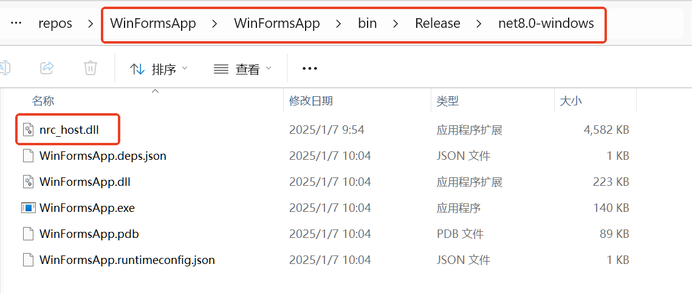
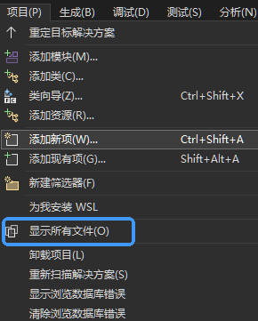
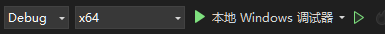

# 프로젝트 초기화

# C#

먼저 리소스 다운로드에서 C# 버전 SDK의 다운로드 영역을 찾아 SDK_CSharp_x64를 선택하여 다운로드합니다.

## 1 프로젝트 생성 및 SDK 가져오기

C# “Windows Forms 앱”을 선택하여 생성합니다.

프로젝트를 생성한 후 SDK를 새로 생성한 프로젝트 폴더에 복사합니다.

그런 다음 동적 라이브러리를 빌드 경로에 넣습니다.

Visual Studio 2022 상단 메뉴에서 >프로젝트>모든 파일 표시를 클릭하여 방금 복사한 파일을 표시합니다.

위 단계를 완료하면 왼쪽 “솔루션 탐색기”에 방금 복사한 “Csharp_api” 폴더가 표시됩니다.

"Csharp_api"를 마우스 오른쪽 버튼으로 클릭하고 >프로젝트에 포함 옵션을 선택하여 포함합니다.

완료한 후 Visual Studio 2022 상단 메뉴에서 >프로젝트>모든 파일 표시를 다시 클릭하여 모든 파일 표시를 해제합니다.

로컬 Windows 디버거를 클릭합니다. Release 버전 라이브러리를 사용하는 경우 Debug를 Release로 전환해야 합니다.

오류가 발생하지 않으면 SDK를 성공적으로 가져온 것입니다.

더 많은 예시는 인터페이스 예시 | 나봇 테크놀로지에서 확인할 수 있습니다.

- 사용 IDE: Visual Studio 2022
- 컴파일 생성 도구: .NET 8.0
