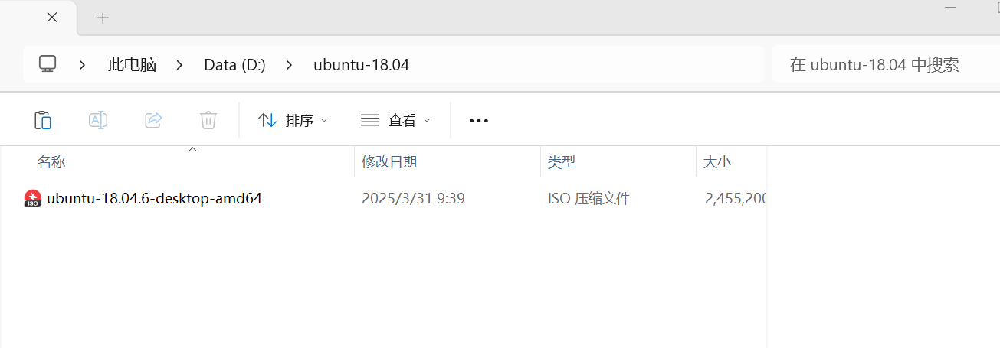
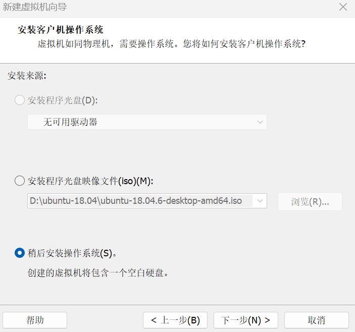
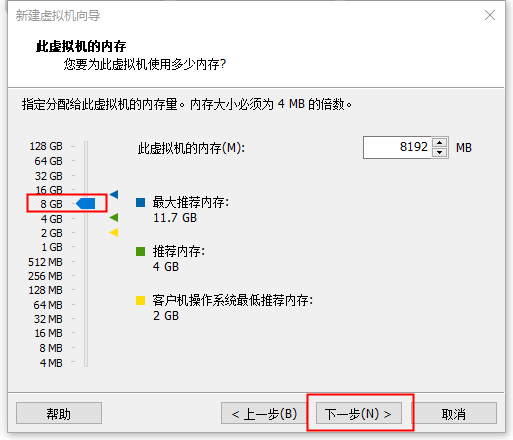
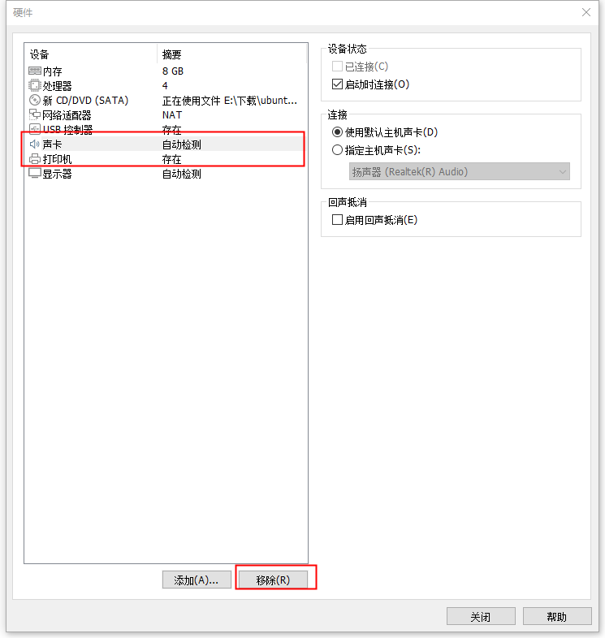
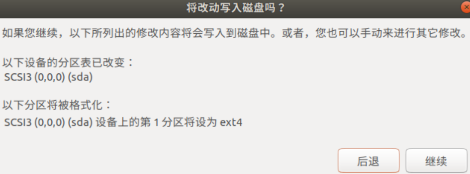
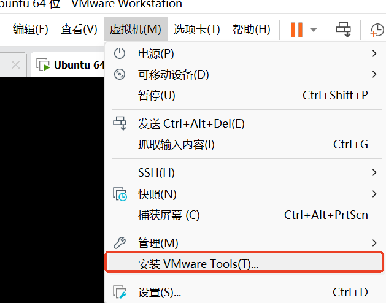

# Ubuntu 18.04 설치

본 문서는 Ubuntu 18.04의 다운로드, VMware Workstation을 통한 가상 머신 생성, 설치 및 구성, VMware Tools 설치의 전 과정을 자세히 설명합니다.

## 1. Ubuntu 18.04 다운로드

Ubuntu 공식 사이트 또는 국내 미러 사이트에서 Ubuntu 18.04 LTS의 iso 파일을 다운로드합니다.


설치 후 다음과 같습니다:



## 2. 가상 머신 생성

### VMware 구성 단계

1. VMware Workstation을 열고 **새 가상 머신 만들기**를 클릭합니다.


2. **사용자 지정(고급)**을 선택한 다음 **다음**을 클릭합니다.


3. 설치된 VMware의 버전에 따라 하드웨어 호환성을 선택하고 **다음**을 클릭합니다.


4. **나중에 운영 체제를 설치합니다**를 선택하고 **다음**을 클릭합니다.



5. **Linux**를 선택하고, 버전을 **Ubuntu 64비트**로 선택한 뒤 **다음**을 클릭합니다.


6. 직접 이름을 지정하고, 설치 위치를 선택합니다 (C 드라이브에는 설치하지 않는 것이 좋습니다).


7. 프로세서 수는 **1**을 선택하고, 코어 수는 **4**를 선택한 후 **다음**을 클릭합니다.


8. 메모리는 **8GB**를 선택하고 **다음**을 클릭합니다.


9. **네트워크 주소 변환 사용**을 선택하고 **다음**을 클릭합니다.



10. 기본 추천 구성대로 **다음**을 클릭합니다.


11. **새 가상 디스크 만들기**를 선택하고 **다음**을 클릭합니다.


12. 디스크를 할당합니다. **80GB**를 추천하며, 실제 필요에 따라 조정 가능합니다. **가상 디스크를 여러 파일로 분할**을 선택하고 **다음**을 클릭합니다.


13. 기본값으로 **다음**을 클릭합니다.


14. **하드웨어 사용자 지정**을 클릭합니다.


15. 하드웨어 사용자 지정으로 들어가서 **ISO 이미지 파일 사용**을 선택하고, 처음에 다운로드한 iso 파일을 선택합니다. **사운드 카드**와 **프린터**를 제거한 다음 **닫기**를 클릭합니다. 가상 머신의 사운드 카드와 프린터는 사용하지 않으므로, 리소스 절약을 위해 비활성화합니다.


16. **완료**를 클릭하여 설치를 시작합니다.



## 3. Ubuntu 18.04 설치

1. Ubuntu 18.04에 진입하여 가상 머신을 켭니다. **中文 (간체)**(중국어 간체)를 선택하고 **Ubuntu 설치**를 클릭합니다.


2. **중국어**를 선택합니다.


3. **일반 설치**, **Ubuntu 설치 시 업데이트 다운로드를 선택하고**, **계속**을 클릭합니다.


4. **디스크 전체를 삭제하고 Ubuntu 설치**를 선택합니다. 알림이 나타나면 **계속**을 선택하고, 마지막으로 **지금 설치**를 클릭합니다.


5. 사용자 이름과 비밀번호를 직접 설정하고, 지역은 임의로 입력해도 됩니다. Ubuntu가 스스로 설치하는 것을 기다립니다.




## 4. VMware Tools 설치

Ubuntu 설치 후 지금 재부팅을 클릭하여 Ubuntu에 진입한 다음, VMware Tools를 설치합니다.

### VMware Tools 마운트

1. 상단의 **가상 머신**을 클릭하고, **VMware Tools 설치**를 클릭합니다.


다운로드 완료 후 다음과 같습니다:



2. 파일 - VMware Tools에서 이 폴더를 찾아 메인 디렉터리로 이동합니다.


3. 메인 디렉터리에서 마우스 우클릭하여 **터미널에서 열기**를 클릭하고, 다음 명령을 실행합니다:

```bash
tar -zxvf VMwareTools-xxx.tar.gz
```

실행 후 폴더가 압축 해제된 것을 확인할 수 있습니다:


4. 다음 두 명령을 실행합니다:

```bash
cd vmware-tools-distrib
sudo ./vmware-install.pl
```

첫 번째 정지 시 `yes`를 입력하고, 나머지 정지 시에는 Enter를 누르기만 하면 됩니다.

그 후 재부팅합니다.至此, Ubuntu 18.04 설치가 완료되었습니다.
