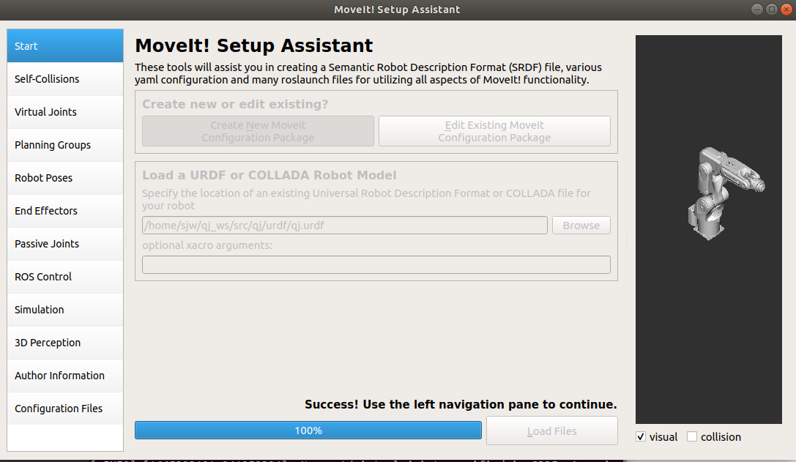
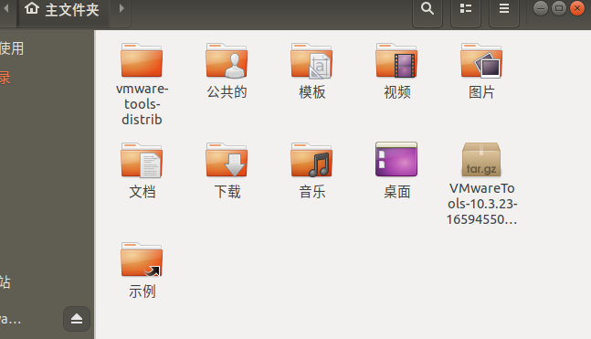
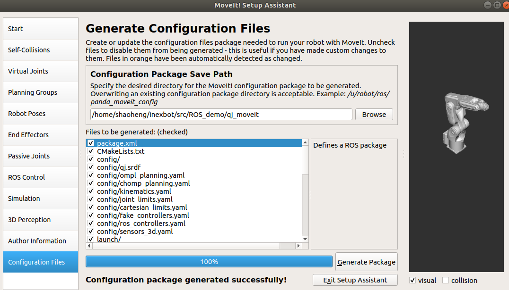
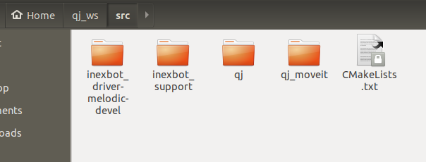
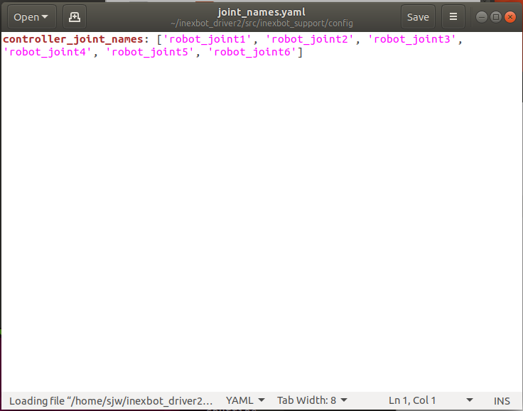
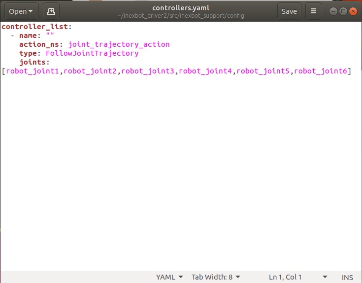
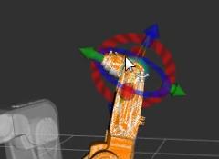

# ROS 사용 튜토리얼

본 문서는 ROS의 기본 사용 방법을 설명하며, 작업 공간 생성, URDF 모델 구성, MoveIt을 통한 로봇 제어, C++ 프로그래밍 제어 등을 포함합니다. 비디오 튜토리얼 [NexDroid과 ROS 결합 - 연결 및 사용](https://www.bilibili.com/video/BV1mJ41177Jh)과 함께 학습할 수 있습니다.

## 1. 작업 공간 생성

```bash
mkdir -p ~/inexbot/src
cd ~/inexbot/src
catkin_init_workspace
```

만약 이상이 발생하면:


다음 명령을 실행합니다:

```bash
ls -al ~/inexbot/src
```

이후 작업 공간 초기화 명령을 다시 실행합니다:

```bash
catkin_init_workspace
cd ../
catkin_make
```

## 2. ~/.bashrc 구성

```bash
gedit ~/.bashrc
```

파일 맨 끝에 다음을 추가합니다:

```bash
source ~/inexbot/devel/setup.bash
```

inexbot 기능 패키지를 `~/inexbot/src` 디렉터리에 복사합니다.

## 3. MoveIt 구성

### MoveIt 설치

새 터미널을 열고 다음을 실행합니다:

```bash
sudo apt-get install ros-melodic-moveit
source /opt/ros/melodic/setup.bash
sudo apt-get install ros-melodic-moveit-resources
```

### MoveIt Setup Assistant 실행

```bash
cd ~/inexbot
source ./devel/setup.bash
roslaunch moveit_setup_assistant setup_assistant.launch
```










inexbot_driver 파일의 두 폴더 및 생성된 moveit 파일을 복사해 넣습니다:


`qj_ws/src/inexbot_support/launch` 내 `moveit_planning_execution.launch`의 모든 기본 moveit 폴더 이름을 `qj_moveit`(moveit 폴더의 실제 이름)으로 변경합니다:





`inexbot_support/config`의 두 `.yaml` 파일의 joints 이름을 URDF 내의 joints 이름으로 변경합니다:


`qj_moveit/launch/qj_moveit_controller_manager.launch.xml`의 빨간색 박스 내용을 `(find inexbot_support)/config/controllers.yaml`로 변경합니다:


터미널을 열고 컴파일 및 실행합니다:

```bash
cd ~/inexbot
catkin_make
source devel/setup.bash
roslaunch inexbot_support moveit_planning_execution.launch sim:=false robot_ip:=192.168.1.13
```

## 4. MoveIt을 통해 로봇 제어

### 방법 1: Goal State 설정

**Plan**을 클릭하여 계획 궤적을 생성하면, 하단에 계산에 걸린 시간 Time이 표시됩니다.


**Execute**를 클릭하여 실행하거나, **Plan & Execute**를 클릭하여 계획 후 즉시 실행할 수도 있습니다.


### 방법 2: 드래그 플래너

드래그 플래너 앞쪽의 녹색 작은 공을 드래그합니다. 작은 공 위에 커서를 두면 하단에 3차원 좌표가 나타나며, 목표 지점까지 드래그한 뒤 **Plan**을 클릭하여 계획 궤적을 생성하고, **Execute**를 클릭하여 실행합니다. 또는 **Plan & Execute**를 클릭하여 계획 후 즉시 실행할 수도 있습니다.



## 5. C++ 프로그래밍으로 로봇 제어

### 기능 패키지 생성

```bash
cd ~/inexbot/src
catkin_create_pkg inexbot_code std_msgs rospy roscpp
cd ../
catkin_make
```

### 관절 공간 계획 예제

다음 코드를 `src/moveit_joint_demo.cpp`로 저장하여 `~/inexbot/src/inexbot_code/src/`에 넣습니다:

```cpp
#include <ros/ros.h>
#include <moveit/move_group_interface/move_group_interface.h>

int main(int argc, char **argv)
{
    ros::init(argc, argv, "moveit_joint_demo");
    ros::AsyncSpinner spinner(1);
    spinner.start();

    // manipulator는 MoveIt을 통해 설정된 계획 그룹 이름
    moveit::planning_interface::MoveGroupInterface arm("manipulator");

    // 관절 허용 오차 설정
    arm.setGoalJointTolerance(0.001);
    // 최대 가속도 설정
    arm.setMaxAccelerationScalingFactor(0.2);
    // 최대 속도 설정
    arm.setMaxVelocityScalingFactor(0.2);

    // 로봇 암을 초기화 위치로 복귀 제어 (home은 MoveIt 사전 설정 위치)
    arm.setNamedTarget("home");
    arm.move();
    sleep(1);

    // 관절 공간의 6개 축 각도 설정
    double targetPose[6] = {0.391410, -0.676384, -0.376217, 0.0, 1.052834, 0.454125};
    std::vector<double> joint_group_positions(6);
    joint_group_positions[0] = targetPose[0];
    joint_group_positions[1] = targetPose[1];
    joint_group_positions[2] = targetPose[2];
    joint_group_positions[3] = targetPose[3];
    joint_group_positions[4] = targetPose[4];
    joint_group_positions[5] = targetPose[5];

    arm.setJointValueTarget(joint_group_positions);
    arm.move();
    sleep(1);

    // 로봇 암을 초기화 위치로 복귀 제어
    arm.setNamedTarget("home");
    arm.move();
    sleep(1);

    ros::shutdown();
    return 0;
}
```

### CMakeLists.txt 수정

`add_executable` 태그 위에 다음을 추가합니다:

```cmake
add_executable(moveit_joint_demo src/moveit_joint_demo.cpp)
target_link_libraries(moveit_joint_demo ${catkin_LIBRARIES})
```

### 컴파일 및 실행

```bash
cd ~/inexbot
catkin_make
rosrun inexbot_code moveit_joint_demo
```
