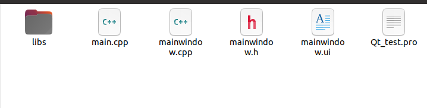
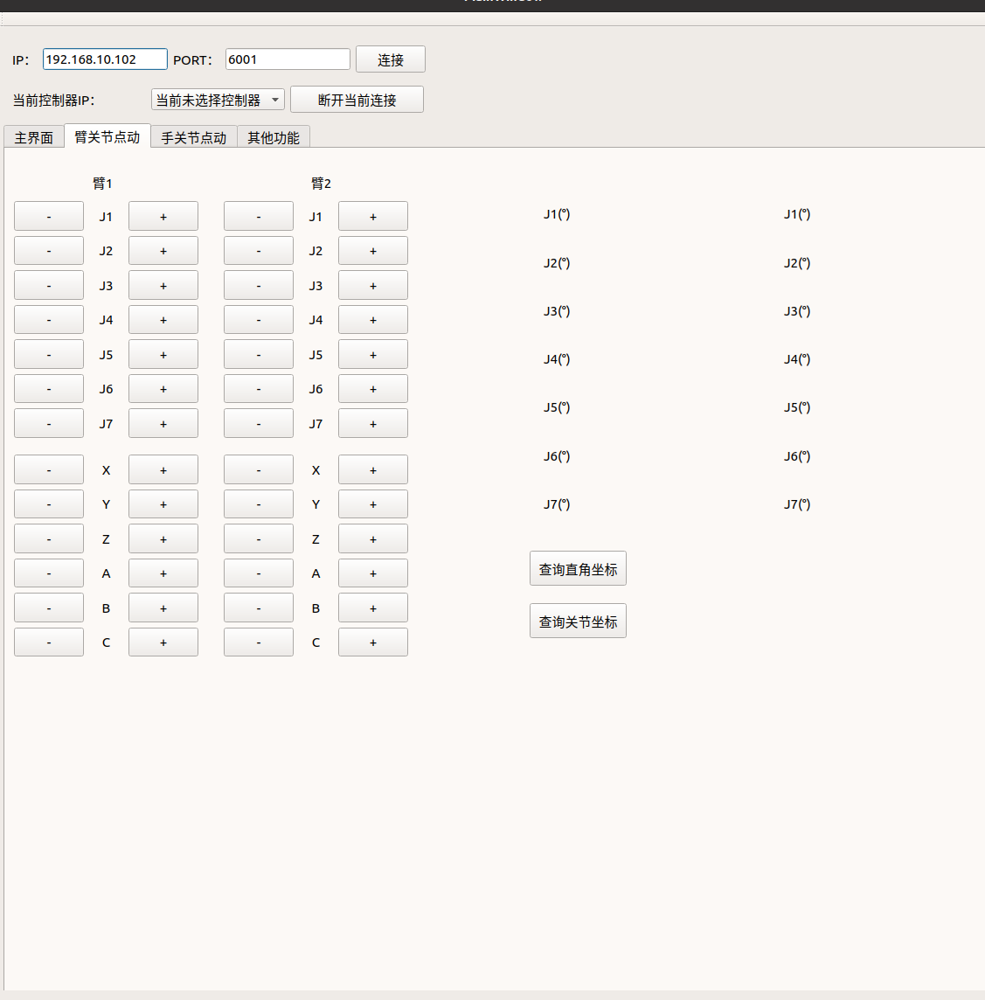

# ROS와 Qt 결합 사용

Qt 프로젝트를 ROS 1과 결합하여 `rosrun` 또는 `roslaunch` 명령으로 실행할 수 있도록 합니다. 핵심 아이디어는 Qt 프로젝트를 ROS 기능 패키지로 변환하고 CMakeLists.txt를 올바르게 구성하는 것입니다. 다음은 전체 단계입니다.

## 1. g++ 버전 확인

Qt5는 g++ 4.8 이상 버전이 필요합니다:

```bash
g++ --version
gcc --version
```

## 2. ROS 작업 공간 생성

```bash
source /opt/ros/noetic/setup.bash
mkdir -p ~/inexbot/src
cd ~/inexbot/src
catkin_create_pkg Qt_test roscpp std_msgs
```

## 3. Qt 프로젝트 구조 조정

먼저 Qt 프로젝트를 생성하고, 구성 파일은 다음과 같습니다. 여기서 `libs`는 라이브러리 파일 `.so` 및 그것이 포함하는 헤더 파일 `.h`입니다:




Qt 프로젝트는 ROS 기능 패키지로 사용되기 위해 구조를 약간 조정해야 하며, 다음과 같습니다:


여기서 원래 프로젝트의 `main.cpp`, `mainwindow.cpp`, `Qt_test.pro` 파일을 `src`에 넣고, `mainwindow.h`는 `include/Qt_test`에 넣습니다:


## 4. CMakeLists.txt 수정

이것이 가장 핵심적인 단계입니다. 기능 패키지 하위의 `CMakeLists.txt` 파일을 수정하여 Qt 프로젝트를 컴파일할 수 있도록 해야 합니다. ROS는 CMake를 사용하고 Qt는 일반적으로 qmake를 사용하지만, CMake의 `find_package`를 통해 Qt를 찾을 수 있습니다.

```cmake
cmake_minimum_required(VERSION 3.0.2)
project(Qt_test)

# Catkin 및 ROS 패키지 찾기
find_package(catkin REQUIRED COMPONENTS
  roscpp
  std_msgs
)

# C++ 표준 설정
set(CMAKE_CXX_STANDARD 11)
set(CMAKE_CXX_STANDARD_REQUIRED ON)

# Qt5 찾기
set(Qt5_DIR "/usr/lib/x86_64-linux-gnu/cmake/Qt5")
find_package(Qt5 COMPONENTS Core Widgets REQUIRED)

# Catkin 패키지 구성
catkin_package(
  CATKIN_DEPENDS roscpp std_msgs
)

# 포함 디렉터리
include_directories(
  include
  /opt/ros/noetic/include
  ${catkin_INCLUDE_DIRS}
  ${Qt5Widgets_INCLUDE_DIRS}
)

# 자동 처리 설정
set(CMAKE_AUTOMOC ON)
set(CMAKE_AUTORCC ON)
set(CMAKE_AUTOUIC ON)  # 이 줄이 존재하는지 확인

# 리소스 파일 처리 (.qrc 파일이 있는 경우)
file(GLOB RESOURCE_FILES "*.qrc")
qt5_add_resources(QT_RESOURCES ${RESOURCE_FILES})

# 소스 파일
set(SRC_FILES
  src/main.cpp
  src/mainwindow.cpp
)

# 헤더 파일
set(HEADER_FILES
  include/Qt_test/mainwindow.h
  libs/include/cpp_interface/nrc_api.h
  libs/include/cpp_interface/nrc_interface.h
)

# 라이브러리 경로 추가
link_directories(${PROJECT_SOURCE_DIR}/libs)

# 실행 파일 생성
add_executable(${PROJECT_NAME}
  ${SRC_FILES}
  ${HEADER_FILES}
  ${QT_UI_HEADERS}
  ${QT_RESOURCES}
)

# 라이브러리 링크
target_link_libraries(${PROJECT_NAME}
  ${catkin_LIBRARIES}
  Qt5::Widgets
  Qt5::Core
  nrc_host
)

# 실행 파일 설치
install(TARGETS ${PROJECT_NAME}
  RUNTIME DESTINATION ${CATKIN_PACKAGE_BIN_DESTINATION}
)

# 라이브러리 파일 설치 (선택 사항)
install(FILES libs/libnrc_host.so
  DESTINATION ${CATKIN_PACKAGE_LIB_DESTINATION}
)
```

**설명:**

- `qt5_add_resources`: `.qrc` 리소스 파일을 실행 파일에 임베드합니다;
- `CMAKE_AUTOMOC`, `CMAKE_AUTORCC`, `CMAKE_AUTOUIC`: Qt 메타 오브젝트 컴파일러, 리소스 컴파일러, UI 변환을 자동 처리합니다;
- 소스 파일 경로(예: `src/main.cpp`)가 올바른지 확인합니다.

## 5. 기능 패키지 컴파일

작업 공간 루트 디렉터리로 돌아가 컴파일합니다:

```bash
cd ~/inexbot
catkin_make
```

컴파일에 성공하면, `~/inexbot/devel/lib/Qt_test/` 디렉터리에서 생성된 실행 파일 `Qt_test`를 찾을 수 있어야 합니다:


## 6. 실행

```bash
# 먼저 roscore가 실행 중인지 확인
roscore

# 그런 다음 노드 실행
source ~/inexbot/devel/setup.bash
rosrun Qt_test Qt_test
```



## 자주 묻는 질문 및 팁

- **환경 변수**: 터미널에서 이미 `source /opt/ros/noetic/setup.bash`와 `source ~/inexbot/devel/setup.bash`를 실행했는지 확인합니다;
- **Qt 버전**: ROS Noetic은 기본적으로 Ubuntu 20.04를 기반으로 하며, Qt5 버전은 5.12입니다. 프로젝트가 해당 버전과 호환되는지 확인해야 합니다;
- **의존성**: 프로젝트가 다른 ROS 패키지(예: rviz, tf 등)에 의존하는 경우, `catkin_create_pkg`와 `find_package(catkin ...)`에 추가해야 합니다.
