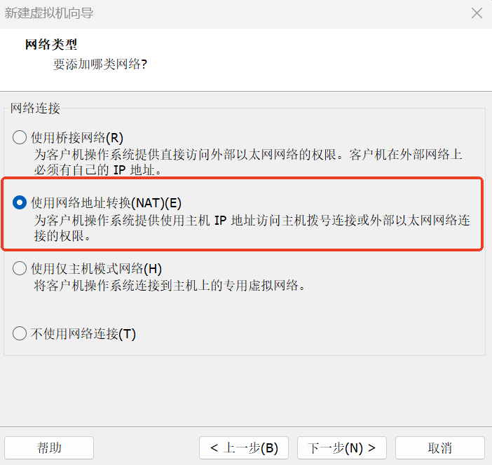
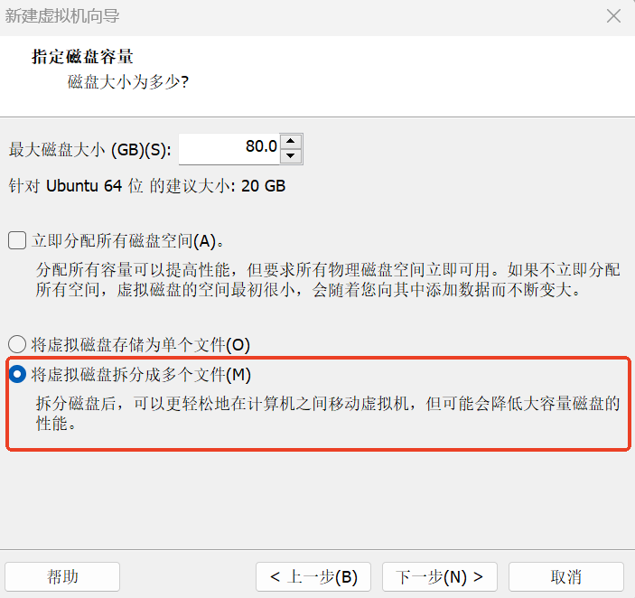
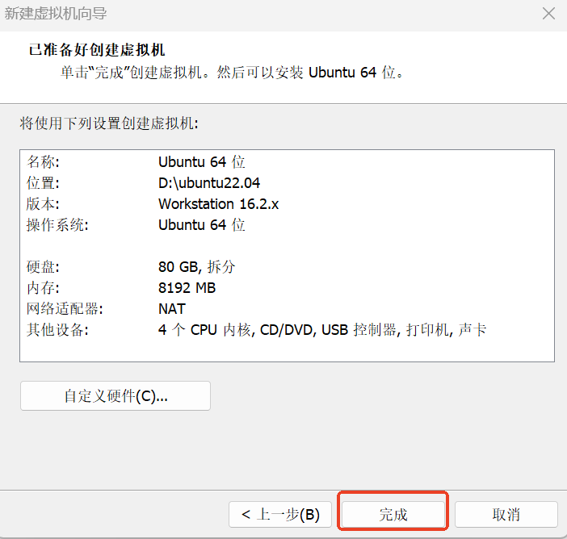
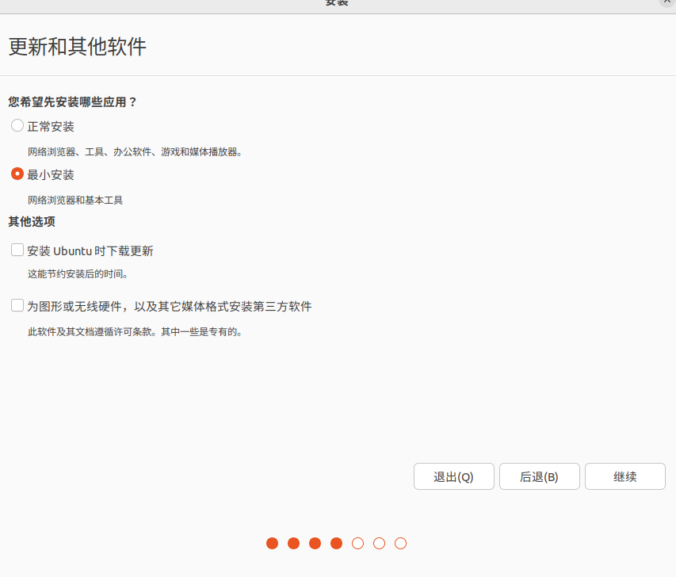
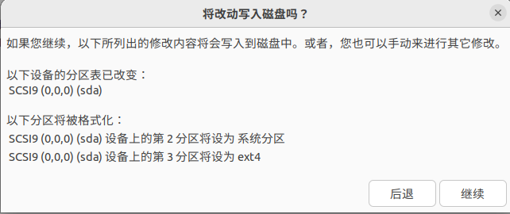
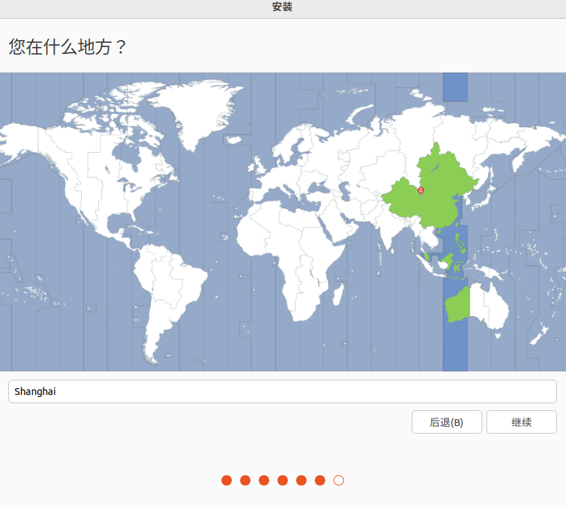
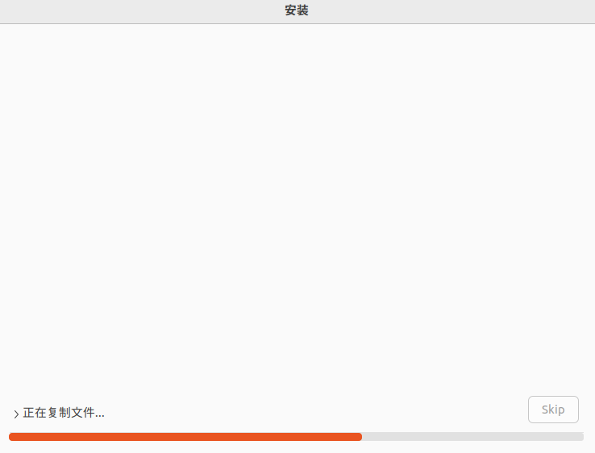

# Ubuntu 22.04 설치

본 문서는 VMware를 통해 Ubuntu 22.04 가상 머신을 설치하는 전체 단계를 설명합니다. 칭화대학교(Tsinghua) 오픈 소스 미러 사이트를 사용하여 이미지를 다운로드하므로, 설치 시 수동으로 소스를 교체하는 단계를 생략할 수 있습니다.

## 이미지 다운로드

칭화대학교 오픈 소스 미러 사이트에서 Ubuntu 22.04 LTS 이미지를 다운로드합니다:

https://mirrors.tuna.tsinghua.edu.cn/ubuntu-releases/22.04/

## 가상 머신 생성

### VMware 구성 단계

1. VMware를 열고 **새 가상 머신 만들기**를 클릭하여 가상 머신 환경 구성을 시작합니다.

2. **사용자 지정(고급)**을 선택하고 **다음**을 클릭합니다.

3. VMware 버전에 따라 하드웨어 호환성을 선택하고 **다음**을 클릭합니다.

4. **나중에 운영 체제를 설치합니다**를 선택하고 **다음**을 클릭합니다.

5. **Linux**를 선택하고, 버전을 **Ubuntu 64비트**로 선택한 뒤 **다음**을 클릭합니다.

6. 가상 머신 이름과 설치 위치를 설정합니다 (C 드라이브에는 두지 않는 것을 권장), **다음**을 클릭합니다.

7. 프로세서 수와 코어 수를 설정하고 **다음**을 클릭합니다.

8. 메모리를 구성합니다 (4GB 이상 권장), **다음**을 클릭합니다.

9. **네트워크 주소 변환(NAT) 사용**을 선택하고 **다음**을 클릭합니다.

10. 기본 추천 구성대로 **다음**을 클릭합니다.

11. **SCSI(S)**를 선택하고 **다음**을 클릭합니다.

12. **새 가상 디스크 만들기**를 선택하고 **다음**을 클릭합니다.

13. 디스크 용량을 할당합니다 (80GB 권장, 필요에 따라 조정 가능), **가상 디스크를 여러 파일로 분할**을 선택하고 **다음**을 클릭합니다.

14. **다음**을 클릭합니다.

15. **하드웨어 사용자 지정**을 클릭하여 프린터를 제거합니다 (리소스 절약).

16. **새 CD/DVD (SATA)**를 선택하고, **ISO 이미지 파일 사용**을 클릭한 다음 다운로드한 Ubuntu 이미지 파일을 찾아 선택하고 **닫기**를 클릭합니다.

17. **완료**를 클릭한 다음 **이 가상 머신 켜기**를 클릭합니다.

## Ubuntu 22.04 설치

### 가상 머신 부팅

1. **Try or install ubuntu**를 선택하고 Enter를 누릅니다.

2. 왼쪽 아래 드롭다운에서 **中文(간체)**(중국어 간체)를 선택하고 **Ubuntu 설치**를 클릭합니다.

### 설치 옵션 구성

1. **계속**을 클릭합니다.

2. **일반 설치** 또는 **최소 설치**를 선택하고 **계속**을 클릭합니다.

3. **디스크 전체를 삭제하고 Ubuntu 설치**를 선택하고 **지금 설치**를 클릭합니다.

4. **계속**을 클릭합니다.

5. **계속**을 클릭합니다.

6. 사용자 이름과 비밀번호를 설정하고 **계속**을 클릭한 다음, 설치가 완료될 때까지 기다립니다.

### 초기 구성

1. 재부팅 후 **건너뛰기**를 클릭합니다.

2. 다음 몇 단계는 안내에 따라 다음을 클릭하고, 마지막에 **완료**를 클릭합니다. 알림 창이 나타나면 **나중에 알림**을 클릭합니다.

