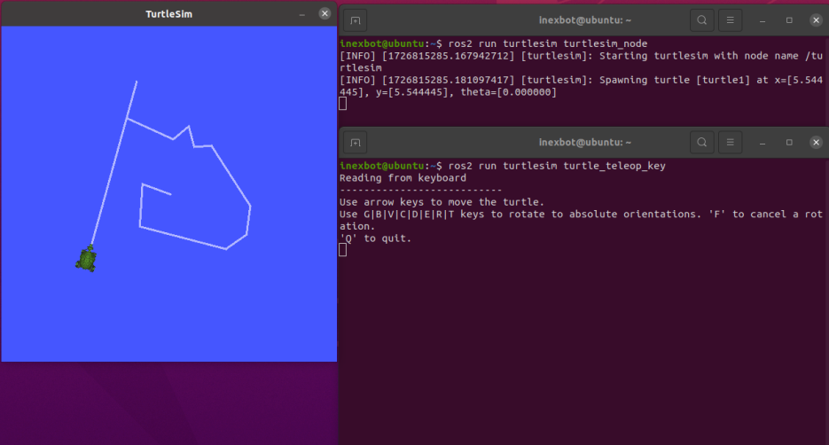

# ROS 2 설치

본 문서는 Ubuntu 20.04 이상의 버전에서 ROS 2를 설치하는 전체 단계를 설명하며, Ubuntu 22.04 + ROS 2 Humble을 예시로 듭니다.

## 준비 작업

### Ubuntu 버전 확인

```bash
lsb_release -a
```

Ubuntu 22.04는 ROS 2 Humble 버전에 해당합니다. Foxy 이후 버전에서부터 Ubuntu 22.04를 지원하기 시작했으며, 더 자세한 버전 대응 관계는 ROS 공식 문서를 참고할 수 있습니다.


## 방법 1: 수동 설치

### 1. 기본 환경 구성

#### locale 설정

시스템이 UTF-8 인코딩을 지원하는지 확인합니다:

```bash
sudo apt update && sudo apt install locales
sudo locale-gen en_US en_US.UTF-8
sudo update-locale LC_ALL=en_US.UTF-8 LANG=en_US.UTF-8
export LANG=en_US.UTF-8
```

#### 소프트웨어 소스 구성

```bash
sudo apt install software-properties-common
sudo add-apt-repository universe
```

#### ROS 2 GPG key 추가

```bash
sudo apt update && sudo apt install curl gnupg2 -y
sudo curl -sSL https://gitee.com/tyx6/rosdistro/raw/master/ros.key -o /usr/share/keyrings/ros-archive-keyring.gpg
```

#### 소프트웨어 저장소 추가

**공식 소스:**

```bash
echo "deb [arch=$(dpkg --print-architecture) signed-by=/usr/share/keyrings/ros-archive-keyring.gpg] http://packages.ros.org/ros2/ubuntu $(. /etc/os-release && echo $UBUNTU_CODENAME) main" | sudo tee /etc/apt/sources.list.d/ros2.list > /dev/null
```

**칭화(Tsinghua) 미러 (국내 사용 권장):**

```bash
echo "deb [arch=$(dpkg --print-architecture) signed-by=/usr/share/keyrings/ros-archive-keyring.gpg] https://mirrors.tuna.tsinghua.edu.cn/ros2/ubuntu $(. /etc/os-release && echo $UBUNTU_CODENAME) main" | sudo tee /etc/apt/sources.list.d/ros2.list > /dev/null
```

### 2. ROS 2 설치

#### 시스템 업데이트

```bash
sudo apt update
sudo apt upgrade
```

#### ROS 2 설치

```bash
sudo apt install ros-humble-desktop
```

#### 환경 변수 구성

```bash
echo "source /opt/ros/humble/setup.bash" >> ~/.bashrc
source ~/.bashrc
```

### 3. 설치 검증

#### 통신 기능 테스트

터미널 1, publisher(발행자) 시작:

```bash
ros2 run demo_nodes_cpp talker
```

정상이면 다음과 같은 정보가 표시됩니다:


터미널 2, subscriber(구독자) 시작:

```bash
ros2 run demo_nodes_py listener
```

정상이면 다음과 같은 정보가 표시됩니다:


두 터미널에 모두 `Hello World` 문자열이 표시되면 통신이 정상이라는 것을 의미합니다.

#### 작은 거북이 시뮬레이터 테스트

터미널 1, 거북이 시뮬레이터 시작:

```bash
ros2 run turtlesim turtlesim_node
```

터미널 2, 키보드 제어 시작:

```bash
ros2 run turtlesim turtle_teleop_key
```

효과는 아래 그림과 같습니다:



### 4. rosdep 구성

rosdep은 ROS의 의존성 관리 도구로, 일부 기능 패키지 소스 코드를 컴파일할 때 시스템 의존성 설치에 사용해야 합니다.

rosdep은 GitHub 해외 서버에 접근하므로, 주소를 국내 미러로 교체할 것을 권장합니다.

#### rosdep 설치

```bash
sudo apt install python3-rosdep
```

#### 자동 구성 수정 (권장)

원클릭 수정 스크립트를 다운로드하여 실행합니다:

```bash
wget https://gitee.com/tyx6/mytools/raw/main/ros/Mrosdep.py
sudo python3 Mrosdep.py
```

참고: 이 스크립트는 rosdistro 디렉터리에서 동작합니다. 스크립트 실행이 실패하면 아래 방법으로 수동 수정할 수 있습니다.

#### 수동 구성 수정

다음 4개의 파일을 수동으로 수정하여 `https://raw.githubusercontent.com/...`을 `https://gitee.com/...`로 교체해야 합니다:

```bash
sudo gedit /usr/lib/python3/dist-packages/rosdep2/sources_list.py    # 약 64번째 줄
sudo gedit /usr/lib/python3/dist-packages/rosdistro/__init__.py       # 약 68번째 줄
sudo gedit /usr/lib/python3/dist-packages/rosdep2/gbpdistro_support.py # 약 34번째 줄
sudo gedit /usr/lib/python3/dist-packages/rosdep2/rep3.py               # 약 36번째 줄
```

#### 초기화 완료

```bash
sudo rosdep init
rosdep update
```

참고: 항상 구성이 실패하는 경우 방법 2의 원클릭 구성을 시도해 볼 수 있습니다.

## 방법 2: 원클릭 설치

小鱼(小鱼, fishros)의 원클릭 설치 스크립트를 사용하면 ROS 2 설치, rosdep 구성, 환경 변수 설정을 자동으로 완료할 수 있습니다:

```bash
wget http://fishros.com/install -O fishros && . fishros
```


