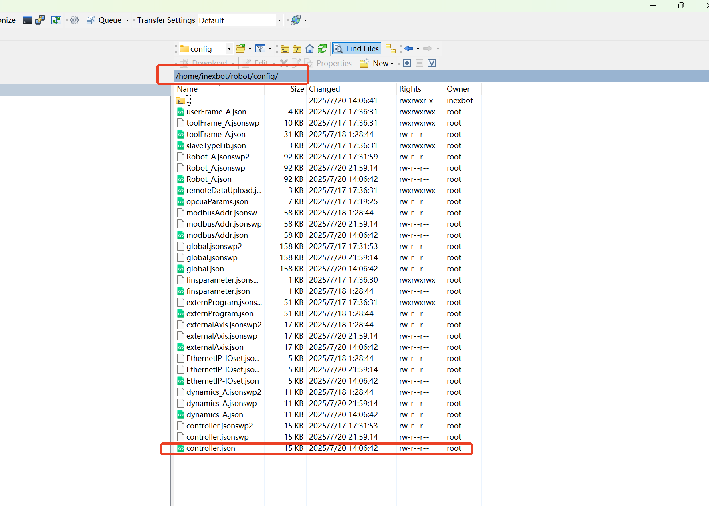
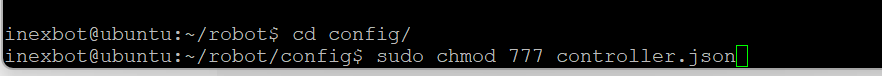
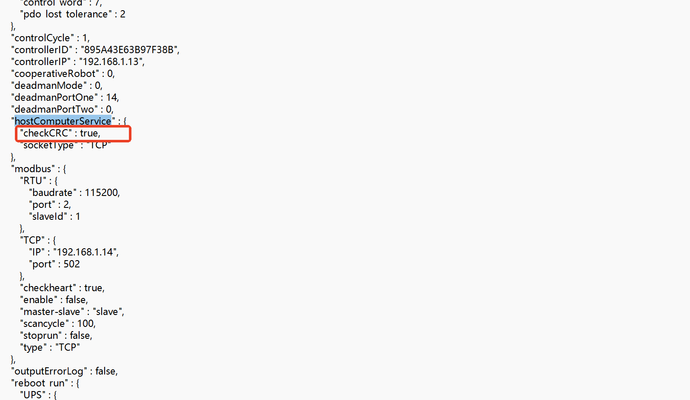
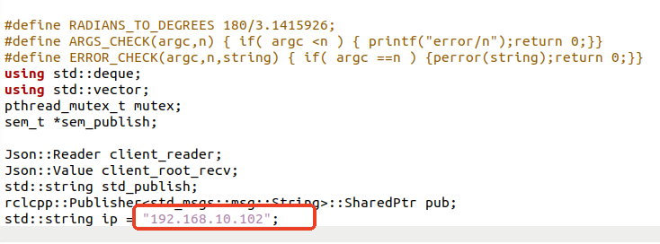
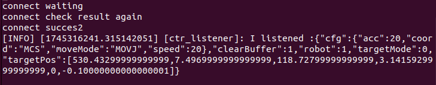
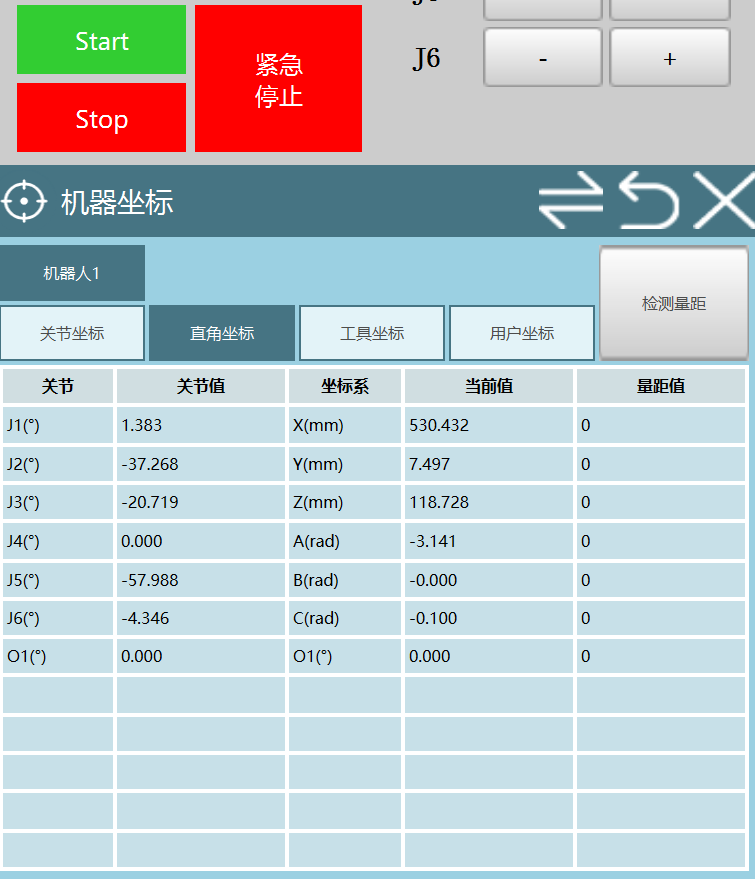
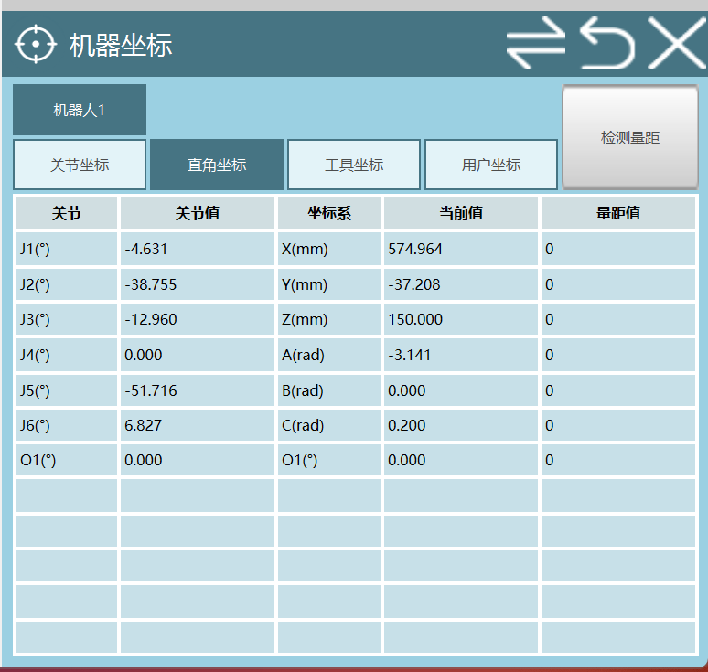

# 7000 통신 패키지 사용 튜토리얼

본 문서는 ROS 2와 inexbot 컨트롤러 사이에서 socket 프로토콜, 7000 포트를 통해 통신하는 구체적인 절차를 소개합니다.

## 1. 컨트롤러 설정 수정

ROS 2 기능 패키지는 7000 포트를 통해 컨트롤러와 통신합니다. 사용 전에 SSH로 컨트롤러에 로그인하여 `controller.json` 설정 파일을 수정해야 합니다.

### SSH로 컨트롤러 로그인

```bash
ssh inexbot@192.168.x.x  # 실제 컨트롤러 IP로 교체
```

비밀번호: `123`

### 파일 권한 수정

```bash
cd robot/
cd config/
sudo chmod 777 controller.json
```



### CRC 검사 비활성화

`controller.json`을 열고 `hostComputerService` 노드 아래에서 `checkCRC`를 찾아 `true`를 `false`로 변경합니다.





## 2. 작업 공간 생성

```bash
mkdir -p ~/inexbot/src
```

## 3. 기능 패키지 컴파일

`inexbot_service` 기능 패키지를 `~/inexbot/src`에 넣은 후 컴파일합니다:

```bash
cd ~/inexbot/
colcon build
```

## 4. 통신 노드 시작

### nrc_rostopic_joint 시작 (컨트롤러 연결)

```bash
source install/setup.bash
ros2 run inexbot_service nrc_rostopic_joint
```

터미널에 아래 출력이 나타나면 컨트롤러 연결에 성공한 것입니다. 컨트롤러 IP는 모델에 따라 다를 수 있으므로 실제 상황에 맞춰 `nrc_rostopic_joint.cpp`에서 IP를 수정해야 합니다.




### rostopic_joint 시작 (데모 프로그램)

```bash
source install/setup.bash
ros2 run inexbot_service rostopic_joint
```


## 데모 프로그램 기능 설명

`rostopic_joint.cpp`는 데모로, 고객에게 ROS 2와 inexbot 컨트롤러 간의 통신을 시연하기 위한 것입니다. `input your number` 문구가 나타나면 1-6을 입력할 수 있으며, 각 숫자는 서로 다른 기능을 나타냅니다:

|| 숫자 | 기능 |
||------|------|
|| 1 | 컨트롤러에서 IO 정보 읽기 |
|| 2 | 컨트롤러에 IO 정보 쓰기 |
|| 3 | 질의 명령 중지 |
|| 4 | 로봇의 실제 좌표 읽기 |
|| 5 | 로봇을 자세 1로 이동 |
|| 6 | 로봇을 자세 2로 이동 |

### 핵심 코드 예시

```cpp
switch(s_number) {
    case 1: { // IO 읽기
        Json::Value rootSend;
        Json::FastWriter fWriter;
        rootSend["channel"] = 1;
        rootSend["stop"] = 0;
        rootSend["robot"] = 1;
        rootSend["mode"] = 1;      // 0:한 번만 응답, 1:주기적으로 응답
        rootSend["interval"] = 1000; // 1000ms마다 한 번 응답
        rootSend["queryType"][(unsigned int)0] = "IO";
        rootSend["typeCfg"]["IO"][(unsigned int)0] = "DO1";
        rootSend["typeCfg"]["IO"][1] = "DO2";
        rootSend["typeCfg"]["IO"][2] = "DO3";
        rootSend["typeCfg"]["IO"][3] = "DO4";
        rootSend["typeCfg"]["IO"][4] = "DO5";
        str = fWriter.write(rootSend);
        break;
    }
    case 2: { // IO 쓰기
        Json::Value rootSend_1;
        Json::FastWriter fWriter_1;
        rootSend_1["IO"]["DO1"] = 1;
        rootSend_1["IO"]["DO2"] = 0;
        rootSend_1["IO"]["DO3"] = 1;
        rootSend_1["IO"]["DO4"] = 0;
        str = fWriter_1.write(rootSend_1);
        break;
    }
    case 3: { // 질의 중지
        printf("tell me channel number is ???\n");
        int channel_num;
        scanf("%d", &channel_num);
        Json::Value rootSend;
        Json::FastWriter fWriter;
        rootSend["channel"] = channel_num; // 중지할 채널, 최대 9개 지원
        rootSend["stop"] = 1;
        str = fWriter.write(rootSend);
        break;
    }
    case 4: { // 실제 좌표 읽기
        Json::Value rootSend;
        Json::FastWriter fWriter;
        rootSend["channel"] = 2;
        rootSend["stop"] = 0;
        rootSend["robot"] = 1;
        rootSend["mode"] = 1;
        rootSend["interval"] = 1000;
        rootSend["queryType"][(unsigned int)0] = "realPosMCS";
        str = fWriter.write(rootSend);
        break;
    }
    case 5: { // 자세1로 이동 제어
        Json::Value rootSend;
        Json::FastWriter fWriter;
        rootSend["robot"] = 1;
        rootSend["clearBuffer"] = 1;
        rootSend["targetMode"] = 0;
        rootSend["cfg"]["coord"] = "MCS";
        rootSend["cfg"]["speed"] = 20;
        rootSend["cfg"]["acc"] = 20;
        rootSend["cfg"]["moveMode"] = "MOVJ";
        rootSend["targetPos"][0] = 530.433;
        rootSend["targetPos"][1] = 7.497;
        rootSend["targetPos"][2] = 118.728;
        rootSend["targetPos"][3] = 3.141593;
        rootSend["targetPos"][4] = 0;
        rootSend["targetPos"][5] = -0.1;
        str = fWriter.write(rootSend);
        break;
    }
    case 6: { // 자세2로 이동 제어
        Json::Value rootSend;
        Json::FastWriter fWriter;
        rootSend["robot"] = 1;
        rootSend["clearBuffer"] = 1;
        rootSend["targetMode"] = 0;
        rootSend["cfg"]["coord"] = "MCS";
        rootSend["cfg"]["speed"] = 20;
        rootSend["cfg"]["acc"] = 20;
        rootSend["cfg"]["moveMode"] = "MOVJ";
        rootSend["targetPos"][0] = 574.964434;
        rootSend["targetPos"][1] = -37.208582;
        rootSend["targetPos"][2] = 150;
        rootSend["targetPos"][3] = 3.141593;
        rootSend["targetPos"][4] = 0;
        rootSend["targetPos"][5] = 0.2;
        str = fWriter.write(rootSend);
        break;
    }
    default:
        RCLCPP_INFO(this->get_logger(), "scanf is: %d", s_number);
        break;
}
```

## 컨트롤러 측 설정

먼저, 티치 펜던트를 열고 새 프로젝트를 생성한 다음 그 프로젝트를 엽니다.


명령을 삽입하고 선택: **모션 제어 → 외부 포인트**


그런 다음 티치 펜던트를 실행 모드로 전환하고 프로젝트를 실행합니다.


모니터링을 통해 현재 로봇이 직교 좌표계에서의 위치를 확인할 수 있습니다.


`rostopic_joint.cpp`를 실행 중인 터미널에서 5를 입력하면, `nrc_rostopic_joint.cpp`를 실행 중인 터미널에 다음과 같은 효과가 나타납니다.



로봇이 움직이기 시작하고, 최종적으로 직교 좌표계에서의 위치가 컨트롤러에 보낸 위치로 바뀝니다. 참고: 작동하지 않으면 `START`를 눌러 보십시오.



그런 다음 `rostopic_joint.cpp`를 실행 중인 터미널에서 6을 입력하고 `START`를 클릭하면 로봇이 case 6의 위치로 이동합니다.

