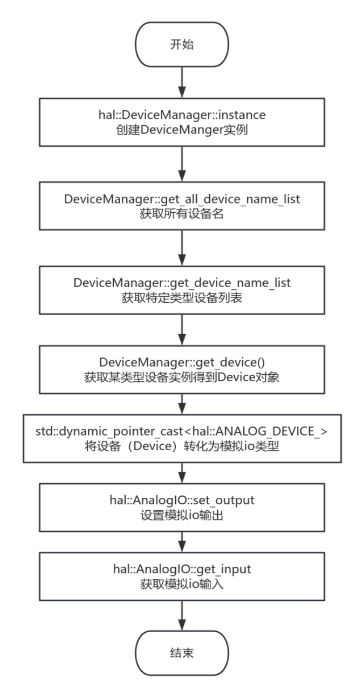

# HAL

# 소개

INEXBOT EtherCAT 마스터 컨트롤러의 마스터 지터 시간은 20us 미만으로, 산업 자동화 제어 시스템 개발에 사용될 수 있으며, 특히 로봇, 서보 모터 제어 등 실시간성이 요구되는 시나리오에 적합합니다.

### 버전 정보

| 이차 개발 버전 | 회사 |
| --- | --- |
| 1.0.0 | INEXBOT |

### 버전 업데이트 이력

| 버전 | 수정 일자 | 수정자 | 설명 |
| --- | --- | --- | --- |
| 1.0.0 | 20250310 | EA | 초기 버전 |

# 개요

### 문서 소개

본 문서는 사용자가 INEXBOT의 libhal_sdk C++ 라이브러리를 사용하는 것을 돕기 위해 작성되었습니다.

### libhal_sdk 라이브러리 소개

해당 라이브러리는 INEXBOT 시스템의 하드웨어 추상화 계층으로, 사용자 인터페이스를 통합하여 사용자가 편리하게 사용할 수 있도록 합니다.

### 개발 환경 요구 사항

| 운영 체제 | Ubuntu 20.04 LTS |
| --- | --- |
| 시스템 아키텍처 | x86_64 |
| 컴파일러 | GCC version 9.4.0/GLIBC 2.31-0ubuntu9.2 &lt; br/>GCC version 4.8.2/EGLIBC 2.19-0ubuntu6.15 |
| 의존성 라이브러리 | Libpthread、librt、libdl、libm |

| --- | --- |
# 함수 라이브러리 API 설명

## 사용 개요

1. 정적 라이브러리 파일 `libhal_sdk.a`를 프로젝트의 `lib` 디렉터리에 복사합니다.

2. `include` 폴더의 헤더 파일을 프로젝트의 `include` 디렉터리에 복사합니다.

3. 컴파일 시 `libhal_sdk.a` 라이브러리를 링크합니다.

[demo 다운로드]

## 클래스 목록

| 클래스명 | 의미 |
| --- | --- |
| Device 클래스 | 이 클래스는 모든 디바이스 객체의 기본 클래스입니다. |
| DeviceManager 클래스 | 이 클래스는 device 디바이스의 매니저 클래스입니다. |
| AnalogIO 클래스 | 이 클래스는 아날로그 IO 디바이스의 추상화입니다. |
| CANDevice 클래스 | 이 클래스는 CAN 디바이스의 추상화입니다. |
| DigitalIO 클래스 | 이 클래스는 디지털 IO의 추상화입니다. |
| EncoderDevice 클래스 | 이 클래스는 엔코더 디바이스의 추상화입니다. |
| PwmDevice 클래스 | 이 클래스는 PWM 디바이스의 추상화입니다. |
| SerialDevice 클래스 | 이 클래스는 Serial 디바이스의 추상화입니다. |
| UpsDevice 클래스 | 이 클래스는 UPS 디바이스의 추상화입니다. |

## hal_sdk 사용 흐름도


## 사용 예시

### demo.cpp

```
#include <hal/device_manager.h>
#include <hal/devices/digital_io.h>
#include <hal/devices/analog_io.h>
#include <hal/devices/can_device.h>
#include <hal/devices/pwm_device.h>
#include <hal/devices/encoder_device.h>
#include <hal/devices/ups_device.h>
#include <iostream>
#include <thread>
#include <chrono>


void print_device_info(const std::vector<std::string>& devices) {
    std::cout << "Devices:" << std::endl;
    for (const auto& name : devices) {
        std::cout << "- " << name << std::endl;
    }
    std::cout << std::endl;
}


int main() {
    auto& manager = hal::DeviceManager::instance();
    
    try {
        // 1. 디바이스 매니저의 조회 기능 시연
        std::cout << "\n=== 디바이스 조회 ===" << std::endl;
        auto all_devices = manager.get_all_device_name_list();
        std::cout << "모든 디바이스:" << std::endl;
        print_device_info(all_devices);


        // 특정 타입의 디바이스 목록 가져오기
        auto dio_devices = manager.get_device_name_list(hal::DeviceType::DIGITAL_IO_);
        std::cout << "디지털 IO 디바이스:" << std::endl;
        print_device_info(dio_devices);


        // 2. DeviceManager를 통해 디바이스를 가져와 사용
        std::cout << "\n=== 디바이스 사용 예시 ===" << std::endl;
        
        // 디지털 IO 사용
        if (auto dio_dev = manager.get_device(hal::DeviceType::DIGITAL_IO_, "DIO_1")) {
            auto digital_io = std::dynamic_pointer_cast<hal::DigitalIO>(dio_dev);
            digital_io->set_output(2, true);
            std::cout << "DIO_1 channel 3: " << digital_io->get_input(3) << std::endl;
        }


        // 아날로그 CAN 디바이스 사용
        if (auto can_dev = manager.get_device(hal::DeviceType::CAN_DEVICE_, "CAN_1")) {
            auto can_device = std::dynamic_pointer_cast<hal::CANDevice>(can_dev);
            can_device->open(0);
            can_device->set_parameters(0, 500000);
            unsigned char tx_data[8] = {0x11, 0x22, 0x33, 0x44};
            can_device->send(0, 0x123, tx_data, 4);
            unsigned int rx_id;
            unsigned char rx_data[16];
            unsigned int rx_len = can_device->receive(0, rx_id, rx_data);
            std::cout << "CAN_1 received length: " << rx_len << std::endl;
        }


        // 3. 디바이스 존재 여부 확인
        std::cout << "\n=== 디바이스 존재 여부 확인 ===" << std::endl;
        std::cout << "DIO_1 exists: " 
                  << manager.is_device_exist(hal::DeviceType::DIGITAL_IO_, "DIO_1") << std::endl;


    } catch (const std::exception& e) {
        std::cerr << "Error: " << e.what() << std::endl;
        return 1;
    }
    
    return 0;
} 
```
# 함수 라이브러리 API 상세 설명

## DeviceType 열거형

```
enum class DeviceType {
    NULL_,
    ANALOG_IO_,
    CAN_DEVICE_,
    DIGITAL_IO_,
    ENCODER_DEVICE_,
    PWM_DEVICE_,
    SERIAL_DEVICE_,
    UPS_DEVICE_,
    CUSTOM_
};
```
| 변수명 | 의미 |
| --- | --- |
| NULL_ | 빈 디바이스 |
| DIGITAL_IO_ | 디지털 입출력 디바이스 |
| ANALOG_IO_ | 아날로그 입출력 디바이스 |
| CAN_DEVICE_ | CAN 버스 디바이스 |
| PWM_DEVICE_ | 펄스 폭 변조 디바이스 |
| ENCODER_DEVICE_ | 엔코더 디바이스 |
| UPS_DEVICE_ | 무정전 전원 공급 장치 디바이스 |
| SERIAL_DEVICE_ | 시리얼 포트 디바이스 |
| CUSTOM_ | 사용자 정의 디바이스 |

## Device 클래스

이 클래스는 모든 디바이스 객체의 기본 클래스입니다.

### Device 클래스 정의

```
class Device {
public:
    Device(DeviceType device_type, const std::string& device_name);
    virtual ~Device() = default;
   
    bool valid() const { return valid_; }
    DeviceType get_device_type() const { return device_type_; }
    std::string get_device_name() const { return device_name_; }

protected:
    bool valid_{false};
    DeviceType device_type_;
    std::string device_name_;
};
} 
```
### Device 클래스 멤버 함수

| 함수 이름 | 함수 기능 | 클래스 접근 권한 |
| --- | --- | --- |
| Device | 생성자 | Public |
| get_device_type | 디바이스 타입 가져오기 | public |
| get_device_name | 디바이스 이름 가져오기 | public |
| valid | 디바이스 사용 가능 여부 가져오기 | public |

### Device 클래스 멤버 변수

| 변수 이름 | 변수 의미 | 클래스 접근 권한 |
| --- | --- | --- |
| valid_ | 사용 가능 여부 | protected |
| device_type_ | 디바이스 타입 | protected |
| device_name_ | 디바이스 이름 | protected |

### 멤버 함수 기능 상세 설명

#### Device

| 함수 프로토타입 | Device(DeviceType device_type, const std::string& device_name); |
| --- | --- |
| 기능 설명 | 디바이스 타입과 이름을 초기화하는 데 사용되는 생성자입니다. |
| 파라미터 설명 | 입력 파라미터: device_type: 디바이스의 종류를 지정하는 데 사용되는 디바이스 타입. device_name: 디바이스의 이름을 식별하는 데 사용되는 디바이스 이름. |
| 반환값 | 없음 |
| 비고 | 이 생성자는 Device 객체를 생성하고 디바이스 타입과 이름을 초기화하는 데 사용됩니다. |

#### ~Device

| 함수 프로토타입 | virtual ~Device() = default; |
| --- | --- |
| 기능 설명 | Device 객체를 소멸시키는 데 사용되는 소멸자입니다. |
| 파라미터 설명 | 없음 |
| 반환값 | 없음 |
| 비고 | 이 소멸자는 가상 함수로, 파생 클래스의 올바른 소멸을 보장합니다. |

#### valid

| 함수 프로토타입 | bool valid() const; |
| --- | --- |
| 기능 설명 | Device 객체가 유효한지 확인합니다. |
| 파라미터 설명 | 없음 |
| 반환값 | bool 타입 값을 반환하며, true는 Device 객체가 유효함을, false는 무효함을 나타냅니다. |
| 비고 | 이 함수는 Device 객체의 상태가 유효한지 판단하는 데 사용됩니다. |

#### get_device_type

| 함수 프로토타입 | DeviceType get_device_type() const; |
| --- | --- |
| 기능 설명 | Device 객체의 디바이스 타입을 가져옵니다. |
| 파라미터 설명 | 없음 |
| 반환값 | DeviceType 타입 값을 반환하며, Device 객체의 디바이스 타입을 나타냅니다. |
| 비고 | 이 함수는 Device 객체의 디바이스 타입을 가져오는 데 사용됩니다. |

#### get_device_name

| 함수 프로토타입 | std::string get_device_name() const; |
| --- | --- |
| 기능 설명 | Device 객체의 디바이스 이름을 가져옵니다. |
| 파라미터 설명 | 없음 |
| 반환값 | std::string 타입 값을 반환하며, Device 객체의 디바이스 이름을 나타냅니다. |
| 비고 | 이 함수는 Device 객체의 디바이스 이름을 가져오는 데 사용됩니다. |

## DeviceManager 클래스

이 클래스는 device 디바이스의 매니저 클래스입니다.

### 클래스 정의

```
class DeviceManager {
public:
    static DeviceManager &instance();


    int add_device(std::shared_ptr<Device> device);
    int remove_device(DeviceType device_type, const std::string& device_name);
    bool is_device_exist(DeviceType device_type, const std::string& device_name) const;
    
    std::vector<std::string> get_all_device_name_list() const;
    std::vector<std::string> get_device_name_list(DeviceType device_type) const;
    std::vector<std::shared_ptr<Device>> get_device_list(DeviceType device_type) const;
    std::shared_ptr<Device> get_device(DeviceType device_type, const std::string& device_name) const;


private:
    DeviceManager() = default;
    static void register_devices(DeviceManager &manager);
    std::unordered_map<std::string, std::shared_ptr<Device>> devices_;
};
```
### 클래스 멤버 함수

| 함수 이름 | 함수 기능 | 클래스 접근 권한 |
| --- | --- | --- |
| instance | 디바이스 매니저의 싱글톤 인스턴스 가져오기 | public |
| add_device | 디바이스 매니저에 디바이스 추가 | public |
| remove_device | 디바이스 매니저에서 디바이스 삭제 | public |
| is_device_exist | 디바이스 존재 여부 확인 | public |
| get_all_device_name_list | 모든 디바이스의 이름 목록 가져오기 | public |
| get_device_name_list | 특정 타입 디바이스의 이름 목록 가져오기 | public |
| get_device_list | 특정 타입 디바이스의 객체 인스턴스 목록 가져오기 | public |
| get_device | 특정 디바이스 하나 가져오기 | public |
| DeviceManager | 생성자 | private |
| register_devices | 디바이스 등록 | private |

### 클래스 멤버 변수

| 변수 이름 | 변수 의미 | 클래스 접근 권한 |
| --- | --- | --- |
| devices_ | 디바이스 매니저에 마운트된 모든 디바이스 저장 | private |

### 멤버 함수 기능 상세 설명

#### instance

| 함수 프로토타입 | static DeviceManager &instance(); |
| --- | --- |
| 기능 설명 | DeviceManager 클래스의 싱글톤 객체를 가져옵니다. |
| 파라미터 설명 | 없음 |
| 반환값 | DeviceManager 클래스의 싱글톤 객체에 대한 참조를 반환합니다. |
| 비고 | 이 함수는 DeviceManager 클래스의 유일한 인스턴스를 가져오는 데 사용됩니다. |

#### add_device

| 함수 프로토타입 | int add_device(std::shared_ptr`<Device>` device); |
| --- | --- |
| 기능 설명 | 디바이스 매니저에 디바이스를 추가합니다. |
| 파라미터 설명 | 입력 파라미터:<br/>device: 추가할 디바이스 객체 |
| 반환값 | int 타입 값을 반환하며, 0은 성공, 0이 아닌 값은 실패를 나타냅니다. |
| 비고 | 이 함수는 디바이스 매니저에 새로운 디바이스를 추가하는 데 사용됩니다. |

#### remove_device

| 함수 프로토타입 | int remove_device(DeviceType device_type, const std::string& device_name); |
| --- | --- |
| 기능 설명 | 디바이스 매니저에서 디바이스를 제거합니다. |
| 파라미터 설명 | 입력 파라미터:<br/>device_type: 디바이스 타입.<br/>device_name: 제거할 디바이스의 이름. |
| 반환값 | int 타입 값을 반환하며, 0은 성공, 0이 아닌 값은 실패를 나타냅니다. |
| 비고 | 이 함수는 디바이스 매니저에서 지정된 타입과 이름의 디바이스를 제거하는 데 사용됩니다. |

#### is_device_exist

| 함수 프로토타입 | bool is_device_exist(DeviceType device_type, const std::string& device_name) const; |
| --- | --- |
| 기능 설명 | 디바이스 매니저에 지정된 타입과 이름의 디바이스가 존재하는지 확인합니다. |
| 파라미터 설명 | 입력 파라미터:<br/>device_type: 디바이스 타입.<br/>device_name: 확인할 디바이스 이름. |
| 반환값 | bool 타입 값을 반환하며, true는 존재함을, false는 존재하지 않음을 나타냅니다. |
| 비고 | 이 함수는 디바이스 매니저에 지정된 타입과 이름의 디바이스가 존재하는지 확인하는 데 사용됩니다. |

#### get_all_device_name_list

| 함수 프로토타입 | std::vector`<std::string>` get_all_device_name_list() const; |
| --- | --- |
| 기능 설명 | 디바이스 매니저에 있는 모든 디바이스의 이름 목록을 가져옵니다. |
| 파라미터 설명 | 없음 |
| 반환값 | 모든 디바이스 이름을 포함하는 문자열 벡터를 반환합니다. |
| 비고 | 이 함수는 디바이스 매니저에 있는 모든 디바이스의 이름 목록을 가져오는 데 사용됩니다. |

#### get_device_name_list

| 함수 프로토타입 | std::vector`<std::string>` get_device_name_list(DeviceType device_type) const; |
| --- | --- |
| 기능 설명 | 디바이스 매니저에 있는 지정된 타입의 디바이스 이름 목록을 가져옵니다. |
| 파라미터 설명 | 입력 파라미터:<br/>device_type: 이름 목록을 가져올 디바이스 타입. |
| 반환값 | 지정된 타입의 디바이스 이름을 포함하는 문자열 벡터를 반환합니다. |
| 비고 | 이 함수는 디바이스 매니저에 있는 지정된 타입의 디바이스 이름 목록을 가져오는 데 사용됩니다. |

#### get_device_list

| 함수 프로토타입 | std::vector &lt; std::shared_ptr`<Device>`> get_device_list(DeviceType device_type) const; |
| --- | --- |
| 기능 설명 | 디바이스 매니저에 있는 지정된 타입의 디바이스 목록을 가져옵니다. |
| 파라미터 설명 | 입력 파라미터:<br/>device_type: 목록을 가져올 디바이스 타입. |
| 반환값 | 지정된 타입의 디바이스 객체에 대한 shared_ptr 벡터를 반환합니다. |
| 비고 | 이 함수는 디바이스 매니저에 있는 지정된 타입의 디바이스 목록을 가져오는 데 사용됩니다. |

#### get_device

| 함수 프로토타입 | std::shared_ptr`<Device>` get_device(DeviceType device_type, const std::string& device_name) const; |
| --- | --- |
| 기능 설명 | 디바이스 매니저에 있는 지정된 타입과 이름의 디바이스 객체를 가져옵니다. |
| 파라미터 설명 | 입력 파라미터:<br/>device_type: 디바이스 타입.<br/>device_name: 가져올 디바이스 이름. |
| 반환값 | 지정된 타입과 이름의 디바이스에 대한 shared_ptr을 반환합니다. 해당 디바이스가 존재하지 않으면 nullptr을 반환합니다. |
| 비고 | 이 함수는 디바이스 매니저에 있는 지정된 타입과 이름의 디바이스 객체를 가져오는 데 사용됩니다. |

## AnalogIO 클래스

이 클래스는 아날로그 IO 디바이스의 추상화입니다.

### 클래스 정의

```
class AnalogIO : public Device {
public:
    AnalogIO(const std::string& name);
    virtual ~AnalogIO() = default;


    virtual void set_output(int channel, double value) = 0;
    virtual void set_outputs(const std::vector<int>& channels, const std::vector<double>& values) = 0;
    virtual double get_input(int channel) = 0;
    virtual std::vector<double> get_inputs(const std::vector<int>& channels) = 0;
    virtual int get_channel_count() const = 0;
    
    // 채널의 레인지 범위를 가져옵니다
    virtual std::pair<double, double> get_range(int channel) const = 0;
};
```
### 클래스 멤버 함수

| 함수 이름 | 함수 기능 | 클래스 접근 권한 |
| --- | --- | --- |
| AnalogIO | 디바이스 이름을 초기화하는 생성자 | public |
| ~AnalogIO | 소멸자 | public |
| set_output | 단일 출력 채널 값 설정 | public |
| set_outputs | 여러 출력 채널 값 설정 | public |
| get_input | 단일 입력 채널 값 가져오기 | public |
| get_inputs | 여러 입력 채널 값 가져오기 | public |
| get_channel_count | 채널 개수 가져오기 | public |
| get_range | 지정된 채널의 레인지 범위 가져오기 | public |

### 클래스 멤버 변수

| 변수 이름 | 변수 의미 | 클래스 접근 권한 |

| --- | --- | --- |
### AnalogIO 클래스 사용 흐름도



### 멤버 함수 기능 상세 설명

#### AnalogIO

| 함수 프로토타입 | AnalogIO(const std::string& name); |
| --- | --- |
| 기능 설명 | AnalogIO 객체를 초기화하는 데 사용되는 생성자입니다. |
| 파라미터 설명 | 입력 파라미터:<br/>name: 디바이스의 이름을 식별하는 데 사용되는 디바이스 이름. |
| 반환값 | 없음 |
| 비고 | 이 생성자는 AnalogIO 객체를 생성하고 디바이스 타입과 이름을 초기화하는 데 사용됩니다. |

#### ~AnalogIO

| 함수 프로토타입 | virtual ~AnalogIO() = default; |
| --- | --- |
| 기능 설명 | Device 객체를 소멸시키는 데 사용되는 소멸자입니다. |
| 파라미터 설명 | 없음 |
| 반환값 | 없음 |
| 비고 | 이 소멸자는 가상 함수로, 파생 클래스의 올바른 소멸을 보장합니다. |

#### set_output

| 함수 프로토타입 | void set_output(int channel, double value); |
| --- | --- |
| 기능 설명 | 지정된 채널의 아날로그 출력 값을 설정합니다. |
| 파라미터 설명 | 입력 파라미터<br/>channel: 아날로그 출력 채널 번호.<br/>value: 설정할 아날로그 출력 값. |
| 반환값 | 없음 |
| 비고 | 이는 지정된 채널의 아날로그 출력 값을 설정하는 순수 가상 함수입니다. |

#### set_outputs

| 함수 프로토타입 | void set_outputs(const std::vector`<int>`& channels, const std::vector`<double>`& values); |
| --- | --- |
| 기능 설명 | 여러 채널의 아날로그 출력 값을 설정합니다. |
| 파라미터 설명 | 입력 파라미터<br/>channels: 설정할 아날로그 출력 채널 번호를 포함하는 벡터.<br/>values: channels 벡터에 대응하는 아날로그 출력 값 벡터. |
| 반환값 | 없음 |
| 비고 | 이는 여러 채널의 아날로그 출력 값을 설정하는 순수 가상 함수입니다. |

#### get_input

| 함수 프로토타입 | double get_input(int channel); |
| --- | --- |
| 기능 설명 | 지정된 채널의 아날로그 입력 값을 가져옵니다. |
| 파라미터 설명 | 입력 파라미터<br/>channel: 아날로그 입력 채널 번호. |
| 반환값 | double 타입 값을 반환하며, 지정된 채널의 아날로그 입력 값을 나타냅니다. |
| 비고 | 이는 지정된 채널의 아날로그 입력 값을 가져오는 순수 가상 함수입니다. |

#### get_inputs

| 함수 프로토타입 | std::vector`<double>` get_inputs(const std::vector`<int>`& channels); |
| --- | --- |
| 기능 설명 | 여러 채널의 아날로그 입력 값을 가져옵니다. |
| 파라미터 설명 | 입력 파라미터<br/>channels: 가져올 아날로그 입력 채널 번호를 포함하는 벡터. |
| 반환값 | std::vector`<double>` 타입 값을 반환하며, 지정된 채널의 아날로그 입력 값들을 포함하는 벡터입니다. |
| 비고 | 이는 여러 채널의 아날로그 입력 값을 가져오는 순수 가상 함수입니다. |

#### get_channel_count

| 함수 프로토타입 | int get_channel_count() const; |
| --- | --- |
| 기능 설명 | 아날로그 I/O 디바이스의 총 채널 개수를 가져옵니다. |
| 파라미터 설명 | 없음 |
| 반환값 | int 타입 값을 반환하며, 아날로그 I/O 디바이스의 총 채널 개수를 나타냅니다. |
| 비고 | 이는 아날로그 I/O 디바이스의 총 채널 개수를 가져오는 순수 가상 함수입니다. |

#### get_range

| 함수 프로토타입 | std::pair &lt; double, double &gt; get_range(int channel) const; |
| --- | --- |
| 기능 설명 | 지정된 채널의 레인지 범위를 가져옵니다. |
| 파라미터 설명 | 입력 파라미터:<br/>channel: 아날로그 I/O 채널 번호. |
| 반환값 | std::pair &lt; double, double> 타입 값을 반환하며, 지정된 채널의 레인지 범위(최소값과 최대값)를 나타냅니다. |
| 비고 | 이는 지정된 채널의 레인지 범위를 가져오는 순수 가상 함수입니다. |

## CANDevice 클래스

이 클래스는 CAN 디바이스의 추상화입니다.

### 클래스 정의

```
class CANDevice : public Device {
public:
    CANDevice(const std::string& name);
    virtual ~CANDevice() = default;
    virtual void open(int channel) = 0;
    virtual void close(int channel) = 0;
    virtual void set_parameters(int channel, int baudrate) = 0;
    virtual void set_recv_filter_id(int channel, bool enable_recv_filter, unsigned int recv_filter_id) = 0;
    virtual void set_frame_format(int channel, Frame_Format format) = 0;
    virtual bool detect_supported_function(int channel, Support_Function function) const = 0;
    virtual void send(int channel, unsigned int txid, const unsigned char buff[8], unsigned int len, bool use_remote_frame = false) = 0;
    virtual unsigned int receive(int channel, unsigned int & rxid, unsigned char buff[16]) = 0;
    virtual int get_channel_count() const = 0;
};
```
### 클래스 멤버 함수

| 함수 이름 | 함수 기능 | 클래스 접근 권한 |
| --- | --- | --- |
| CANDevice | 디바이스 이름을 초기화하는 생성자 | public |
| ~CANDevice | 소멸자 | public |
| open | 지정된 채널 열기 | public |
| close | 지정된 채널 닫기 | public |
| set_parameters | 지정된 채널의 파라미터(주로 보레이트) 설정 | public |
| set_recv_filter_id | 수신 필터 ID 설정 | public |
| set_frame_format | 데이터 프레임 포맷 설정 | public |
| detect_supported_function | 지정된 채널이 특정 기능을 지원하는지 확인 | public |
| send | 데이터 프레임 송신 | public |
| receive | 데이터 프레임 수신 | public |
| get_channel_count | 디바이스의 채널 개수 가져오기 | public |

### 클래스 멤버 변수

| 변수 이름 | 변수 의미 | 클래스 접근 권한 |

| --- | --- | --- |
### CANDevice 클래스 사용 흐름도


### 멤버 함수 기능 상세 설명

#### CANDevice

| 함수 프로토타입 | CANDevice(const std::string& name); |
| --- | --- |
| 기능 설명 | CANDevice 객체를 초기화하는 데 사용되는 생성자입니다. |
| 파라미터 설명 | 입력 파라미터:<br/>name: 디바이스의 이름을 식별하는 데 사용되는 디바이스 이름. |
| 반환값 | 없음 |
| 비고 | 이 생성자는 CANDevice 객체를 생성하고 디바이스 타입과 이름을 초기화하는 데 사용됩니다. |

#### ~CANDevice

| 함수 프로토타입 | virtual ~CANDevice() = default; |
| --- | --- |
| 기능 설명 | CANDevice 객체를 소멸시키는 데 사용되는 소멸자입니다. |
| 파라미터 설명 | 없음 |
| 반환값 | 없음 |
| 비고 | 이 소멸자는 가상 함수로, 파생 클래스의 올바른 소멸을 보장합니다. |

#### open

| 함수 프로토타입 | void open(int channel); |
| --- | --- |
| 기능 설명 | 지정된 채널의 CAN 디바이스를 엽니다. |
| 파라미터 설명 | 입력 파라미터:<br/>channel: 열려는 CAN 디바이스의 채널 번호. |
| 반환값 | 없음 |
| 비고 | 이는 파생 클래스에서 구현해야 하는 순수 가상 함수입니다. CAN 디바이스를 연 후에만 후속 통신 작업을 수행할 수 있습니다. |

#### close

| 함수 프로토타입 | void close(int channel); |
| --- | --- |
| 기능 설명 | 지정된 채널의 CAN 디바이스를 닫습니다. |
| 파라미터 설명 | 입력 파라미터:<br/>channel: 닫으려는 CAN 디바이스의 채널 번호. |
| 반환값 | 없음 |
| 비고 | 이는 파생 클래스에서 구현해야 하는 순수 가상 함수입니다. CAN 디바이스를 닫으면 관련 리소스를 해제할 수 있습니다. |

#### set_parameters

| 함수 프로토타입 | void set_parameters(int channel, int baudrate); |
| --- | --- |
| 기능 설명 | 지정된 채널의 CAN 디바이스 보레이트를 설정합니다. |
| 파라미터 설명 | 입력 파라미터:<br/>channel: 보레이트를 설정할 CAN 디바이스의 채널 번호.<br/>baudrate: 설정할 보레이트 값. |
| 반환값 | 없음 |
| 비고 | 이는 파생 클래스에서 구현해야 하는 순수 가상 함수입니다. 보레이트를 설정하면 CAN 디바이스 간의 통신 속도를 일치시킬 수 있습니다. |

#### set_recv_filter_id

| 함수 프로토타입 | void set_recv_filter_id(int channel, bool enable_recv_filter, unsigned int recv_filter_id); |
| --- | --- |
| 기능 설명 | 지정된 채널의 CAN 디바이스 수신 필터 ID를 설정합니다. |
| 파라미터 설명 | 입력 파라미터:<br/>channel: 수신 필터 ID를 설정할 CAN 디바이스의 채널 번호.<br/>enable_recv_filter: 수신 필터 활성화 여부.<br/>recv_filter_id: 설정할 수신 필터 ID 값. |
| 반환값 | 없음 |
| 비고 | 이는 파생 클래스에서 구현해야 하는 순수 가상 함수입니다. 수신 필터 ID를 설정하면 수신할 필요가 없는 CAN 메시지를 필터링할 수 있습니다. |

#### set_frame_format

| 함수 프로토타입 | void set_frame_format(int channel, Frame_Format format); |
| --- | --- |
| 기능 설명 | 지정된 채널의 CAN 디바이스 프레임 포맷을 설정합니다. |
| 파라미터 설명 | 입력 파라미터:<br/>channel: 프레임 포맷을 설정할 CAN 디바이스의 채널 번호.<br/>format: 설정할 프레임 포맷 타입. |
| 반환값 | 없음 |
| 비고 | 이는 파생 클래스에서 구현해야 하는 순수 가상 함수입니다. 프레임 포맷을 설정하면 CAN 디바이스 간의 메시지 포맷을 일치시킬 수 있습니다. |

#### detect_supported_function

| 함수 프로토타입 | bool detect_supported_function(int channel, Support_Function function) const; |
| --- | --- |
| 기능 설명 | 지정된 채널의 CAN 디바이스가 지정된 기능을 지원하는지 감지합니다. |
| 파라미터 설명 | 입력 파라미터:<br/>channel: 기능을 감지할 CAN 디바이스의 채널 번호.<br/>function: 감지할 기능 타입. |
| 반환값 | bool 타입 값을 반환하며, true는 해당 기능을 지원함을, false는 지원하지 않음을 나타냅니다. |
| 비고 | 이는 파생 클래스에서 구현해야 하는 순수 가상 함수입니다. 기능을 사용하기 전에 CAN 디바이스가 해당 기능을 지원하는지 확인할 수 있습니다. |

#### send

| 함수 프로토타입 | void send(int channel, unsigned int txid, const unsigned char buff[8], unsigned int len, bool use_remote_frame = false); |
| --- | --- |
| 기능 설명 | 지정된 채널의 CAN 메시지를 송신합니다. |
| 파라미터 설명 | 입력 파라미터:<br/>channel: 메시지를 송신할 CAN 디바이스의 채널 번호.<br/>txid: 송신 메시지의 ID.<br/>buff: 송신 메시지 데이터 버퍼.<br/>len: 송신 메시지 데이터 길이.<br/>use_remote_frame: 원격 프레임 송신 여부, 기본값 false. |
| 반환값 | 없음 |
| 비고 | 이는 파생 클래스에서 구현해야 하는 순수 가상 함수입니다. 메시지 송신은 CAN 통신의 기본 동작 중 하나입니다. |

#### receive

| 함수 프로토타입 | unsigned int receive(int channel, unsigned int & rxid, unsigned char buff[16]); |
| --- | --- |
| 기능 설명 | 지정된 채널의 CAN 메시지를 수신합니다. |
| 파라미터 설명 | 입력 파라미터:<br/>channel: 메시지를 수신할 CAN 디바이스의 채널 번호.<br/>출력 파라미터<br/>rxid: 수신 메시지의 ID.<br/>buff: 수신 메시지 데이터 버퍼. |
| 반환값 | unsigned int 타입 값을 반환하며, 수신된 메시지 길이를 나타냅니다. |
| --- | --- |
| 비고 | 이는 파생 클래스에서 구현해야 하는 순수 가상 함수입니다. 메시지 수신은 CAN 통신의 기본 동작 중 하나입니다. |

#### get_channel_count

| 함수 프로토타입 | int get_channel_count() const; |
| --- | --- |
| 기능 설명 | CAN 디바이스의 채널 개수를 가져옵니다. |
| 파라미터 설명 | 없음 |
| 반환값 | int 타입 값을 반환하며, CAN 디바이스의 채널 개수를 나타냅니다. |
| 비고 | 이는 파생 클래스에서 구현해야 하는 순수 가상 함수입니다. 채널 개수를 가져오면 CAN 디바이스의 하드웨어 구성을 파악할 수 있습니다. |

## DigitalIO 클래스

이 클래스는 디지털 IO의 추상화입니다.

### 클래스 정의

```
class DigitalIO : public Device {
public:
    DigitalIO(const std::string& name);
    virtual ~DigitalIO() = default;


    virtual void set_output(int channel, bool state) = 0;
    virtual void set_outputs(const std::vector<int>& channels, const std::vector<bool>& states) = 0;
    virtual bool get_input(int channel) = 0;
    virtual std::vector<bool> get_inputs(const std::vector<int>& channels) = 0;
    virtual int get_channel_count() const = 0;
};
```
### 클래스 멤버 함수

| 함수 이름 | 함수 기능 | 클래스 접근 권한 |
| --- | --- | --- |
| DigitalIO | 디바이스 이름을 초기화하는 생성자 | public |
| ~DigitalIO | 소멸자 | public |
| set_output | 지정된 채널의 출력 상태 설정 | public |
| set_outputs | 여러 채널의 출력 상태 설정 | public |
| get_input | 지정된 채널의 입력 상태 가져오기 | public |
| get_inputs | 여러 채널의 입력 상태 가져오기 | public |
| get_channel_count | 디바이스의 채널 개수 가져오기 | public |

### 클래스 멤버 변수

| 변수 이름 | 변수 의미 | 클래스 접근 권한 |

| --- | --- | --- |
### DigitalIO 클래스 사용 흐름도


### 멤버 함수 기능 상세 설명

#### DigitalIO

| 함수 프로토타입 | DigitalIO(const std::string& name); |
| --- | --- |
| 기능 설명 | DigitalIO 객체를 초기화하는 데 사용되는 생성자입니다. |
| 파라미터 설명 | 입력 파라미터:<br/>name: 디바이스의 이름을 식별하는 데 사용되는 디바이스 이름. |
| 반환값 | 없음 |
| 비고 | 이 생성자는 DigitalIO 객체를 생성하고 디바이스 타입과 이름을 초기화하는 데 사용됩니다. |

#### ~DigitalIO

| 함수 프로토타입 | virtual ~DigitalIO() = default; |
| --- | --- |
| 기능 설명 | DigitalIO 객체를 소멸시키는 데 사용되는 소멸자입니다. |
| 파라미터 설명 | 없음 |
| 반환값 | 없음 |
| 비고 | 이 소멸자는 가상 함수로, 파생 클래스의 올바른 소멸을 보장합니다. |

#### set_output

| 함수 프로토타입 | void set_output(int channel, bool state); |
| --- | --- |
| 기능 설명 | 지정된 디지털 IO 채널의 출력 상태를 설정합니다. |
| 파라미터 설명 | 입력 파라미터<br/>channel: 출력 상태를 설정할 디지털 IO 채널 번호.<br/>state: 디지털 IO 채널의 출력 상태, true는 하이 레벨, false는 로우 레벨을 나타냅니다. |
| 반환값 | 없음 |
| --- | --- |
| 비고 | 이 함수는 순수 가상 함수로, 파생 클래스에서 구현되어야 하며, 지정된 디지털 IO 채널의 출력 상태를 설정하는 데 사용됩니다. |

#### set_outputs

| 함수 프로토타입 | void set_outputs(const std::vector`<int>`& channels, const std::vector`<bool>`& states); |
| --- | --- |
| 기능 설명 | 디지털 IO 채널의 출력 상태를 일괄 설정합니다. |
| 파라미터 설명 | 입력 파라미터<br/>channels: 출력 상태를 설정할 디지털 IO 채널 번호를 포함하는 벡터.<br/>states: 각 디지털 IO 채널의 출력 상태를 포함하는 벡터, true는 하이 레벨, false는 로우 레벨을 나타냅니다. |
| 반환값 | 없음 |
| --- | --- |
| 비고 | 이 함수는 순수 가상 함수로, 파생 클래스에서 구현되어야 하며, 디지털 IO 채널의 출력 상태를 일괄 설정하는 데 사용됩니다. |

#### get_input

| 함수 프로토타입 | bool get_input(int channel); |
| --- | --- |
| 기능 설명 | 지정된 디지털 IO 채널의 입력 상태를 가져옵니다. |
| 파라미터 설명 | 입력 파라미터<br/>channel: 입력 상태를 가져올 디지털 IO 채널 번호. |
| 반환값 | bool 타입 값을 반환하며, true는 하이 레벨, false는 로우 레벨을 나타냅니다. |
| --- | --- |
| 비고 | 이 함수는 순수 가상 함수로, 파생 클래스에서 구현되어야 하며, 지정된 디지털 IO 채널의 입력 상태를 가져오는 데 사용됩니다. |

#### get_inputs

| 함수 프로토타입 | std::vector`<bool>` get_inputs(const std::vector`<int>`& channels); |
| --- | --- |
| 기능 설명 | 디지털 IO 채널의 입력 상태를 일괄 가져옵니다. |
| 파라미터 설명 | 입력 파라미터<br/>channels: 입력 상태를 가져올 디지털 IO 채널 번호를 포함하는 벡터. |
| 반환값 | std::vector`<bool>` 타입 값을 반환하며, 벡터의 각 요소는 대응하는 디지털 IO 채널의 입력 상태를 나타내고, true는 하이 레벨, false는 로우 레벨을 나타냅니다. |
| --- | --- |
| 비고 | 이 함수는 순수 가상 함수로, 파생 클래스에서 구현되어야 하며, 디지털 IO 채널의 입력 상태를 일괄 가져오는 데 사용됩니다. |

#### get_channel_count

| 함수 프로토타입 | int get_channel_count() const; |
| --- | --- |
| 기능 설명 | 디지털 IO 채널의 총 개수를 가져옵니다. |
| 파라미터 설명 | 없음 |
| 반환값 | int 타입 값을 반환하며, 디지털 IO 채널의 총 개수를 나타냅니다. |
| 비고 | 이 함수는 순수 가상 함수로, 파생 클래스에서 구현되어야 하며, 디지털 IO 채널의 총 개수를 가져오는 데 사용됩니다. |

## EncoderDevice 클래스

이 클래스는 엔코더 디바이스의 추상화입니다.

### 클래스 정의

```
class EncoderDevice : public Device {
public:
    EncoderDevice(const std::string& name);
    virtual ~EncoderDevice() = default;


    virtual int64_t get_encoder_value() const = 0;
    virtual std::pair<int64_t, int64_t> get_encoder_range() const = 0;
    virtual int get_encoder_direction() const = 0;  // 1: 정방향 -1: 역방향
};
```
### 클래스 멤버 함수

| 함수 이름 | 함수 기능 | 클래스 접근 권한 |
| --- | --- | --- |
| EncoderDevice | 디바이스 이름을 초기화하는 생성자 | public |
| ~EncoderDevice | 소멸자 | public |
| get_encoder_value | 엔코더 현재 값 가져오기 | public |
| get_encoder_range | 엔코더 값 범위 가져오기 | public |
| get_encoder_direction | 엔코더 회전 방향 가져오기 | public |

### 클래스 멤버 변수

| 변수 이름 | 변수 의미 | 클래스 접근 권한 |

| --- | --- | --- |
### EncoderDevice 클래스 사용 흐름도


### 멤버 함수 기능 상세 설명

#### EncoderDevice

| 함수 프로토타입 | EncoderDevice(const std::string& name); |
| --- | --- |
| 기능 설명 | EncoderDevice 객체를 초기화하는 데 사용되는 생성자입니다. |
| 파라미터 설명 | 입력 파라미터<br/>name: 디바이스의 이름을 식별하는 데 사용되는 디바이스 이름. |
| 반환값 | 없음 |
| 비고 | 이 생성자는 EncoderDevice 객체를 생성하고 디바이스 타입과 이름을 초기화하는 데 사용됩니다. |

#### ~EncoderDevice

| 함수 프로토타입 | virtual ~EncoderDevice() = default; |
| --- | --- |
| 기능 설명 | EncoderDevice 객체를 소멸시키는 데 사용되는 소멸자입니다. |
| 파라미터 설명 | 없음 |
| 반환값 | 없음 |
| 비고 | 이 소멸자는 가상 함수로, 파생 클래스의 올바른 소멸을 보장합니다. |

#### get_encoder_value

| 함수 프로토타입 | virtual int64_t EncoderDevice::get_encoder_value() const; |
| --- | --- |
| 기능 설명 | 엔코더 값을 가져옵니다. |
| 파라미터 설명 | 없음 |
| 반환값 | int64_t 타입 값을 반환하며, 엔코더의 현재 값을 나타냅니다. |
| 비고 | 이는 파생 클래스에서 구현해야 하는 순수 가상 함수입니다. |

#### get_encoder_range

| 함수 프로토타입 | virtual std::pair &lt; int64_t, int64_t &gt; EncoderDevice::get_encoder_range() const; |
| --- | --- |
| 기능 설명 | 엔코더의 범위를 가져옵니다. |
| 파라미터 설명 | 없음 |
| 반환값 | std::pair &lt; int64_t, int64_t> 타입 값을 반환하며, pair의 첫 번째 요소는 엔코더의 최소값, 두 번째 요소는 최대값을 나타냅니다. |
| 비고 | 이는 파생 클래스에서 구현해야 하는 순수 가상 함수입니다. |

#### get_encoder_direction

| 함수 프로토타입 | virtual int EncoderDevice::get_encoder_direction() const; |
| --- | --- |
| 기능 설명 | 엔코더의 방향을 가져옵니다. |
| 파라미터 설명 | 없음 |
| 반환값 | int 타입 값을 반환하며, 1은 정방향, -1은 역방향을 나타냅니다. |
| 비고 | 이는 파생 클래스에서 구현해야 하는 순수 가상 함수입니다. 이 함수는 엔코더의 회전 방향을 가져오는 데 사용됩니다. |

## PwmDevice 클래스

이 클래스는 PWM 디바이스의 추상화입니다.

### 클래스 정의

```
class PwmDevice : public Device {
public:
    PwmDevice(const std::string& name);
    virtual ~PwmDevice() = default;


    virtual void start_pwm() = 0;
    virtual void stop_pwm() = 0;
    virtual void set_freq(double freq) = 0;
    virtual void set_duty(double duty) = 0;
    virtual double get_freq() const = 0;
    virtual double get_duty() const = 0;
};
```
### 클래스 멤버 함수

| 함수 이름 | 함수 기능 | 클래스 접근 권한 |
| --- | --- | --- |
| PwmDevice | 디바이스 이름을 초기화하는 생성자 | public |
| ~PwmDevice | 소멸자 | public |
| start_pwm | PWM 출력 시작 | public |
| stop_pwm | PWM 출력 중지 | public |
| set_freq | PWM 출력 주파수 설정 | public |
| set_duty | PWM 출력 듀티비 설정 | public |
| get_freq | PWM 출력 주파수 가져오기 | public |
| get_duty | PWM 출력 듀티비 가져오기 | public |

### 클래스 멤버 변수

| 변수 이름 | 변수 의미 | 클래스 접근 권한 |

| --- | --- | --- |
### PwmDevice 클래스 사용 흐름도


### 멤버 함수 기능 상세 설명

#### PwmDevice

| 함수 프로토타입 | PwmDevice(const std::string& name); |
| --- | --- |
| 기능 설명 | PwmDevice 객체를 초기화하는 데 사용되는 생성자입니다. |
| 파라미터 설명 | 입력 파라미터:<br/>name: 디바이스의 이름을 식별하는 데 사용되는 디바이스 이름. |
| 반환값 | 없음 |
| 비고 | 이 생성자는 PwmDevice 객체를 생성하고 디바이스 타입과 이름을 초기화하는 데 사용됩니다. |

#### ~PwmDevice

| 함수 프로토타입 | virtual ~PwmDevice() = default; |
| --- | --- |
| 기능 설명 | PwmDevice 객체를 소멸시키는 데 사용되는 소멸자입니다. |
| 파라미터 설명 | 없음 |
| 반환값 | 없음 |
| 비고 | 이 소멸자는 가상 함수로, 파생 클래스의 올바른 소멸을 보장합니다. |

#### start_pwm

| 함수 프로토타입 | void start_pwm(); |
| --- | --- |
| 기능 설명 | PWM(펄스 폭 변조) 디바이스를 시작합니다. |
| 파라미터 설명 | 없음 |
| 반환값 | 없음 |
| 비고 | 이 함수는 순수 가상 함수로, 파생 클래스에서 구현되어야 합니다. PWM 디바이스를 시작하는 데 사용됩니다. |

#### stop_pwm

| 함수 프로토타입 | void stop_pwm(); |
| --- | --- |
| 기능 설명 | PWM(펄스 폭 변조) 디바이스를 중지합니다. |
| 파라미터 설명 | 없음 |
| 반환값 | 없음 |
| 비고 | 이 함수는 순수 가상 함수로, 파생 클래스에서 구현되어야 합니다. PWM 디바이스를 중지하는 데 사용됩니다. |

#### set_freq

| 함수 프로토타입 | void set_freq(double freq); |
| --- | --- |
| 기능 설명 | PWM(펄스 폭 변조) 디바이스의 주파수를 설정합니다. |
| 파라미터 설명 | 입력 파라미터:<br/>freq: 설정할 PWM 주파수 값. |
| 반환값 | 없음 |
| 비고 | 이 함수는 순수 가상 함수로, 파생 클래스에서 구현되어야 합니다. PWM 디바이스의 주파수를 설정하는 데 사용됩니다. |

#### set_duty

| 함수 프로토타입 | void set_duty(double duty); |
| --- | --- |
| 기능 설명 | PWM(펄스 폭 변조) 디바이스의 듀티비를 설정합니다. |
| 파라미터 설명 | 입력 파라미터:<br/>duty: 설정할 PWM 듀티비 값. |
| 반환값 | 없음 |
| 비고 | 이 함수는 순수 가상 함수로, 파생 클래스에서 구현되어야 합니다. PWM 디바이스의 듀티비를 설정하는 데 사용됩니다. |

#### get_freq

| 함수 프로토타입 | double get_freq() const; |
| --- | --- |
| 기능 설명 | PWM(펄스 폭 변조) 디바이스의 현재 주파수를 가져옵니다. |
| 파라미터 설명 | 없음 |
| 반환값 | double 타입 값을 반환하며, 현재 PWM 디바이스의 주파수를 나타냅니다. |
| 비고 | 이 함수는 순수 가상 함수로, 파생 클래스에서 구현되어야 합니다. PWM 디바이스의 현재 주파수를 가져오는 데 사용됩니다. |

#### get_duty

| 함수 프로토타입 | double get_duty() const; |
| --- | --- |
| 기능 설명 | PWM(펄스 폭 변조) 디바이스의 현재 듀티비를 가져옵니다. |
| 파라미터 설명 | 없음 |
| 반환값 | double 타입 값을 반환하며, 현재 PWM 디바이스의 듀티비를 나타냅니다. |
| 비고 | 이 함수는 순수 가상 함수로, 파생 클래스에서 구현되어야 합니다. PWM 디바이스의 현재 듀티비를 가져오는 데 사용됩니다. |

## SerialDevice 클래스

이 클래스는 UPS 디바이스의 추상화입니다.

### 클래스 정의

```
class SerialDevice : public Device { // 필요하지 않은 경우 ": public Device" 제거
public:
    SerialDevice(const std::string& name);
    virtual ~SerialDevice() = default;
    virtual void open(int channel) = 0;
    virtual void close(int channel) = 0;
    virtual void set_parameters(int channel, int baudrate, char parity, int stop_bits) = 0;
    virtual int send(int channel, const std::vector<char>& data, size_t bytes_to_send) = 0;
    virtual int receive(int channel, std::vector<char>& buffer, size_t& bytes_received) = 0;
    virtual int get_channel_count() const = 0;
};
```
### SerialDevice 클래스 사용 흐름도


### 멤버 함수 기능 상세 설명

#### SerialDevice

| 함수 프로토타입 | SerialDevice(const std::string& name); |
| --- | --- |
| 기능 설명 | SerialDevice 객체를 초기화하는 데 사용되는 생성자입니다. |
| 파라미터 설명 | 입력 파라미터:<br/>name: 디바이스의 이름을 식별하는 데 사용되는 디바이스 이름. |
| 반환값 | 없음 |
| 비고 | 이 생성자는 SerialDevice 객체를 생성하고 디바이스 타입과 이름을 초기화하는 데 사용됩니다. |

#### ~SerialDevice

| 함수 프로토타입 | virtual ~SerialDevice() = default; |
| --- | --- |
| 기능 설명 | CANDevice 객체를 소멸시키는 데 사용되는 소멸자입니다. |
| 파라미터 설명 | 없음 |
| 반환값 | 없음 |
| 비고 | 이 소멸자는 가상 함수로, 파생 클래스의 올바른 소멸을 보장합니다. |

#### open

| 함수 프로토타입 | void open(int channel); |
| --- | --- |
| 기능 설명 | 지정된 채널의 Serial 디바이스를 엽니다. |
| 파라미터 설명 | 입력 파라미터:<br/>channel: 열려는 Serial 디바이스의 채널 번호. |
| 반환값 | 없음 |
| 비고 | 이는 파생 클래스에서 구현해야 하는 순수 가상 함수입니다. CAN 디바이스를 연 후에만 후속 통신 작업을 수행할 수 있습니다. |

#### close

| 함수 프로토타입 | void close(int channel); |
| --- | --- |
| 기능 설명 | 지정된 채널의 Serial 디바이스를 닫습니다. |
| 파라미터 설명 | 입력 파라미터:<br/>channel: 닫으려는 Serial 디바이스의 채널 번호. |
| 반환값 | 없음 |
| 비고 | 이는 파생 클래스에서 구현해야 하는 순수 가상 함수입니다. CAN 디바이스를 닫으면 관련 리소스를 해제할 수 있습니다. |

#### set_parameters

| 함수 프로토타입 | void set_parameters(int channel, int baudrate, char parity, int stop_bits) ; |
| --- | --- |
| 기능 설명 | 지정된 채널의 Serial 디바이스의 보레이트, 패리티 비트, 정지 비트를 설정합니다. |
| 파라미터 설명 | 입력 파라미터:<br/>channel: 보레이트를 설정할 Serial 디바이스의 채널 번호.<br/>baudrate: 설정할 보레이트 값.<br/>parity: 패리티 비트 타입 지정, "N"은 패리티 없음, "E"는 홀수 패리티, "O"는 짝수 패리티.<br/>stop_bits: 정지 비트. |
| 반환값 | 없음 |
| 비고 |  |

#### send

| 함수 프로토타입 | int send(int channel, const std::vector`<char>`& data, size_t bytes_to_send); |
| --- | --- |
| 기능 설명 | 지정된 채널의 Serial 메시지를 송신합니다. |
| 파라미터 설명 | 입력 파라미터:<br/>channel: 메시지를 송신할 CAN 디바이스의 채널 번호.<br/>data: 송신할 데이터.<br/>bytes_to_send: 송신 메시지 데이터 길이. |
| 반환값 | 없음 |
| --- | --- |
| 비고 | 없음 |

#### receive

| 함수 프로토타입 | int receive(int channel, std::vector`<char>`& buffer, size_t& bytes_received); |
| --- | --- |
| 기능 설명 | 지정된 채널의 Serial 메시지를 수신합니다. |
| 파라미터 설명 | 입력 파라미터:<br/>channel: 메시지를 송신할 CAN 디바이스의 채널 번호.<br/>출력 파라미터<br/>buffer: 수신 메시지 버퍼<br/>bytes_received: 수신 메시지 길이. |
| 반환값 | unsigned int 타입 값을 반환하며, 수신된 메시지 길이를 나타냅니다. |
| --- | --- |
| 비고 | 없음 |

#### get_channel_count

| 함수 프로토타입 | int get_channel_count() const; |
| --- | --- |
| 기능 설명 | Serial 디바이스의 채널 개수를 가져옵니다. |
| 파라미터 설명 | 없음 |
| 반환값 | int 타입 값을 반환하며, Serial 디바이스의 채널 개수를 나타냅니다. |
| 비고 | 이는 파생 클래스에서 구현해야 하는 순수 가상 함수입니다. 채널 개수를 가져오면 Serial 디바이스의 하드웨어 구성을 파악할 수 있습니다. |

## UpsDevice 클래스

이 클래스는 UPS 디바이스의 추상화입니다.

### 클래스 정의

```
class UpsDevice : public Device {
public:
    UpsDevice(const std::string& name);
    virtual ~UpsDevice() = default;


    virtual bool get_ups_status() const = 0;  // true: 트리거됨 false: 트리거되지 않음
};
```
### 클래스 멤버 함수

| 함수 이름 | 함수 기능 | 클래스 접근 권한 |
| --- | --- | --- |
| UpsDevice | 디바이스 이름을 초기화하는 생성자 | public |
| ~UpsDevice | 소멸자 | public |
| get_ups_status | UPS 상태 가져오기, 트리거 상태 반환 (true: 트리거됨, false: 트리거되지 않음) | public |

### 클래스 멤버 변수

| 변수 이름 | 변수 의미 | 클래스 접근 권한 |

| --- | --- | --- |
### UpsDevice 클래스 사용 흐름도


### 멤버 함수 기능 상세 설명

#### UpsDevice

| 함수 프로토타입 | UpsDevice(const std::string& name); |
| --- | --- |
| 기능 설명 | UpsDevice 객체를 초기화하는 데 사용되는 생성자입니다. |
| 파라미터 설명 | 입력 파라미터:<br/>name: 디바이스의 이름을 식별하는 데 사용되는 디바이스 이름. |
| 반환값 | 없음 |
| 비고 | 이 생성자는 UpsDevice 객체를 생성하고 디바이스 타입과 이름을 초기화하는 데 사용됩니다. |

#### ~UpsDevice

| 함수 프로토타입 | virtual ~UpsDevice() = default; |
| --- | --- |
| 기능 설명 | UpsDevice 객체를 소멸시키는 데 사용되는 소멸자입니다. |
| 파라미터 설명 | 없음 |
| 반환값 | 없음 |
| 비고 | 이 소멸자는 가상 함수로, 파생 클래스의 올바른 소멸을 보장합니다. |

#### get_ups_status

| 함수 프로토타입 | virtual bool get_ups_status() const = 0; |
| --- | --- |
| 기능 설명 | UPS 디바이스의 상태를 가져옵니다. |
| 파라미터 설명 | 없음 |
| 반환값 | bool 타입 값을 반환하며, true는 트리거됨, false는 트리거되지 않음을 나타냅니다. |
| 비고 | 이는 파생 클래스에서 구현해야 하는 순수 가상 함수입니다. 이 함수는 UPS 디바이스의 상태를 가져오는 데 사용됩니다. |
