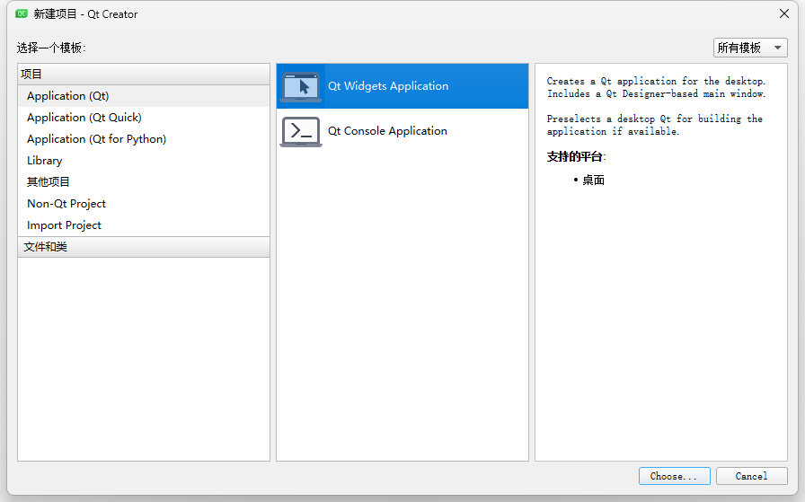
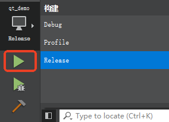

# 一、MinGW + Qt Creator（Windows）

> **重要：** SDK 与编译器的 ABI 必须匹配。MinGW 编译的库与 MSVC 编译的库**不能混用**。下载 SDK 时请选择 MinGW 版本。

## 1.1 创建项目

打开 Qt Creator，创建一个 **Qt Widgets Application**，命名为 `qt_demo`。



## 1.2 导入 SDK

在项目根目录下新建 `libs` 文件夹，将 SDK 文件拷贝进去：

```text
项目根目录/
├── libs/
│   ├── include/
│   │   ├── c_interface/
│   │   ├── cpp_interface/
│   │   └── parameter/
│   ├── libnrc_host.dll.a    # MinGW 导入库
│   └── nrc_host.dll         # 运行时动态库
├── main.cpp
├── mainwindow.h
├── mainwindow.cpp
├── mainwindow.ui
└── qt_demo.pro
```

在 `qt_demo.pro` 末尾添加 SDK 引用：

```makefile
# 1. 指定头文件路径
INCLUDEPATH += $$PWD/libs/include
# 2. 指定库文件搜索路径
LIBS += -L$$PWD/libs
# 3. 链接库文件（注意名称格式）
LIBS += -lnrc_host
# 4. 生成后自动复制 DLL 到输出目录
win32 {
    DLL_SOURCE = $$shell_path($${PWD}\\libs\\nrc_host.dll)
    DLL_TARGET = $$shell_path($${OUT_PWD}\\\\)
    QMAKE_POST_LINK += $$quote(cmd /c copy /Y $$quote($$DLL_SOURCE) $$quote($$DLL_TARGET))
}
```

## 1.3 编写最小连接代码

### (1) 修改 nrc_api.h 头文件包含路径

由于 SDK 的 `nrc_api.h` 中引用的头文件路径可能与实际目录结构不一致，需要修改 `libs/include/cpp_interface/nrc_api.h`，将其中引用的头文件路径改为直接使用文件名（因为它们与 `nrc_api.h` 位于同一 `cpp_interface/` 目录下）：

```cpp
#ifndef INCLUDE_CPP_INTERFACE_NRC_API_H_
#define INCLUDE_CPP_INTERFACE_NRC_API_H_

#include "nrc_craft_conveyor_belt_track.h"
#include "nrc_craft_vision.h"
#include "nrc_craft_weld.h"
#include "nrc_interface.h"
#include "nrc_io.h"
#include "nrc_job_operate.h"
#include "nrc_modbus.h"
#include "nrc_queue_operate.h"
#include "nrc_track.h"
#include "nrc_dual_arm.h"

#endif /* INCLUDE_API_NRC_API_H_ */
```

### (2) 修改 cpp_interface/ 下头文件对 parameter/ 目录的引用路径

`nrc_api.h` 所包含的各个头文件（如 `nrc_craft_conveyor_belt_track.h` 等）内部还会引用 `parameter/` 目录下的头文件。由于这些头文件位于 `cpp_interface/` 目录下，需要使用相对路径 `../parameter/` 来定位 `parameter/` 目录。

以 `nrc_craft_conveyor_belt_track.h` 为例，将其内部的头文件引用修改为如下形式：

```cpp
#ifndef INCLUDE_CPP_INTERFACE_NRC_CRAFT_CONVEYOR_BELT_TRACK_H_
#define INCLUDE_CPP_INTERFACE_NRC_CRAFT_CONVEYOR_BELT_TRACK_H_

#include "../parameter/nrc_define.h"
#include "../parameter/nrc_craft_conveyor_belt_track_parameter.h"
......
```

> **提示：** 需要对 `cpp_interface/` 目录下**所有**头文件逐一检查，凡是引用了 `parameter/` 目录下头文件的地方，都要统一使用 `../parameter/xxx.h` 的相对路径格式。常见的被引用文件包括 `nrc_define.h`、各类 `*_parameter.h` 等。

### (3) 编写连接测试代码

在 `mainwindow.cpp` 中添加头文件和连接测试：

```cpp
#include "mainwindow.h"
#include "ui_mainwindow.h"
#include "libs/include/cpp_interface/nrc_api.h"   // SDK 头文件
#include <QDebug>
MainWindow::MainWindow(QWidget *parent)
    : QMainWindow(parent)
    , ui(new Ui::MainWindow)
{
    ui->setupUi(this);

    // 1. 连接控制器
    SOCKETFD fd = connect_robot("192.168.1.15", "6001");
    if (fd <= 0) {
        ui->statusbar->showMessage("连接失败，请检查 IP 和端口");
        return;
    }

    // 2. 等待连接就绪
    while (get_connection_status(fd) != 0) {
        QApplication::processEvents();
    }
    ui->statusbar->showMessage("连接成功！fd=" + QString::number(fd));
    qDebug() << "SDK 版本:" << QString::fromStdString(get_library_version());
}
MainWindow::~MainWindow()
{
    delete ui;
}
```

## 1.4 编译运行

选择 MinGW 编译套件，点击运行。如果状态栏显示"连接成功"，说明 SDK 配置正确。



> **验证标准：** 不是"头文件能引入"，而是**实际连接控制器成功**。如果编译报链接错误，请检查 `LIBS` 路径和库文件名是否匹配。

## 下一步

完成连接测试后，请浏览[接口示例](../../03.示例/index.md)了解更多 API 用法。
