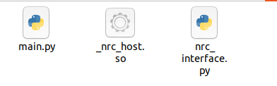

# 环境搭建

## 环境要求

- **Python 版本：** 3.x（必须与 SDK 包匹配，否则 `_nrc_host.so` 加载失败）
- **操作系统：** Windows x64 / Linux x64
- **控制器 IP 地址和端口号**
- **SDK 包：** 从[下载页](../../../12.相关下载.md)获取

## 1. 准备 SDK 文件

解压 SDK 包后得到：

```text
项目目录/
├── nrc_interface.py      ← Python 接口模块（必须）
├── _nrc_host.so          ← Linux 本地库
└── nrc_host.pyd          ← Windows 本地库
```



> 本地库必须与 Python 版本、操作系统架构严格匹配。如果版本不对应，会报 `ImportError` 或系统找不到指定模块。

**验证导入：**

```python
import nrc_interface
print("SDK 导入成功")
```

运行后如果输出 `SDK 导入成功`，说明 SDK 文件放置正确。

## 2. 只读连接测试

以下代码只连接控制器并读取当前位置，**不会使机器人运动**。

```python
import nrc_interface as nrc
import sys

fd = nrc.connect_robot("192.168.1.16", "6001")
if fd <= 0:
    print("连接失败")
    sys.exit(1)

print("连接成功！fd =", fd)
print("SDK 版本:", nrc.get_library_version())

# 读取当前位置
pos = nrc.VectorDouble(7)
nrc.get_current_position(fd, 0, pos)
print("当前位置:", [pos[i] for i in range(7)])
```

**预期输出：**

```text
连接成功！fd = 1
SDK 版本: Inexbot API v2.0.4-24.03
当前位置: [0.0, -45.0, 90.0, 0.0, 0.0, 0.0, 0.0]
```

## 排错

> **Python API 返回值说明：** 大部分 getter 函数返回 `(结果码, 数据值)` 元组。例如 `get_servo_state(fd, status)` 返回 `(0, 3)` 表示调用成功且伺服状态为运行。每次调用前需重新初始化传入的变量。

| 错误现象 | 原因 | 解决 |
|---------|------|------|
| `ImportError: No module named nrc_interface` | SDK 文件未放入 Python 路径 | 将 SDK 文件放在脚本相同目录 |
| `ImportError: No module named _nrc_host` | 本地库未找到或版本不匹配 | 确认 SDK 包与 Python 版本、OS 架构一致 |
| Windows 找不到指定模块 | `nrc_host.pyd` 缺失或 VC++ 运行库未安装 | 将 `.pyd` 放在项目目录；安装 Visual C++ Redistributable |
| 连接返回 `<= 0` | IP/端口错误、网络不通或控制器未就绪 | 检查 IP/端口；用 `ping` 测试；确认控制器已启动 |
| 运动指令无响应 | 运动队列未使能 | 调用 `queue_motion_set_status(fd, True)` |
