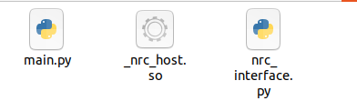

# 初始化项目

> 本教程带你从零搭建 Python 项目环境，连接控制器，读取状态，再执行基础运动。

---

## 前提条件

- Python 3.x（版本必须与 SDK 包匹配）
- SDK 包已从[下载页](../../../12.相关下载.md)获取
- 控制器 IP 地址和端口号
- 控制器已上电且网络可达

---

## 1. 准备 SDK 文件

根据 Python 版本和操作系统，在[下载页](../../../12.相关下载.md)获取对应的 SDK 包。解压后得到：

```text
项目目录/
├── nrc_interface.py      <- Python 接口模块（必须）
├── _nrc_host.so          <- Linux 本地库
└── nrc_host.pyd          <- Windows 本地库
```



> 本地库必须与 Python 版本、操作系统架构严格匹配。如果版本不对应，会报 `ImportError` 或系统找不到指定模块。

**验证导入：**

```python
import nrc_interface
print("SDK 导入成功")
```

运行后如果输出 `SDK 导入成功`，说明 SDK 文件放置正确。如果报错，请参考下方的[排错](#排错)章节。

---

## 2. 只读连接测试（安全示例）

以下代码只连接控制器并读取当前位置，**不会使机器人运动**。请先完成这一步确认连接正常。

```python
# -*- coding: UTF-8 -*-
import nrc_interface
import sys

# === 可替换配置 ===
CONTROLLER_IP = "192.168.1.16"   # 替换为实际控制器 IP
CONTROLLER_PORT = "6001"         # 6001 为 SDK 命令端口

def main():
    # 连接控制器
    socket_fd = nrc_interface.connect_robot(CONTROLLER_IP, CONTROLLER_PORT)
    if socket_fd <= 0:
        print("连接失败（返回值: %d），请检查：" % socket_fd)
        print("  1. 控制器 IP 是否正确（当前: %s）" % CONTROLLER_IP)
        print("  2. 端口是否正确（当前: %s）" % CONTROLLER_PORT)
        print("  3. 网络是否可达（ping 测试）")
        sys.exit(1)

    print("连接成功！socketFd = %d" % socket_fd)

    # 获取库版本
    print("SDK 版本: %s" % nrc_interface.get_library_version())

    # 读取当前位置（7 轴，关节坐标）
    pos = nrc_interface.VectorDouble(7)
    nrc_interface.get_current_position(socket_fd, 0, pos)
    position = [pos[0], pos[1], pos[2], pos[3], pos[4], pos[5], pos[6]]
    print("当前位置（关节角）: %s" % position)
    # 程序退出时连接自动关闭
    print("数据读取完成")

if __name__ == "__main__":
    main()
```

**预期输出（数值因实际位置而异）：**

```text
连接成功！socketFd = 1
当前位置（关节角）: [0.0, -45.0, 90.0, 0.0, 0.0, 0.0, 0.0]
数据读取完成
```

---

## 3. 执行基础运动（请在确认安全后进行）

> **安全警告：** 以下代码会导致机器人实际运动！
> - 确保机器人工作空间内**没有人员或障碍物**
> - 确认**急停按钮**在可触及范围内
> - 首次运行时降低速度（`velocity` 和 `acc` 参数）
> - 建议先在仿真环境或空载低速条件下测试

```python
# -*- coding: UTF-8 -*-
import nrc_interface
import sys

# === 可替换配置 ===
CONTROLLER_IP = "192.168.1.16"
CONTROLLER_PORT = "6001"

def move_joint(socket_fd, target_pos):
    move_cmd = nrc_interface.MoveCmd()
    move_cmd.coord = 0
    move_cmd.targetPosType = nrc_interface.PosType_data
    move_cmd.targetPosValue = target_pos
    move_cmd.velocity = 20
    move_cmd.acc = 20
    move_cmd.dec = 20
    move_cmd.pl = 5
    nrc_interface.queue_motion_push_back_moveJ(socket_fd, move_cmd)
    nrc_interface.queue_motion_send_to_controller(socket_fd, 1)

def main():
    socket_fd = nrc_interface.connect_robot(CONTROLLER_IP, CONTROLLER_PORT)
    if socket_fd <= 0:
        print("连接失败")
        sys.exit(1)

    # 读取当前位置
    pos = nrc_interface.VectorDouble(7)
    nrc_interface.get_current_position(socket_fd, 0, pos)
    current = [pos[0], pos[1], pos[2], pos[3], pos[4], pos[5], pos[6]]
    print("当前位置: %s" % current)

    # 使能运动队列，在当前位置基础上偏移
    nrc_interface.queue_motion_set_status(socket_fd, True)
    pos[0] = pos[0] - 1
    move_joint(socket_fd, pos)
    # 程序退出时连接自动关闭

if __name__ == "__main__":
    main()
```

> **端口说明：** `6001` 是 SDK 命令端口。控制器端口体系：5000（文件传输）、6000（示教器通信）、6001（上位机 SDK）、7000（服务功能）。详见[版本与兼容性](../../../版本与兼容性.md)。

---

## 排错

> **Python API 返回值说明：** 大部分 getter 函数返回 `(结果码, 数据值)` 元组。例如 `get_servo_state(socketFd, status)` 返回 `(0, 3)` 表示调用成功且伺服状态为运行。获取伺服状态时需要先定义 `status` 并传入，每次调用前需重新赋值初始值。

| 错误现象 | 可能原因 | 解决方法 |
|---------|---------|---------|
| `ImportError: No module named nrc_interface` | SDK 文件未放入 Python 路径 | 将 SDK 文件放在与脚本相同的目录 |
| `ImportError: No module named _nrc_host` | 本地库未找到或版本不匹配 | 确认 SDK 包与 Python 版本、操作系统架构一致 |
| Windows 下找不到指定模块 | `nrc_host.pyd` 缺失或 VC++ 运行库未安装 | 将 `.pyd` 放在项目目录；安装 Visual C++ Redistributable |
| 连接返回 `<= 0` | IP/端口错误、网络不通或控制器未就绪 | 检查 IP/端口；用 `ping` 测试；确认控制器已启动 |
| 运动指令无响应 | 运动队列未使能 | 调用 `queue_motion_set_status(socketFd, True)` |

---

## 下一步

- [基础应用示例](../03.接口示例/index.md)：错误回调、位置获取
- [进阶应用示例](../03.接口示例/02.进阶应用/01.使用-servo_move%28%29-%E6%9D%A5%E8%BF%9B%E8%A1%8C%E8%B7%9F%E8%B8%AA%E8%BF%90%E5%8A%A8.md)：servo_move 跟踪运动
