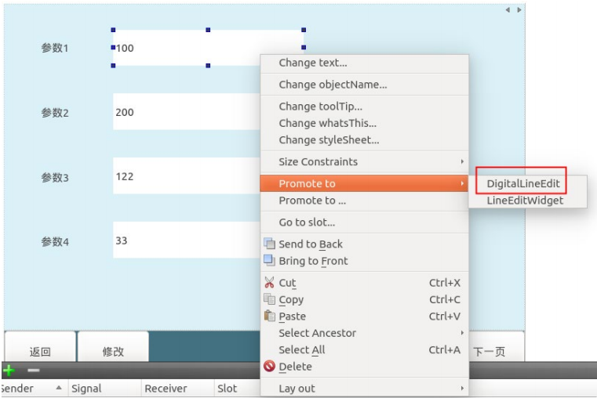
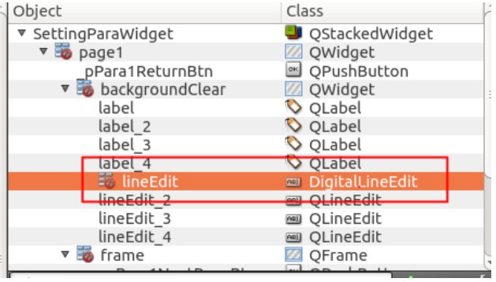
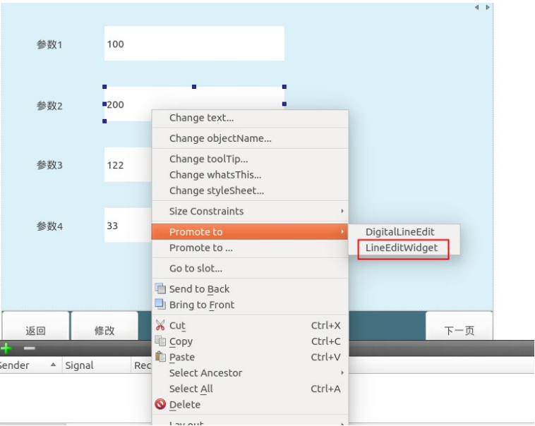
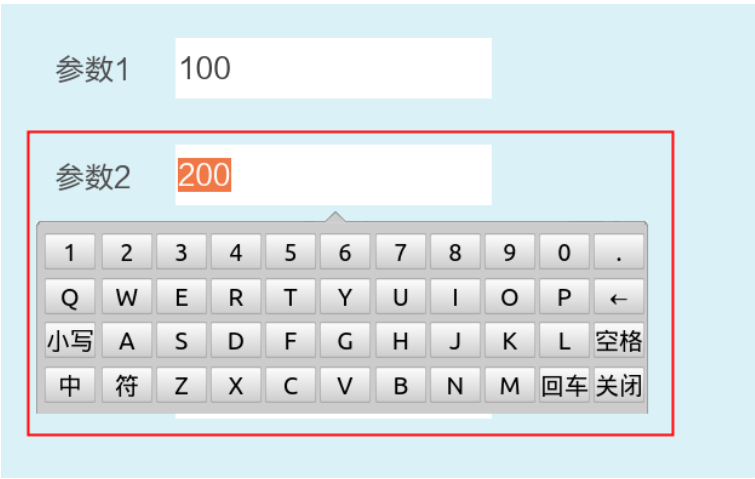
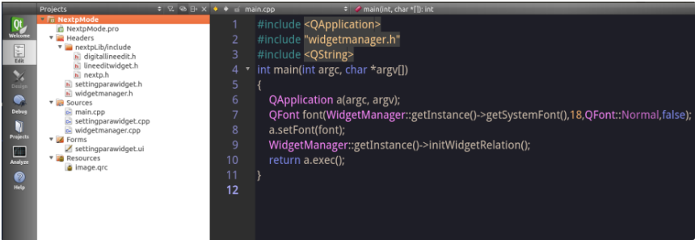
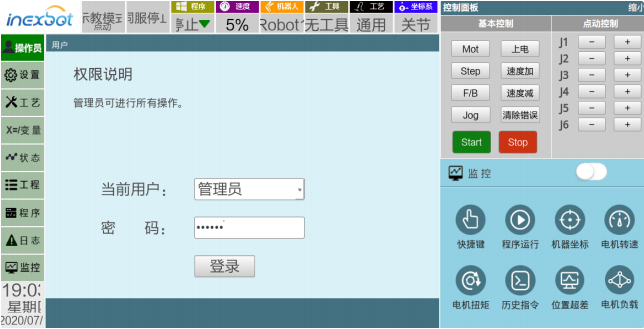
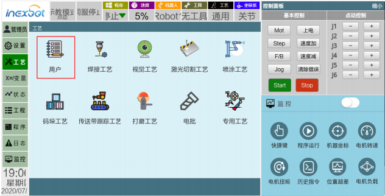
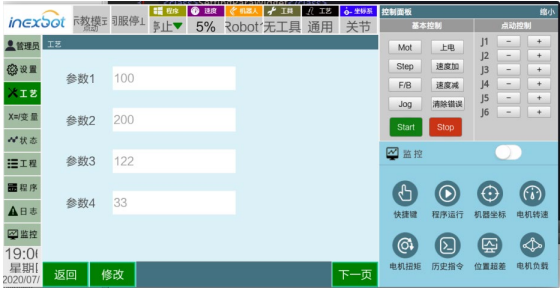
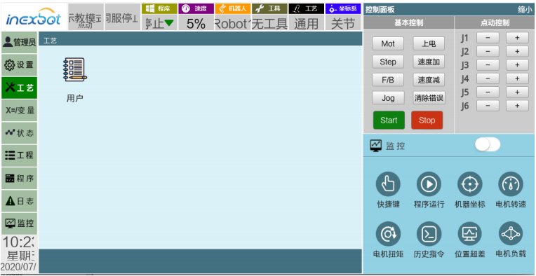

# 二次开发 API

## 二次开发静态库简介

### 功能介绍

提供完整的示教器功能，支持添加用户自定义界面，支持特定字段的通信与控制系统通信。

### 静态库目录结构


nextpLib 为总文件夹；

Include 文件夹中为头文件；

Library 文件夹中为静态库文件包括 linux 平台和 ARM 平台的库文件（使用ARM 平台交叉编译的程序只适用于纳博特公司的 T30 示教器使用）；

### 静态库结构说明

#### 1.nextp.h 头文件接口说明：

```cpp
//创建 Nextp 类对象
static QPointer<Nextp> getInstance();
//获取系统字体
QString getSystemFont();
//用户自定义窗体传输到主程序
void setWidgetParentLocation(QPointer <QWidget> widget);
//向控制器发送消息
void sendMessage(const quint16 &command,const QByteArray &data);
//通知示教程序自定义窗体已经打开
widgetShowFinish()
//接收控制器消息信号
void signal_receiveMessage(const quint16 &command,const QByteArray &data);
//打开自定义窗体信号
void signal_openWidget();
//关闭自定义窗体信号
void signal_closeWidget();
//隐藏工艺主界面中除了自定义按钮的其他按钮
void hideTechnologyToolbuttons();
//静态库支持与控制器通信命令字
 enum CommandList
 {
    SetFirstUserParaCommand = 0x9200,
    GetFirstUserCommand = 0x9201,
    ReceivedFirstUserCommand = 0x9202,
    SetSecondUserParaCommand = 0x9203,
    GetSecondUserCommand = 0x9204,
    ReceivedSecondUserCommand = 0x9205,
    SetThirdUserParaCommand = 0x9206,
    GetThirdUserCommand = 0x9207,
    ReceivedThirdUserCommand = 0x92,
    ReceivedThirdUserCommand = 0x9208,
    SetFourthUserParaCommand = 0x9209,
    GetFourthUserCommand = 0x920a,
    ReceivedFourthUserCommand = 0x920b,
    SetFifthUserParaCommand = 0x920c,
    GetFifthUserCommand = 0x920d,
    ReceivedFifthUserCommand = 0x920e,
};
```

#### 2.json/json.h 头文件提供 JSON 数据格式的组装和解析

组装 json 数据示例:

```cpp
Json::Value root;
Json::FastWriter wt;
root["robot"] =1;
root["booldata"] =true;
root["data"] = 1.1;
root["name"] ="nihao";
```

解析 Json 数据示例

```cpp
QByteArray jsonData //控制器发送的数据
Json::Value root;
Json::Reader reader;
QString jsonData = param.data();
if(reader.parse(jsonData.toStdString(), root))
{
    int robot = root["robot"].asInt();
    bool booldata= root["booldata"].asBool();
    Int data= root["data"].asDouble();
    Std::string name = root["name "].asString();
}
```

#### 3.digitallineedit.h 提供数字输入框

支持将 QLineEdit 控件提升为数字输入框

提升方法：右键选择一个 QLineEdit 控件 --->Promote to--->DigitalLineEdit



右侧树形结构中可以看到该控件 Classs 属性变为 DigitLineEdit



程序运行后控件效果，单击控件会弹出数字键盘：


#### 4.lineeditwidget.h 提供数字和字符输入框 支持将 QLineEdit 控件提升为数字与字符输入框 提升方法：右键选择一个 QLineEdit 控 件 --->Promote to--->lineEditWidget



右侧树形结构中可以看到该控件 Classs 属性变为 lineEditWidget


程序运行后控件效果，单击控件会弹出数字与字母键盘：



## Demo 说明



- Demo 结构图 demo 文件夹名称：NextpMode

2.1 settingparawidget.h settingparawidget.cpp settingparawidget.ui 三个文件为用户自定义窗体


2.2 widgetmanager.h widgetmanager.cpp 为管理类连接用户自定义窗体和静态库

2.2 静态库文件夹 nextplib 需要放置在 demod 的 NextpMode 文件夹下

2.3 运行 Demo （使用 QtCreator 直接打开 NextpMode 文件夹下的 NextpMode.pro 文件 ）

运 Demo 程序点击【操作员】> 选择管理员>输入密码 123456 登录



点击左侧【工艺】按钮> 用户 进入自定义窗体





点击修改按钮 可以修改参数 点击保存将发送参数到控制器


QtCreator 控制台会打印发送到控制器的数据


如果调用函数 void hideTechnologyToolbuttons();会隐藏除工艺在主界 面上自定义按钮以外的其他工艺按钮



- Demo 文件类说明
