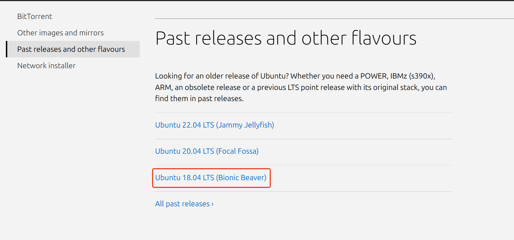
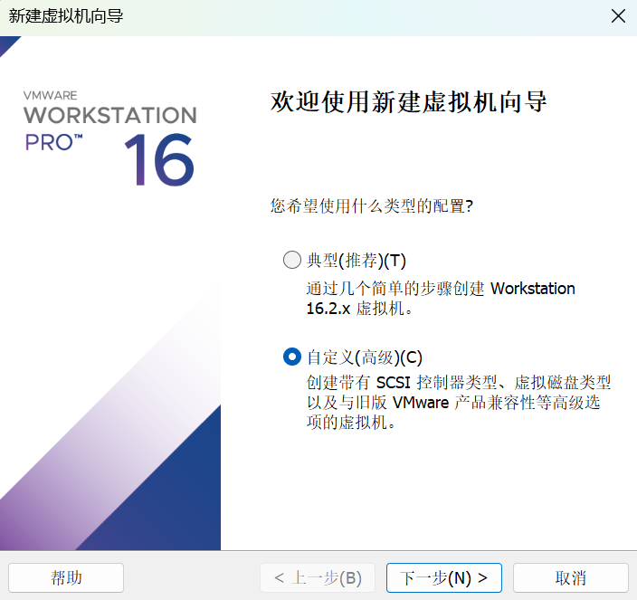
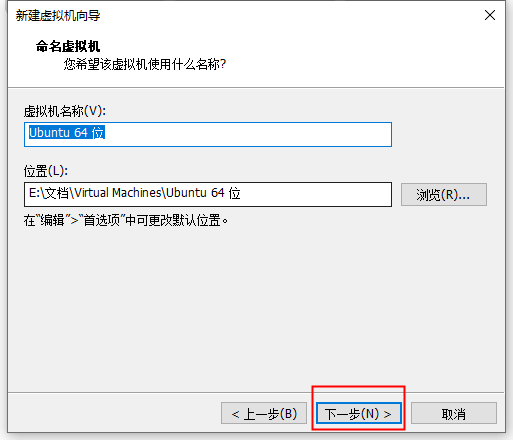
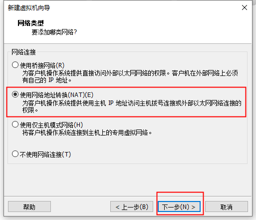
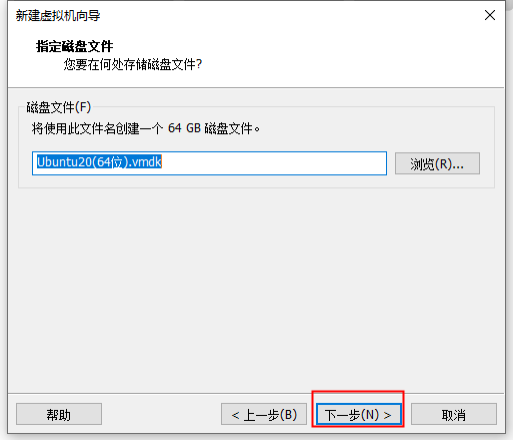
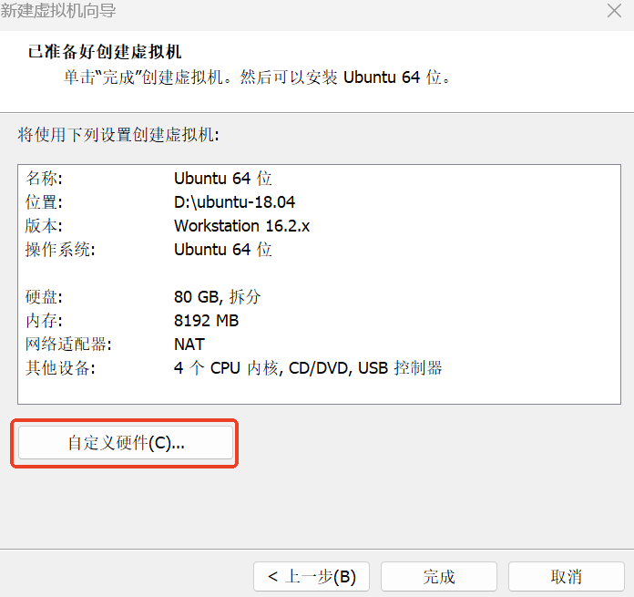
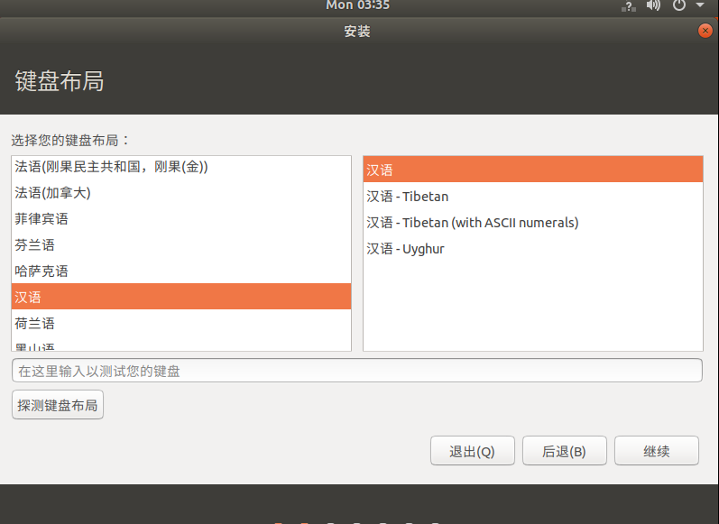

# Ubuntu 18.04 安装

本文详细说明 Ubuntu 18.04 的下载、通过 VMware Workstation 创建虚拟机、安装配置以及 VMware Tools 安装的全过程。

## 1. 下载 Ubuntu 18.04

从 Ubuntu 官方或国内镜像站下载 Ubuntu 18.04 LTS 的 iso 文件。



安装好之后如下：


## 2. 创建虚拟机

### VMware 配置步骤

1. 打开 VMware Workstation，点击 **创建新的虚拟机**。


2. 选择 **自定义（高级）**，然后点击 **下一步**。



3. 根据安装的 VMware 的版本号，选择硬件兼容性，点击 **下一步**。


4. 选择 **稍后安装操作系统**，点击 **下一步**。


5. 选择 **Linux**，版本为 **Ubuntu 64位**，点击 **下一步**。


6. 自己命名，选择安装位置（最好不要安装在 C 盘）。


7. 处理器数量选择 **1**，内核数量选择 **4**，点击 **下一步**。



8. 内存选择 **8GB**，点击 **下一步**。


9. 选择 **使用网络地址转换**，点击 **下一步**。


10. 按默认推荐配置，点击 **下一步**。




11. 选择 **创建新虚拟磁盘**，点击 **下一步**。


12. 分配磁盘，推荐 **80GB**，可根据实际需求调整，选择 **将虚拟磁盘拆分为多个文件**，点击 **下一步**。


13. 默认，点击 **下一步**。


14. 点击 **自定义硬件**。



15. 进入自定义硬件，使用 **ISO 映像文件**，选择一开始下载的 iso 文件，移除 **声卡** 和 **打印机**，然后点 **关闭**。因为用不上虚拟机的声卡和打印机，关闭以节省资源。



16. 点击 **完成**，开始安装。


## 3. 安装 Ubuntu 18.04

1. 进入 Ubuntu 18.04，开启此虚拟机。选择 **中文（简体）**，点击 **安装 Ubuntu**。


2. 选择 **汉语**。


3. 选择 **正常安装**，**安装 Ubuntu 时下载更新**，点击 **继续**。



4. 选择 **清除整个磁盘并安装 Ubuntu**，出现提醒选择 **继续**，最后点击 **现在安装**。


5. 自己设定好用户名以及密码，地区可以随意填，等待 Ubuntu 自己安装即可。


## 4. 安装 VMware Tools

安装好 Ubuntu 后点击现在重启，进入 Ubuntu，安装 VMware Tools。

### 挂载 VMware Tools

1. 点击上方 **虚拟机**，点击 **安装 VMware Tools**。


下载完成如下：


2. 在文件—VMware Tools 中找到这个文件夹，把文件夹移入主目录。


3. 在主目录中点击右键，点击 **在终端打开**，运行以下命令：

```bash
tar -zxvf VMwareTools-xxx.tar.gz
```

运行后即可发现文件夹已解压：


4. 运行以下两条命令：

```bash
cd vmware-tools-distrib
sudo ./vmware-install.pl
```

除了第一次停顿时输入 `yes`，其他停顿都按回车即可。

之后重启；至此，Ubuntu 18.04 安装完成。
