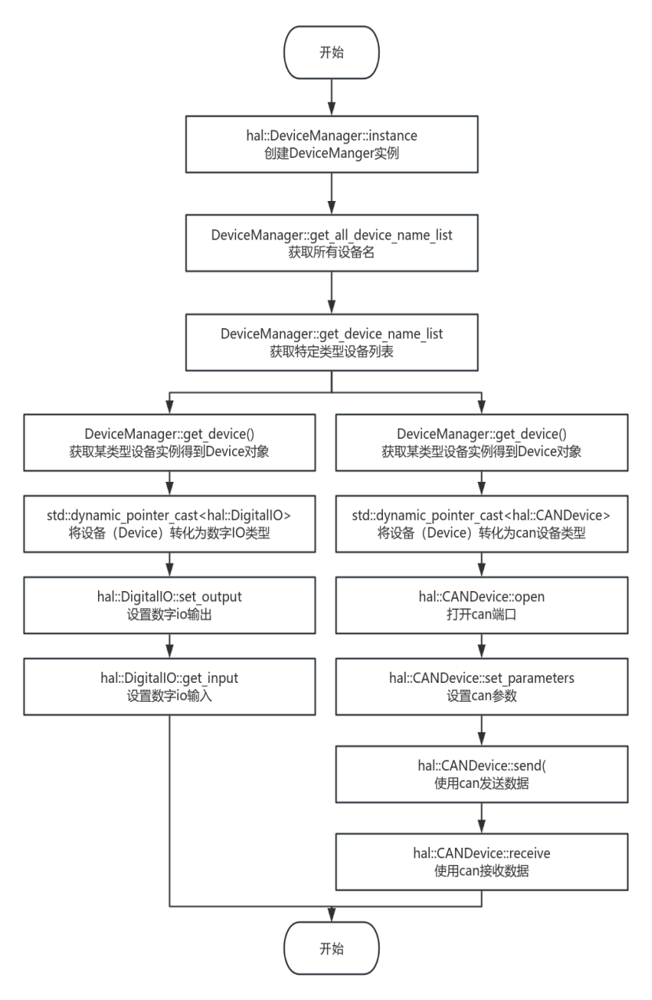
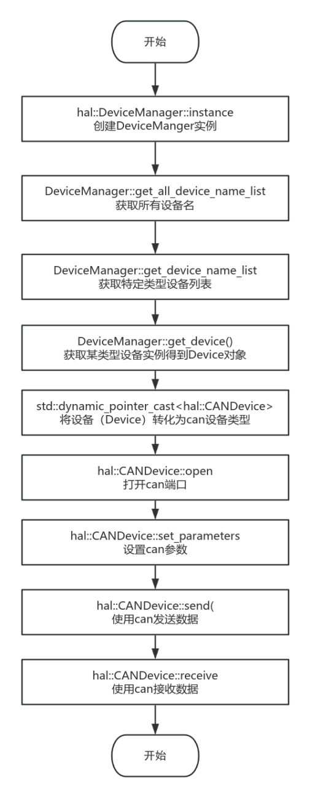
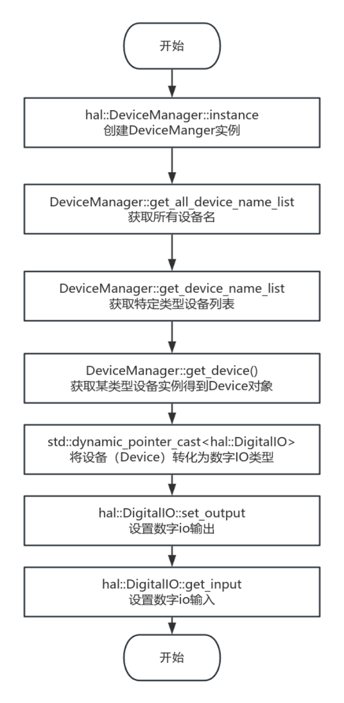
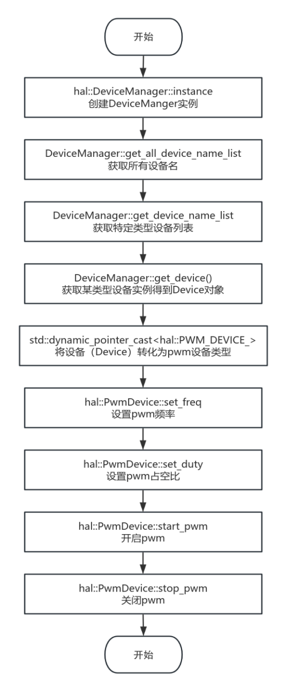
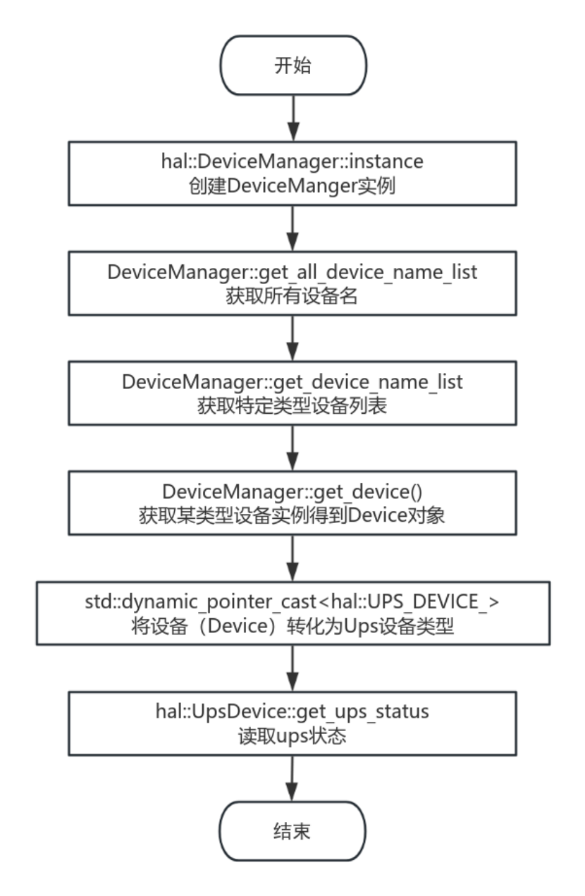

# HAL

## 简介

纳博特 EtherCAT 主站控制器主站抖动时间小于20us，可用于工业自动化控制系统的开发，特别适用于机器人、伺服电机控制等实时性要求高的场景。

#### 版本信息

| 二次开发版本 | 公司 |
| --- | --- |
| 1.0.0 | INEXBOT |

#### 版本迭代

| 版本 | 修改日期 | 修改人 | 描述 |
| --- | --- | --- | --- |
| 1.0.0 | 20250310 | EA | 初始版本 |

## 概述

#### 关于文档

本文旨在帮助用户使用纳博特 libhal_sdk 的 C++库。

#### 关于 libhal_sdk 库

该库为纳博特系统硬件抽象层，统一了用户接口，方便用户使用。

#### 开发环境要求

| 操作系统 | Ubuntu 20.04 LTS |
| --- | --- |
| 系统架构 | x86_64 |
| 编译器 | GCC version 9.4.0/GLIBC 2.31-0ubuntu9.2<br>GCC version 4.8.2/EGLIBC 2.19-0ubuntu6.15 |
| 依赖库 | Libpthread、librt、libdl、libm |
## 函数库 API 说明

### 使用概述

1. 将 libhal_sdk.a 静态库文件复制到项目的 lib 目录

2. 将 include 文件夹下的头文件复制到项目的 include 目录

3. 在编译时链接 libhal_sdk.a 库

Demo 下载

### 类列表

| 类名 | 含义 |
| --- | --- |
| Device 类 | 该类是所有设备对象的基类。 |
| DeviceManager 类 | 该类是 device 设备的管理器类。 |
| AnalogIO 类 | 该类是模拟 io 设备的抽象。 |
| CANDevice 类 | 该类是 can 设备的抽象。 |
| DigitalIO 类 | 该类是数字 IO 的抽象。 |
| EncoderDevice 类 | 该类是编码器设备的抽象。 |
| PwmDevice 类 | 该类是 pwm 设备的抽象。 |
| SerialDevice 类 | 该类是 Serial 设备的抽象。 |
| UpsDevice 类 | 该类是 ups 设备的抽象。 |

### hal_sdk 使用流程图



### 使用示例

#### Demo.cpp

```cpp
#include <hal/device_manager.h>
#include <hal/devices/digital_io.h>
#include <hal/devices/analog_io.h>
#include <hal/devices/can_device.h>
#include <hal/devices/pwm_device.h>
#include <hal/devices/encoder_device.h>
#include <hal/devices/ups_device.h>
#include <iostream>
#include <thread>
#include <chrono>


void print_device_info(const std::vector<std::string>& devices) {
    std::cout << "Devices:" << std::endl;
    for (const auto& name : devices) {
        std::cout << "- " << name << std::endl;
    }
    std::cout << std::endl;
}


int main() {
    auto& manager = hal::DeviceManager::instance();
    
    try {
        // 1. 展示设备管理器的查询功能
        std::cout << "\n=== 设备查询 ===" << std::endl;
        auto all_devices = manager.get_all_device_name_list();
        std::cout << "所有设备：" << std::endl;
        print_device_info(all_devices);


        // 获取特定类型设备列表
        auto dio_devices = manager.get_device_name_list(hal::DeviceType::DIGITAL_IO_);
        std::cout << "数字IO设备：" << std::endl;
        print_device_info(dio_devices);


        // 2. 通过DeviceManager获取设备并使用
        std::cout << "\n=== 设备使用示例 ===" << std::endl;
        
        // 使用数字IO
        if (auto dio_dev = manager.get_device(hal::DeviceType::DIGITAL_IO_, "DIO_1")) {
            auto digital_io = std::dynamic_pointer_cast<hal::DigitalIO>(dio_dev);
            digital_io->set_output(2, true);
            std::cout << "DIO_1 channel 3: " << digital_io->get_input(3) << std::endl;
        }


        // 使用模拟CAN设备
        if (auto can_dev = manager.get_device(hal::DeviceType::CAN_DEVICE_, "CAN_1")) {
            auto can_device = std::dynamic_pointer_cast<hal::CANDevice>(can_dev);
            can_device->open(0);
            can_device->set_parameters(0, 500000);
            unsigned char tx_data[8] = {0x11, 0x22, 0x33, 0x44};
            can_device->send(0, 0x123, tx_data, 4);
            unsigned int rx_id;
            unsigned char rx_data[16];
            unsigned int rx_len = can_device->receive(0, rx_id, rx_data);
            std::cout << "CAN_1 received length: " << rx_len << std::endl;
        }


        // 3. 设备存在性检查
        std::cout << "\n=== 设备存在性检查 ===" << std::endl;
        std::cout << "DIO_1 exists: " 
                  << manager.is_device_exist(hal::DeviceType::DIGITAL_IO_, "DIO_1") << std::endl;


    } catch (const std::exception& e) {
        std::cerr << "Error: " << e.what() << std::endl;
        return 1;
    }
    
    return 0;
} 
```
## 函数库 API 详解

### DeviceType 枚举

```text
enum class DeviceType {
    NULL_,
    ANALOG_IO_,
    CAN_DEVICE_,
    DIGITAL_IO_,
    ENCODER_DEVICE_,
    PWM_DEVICE_,
    SERIAL_DEVICE_,
    UPS_DEVICE_,
    CUSTOM_
};
```
| 变量名 | 含义 |
| --- | --- |
| NULL_ | 空设备 |
| DIGITAL_IO_ | 数字输入输出设备 |
| ANALOG_IO_ | 模拟输入输出设备 |
| CAN_DEVICE_ | CAN 总线设备 |
| PWM_DEVICE_ | 脉宽调制设备 |
| ENCODER_DEVICE_ | 编码器设备 |
| UPS_DEVICE_ | 不间断电源设备 |
| SERIAL_DEVICE_ | 串口设备 |
| CUSTOM_ | 自定义设备 |

### Device 类

该类是所有设备对象的基类。

#### Device 类定义

```cpp
class Device {
public:
    Device(DeviceType device_type, const std::string& device_name);
    virtual ~Device() = default;
    
    bool valid() const { return valid_; }
    DeviceType get_device_type() const { return device_type_; }
    std::string get_device_name() const { return device_name_; }
​
protected:
    bool valid_{false};
    DeviceType device_type_;
    std::string device_name_;
};
} 
```
#### Device 类成员函数

| 函数名称 | 函数功能 | 类访问权限 |
| --- | --- | --- |
| Device | 构造函数 | Public |
| get_device_type | 获取设备类型 | public |
| get_device_name | 获取设备名称 | public |
| valid | 获取设备是否可用 | public |

#### Device 类成员变量

| 变量名称 | 变量含义 | 类访问权限 |
| --- | --- | --- |
| valid_ | 是否可用 | protected |
| device_type_ | 设备类型 | protected |
| device_name_ | 设备名称 | protected |

#### 成员函数功能详解

##### Device

| 函数原型 | Device(DeviceType device_type, const std::string& device_name); |
| --- | --- |
| 功能描述 | 构造函数，用于初始化 Device 对象。 |
| 参数说明 | 输入参数：device_type：设备类型，用于指定设备的种类。device_name：设备名称，用于标识设备的名字。 |
| 返回值 | 无 |
| 备注说明 | 该构造函数用于创建 Device 对象，并初始化其设备类型和名称。 |

##### ~Device

| 函数原型 | virtual ~Device() = default; |
| --- | --- |
| 功能描述 | 析构函数，用于销毁 Device 对象。 |
| 参数说明 | 无 |
| 返回值 | 无 |
| 备注说明 | 该析构函数是虚函数，确保派生类的正确析构。 |

##### valid

| 函数原型 | bool valid() const; |
| --- | --- |
| 功能描述 | 检查 Device 对象是否有效。 |
| 参数说明 | 无 |
| 返回值 | 返回 bool 类型的值，true 表示 Device 对象有效，false 表示无效。 |
| 备注说明 | 该函数用于判断 Device 对象的状态是否有效。 |

##### get_device_type

| 函数原型 | DeviceType get_device_type() const; |
| --- | --- |
| 功能描述 | 获取 Device 对象的设备类型。 |
| 参数说明 | 无 |
| 返回值 | 返回 DeviceType 类型的值，表示 Device 对象的设备类型。 |
| 备注说明 | 该函数用于获取 Device 对象的设备类型。 |

##### get_device_name

| 函数原型 | std::string get_device_name() const; |
| --- | --- |
| 功能描述 | 获取 Device 对象的设备名称。 |
| 参数说明 | 无 |
| 返回值 | 返回 std::string 类型的值，表示 Device 对象的设备名称。 |
| 备注说明 | 该函数用于获取 Device 对象的设备名称。 |

### DeviceManager 类

该类是 device 设备的管理器类。

#### 类定义

```cpp
class DeviceManager {
public:
    static DeviceManager &instance();


    int add_device(std::shared_ptr<Device> device);
    int remove_device(DeviceType device_type, const std::string& device_name);
    bool is_device_exist(DeviceType device_type, const std::string& device_name) const;
    
    std::vector<std::string> get_all_device_name_list() const;
    std::vector<std::string> get_device_name_list(DeviceType device_type) const;
    std::vector<std::shared_ptr<Device>> get_device_list(DeviceType device_type) const;
    std::shared_ptr<Device> get_device(DeviceType device_type, const std::string& device_name) const;


private:
    DeviceManager() = default;
    static void register_devices(DeviceManager &manager);
    std::unordered_map<std::string, std::shared_ptr<Device>> devices_;
};
```
#### 类成员函数

| 函数名称 | 函数功能 | 类访问权限 |
| --- | --- | --- |
| instance | 获取设备管理器的单例实例 | public |
| add_device | 向设备管理器中添加设备 | public |
| remove_device | 从设备管理器中删除设备 | public |
| is_device_exist | 判断设备是否存在 | public |
| get_all_device_name_list | 获取所有设备的名称列表 | public |
| get_device_name_list | 获取所有某类设备名称列表 | public |
| get_device_list | 获取所有某类设备的对象实例 | public |
| get_device | 获取具体的某一个设备 | public |
| DeviceManager | 构造函数 | private |
| register_devices | 注册设备 | private |

#### 类成员变量

| 变量名称 | 变量含义 | 类访问权限 |
| --- | --- | --- |
| device_ | 存储所有挂载到设备管理器上的设备 | private |

#### 成员函数功能详解

##### instance

| 函数原型 | static DeviceManager &instance(); |
| --- | --- |
| 功能描述 | 获取 DeviceManager 类的单例对象。 |
| 参数说明 | 无 |
| 返回值 | 返回 DeviceManager 类的单例对象的引用。 |
| 备注说明 | 该函数用于获取 DeviceManager 类的唯一实例。 |

##### add_device

| 函数原型 | int add_device(std::shared_ptr&lt;Device> device); |
| --- | --- |
| 功能描述 | 添加一个设备到设备管理器中。 |
| 参数说明 | 输入参数：<br>device：要添加的设备对象 |
| 返回值 | 返回 int 类型的值，0表示成功，非0表示失败。 |
| 备注说明 | 该函数用于向设备管理器中添加一个新的设备。 |

##### remove_device

| 函数原型 | int remove_device(DeviceType device_type, const std::string& device_name); |
| --- | --- |
| 功能描述 | 从设备管理器中移除一个设备。 |
| 参数说明 | 输入参数：<br>device_type：设备的类型。<br>device_name：要移除的设备的名称。 |
| 返回值 | 返回 int 类型的值，0表示成功，非0表示失败。 |
| 备注说明 | 该函数用于从设备管理器中移除指定类型和名称的设备。 |

##### is_device_exist

| 函数原型 | bool is_device_exist(DeviceType device_type, const std::string& device_name) const; |
| --- | --- |
| 功能描述 | 检查设备管理器中是否存在指定类型和名称的设备。 |
| 参数说明 | 输入参数：<br>device_type：设备的类型。<br>device_name：要检查的设备名称。 |
| 返回值 | 返回 bool 类型的值，true 表示存在，false 表示不存在。 |
| 备注说明 | 该函数用于检查设备管理器中是否存在指定类型和名称的设备。 |

##### get_all_device_name_list

| 函数原型 | std::vector&lt;std::string> get_all_device_name_list() const; |
| --- | --- |
| 功能描述 | 获取设备管理器中所有设备的名称列表。 |
| 参数说明 | 无 |
| 返回值 | 返回包含所有设备名称的字符串向量。 |
| 备注说明 | 该函数用于获取设备管理器中所有设备的名称列表。 |

##### get_device_name_list

| 函数原型 | std::vector&lt;std::string> get_device_name_list(DeviceType device_type) const; |
| --- | --- |
| 功能描述 | 获取设备管理器中指定类型设备的名称列表。 |
| 参数说明 | 输入参数：<br>device_type：要获取名称列表的设备类型。 |
| 返回值 | 返回包含指定类型设备名称的字符串向量。 |
| 备注说明 | 该函数用于获取设备管理器中指定类型设备的名称列表。 |

##### get_device_list

| 函数原型 | std::vector&lt;std::shared_ptr&lt;Device>> get_device_list(DeviceType device_type) const; |
| --- | --- |
| 功能描述 | 获取设备管理器中指定类型设备的列表。 |
| 参数说明 | 输入参数：<br>device_type：要获取列表的设备类型。 |
| 返回值 | 返回包含指定类型设备对象的共享指针向量。 |
| 备注说明 | 该函数用于获取设备管理器中指定类型设备的列表。 |

##### get_device

| 函数原型 | std::shared_ptr&lt;Device> get_device(DeviceType device_type, const std::string& device_name) const; |
| --- | --- |
| 功能描述 | 获取设备管理器中指定类型和名称的设备对象。 |
| 参数说明 | 输入参数：<br>device_type：设备的类型。<br>device_name：要获取的设备名称。 |
| 返回值 | 返回指定类型和名称设备的共享指针。如果设备不存在，则返回 nullptr。 |
| 备注说明 | 该函数用于获取设备管理器中指定类型和名称的设备对象。 |

### AnalogIO 类

该类是模拟 io 设备的抽象。

#### 类定义

```cpp
class AnalogIO : public Device {
public:
    AnalogIO(const std::string& name);
    virtual ~AnalogIO() = default;


    virtual void set_output(int channel, double value) = 0;
    virtual void set_outputs(const std::vector<int>& channels, const std::vector<double>& values) = 0;
    virtual double get_input(int channel) = 0;
    virtual std::vector<double> get_inputs(const std::vector<int>& channels) = 0;
    virtual int get_channel_count() const = 0;
    
    // 获取通道的量程范围
    virtual std::pair<double, double> get_range(int channel) const = 0;
};
```
#### 类成员函数

| 函数名称 | 函数功能 | 类访问权限 |
| --- | --- | --- |
| AnalogIO | 构造函数，初始化设备名称 | public |
| ~AnalogIO | 析构函数 | public |
| set_output | 设置单个输出通道的值 | public |
| set_outputs | 设置多个输出通道的值 | public |
| get_input | 获取单个输入通道的值 | public |
| get_inputs | 获取多个输入通道的值 | public |
| get_channel_count | 获取通道数量 | public |
| get_range | 获取指定通道的量程范围 | public |

#### 类成员变量

| 变量名称 | 变量含义 | 类访问权限 |
| --- | --- | --- |
#### AnalogIO 类使用流程图


#### 成员函数功能详解

##### AnalogIO

| 函数原型 | AnalogIO(const std::string& name); |
| --- | --- |
| 功能描述 | 构造函数，用于初始化 AnalogIO 对象。 |
| 参数说明 | 输入参数：<br>name：设备名称，用于标识设备的名字。 |
| 返回值 | 无 |
| 备注说明 | 该构造函数用于创建 AnalogIO 对象，并初始化其设备类型和名称。 |

##### ~AnalogIO

| 函数原型 | virtual ~AnalogIO() = default; |
| --- | --- |
| 功能描述 | 析构函数，用于销毁 Device 对象。 |
| 参数说明 | 无 |
| 返回值 | 无 |
| 备注说明 | 该析构函数是虚函数，确保派生类的正确析构。 |

##### set_output

| 函数原型 | void set_output(int channel, double value); |
| --- | --- |
| 功能描述 | 设置指定通道的模拟输出值。 |
| 参数说明 | 输入参数<br>channel：模拟输出通道的编号。<br>value：要设置的模拟输出值。 |
| 返回值 | 无 |
| 备注说明 | 这是一个纯虚函数，用于设置指定通道的模拟输出值。 |

##### set_outputs

| 函数原型 | void set_outputs(const std::vector&lt;int>& channels, const std::vector&lt;double>& values); |
| --- | --- |
| 功能描述 | 设置多个通道的模拟输出值。 |
| 参数说明 | 输入参数<br>channels：包含要设置的模拟输出通道编号的向量。<br>values：与 channels 向量对应的模拟输出值的向量。 |
| 返回值 | 无 |
| 备注说明 | 这是一个纯虚函数，用于设置多个通道的模拟输出值。 |

##### get_input

| 函数原型 | double get_input(int channel); |
| --- | --- |
| 功能描述 | 获取指定通道的模拟输入值。 |
| 参数说明 | 输入参数<br>channel：模拟输入通道的编号。 |
| 返回值 | 返回 double 类型的值，表示指定通道的模拟输入值。 |
| 备注说明 | 这是一个纯虚函数，用于获取指定通道的模拟输入值。 |

##### get_inputs

| 函数原型 | std::vector&lt;double> get_inputs(const std::vector&lt;int>& channels); |
| --- | --- |
| 功能描述 | 获取多个通道的模拟输入值。 |
| 参数说明 | 输入参数<br>channels：包含要获取的模拟输入通道编号的向量。 |
| 返回值 | 返回 std::vector&lt;double> 类型的值，包含指定通道的模拟输入值的向量。 |
| 备注说明 | 这是一个纯虚函数，用于获取多个通道的模拟输入值 |

##### get_channel_count

| 函数原型 | int get_channel_count() const; |
| --- | --- |
| 功能描述 | 获取模拟 I/O 设备的通道总数。 |
| 参数说明 | 无 |
| 返回值 | 返回 int 类型的值，表示模拟 I/O 设备的通道总数。 |
| 备注说明 | 这是一个纯虚函数，用于获取模拟 I/O 设备的通道总数。 |

##### get_range

| 函数原型 | std::pair&lt;double, double> get_range(int channel) const; |
| --- | --- |
| 功能描述 | 获取指定通道的量程范围。 |
| 参数说明 | 输入参数：<br>channel：模拟 I/O 通道的编号。 |
| 返回值 | 返回 std::pair&lt;double, double> 类型的值，表示指定通道的量程范围（最小值和最大值）。 |
| 备注说明 | 这是一个纯虚函数，用于获取指定通道的量程范围。 |

### CANDevice 类

该类是 can 设备的抽象。

#### 类定义

```cpp
class CANDevice : public Device {
public:
    CANDevice(const std::string& name);
    virtual ~CANDevice() = default;
    virtual void open(int channel) = 0;
    virtual void close(int channel) = 0;
    virtual void set_parameters(int channel, int baudrate) = 0;
    virtual void set_recv_filter_id(int channel, bool enable_recv_filter, unsigned int recv_filter_id) = 0;
    virtual void set_frame_format(int channel, Frame_Format format) = 0;
    virtual bool detect_supported_function(int channel, Support_Function function) const = 0;
    virtual void send(int channel, unsigned int txid, const unsigned char buff[8], unsigned int len, bool use_remote_frame = false) = 0;
    virtual unsigned int receive(int channel, unsigned int & rxid, unsigned char buff[16]) = 0;
    virtual int get_channel_count() const = 0;
};
```
#### 类成员函数

| 函数名称 | 函数功能 | 类访问权限 |
| --- | --- | --- |
| CANDevice | 构造函数，初始化设备名称 | public |
| ~CANDevice | 析构函数 | public |
| open | 打开指定通道 | public |
| close | 关闭指定通道 | public |
| set_parameters | 设置指定通道的参数，主要是波特率 | public |
| set_recv_filter_id | 设置接收过滤器 ID | public |
| set_frame_format | 设置数据帧格式 | public |
| detect_supported_function | 检测指定通道是否支持某个功能 | public |
| send | 发送数据帧 | public |
| receive | 接收数据帧 | public |
| get_channel_count | 获取设备的通道数量 | public |

#### 类成员变量

| 变量名称 | 变量含义 | 类访问权限 |
| --- | --- | --- |
#### CANDEvice 类使用流程图



#### 成员函数功能详解

##### CANDevice

| 函数原型 | CANDevice(const std::string& name); |
| --- | --- |
| 功能描述 | 构造函数，用于初始化 CANDevice 对象。 |
| 参数说明 | 输入参数：<br>name：设备名称，用于标识设备的名字。 |
| 返回值 | 无 |
| 备注说明 | 该构造函数用于创建 CANDevice 对象，并初始化其设备类型和名称。 |

##### ~CANDevice

| 函数原型 | virtual ~CANDevice() = default; |
| --- | --- |
| 功能描述 | 析构函数，用于销毁 CANDevice 对象。 |
| 参数说明 | 无 |
| 返回值 | 无 |
| 备注说明 | 该析构函数是虚函数，确保派生类的正确析构。 |

##### open

| 函数原型 | void open(int channel); |
| --- | --- |
| 功能描述 | 打开指定通道的 CAN 设备。 |
| 参数说明 | 输入参数：<br>channel：指定要打开的 CAN 设备通道号。 |
| 返回值 | 无 |
| 备注说明 | 这是一个纯虚函数，需要在派生类中实现。打开 CAN 设备后，才能进行后续的通信操作。 |

##### close

| 函数原型 | void close(int channel); |
| --- | --- |
| 功能描述 | 关闭指定通道的 CAN 设备。 |
| 参数说明 | 输入参数：<br>channel：指定要关闭的 CAN 设备通道号。 |
| 返回值 | 无 |
| 备注说明 | 这是一个纯虚函数，需要在派生类中实现。关闭 CAN 设备可以释放相关资源。 |

##### set_parameters

| 函数原型 | void set_parameters(int channel, int baudrate); |
| --- | --- |
| 功能描述 | 设置指定通道的 CAN 设备波特率。 |
| 参数说明 | 输入参数：<br>channel：指定要设置波特率的 CAN 设备通道号。<br>baudrate：要设置的波特率值。 |
| 返回值 | 无 |
| 备注说明 | 这是一个纯虚函数，需要在派生类中实现。设置波特率可以确保 CAN 设备之间的通信速率一致。 |

##### set_recv_filter_id

| 函数原型 | void set_recv_filter_id(int channel, bool enable_recv_filter, unsigned int recv_filter_id); |
| --- | --- |
| 功能描述 | 设置指定通道的 CAN 设备接收滤波器 ID。 |
| 参数说明 | 输入参数：<br>channel：指定要设置接收滤波器 ID 的 CAN 设备通道号。<br>enable_recv_filter：是否启用接收滤波器。<br>recv_filter_id：要设置的接收滤波器 ID 值。 |
| 返回值 | 无 |
| 备注说明 | 这是一个纯虚函数，需要在派生类中实现。设置接收滤波器 ID 可以过滤掉不需要接收的 CAN 报文。 |

##### set_frame_format

| 函数原型 | void set_frame_format(int channel, Frame_Format format); |
| --- | --- |
| 功能描述 | 设置指定通道的 CAN 设备帧格式。 |
| 参数说明 | 输入参数：<br>channel：指定要设置帧格式的 CAN 设备通道号。<br>format：要设置的帧格式类型。 |
| 返回值 | 无 |
| 备注说明 | 这是一个纯虚函数，需要在派生类中实现。设置帧格式可以确保 CAN 设备之间的报文格式一致。 |

##### detect_supported_function

| 函数原型 | bool detect_supported_function(int channel, Support_Function function) const; |
| --- | --- |
| 功能描述 | 检测指定通道的 CAN 设备是否支持指定的功能。 |
| 参数说明 | 输入参数：<br>channel：指定要检测功能的 CAN 设备通道号。<br>function：要检测的功能类型。 |
| 返回值 | 返回 bool 类型的值，true 表示支持该功能，false 表示不支持。 |
| 备注说明 | 这是一个纯虚函数，需要在派生类中实现。检测功能可以确保在使用该功能之前，CAN 设备支持该功能。 |

##### send

| 函数原型 | void send(int channel, unsigned int txid, const unsigned char buff[8], unsigned int len, bool use_remote_frame = false); |
| --- | --- |
| 功能描述 | 发送指定通道的 CAN 报文。 |
| 参数说明 | 输入参数：<br>channel：指定要发送报文的 CAN 设备通道号。<br>txid：发送报文的 ID。<br>buff：发送报文的数据缓冲区。<br>len：发送报文的数据长度。<br>use_remote_frame：是否发送远程帧，默认为 false。 |
| 返回值 | 无 |
| 备注说明 | 这是一个纯虚函数，需要在派生类中实现。发送报文是 CAN 通信的基本操作之一。 |

##### receive

| 函数原型 | unsigned int receive(int channel, unsigned int & rxid, unsigned char buff[16]); |
| --- | --- |
| 功能描述 | 接收指定通道的 CAN 报文。 |
| 参数说明 | 输入参数：<br>channel：指定要接收报文的 CAN 设备通道号。<br>输出参数<br>rxid：接收报文的 ID。<br>buff：接收报文的数据缓冲区。 |
| 返回值 | 返回 unsigned int 类型的值，表示接收到的报文长度。 |
| 备注说明 | 这是一个纯虚函数，需要在派生类中实现。接收报文是 CAN 通信的基本操作之一。 |

##### get_channel_count

| 函数原型 | int get_channel_count() const; |
| --- | --- |
| 功能描述 | 获取 CAN 设备的通道数量。 |
| 参数说明 | 无 |
| 返回值 | 返回 int 类型的值，表示 CAN 设备的通道数量。 |
| 备注说明 | 这是一个纯虚函数，需要在派生类中实现。获取通道数量可以了解 CAN 设备的硬件配置。 |

### DigitalIO 类

该类是数字 IO 的抽象。

#### 类定义

```cpp
class DigitalIO : public Device {
public:
    DigitalIO(const std::string& name);
    virtual ~DigitalIO() = default;


    virtual void set_output(int channel, bool state) = 0;
    virtual void set_outputs(const std::vector<int>& channels, const std::vector<bool>& states) = 0;
    virtual bool get_input(int channel) = 0;
    virtual std::vector<bool> get_inputs(const std::vector<int>& channels) = 0;
    virtual int get_channel_count() const = 0;
};
```
#### 类成员函数

| 函数名称 | 函数功能 | 类访问权限 |
| --- | --- | --- |
| DigitalIO | 构造函数，初始化设备名称 | public |
| ~DigitalIO | 析构函数 | public |
| set_output | 设置指定通道的输出状态 | public |
| set_outputs | 设置多个通道的输出状态 | public |
| get_input | 获取指定通道的输入状态 | public |
| get_inputs | 获取多个通道的输入状态 | public |
| get_channel_count | 获取设备的通道数量 | public |

#### 类成员变量

| 变量名称 | 变量含义 | 类访问权限 |
| --- | --- | --- |
#### DigitalIO 类使用流程图



#### 成员函数功能详解

##### DigitalIO

| 函数原型 | DigitalIO(const std::string& name); |
| --- | --- |
| 功能描述 | 构造函数，用于初始化 DigitalIO 对象。 |
| 参数说明 | 输入参数：<br>name：设备名称，用于标识设备的名字。 |
| 返回值 | 无 |
| 备注说明 | 该构造函数用于创建 DigitalIO 对象，并初始化其设备类型和名称。 |

##### ~DigitalIO

| 函数原型 | virtual ~DigitalIO() = default; |
| --- | --- |
| 功能描述 | 析构函数，用于销毁 DigitalIO 对象。 |
| 参数说明 | 无 |
| 返回值 | 无 |
| 备注说明 | 该析构函数是虚函数，确保派生类的正确析构。 |

##### set_output

| 函数原型 | void set_output(int channel, bool state); |
| --- | --- |
| 功能描述 | 设置指定数字 IO 通道的输出状态。 |
| 参数说明 | 输入参数<br>channel：指定要设置的数字 IO 通道编号。<br>state：指定数字 IO 通道的输出状态，true 表示高电平，false 表示低电平。 |
| 返回值 | 无 |
| 备注说明 | 该函数为纯虚函数，需要在派生类中实现，用于设置指定数字 IO 通道的输出状态。 |

##### set_outputs

| 函数原型 | void set_outputs(const std::vector&lt;int>& channels, const std::vector&lt;bool>& states); |
| --- | --- |
| 功能描述 | 批量设置数字 IO 通道的输出状态。 |
| 参数说明 | 输入参数<br>channels：包含要设置的数字 IO 通道编号的向量。<br>states：包含每个数字 IO 通道的输出状态的向量，true 表示高电平，false 表示低电平。 |
| 返回值 | 无 |
| 备注说明 | 该函数为纯虚函数，需要在派生类中实现，用于批量设置数字 IO 通道的输出状态。 |

##### get_input

| 函数原型 | bool get_input(int channel); |
| --- | --- |
| 功能描述 | 获取指定数字 IO 通道的输入状态。 |
| 参数说明 | 输入参数<br>channel：指定要获取的数字 IO 通道编号。 |
| 返回值 | 返回 bool 类型的值，true 表示高电平，false 表示低电平。 |
| 备注说明 | 该函数为纯虚函数，需要在派生类中实现，用于获取指定数字 IO 通道的输入状态。 |

##### get_inputs

| 函数原型 | std::vector&lt;bool> get_inputs(const std::vector&lt;int>& channels); |
| --- | --- |
| 功能描述 | 批量获取数字 IO 通道的输入状态。 |
| 参数说明 | 输入参数<br>channels：包含要获取的数字 IO 通道编号的向量。 |
| 返回值 | 返回 std::vector&lt;bool> 类型的值，向量中的每个元素表示对应数字 IO 通道的输入状态，true 表示高电平，false 表示低电平。 |
| 备注说明 | 该函数为纯虚函数，需要在派生类中实现，用于批量获取数字 IO 通道的输入状态。 |

##### get_channel_count

| 函数原型 | int get_channel_count() const; |
| --- | --- |
| 功能描述 | 获取数字 IO 通道的总数。 |
| 参数说明 | 无 |
| 返回值 | 返回 int 类型的值，表示数字 IO 通道的总数。 |
| 备注说明 | 该函数为纯虚函数，需要在派生类中实现，用于获取数字 IO 通道的总数。 |

### EncoderDevice 类

该类是编码器设备的抽象。

#### 类定义

```cpp
class EncoderDevice : public Device {
public:
    EncoderDevice(const std::string& name);
    virtual ~EncoderDevice() = default;


    virtual int64_t get_encoder_value() const = 0;
    virtual std::pair<int64_t, int64_t> get_encoder_range() const = 0;
    virtual int get_encoder_direction() const = 0;  // 1:正转 -1:反转
};
```
#### 类成员函数

| 函数名称 | 函数功能 | 类访问权限 |
| --- | --- | --- |
| EncoderDevice | 构造函数，初始化设备名称 | public |
| ~EncoderDevice | 析构函数 | public |
| get_encoder_value | 获取编码器当前值 | public |
| get_encoder_range | 获取编码器的值范围 | public |
| get_encoder_direction | 获取编码器的转动方向 | public |

#### 类成员变量

| 变量名称 | 变量含义 | 类访问权限 |
| --- | --- | --- |
#### EncoderDevice 类使用流程图


#### 成员函数功能详解

##### EncoderDevice

| 函数原型 | EncoderDevice(const std::string& name); |
| --- | --- |
| 功能描述 | 构造函数，用于初始化 EncoderDevice 对象。 |
| 参数说明 | 输入参数<br>name：设备名称，用于标识设备的名字。 |
| 返回值 | 无 |
| 备注说明 | 该构造函数用于创建 EncoderDevice 对象，并初始化其设备类型和名称。 |

##### ~EncoderDevice

| 函数原型 | virtual ~EncoderDevice() = default; |
| --- | --- |
| 功能描述 | 析构函数，用于销毁 EncoderDevice 对象。 |
| 参数说明 | 无 |
| 返回值 | 无 |
| 备注说明 | 该析构函数是虚函数，确保派生类的正确析构。 |

##### get_encoder_value

| 函数原型 | virtual int64_t EncoderDevice::get_encoder_value() const; |
| --- | --- |
| 功能描述 | 获取编码器的值。 |
| 参数说明 | 无 |
| 返回值 | 返回 int64_t 类型的值，表示编码器的当前值。 |
| 备注说明 | 这是一个纯虚函数，需要在派生类中实现。 |

##### get_encoder_range

| 函数原型 | virtual std::pair&lt;int64_t, int64_t> EncoderDevice::get_encoder_range() const; |
| --- | --- |
| 功能描述 | 获取编码器的范围。 |
| 参数说明 | 无 |
| 返回值 | 返回一个 std::pair&lt;int64_t, int64_t> 类型的值，pair 的第一个元素表示编码器的最小值，第二个元素表示编码器的最大值。 |
| 备注说明 | 这是一个纯虚函数，需要在派生类中实现。 |

##### get_encoder_direction

| 函数原型 | virtual int EncoderDevice::get_encoder_direction() const; |
| --- | --- |
| 功能描述 | 获取编码器的方向。 |
| 参数说明 | 无 |
| 返回值 | 返回 int 类型的值，1表示正转，-1表示反转。 |
| 备注说明 | 这是一个纯虚函数，需要在派生类中实现。该函数用于获取编码器的旋转方向。 |

### PwmDevice 类

该类是 pwm 设备的抽象。

#### 类定义

```cpp
class PwmDevice : public Device {
public:
    PwmDevice(const std::string& name);
    virtual ~PwmDevice() = default;


    virtual void start_pwm() = 0;
    virtual void stop_pwm() = 0;
    virtual void set_freq(double freq) = 0;
    virtual void set_duty(double duty) = 0;
    virtual double get_freq() const = 0;
    virtual double get_duty() const = 0;
};
```
#### 类成员函数

| 函数名称 | 函数功能 | 类访问权限 |
| --- | --- | --- |
| PwmDevice | 构造函数，初始化设备名称 | public |
| ~PwmDevice | 析构函数 | public |
| start_pwm | 启动 PWM 输出 | public |
| stop_pwm | 停止 PWM 输出 | public |
| set_freq | 设置 PWM 输出频率 | public |
| set_duty | 设置 PWM 输出占空比 | public |
| get_freq | 获取 PWM 输出频率 | public |
| get_duty | 获取 PWM 输出占空比 | public |

#### 类成员变量

| 变量名称 | 变量含义 | 类访问权限 |
| --- | --- | --- |
#### PwmDevice 类使用流程图



#### 成员函数功能详解

##### PwmDevice

| 函数原型 | PwmDevice(const std::string& name); |
| --- | --- |
| 功能描述 | 构造函数，用于初始化 PwmDevice 对象。 |
| 参数说明 | 输入参数：<br>name：设备名称，用于标识设备的名字。 |
| 返回值 | 无 |
| 备注说明 | 该构造函数用于创建 PwmDevice 对象，并初始化其设备类型和名称。 |

##### ~PwmDevice

| 函数原型 | virtual ~PwmDevice() = default; |
| --- | --- |
| 功能描述 | 析构函数，用于销毁 PwmDevice 对象。 |
| 参数说明 | 无 |
| 返回值 | 无 |
| 备注说明 | 该析构函数是虚函数，确保派生类的正确析构。 |

##### start_pwm

| 函数原型 | void start_pwm(); |
| --- | --- |
| 功能描述 | 启动 PWM（脉冲宽度调制）设备。 |
| 参数说明 | 无 |
| 返回值 | 无 |
| 备注说明 | 该函数为纯虚函数，需要在派生类中实现。用于启动 PWM 设备。 |

##### stop_pwm

| 函数原型 | void stop_pwm(); |
| --- | --- |
| 功能描述 | 停止 PWM（脉冲宽度调制）设备。 |
| 参数说明 | 无 |
| 返回值 | 无 |
| 备注说明 | 该函数为纯虚函数，需要在派生类中实现。用于停止 PWM 设备。 |

##### set_freq

| 函数原型 | void set_freq(double freq); |
| --- | --- |
| 功能描述 | 设置 PWM（脉冲宽度调制）设备的频率。 |
| 参数说明 | 输入参数：<br>freq：要设置的 PWM 频率值。 |
| 返回值 | 无 |
| 备注说明 | 该函数为纯虚函数，需要在派生类中实现。用于设置 PWM 设备的频率。 |

##### set_duty

| 函数原型 | void set_duty(double duty); |
| --- | --- |
| 功能描述 | 设置 PWM（脉冲宽度调制）设备的占空比。 |
| 参数说明 | 输入参数：<br>duty：要设置的 PWM 占空比值。 |
| 返回值 | 无 |
| 备注说明 | 该函数为纯虚函数，需要在派生类中实现。用于设置 PWM 设备的占空比。 |

##### get_freq

| 函数原型 | double get_freq() const; |
| --- | --- |
| 功能描述 | 获取 PWM（脉冲宽度调制）设备的当前频率。 |
| 参数说明 | 无 |
| 返回值 | 返回 double 类型的值，表示当前 PWM 设备的频率。 |
| 备注说明 | 该函数为纯虚函数，需要在派生类中实现。用于获取 PWM 设备的当前频率。 |

##### get_duty

| 函数原型 | double get_duty() const; |
| --- | --- |
| 功能描述 | 获取 PWM（脉冲宽度调制）设备的当前占空比。 |
| 参数说明 | 无 |
| 返回值 | 返回 double 类型的值，表示当前 PWM 设备的占空比。 |
| 备注说明 | 该函数为纯虚函数，需要在派生类中实现。用于获取 PWM 设备的当前占空比。 |

### SerialDevice 类

该类是 ups 设备的抽象。

#### 类定义

```cpp
class SerialDevice : public Device { // Remove ": public Device" if not needed
public:
    SerialDevice(const std::string& name);
    virtual ~SerialDevice() = default;
    virtual void open(int channel) = 0;
    virtual void close(int channel) = 0;
    virtual void set_parameters(int channel, int baudrate, char parity, int stop_bits) = 0;
    virtual int send(int channel, const std::vector<char>& data, size_t bytes_to_send) = 0;
    virtual int receive(int channel, std::vector<char>& buffer, size_t& bytes_received) = 0;
    virtual int get_channel_count() const = 0;
};
```
#### SerialDevice 类使用流程图


#### 成员函数功能详解

##### SerialDevice

| 函数原型 | SerialDevice(const std::string& name); |
| --- | --- |
| 功能描述 | 构造函数，用于初始化 SerialDevice 对象。 |
| 参数说明 | 输入参数：<br>name：设备名称，用于标识设备的名字。 |
| 返回值 | 无 |
| 备注说明 | 该构造函数用于创建 SerialDevice 对象，并初始化其设备类型和名称。 |

##### ~SerialDevice

| 函数原型 | virtual ~SerialDevice() = default; |
| --- | --- |
| 功能描述 | 析构函数，用于销毁 CANDevice 对象。 |
| 参数说明 | 无 |
| 返回值 | 无 |
| 备注说明 | 该析构函数是虚函数，确保派生类的正确析构。 |

##### open

| 函数原型 | void open(int channel); |
| --- | --- |
| 功能描述 | 打开指定通道的 Serial 设备。 |
| 参数说明 | 输入参数：<br>channel：指定要打开的 Serial 设备通道号。 |
| 返回值 | 无 |
| 备注说明 | 这是一个纯虚函数，需要在派生类中实现。打开 CAN 设备后，才能进行后续的通信操作。 |

##### close

| 函数原型 | void close(int channel); |
| --- | --- |
| 功能描述 | 关闭指定通道的 Serial 设备。 |
| 参数说明 | 输入参数：<br>channel：指定要关闭的 Serial 设备通道号。 |
| 返回值 | 无 |
| 备注说明 | 这是一个纯虚函数，需要在派生类中实现。关闭 CAN 设备可以释放相关资源。 |

##### set_parameters

| 函数原型 | void set_parameters(int channel, int baudrate, char parity, int stop_bits) ; |
| --- | --- |
| 功能描述 | 设置指定通道的 Serial 设备的波特率，校验位，停止位。 |
| 参数说明 | 输入参数：<br>channel：指定要设置波特率的 Serial 设备通道号。<br>baudrate：要设置的波特率值。<br>parity：指定校验位类型“N”无校验，“E”奇校验，“O”偶校验<br>stop_bits：停止位 |
| 返回值 | 无 |
| 备注说明 |  |

##### send

| 函数原型 | int send(int channel, const std::vector&lt;char>& data, size_t bytes_to_send); |
| --- | --- |
| 功能描述 | 发送指定通道的 Serial 报文。 |
| 参数说明 | 输入参数：<br>channel：指定要发送报文的 CAN 设备通道号。<br>data：需要发送的数据。<br>bytes_to_send：发送报文的数据长度。 |
| 返回值 | 无 |
| 备注说明 | 无 |

##### receive

| 函数原型 | int receive(int channel, std::vector&lt;char>& buffer, size_t& bytes_received); |
| --- | --- |
| 功能描述 | 接收指定通道的 Serial 报文。 |
| 参数说明 | 输入参数：<br>channel：指定要发送报文的 CAN 设备通道号。<br>输出参数<br>buffer:接收报文的缓存<br>bytes_received：接收报文的长度 |
| 返回值 | 返回 unsigned int 类型的值，表示接收到的报文长度。 |
| 备注说明 | 无 |

##### get_channel_count

| 函数原型 | int get_channel_count() const; |
| --- | --- |
| 功能描述 | 获取 Serial 设备的通道数量。 |
| 参数说明 | 无 |
| 返回值 | 返回 int 类型的值，表示 Serial 设备的通道数量。 |
| 备注说明 | 这是一个纯虚函数，需要在派生类中实现。获取通道数量可以了解 Serial 设备的硬件配置。 |

### UpsDevice 类

该类是 ups 设备的抽象。

#### 类定义

```cpp
class UpsDevice : public Device {
public:
    UpsDevice(const std::string& name);
    virtual ~UpsDevice() = default;


    virtual bool get_ups_status() const = 0;  // true:触发 false:未触发
};
```
#### 类成员函数

| 函数名称 | 函数功能 | 类访问权限 |
| --- | --- | --- |
| UpsDevice | 构造函数，初始化设备名称 | public |
| ~UpsDevice | 析构函数 | public |
| get_ups_status | 获取 UPS 状态，返回触发状态（true: 触发，false: 未触发） | public |

#### 类成员变量

| 变量名称 | 变量含义 | 类访问权限 |
| --- | --- | --- |
#### UpsDevice 类使用流程图



#### 成员函数功能详解

##### UpsDevice

| 函数原型 | UpsDevice(const std::string& name); |
| --- | --- |
| 功能描述 | 构造函数，用于初始化 UpsDevice 对象。 |
| 参数说明 | 输入参数：<br>name：设备名称，用于标识设备的名字。 |
| 返回值 | 无 |
| 备注说明 | 该构造函数用于创建 UpsDevice 对象，并初始化其设备类型和名称。 |

##### ~UpsDevice

| 函数原型 | virtual ~UpsDevice() = default; |
| --- | --- |
| 功能描述 | 析构函数，用于销毁 UpsDevice 对象。 |
| 参数说明 | 无 |
| 返回值 | 无 |
| 备注说明 | 该析构函数是虚函数，确保派生类的正确析构。 |

##### get_ups_status

| 函数原型 | virtual bool get_ups_status() const = 0; |
| --- | --- |
| 功能描述 | 获取 UPS 设备的状态。 |
| 参数说明 | 无 |
| 返回值 | 返回 bool 类型的值，true 表示触发，false 表示未触发。 |
| 备注说明 | 这是一个纯虚函数，需要在派生类中实现。该函数用于获取 UPS 设备的状态。 |
